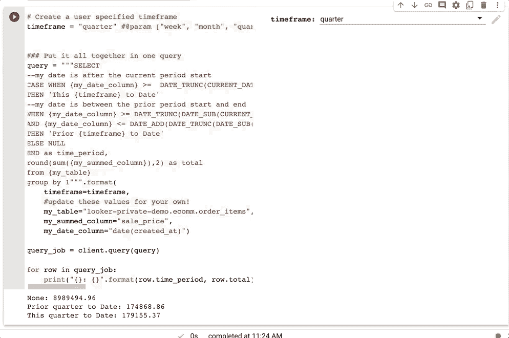
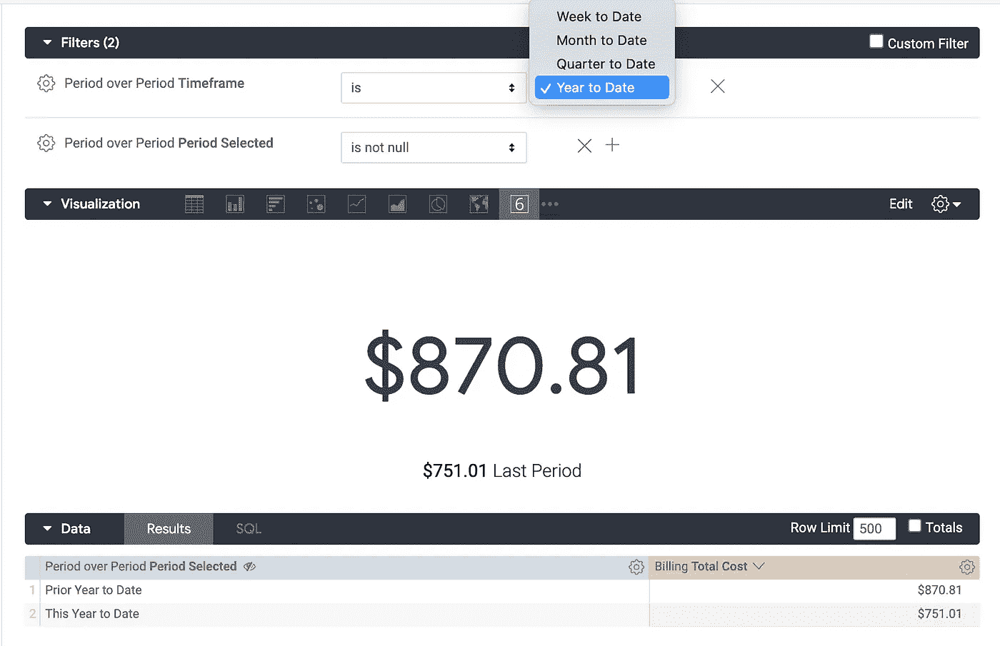

# BigQuery 中简单的期初至今比较(通过 Colab 或 Looker)

> 原文：<https://medium.com/google-cloud/simple-period-to-date-comparisons-in-bigquery-via-colab-or-looker-1525f26d1cdd?source=collection_archive---------0----------------------->

用 SQL 执行逐期分析似乎总是感觉很复杂。如果你和我一样，每次你需要做一些“迄今为止”的比较时，你都会在谷歌上搜索你可以利用的查询示例。希望这篇文章能让你的搜索更有收获！

在这里，我将分解我们如何使用 BigQuery 来执行一个简单的分析，我们希望查看周至今(WTD)、月至今(MTD)、季至今(QTD)或年至今(YTD)的聚合，并将它们与前一期(即上周/月/季/年直到同一天)进行比较。

首先，我将使用 Google Colab 中的 iPythonNotebook 浏览一个 Python 示例。接下来我会用 [LookML](https://docs.looker.com/data-modeling/learning-lookml/what-is-lookml) 、 [Looker 的](https://looker.com/)造型语言来展示。在本例中，当前日期为**2021–04–13。**

**使用 Google Colab (f** [**此处为**](https://gist.github.com/leighajarett/ba348798714d2dc3f520bd3acda6c140) **)**

让我们从一个用户输入的参数开始，该参数代表我们考虑的时间段—周、月、季度或年。

```
timeframe = "quarter" #@param ["week", "month", "quarter","year"]
```

这个代码片段允许您从笔记本的下拉列表中选择时间范围。这里，我们选择了**季度**。


我们要做的第一件事是确定我们正在考虑的本期的*开始日期。在 BigQuery 中，我们可以使用 [DATE_TRUNC](https://cloud.google.com/bigquery/docs/reference/standard-sql/date_functions) 函数很容易地做到这一点，该函数允许我们将一个日期值截断成一个特定的时间段。BigQuery 返回该时间段的第一个日期。*

```
query = "SELECT DATE_TRUNC(CURRENT_DATE(),{timeframe}) as current_period_start".format(timeframe=timeframe)>>> 2021-04-01 (first day of the current quarter)
```

接下来，我们需要确定前期的*开始日期。*在这种情况下，我们可以使用 [DATE_SUB](https://cloud.google.com/bigquery/docs/reference/standard-sql/date_functions#date_sub) 从当前日期中减去时间段，然后使用 DATE_TRUNC 函数再次获取该时间段中的第一个日期。

```
query = "SELECT DATE_TRUNC(DATE_SUB(CURRENT_DATE(), INTERVAL 1 {timeframe}), {timeframe}) as prior_period_start".format(timeframe=timeframe)>>> 2021-01-01 (first day of previous quarter)
```

现在我们想确定前一时段的最后一天*。*我们希望本期和前期的天数相同，因此我们需要首先使用 [DATE_DIFF](https://cloud.google.com/bigquery/docs/reference/standard-sql/date_functions#date_diff) 来计算本期的总天数，然后使用 [DATE_ADD](https://cloud.google.com/bigquery/docs/reference/standard-sql/date_functions#date_add) 将结果添加到我们的前期开始。

```
query = """SELECT DATE_ADD(DATE_TRUNC(DATE_SUB(CURRENT_DATE(), INTERVAL 1 {timeframe}), {timeframe}), INTERVAL DATE_DIFF(CURRENT_DATE(), DATE_TRUNC(CURRENT_DATE(),{timeframe}), DAY) DAY) as prior_period_end""".format(timeframe=timeframe)>>> 2021-01-13 (last day that we will consider in prior quarter)
```

最后，我们可以使用 case 语句将每个日期分类为在我们的*当前时间段*、*先前时间段*或 *NULL* (在我们关心的时间段之外)，并使用它作为我们的字段进行聚合。

```
query = """SELECT--my date is after the current period start
CASE WHEN {my_date_column} >=  DATE_TRUNC(CURRENT_DATE(),{timeframe}) THEN 'This {timeframe} to Date'--my date is between the prior period start and end
WHEN {my_date_column} >= DATE_TRUNC(DATE_SUB(CURRENT_DATE(), INTERVAL 1 {timeframe}), {timeframe}) AND {my_date_column} <= DATE_ADD(DATE_TRUNC(DATE_SUB(CURRENT_DATE(), INTERVAL 1 {timeframe}), {timeframe}), INTERVAL DATE_DIFF(CURRENT_DATE(), DATE_TRUNC(CURRENT_DATE(),{timeframe}), DAY) DAY) THEN 'Prior {timeframe} to Date' ELSE NULL END as time_period,--sum up the specified column and group by period to aggregate
round(sum({my_summed_column}),2) as total
from {my_table}
group by 1""".format(timeframe=timeframe, # enter in your own values here!
my_table="ecomm.order_items", my_summed_column="sale_price",      my_date_column="date(created_at)")>>> Prior quarter to Date: 174868.86 
>>> This quarter to Date: 179155.37 
```

将所有这些放在一起，您就有了一个自助式的“期初至今”分析！



**使用 Looker (** [**完整 LookML 文件此处**](https://gist.github.com/leighajarett/ba348798714d2dc3f520bd3acda6c140) **)**

在 Looker 中，我们可以使用这些查询在 LookML 中创建不同的维度。首先，我们创建一个参数，允许用户选择感兴趣的时间范围。

```
parameter: timeframe {
    view_label: "Period over Period"
    type: unquoted
    allowed_value: {
      label: "Week to Date"
      value: "Week"
    }
    allowed_value: {
      label: "Month to Date"
      value: "Month"
    }    
    allowed_value: {
      label: "Quarter to Date"
      value: "Quarter"
    }
    allowed_value: {
      label: "Year to Date"
      value: "Year"
    }
    default_value: "Quarter"
  }
```

接下来，我们通过将当前日期截断到我们选择的时间范围来计算当前周期的*开始日期*

```
dimension: first_date_in_period {
    view_label: "Period over Period"
    type: date
    sql: DATE_TRUNC(CURRENT_DATE(), );;
  }
```

现在，我们将通过计算当前日期和时间段中第一个日期之间的差值来计算时间段中的*总天数*

```
dimension: days_in_period {
    view_label: "Period over Period"
    type: number
    sql: DATE_DIFF(CURRENT_DATE(),${first_date_in_period}, DAY) ;;
  }
```

接下来，我们从当前日期中减去一个时间范围，得到前一周期中的*第一个日期，并将该值截断到时间范围中的第一个日期。*

```
dimension: first_date_in_prior_period {
    view_label: "Period over Period"
    type: date
    hidden: no
    sql: DATE_TRUNC(DATE_SUB(CURRENT_DATE(), INTERVAL 1 ),);;
  }
```

现在，通过将前一个周期的开始日期加上该周期的总天数，得到前一个周期的最后日期*。*

```
dimension: last_date_in_prior_period {
    view_label: "Period over Period"
    type: date
    hidden: no
    sql: DATE_ADD(${first_date_in_prior_period}, INTERVAL ${days_in_period} DAY) ;;
  }
```

最后，计算每个日期属于哪个时间段。

```
dimension: period_selected {
    view_label: "Period over Period"
    type: string
    sql:
        CASE
          WHEN ${my_date} >=  ${first_date_in_period}
          THEN 'This  to Date'
          WHEN ${my_date} >= ${first_date_in_prior_period}
          AND ${my_date} <= ${last_date_in_prior_period}
          THEN 'Prior  to Date'
          ELSE NULL
          END ;;
  }
```

现在，我们的用户可以进入探索，并选择感兴趣的时间段。



如果你有兴趣了解更多关于 BigQuery 或 Looker 的信息，**关注我的**[**Linkedin**](https://www.linkedin.com/in/leighajarett/)**和**[**Twitter**](https://twitter.com/LeighaJarett)**@ LeighaJarett。**请随时给我发送问题或反馈！