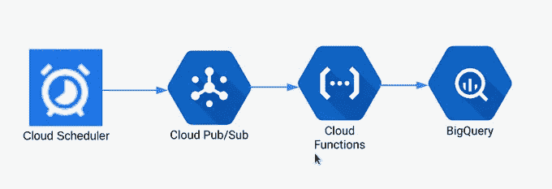
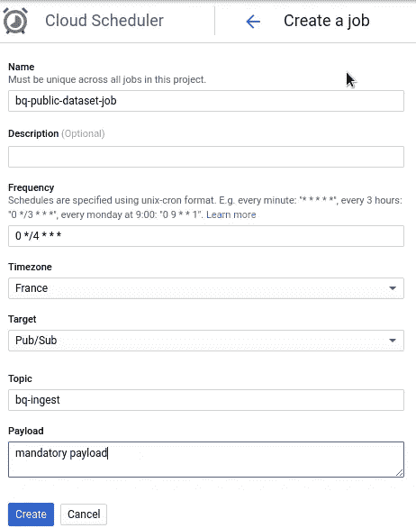

# Google 云平台上简单的无服务器数据管道

> 原文：<https://medium.com/google-cloud/simple-serverless-data-pipeline-on-google-cloud-platform-ab8941ce0f8e?source=collection_archive---------0----------------------->

在我以前的[文章](/google-cloud/bigquery-public-datasets-metadata-788c2c3897b2)中，我写了关于创建数据管道来定期获取关于 BigQuery 公共数据集的信息，并将它们插入到一个 BigQuery 表中。在这篇文章中，我想描述它是如何设计的。这不是火箭科学，而是如何创建无服务器管道的例子。一切运行在谷歌云平台上，成本 0 美元。完整代码在这里[https://github . com/zde nulo/big query _ public _ datasets _ metadata](https://github.com/zdenulo/bigquery_public_datasets_metadata)。



管道图

我将简要描述如何设置每个组件。

## 云调度程序

云调度器定期触发云发布/订阅上的主题，云发布/订阅在主要部分发生的地方执行云功能(从 BigQuery 读取信息并写回)。云调度程序可以通过 HTTP 请求直接触发云功能，但它不是通过发布/订阅来触发，因为这样一来，云功能不会暴露于互联网，而是只能通过发布/订阅来触发。小小的安保细节。

在云调度程序中创建作业的命令将触发发布主题为:

```
gcloud alpha scheduler jobs create pubsub bq-public-dataset-job --schedule="0 */4 * * *" --topic="bq-ingest" --message-body=" "
```

带输出:

```
pubsubTarget:
  data: IA==
  topicName: projects/adventures-on-gcp/topics/bq-ingest
retryConfig:
  maxBackoffDuration: 3600s
  maxDoublings: 16
  maxRetryDuration: 0s
  minBackoffDuration: 5s
schedule: 0 */4 * * *
state: ENABLED
timeZone: Etc/UTC
userUpdateTime: '2019-01-14T22:32:59Z'
```

或者使用 web 用户界面:



基于这些设置，云调度程序将每 4 小时在整点向 PubSub 发布消息。次要的细节是，当我通过 gcloud 创建调度程序作业时，pubsub 消息(有效负载)的内容可以是一个空格" "(它不接受空字符串)。当它通过 Web UI 完成时，有效负载中的一些文本需要被写入。

## 公共订阅

下一步是创建在云调度程序设置中定义的发布订阅主题。

```
gcloud pubsub topics create bq-ingest
```

带输出:

```
Created topic [projects/adventures-on-gcp/topics/bq-ingest].
```

## 云函数

下一步是创建和上传云函数，每当消息发布到我们在云调度程序中创建的发布订阅主题时，该函数都会运行。代码在 [Github](https://github.com/zdenulo/bigquery_public_datasets_metadata/blob/master/bq_metadata.py) 上，主脚本由 3 部分组成。第一步是从公共数据集获取数据，第二步是将数据上传到 Google 云存储，第三步是启动将数据从该文件上传到 BigQuery 的作业。

从文件夹代码通过 gcloud 上传到云功能:

```
gcloud functions deploy bq_public_metadata  --runtime python37
--trigger-topic bq-ingest --timeout 540
```

我选择运行时为 Python 3.7，因为我有用 Python 写的脚本，接下来是我在上一步中创建的 PubSub 主题。最后，我将超时设置为 540 秒，因为脚本需要更长的时间来获取数据，这样函数就不会超时。bq_public_metadata 是云函数的名称，也是 main.py 文件中函数的名称。

仅此而已。