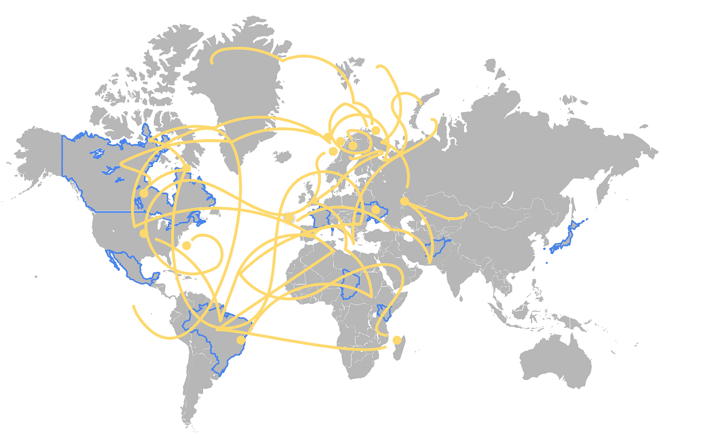
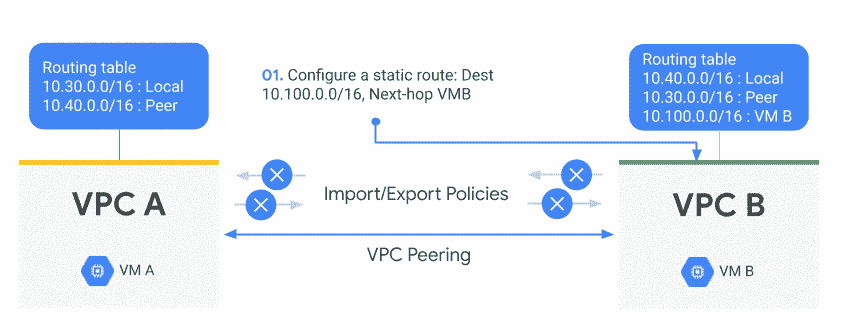
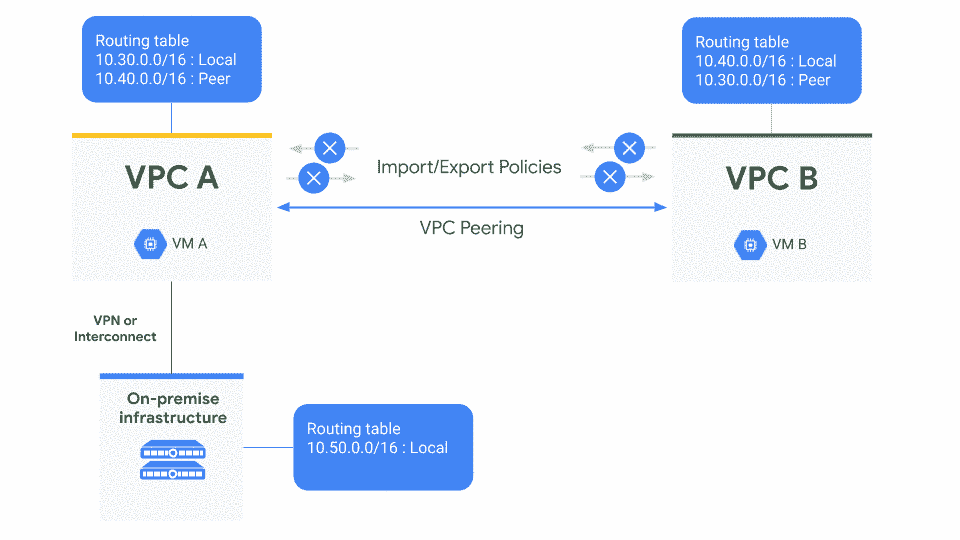
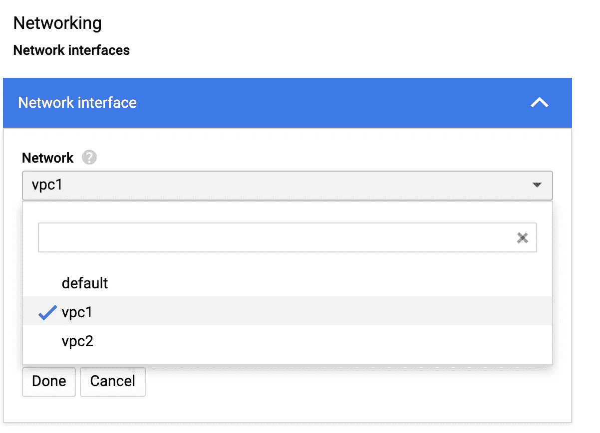
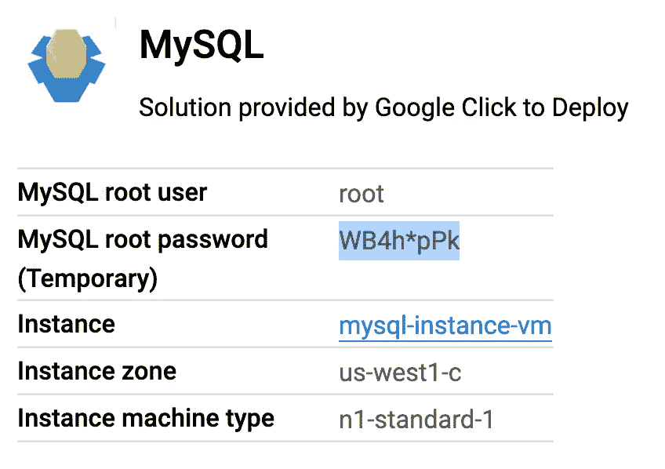
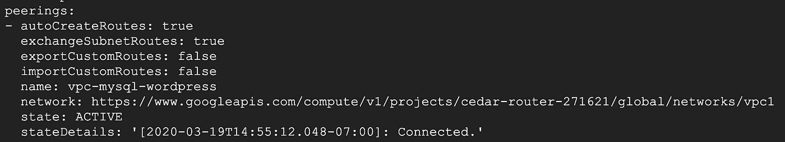
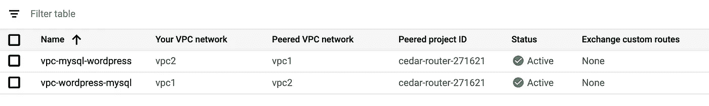
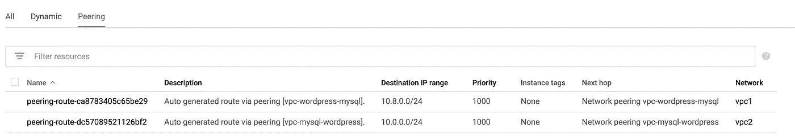
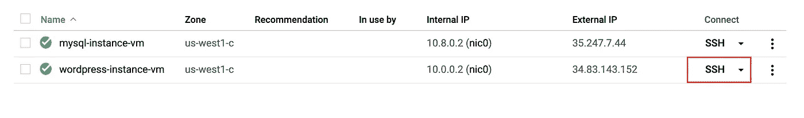
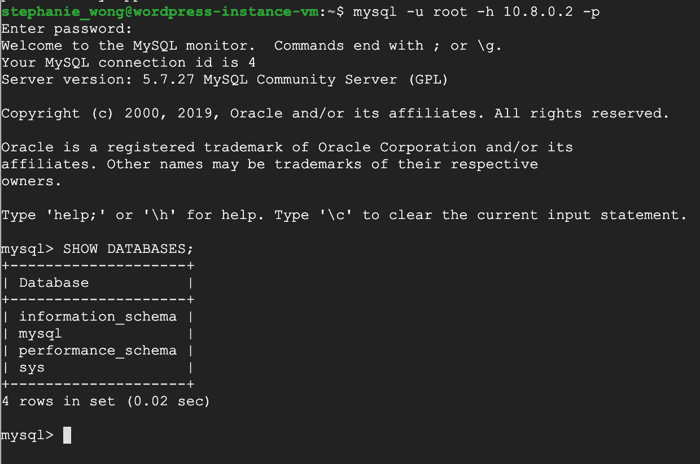

# 通过 VPC 对等简化路由

> 原文：<https://medium.com/google-cloud/simplify-routing-with-vpc-peering-fa1a527b4cfc?source=collection_archive---------0----------------------->


众所周知，互联网是由一个庞大的独立自治网络组成的，每个网络都有自己的子网和唯一的 IP 地址。通过使用这个框架，任何服务器都可以像在同一个网络上一样相互连接。现在，网络可以保持安全性和隔离性，并具有足够的灵活性来提供无缝通信。云网络也是如此，能够在一个全球虚拟私有云下创建自己的子网网络。

然而，随着您的云足迹的增长，一个不可避免的问题持续存在——您开始面对堆积如山的个人虚拟 PC，并且“VPC 孤岛”开始发生。也就是说，当您开始让更多的数据中心区域供您的服务使用时，您开始获得更多的复杂性开销来引导、管理和维护每个区域中的这些 VPC(没有简单的集成方式)。通常，主要目标是在网络之间共享资源(例如，构建星型网络拓扑)。

传统上，大多数公司的第一个方法是建立一系列 VPN。这使得客户和员工即使在公共互联网上也能安全地访问云资源。然而，这将带来自身的复杂性和可伸缩性限制。为了解释这一点，许多云提供商的基础设施都是由分布在全球不同地理区域的大型数据中心联合体组成的，每个区域又被细分为服务冗余区。在大多数情况下，这些地区之间的连接是通过公共互联网进行的。



这种方法的好处是互联网提供了无处不在的连接。但是，这也带来了一些不利因素:

*   首先，你将面临不可预测的表现。因为部署 VPN 需要使用公共 IP 地址，所以您无法控制公共互联网管理复杂性中的抖动、延迟和数据包丢失。从一个网络到另一个网络，10–15%的吞吐量开销可能是合理的，但是随着您的扩展，它可能会大大降低您的整体环境的性能。
*   你也是次优路线的受害者。你的流量必须通过公共互联网的跳数很可能不是为你的业务优化的——你受到网络中断和运营商的 [BGP](https://en.wikipedia.org/wiki/Border_Gateway_Protocol) 政策的支配。
*   我们不要忘记安全风险。互联网是好人(也就是你的客户)所在的地方，但不幸的是，它也是坏人所在的地方。虽然您可以对传输中的流量进行加密，但在通过公共互联网发送跨地区通信时，您仍然会面临风险。

正如我在[我的上一篇文章](/@swongra/migrating-to-gcp-first-things-first-vpcs-c0cf00d9adff)中解释的那样，谷歌云中的所有 VPC 默认都是全局的。这意味着您不再需要为每个地区部署一个 VPC，也不再需要为跨地区的私人通信在地区之间设置 VPN。本质上，这允许你构建一次，然后继续前进。然而，这并不适用于每个组织。一些结构需要对 VPC 部署进行更细粒度的控制，出于隔离的目的，实际上需要跨每个区域部署不同的 VPC。例如，一家公司可能需要为子公司、合作伙伴或客户提供单独的 VPC，但希望在 VPC 之间建立传输，以便共享文件或访问主数据存储库。

那么，如何连接您的私有云网络而又不为此而烦恼呢？

# VPC 对等



VPC 对等允许您拥有跨越两个 VPC 网络的私有连接，无论它们是否属于同一个项目或组织。本质上，它让你可以对等 VPC 网络，以便不同 VPC 网络中的工作负载可以通信，流量留在谷歌的网络内——无需穿越公共互联网。

这在 GCP 有 SaaS 生态系统的情况下很有用。您可以使服务在组织内部和组织之间的不同 VPC 网络上私有可用，或者在具有多个网络管理域的组织中私有可用。例如，财务部门可能有一个 VPC，会计部门可能有另一个 VPC。财务部门需要访问会计部门的所有资源，而会计部门需要访问财务部门的所有资源。

当您使用 VPC 对等时，GCP 会创建一个对等连接，在两个对等网络之间交换子网路由。如果每个网络中的防火墙规则允许通信，则一个网络中的虚拟机实例可以通过私有 IP 与对等网络中的实例通信。瞧啊。

# 本地访问



您很可能需要将您的内部网络连接到一个云 VPC。在这种情况下，您可以使用[云 VPN](https://cloud.google.com/vpn/docs/concepts/overview) 或[云互联](https://cloud.google.com/interconnect/docs)安全地将您的内部网络连接到您的 VPC 网络。如果您正在导出自定义路线，您的对等 VPC 网络也可以连接到您的内部网络。在本地端，您需要创建路由，以便将去往您的 VPC 网络的流量定向到 VPN 隧道(我将在下一篇文章中详细介绍)。

# VPC 对等建立

我说的够多了，让我们来看看对等设置:

1.  用 1 个子网和不重叠的 IP 范围创建 2 个 VPC。如果您收到启用 compute.googleapis.com API 的通知，请选择是。

```
gcloud compute networks create vpc1 --subnet-mode=custom
gcloud compute networks create vpc2 --subnet-mode=customgcloud compute networks subnets create subnet1 --network=vpc1 --range=10.0.0.0/24gcloud compute networks subnets create subnet2 --network=vpc2 --range=10.8.0.0/24
```

2.使用 GCP 市场，分别在 vpc1 中部署一个 [Wordpress 实例](https://console.cloud.google.com/marketplace/details/click-to-deploy-images/wordpress?_ga=2.54567723.1003649494.1584400840-953307546.1572288266&_gac=1.115800180.1584485404.Cj0KCQjw6sHzBRCbARIsAF8FMpVWHIZ_x2SDlaXGEHviaGvsjJKF_ro0it88zSb-0T_i6Skr57Eh688aAoLuEALw_wcB)，在 vpc2 中部署一个 [mySQL 实例](https://console.cloud.google.com/marketplace/details/click-to-deploy-images/mysql?q=mysql&id=59e776b5-96fb-4644-8a6e-92c2756ebef5)。

给每一个取一个名字(wordpress-instance，mysql-instance)。添加管理员电子邮件。

将所有内容保留为默认值，但请确保将该区域编辑到部署 VPC 的同一区域，并编辑网络部分以部署到相应的 VPC 中。



记下部署页面上的 mySQL 用户名和密码。



3.现在让我们创建一个从 wordpress vpc1 到 mySQL vpc2 的对等连接。

```
gcloud compute networks peerings create vpc-wordpress-mysql \
    --auto-create-routes \
    --network=vpc1 \
    --peer-network vpc2 
```

4.从 mySQL vpc2 到 Wordpress vpc1 也是如此。

```
gcloud compute networks peerings create vpc-mysql-wordpress \
    --auto-create-routes \
    --network=vpc2 \
    --peer-network vpc1
```

完成后，您应该会看到状态为 ACTIVE。



在 VPC 网络对等控制台上，您还会在 VPC 对等控制台上看到一个绿色复选标记，确认 vpc1 和 vpc2 之间的对等连接已经建立。



5.检查路由页面，您会看到它已经自动创建了两个网络之间的子网路由。



6.现在创建防火墙规则，允许流量从另一个内部网络流向每个 VPC。出于安全原因，只允许来自可信来源 IP 范围的流量流向特定端口。

```
gcloud compute firewall-rules create allow-ssh-wordpress --network vpc1 --allow tcp:22 --source-ranges 0.0.0.0/0gcloud compute firewall-rules create allow-ssh-mysql --network vpc2 --allow tcp:22 --source-ranges 0.0.0.0/0gcloud compute firewall-rules create allow-wordpress-mysql --network vpc2 --allow tcp:3306,icmp --source-ranges 10.0.0.0/24
```

7.让我们测试对等连接。在计算引擎实例页面上，复制 mySQL-instance-vm 专用 IP 地址。


8.现在 SSH 进入 Wordpress 实例。



9.在 SSH 终端中，输入以下命令。

```
mysql -u root -h [MYSQL_PRIVATE_IP] -p
```

从部署页面输入 mySQL 实例 root 密码。

10.现在，您应该能够从 Wordpress 实例登录到 mySQL 实例，并输入一个 SQL 命令，比如:

```
SHOW DATABASES;
```



如果您得到一个结果，您可以确认您已经能够在 VPC 之间建立一个对等连接！Wordpress 实例可以通过创建的对等路由访问 mySQL 实例的私有 IP。

# 平稳航行的提示

为避免遇到任何颠簸，请注意以下几点:

*   VPC 网络对等与计算引擎、GKE 和应用引擎灵活环境一起工作。
*   对等的 VPC 网络在行政上仍然是分开的。在每个 VPC 网络中，路由、防火墙、VPN 和其它流量管理工具都是单独管理和应用的。

## 没有重叠

需要注意的一点是，由于 VPC 对等创建了子网之间的全网状连接，因此不能有重叠的 IP 范围，因为这会导致路由问题。在对等时，GCP 会检查两个 VPC 或它们的对等网络之间是否有任何 IP 范围重叠的子网。如果存在重叠，则不会建立对等。这同样适用于在对等网络中扩展 IP 范围时，如果存在重叠范围，扩展将会失败。

# 准备，就位，开始

总而言之，与使用外部 IP 地址或 VPN 连接网络相比，VPC 网络对等为您提供了几个优势，包括:

*   **网络延迟**:所有对等流量都留在谷歌的网络内，减少了公共 IP 延迟。
*   **网络**
*   **网络**然而，如果网络是对等的，他们可以使用内部 IP 进行通信，并节省这些出口成本。

# 现在怎么办？

1.  深潜在 VPC 窥视[这里](https://cloud.google.com/vpc/docs/vpc-peering)。
2.  订阅 [GCP Youtube 频道](https://www.youtube.com/user/googlecloudplatform)并关注我的视频系列[端到端联网](https://www.youtube.com/playlist?list=PLIivdWyY5sqJ0oXcnZYqOnuNRsLF9H48u)。
3.  查看[网络 102](https://www.youtube.com/watch?v=jQc9P7xA_wU) ，在那里我与网络专家 Ryan Pryzbl 讨论对等。
4.  想要更多内容？在[推特](https://twitter.com/swongful) @swongful 上关注我。
5.  看看你身边的[谷歌云事件](https://cloud.google.com/events/)。

请继续关注本系列的更多内容，并感谢您和我一起开启这场揭开云网络神秘面纱的旅程。