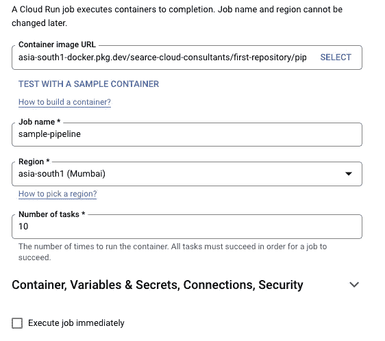
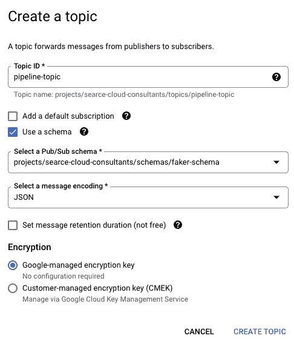
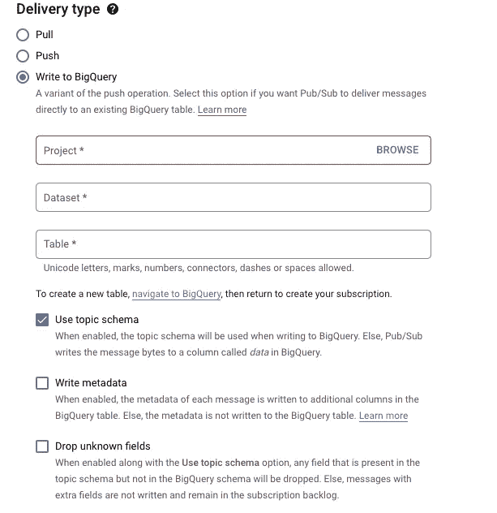

# 使用带有发布/订阅的 BigQuery 订阅简化流 ELT 管道

> 原文：<https://medium.com/google-cloud/simplify-streaming-elt-pipeline-using-bigquery-subscriptions-with-pub-sub-b3c4fb69e5f4?source=collection_archive---------0----------------------->

克劳迪奥·施瓦兹在 [Unsplash](https://unsplash.com?utm_source=medium&utm_medium=referral) 上的照片

将您的数据从客户端实时接收到 BigQuery 这样的数据仓库中，对于让您的最新业务数据立即可供分析来说是至关重要的。

在 GCP，你基本上使用一个组合**云发布/订阅**，它用于流分析和数据集成管道来接收和分发数据。作为面向消息的中间件，它同样可以有效地进行服务集成，或者作为队列来并行化任务和中间的 [**数据流**](https://cloud.google.com/dataflow) 作业，然后您的数据才能以正确的模式被接收到 BigQuery 中。虽然数据流管道(包括使用数据流模板构建的管道)可以很好地完成工作，但有时对于只需要将原始数据导出到 BigQuery 而不进行转换的用例来说，它们可能会超出需求。

幸运的是，GCP 宣布了一种叫做 **BigQuery Subscription** 的新订阅类型，它直接从发布/订阅向 BigQuery 写入数据。这个新的提取、加载和转换(ELT)路径将能够简化您的事件驱动架构。对于 Pub/Sub 消息，在将数据放入 BigQuery 之前，需要进行高级预加载转换或数据处理(例如屏蔽 PII ),但是中间仍然需要数据流。

现在，让我们继续创建我们的管道。我们将完成以下主要任务:

1.  创建我们的客户端(Node js)并使用云运行作业部署它。
2.  创建 BQ 数据集和表
3.  配置发布/订阅

**创建客户端并部署到云运行作业**

我们将使用 [**faker js**](https://github.com/faker-js/faker) (RIP 艾伦·施瓦茨)生成大量虚假(但真实)的交易数据。

确保在根文件夹中创建一个. env 文件，并设置了**主题名称**和**项目 ID** 值。

现在，我们需要对客户端进行容器化，将容器推送到工件注册中心，并将其部署为云运行作业。

构建您的容器，并将其推送到工件注册表。你可以在这里查阅文档[。](https://cloud.google.com/artifact-registry/docs/docker/pushing-and-pulling)

导航到 GCP 控制台中的云运行，然后选择作业。点击创建工单，并填写如下详细信息:

云运行作业配置

不要勾选**立即执行作业**复选框。点击创建

**创建 BQ 数据集和表格**

在 GCP 控制台中导航到 BigQuery，单击项目旁边的⋮图标，然后单击**创建数据集**

创建数据集后，运行以下查询来创建表:

**配置发布/订阅**

在 GCP 控制台中导航到发布/订阅，然后单击左侧边栏中的模式。

从顶部单击创建模式。给它一个名称，并选择 **Avro 作为模式类型。**增加以下模式定义:

创建模式后，单击创建主题，输入所有详细信息，然后单击创建。

发布/子主题配置

转到**订阅**，从顶部点击**创建订阅**。为订阅命名，并添加前面步骤中的所有详细信息。

发布/订阅订阅配置

一旦创建了订阅，就可以了。您已经完成了设置。现在让我们来看看它的运行情况。

转到云运行中的作业。选择之前创建的任务，点击**执行。**

现在，您应该开始看到 BQ 表中的条目。一旦云运行作业完成，在 BQ 中运行以下查询来检查摄取的记录数量:

从`<project_id>中选择计数(账户)。<dataset_name>。<table_name></table_name></dataset_name></project_id>

**总结**

在这篇博客中，我们创建了一个简单的实时管道，将数据从发布/订阅直接推送到 BigQuery，而不必在中间使用数据流。这对于在存储之前不需要额外处理的用例非常有用。

有了这种新的订阅类型，在使用这种新的直接方法时，您不再需要为将数据接收到 BigQuery 中而付费。你只需为你使用的酒馆/餐馆付费。与使用数据流管道相比，这要便宜得多，在数据流管道中，您需要为使用存储写 API 的发布/订阅读取、数据流作业和大查询数据接收付费。

**参考** [https://cloud . Google . com/blog/products/data-analytics/pub-sub-launchs-direct-path-to-big query-for-streaming-analytics](https://cloud.google.com/blog/products/data-analytics/pub-sub-launches-direct-path-to-bigquery-for-streaming-analytics)

[https://cloud.google.com/pubsub/docs/bigquery](https://cloud.google.com/pubsub/docs/bigquery)

[https://github . com/rastogiji/automation-scripts/tree/master/streaming-pipeline-GCP](https://github.com/rastogiji/automation-scripts/tree/master/streaming-pipeline-gcp)

[https://www . rollingstone . com/culture/culture-news/the-brilliant-life-and-quartery-death-of-aaron-swar tz-177191/](https://www.rollingstone.com/culture/culture-news/the-brilliant-life-and-tragic-death-of-aaron-swartz-177191/)