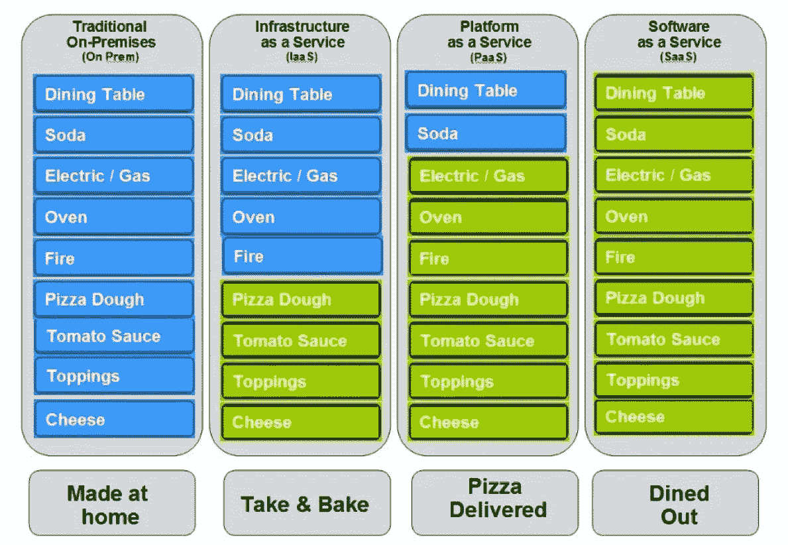
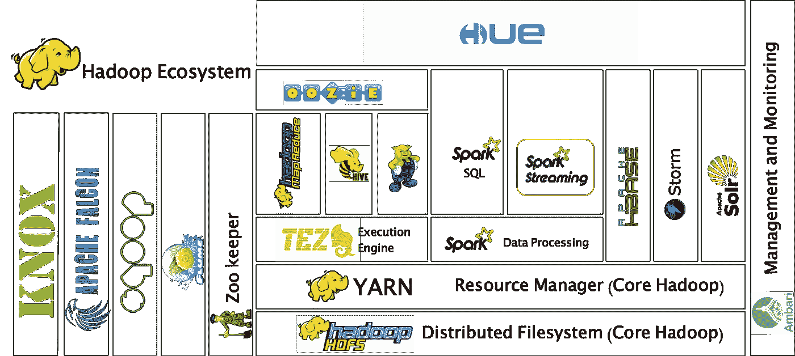

# 使用 Google Cloud Dataproc 简化大数据

> 原文：<https://medium.com/google-cloud/simplifying-big-data-with-google-cloud-dataproc-9b3bf844b48e?source=collection_archive---------0----------------------->

我以前的老板拉里·埃里森(甲骨文的创始人和现任首席技术官)曾经说过没有“云”，它只是一台连接到网络上的电脑。他并没有完全错，但是云计算不仅仅是这样。

不是水蒸气。

> 你在说什么？**不是水蒸气**。它是一台连接到网络的计算机！”—拉里·埃里森，甲骨文公司，2009 年

根据美国国家标准与技术研究院(NIST)的定义，云计算由五个基本特征组成:

1.  按需自助服务:您应该能够在需要服务的任何时候请求服务，而无需人工干预。
2.  广泛的网络接入:它应该随处可达
3.  资源共享:你与其他人(公司)共享资源
4.  快速弹性:你有能力快速地上下伸缩
5.  计量服务:你的消费是经过计量的，所以你可以只为你真正使用的东西付费。

此外，它还定义了三种服务模型:基础设施即服务(IaaS)、平台即服务(PaaS)和软件即服务(SaaS)。

网上有一个有趣的类比，我喜欢用来解释这些服务模型。它被称为“比萨饼作为一种服务”。想象一下你想吃披萨……实际上你有 4 种不同的方式来满足你的愿望:

1.  自己动手:假设你有烤箱，有原材料，想从头开始做。你不仅要做饭，还要担心摆桌子、放盘子和买汽水。让我们不要忘记清理！:)这相当于拥有一个内部部署的技术堆栈:硬件和软件，一切都由您的团队安装、配置和运行。
2.  带烤:和以前一样，但不是用原材料做比萨饼，而是用预先做好的比萨饼。你还是要煮它，做其他的事情。有些步骤是由您完成的…这就是基础架构即服务:他们为您提供虚拟机，但仅此而已。软件安装和使用由您负责。
3.  送货:你做好了比萨饼并送到了你的手中，但你仍然要担心事后摆桌子和洗碗的问题。这就是平台即服务:您拥有一个完整的平台，可以是数据库、中间件层或机器学习堆栈。最终的应用取决于您，但是您已经准备好了大部分的堆栈。
4.  外出就餐:你不想担心任何事情，你只想吃你的比萨饼！这就是软件即服务，产品随时可供您使用，例如，像 Gmail、Google Documents 或 Hangouts。

披萨即服务模式(作者不详)

使用云服务的主要优势是能够使用高端环境，而不必支付全价。比如，您不需要购买所有的硬件，也不需要只为布线和支持一切而保留一名员工，而在内部部署时，即使您不全天候使用，也必须预先支付全额费用。

此外，您可以根据需要灵活地扩大或缩小资源规模。对于内部设置，您可能永远不会缩减规模。

上田拓也的《地鼠》([坦恩](http://twitter.com/tenntenn) ) /蕾妮·弗伦奇

像大多数云一样，Google Cloud 提供所有的服务级别，但是在本文的其余部分，我将重点关注他们的数据处理 PaaS 产品:Google Dataproc。

我选择谈论这项技术是因为没有比大数据技术堆栈更好的复杂环境的例子了。在云上运行这种类型的工作负载的好处很快就会显现出来。

但是为了理解 Dataproc，首先让我们在大数据世界中深入挖掘一下。

大数据，顾名思义，就是处理海量数据。这个术语第一次出现在文献中是在 1997 年 10 月发表的一篇论文中，该论文由美国宇航局的迈克尔·考克斯和大卫·埃尔斯沃斯撰写:

> 我们称之为**大数据**的问题。当数据集不适合主内存(在内核中)时，或者当它们甚至不适合本地磁盘时。—迈克尔·考克斯和大卫·埃尔斯沃斯，1997 年

在 2003 年发表了“Google 文件系统”和 2004 年发表了“MapReduce:大型集群上的简化数据处理”之后，这个术语开始流行起来，这两篇论文都是由 Google 的工程师撰写的。他们描述了谷歌如何建立一个引擎来使用由商用硬件组成的集群处理大量数据。

这些文章的答案是在 2006 年创建的 Hadoop，这是一个开源框架，实现了像谷歌一样的分布式文件系统，称为 HDFS (Hadoop 分布式文件系统)，并具有运行 MapReduce 工作负载的能力。

除了能够在集群上运行工作负载之外，MapReduce 模型还有其局限性，因为它意味着复杂的工作负载需要在磁盘上暂存中间结果。

Apache Spark 作为一种新的分布式计算框架，在 Hadoop 上运行，旨在解除这种磁盘暂存限制。它使用弹性分布式数据集(仅存在于内存中的数据集)的概念，允许处理迭代工作负载，而不必将数据转移到磁盘。

这种架构上的改变使性能平均提升了两个数量级，很快 Spark 就成为了行业的新黄金标准。

但是，为了运行 Spark 工作负载，我们需要一个与此类似的设置:

大数据技术堆栈(非详尽列表)

Spark 在中间，但还有许多其他大数据工具...它看起来非常像一个动物园，甚至有一个叫“动物园管理员”的工具来管理一切。

似乎很麻烦，对吧？确实是！但幸运的是，我们现在可以利用 Dataproc 来为我们做这个疯狂的设置，所以我们只需要担心吃比萨饼…我的意思是，运行我们的工作负载！:)

Dataproc 的卖点是我们可以在不到 90 秒的时间内设置整个集群。如果有任何一家公司可以做出这样疯狂的声明，那就是谷歌，但我必须说，以我的个人经验来看，有时需要大约 2 到 2 分半钟才能完成。但是，嘿，看看上面所有的疯狂，它仍然令人印象深刻！

Google Dataproc 允许您从命令行(使用 Google Cloud SDK 的 gcloud 命令)或云控制台运行 Spark 作业。它还可以选择运行用 Scala 和 Python (PySpark)编写的作业。

它还可以连接到其他谷歌云平台产品，比如 BigQuery。这意味着您可以运行数据处理或机器学习 Spark 作业，并将其输出到 BigQuery 进行进一步分析，或者您可以使用 BigQuery 数据作为工作负载的输入。

顺便说一下，如果您对这个场景感兴趣，您一定要查看文档:[使用 BigQuery 连接器和 Spark](https://cloud.google.com/dataproc/docs/tutorials/bigquery-connector-spark-example) 。

总之，通过使用 Google Cloud Platform，您可以简化大数据堆栈的部署，只需几次点击和几分钟时间，您就可以拥有一个集群来处理您的工作负载。此外，如果您需要扩大或缩小规模，也可以用同样的方式完成，因此您不必担心长期的规模调整或前期的基础架构费用。

如果你想在不支付高额入门费用的情况下体验大数据，GCP 绝对是你的不二之选。它让几乎任何类型的公司都可以获得大数据的颠覆性力量。

*附:本文是我 2017 年 8 月 5 日在 Google Launchpad Build 阿雷格里港发表的关于 Google 云平台的演讲的修改版。*