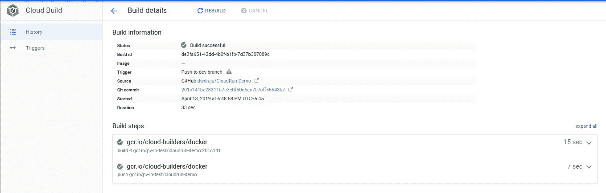

# 通过云构建简化云运行的持续部署，包括自定义域设置(SSL)

> 原文：<https://medium.com/google-cloud/simplifying-continuous-deployment-to-cloud-run-with-cloud-build-including-custom-domain-setup-ssl-22d23bed5cd6?source=collection_archive---------0----------------------->

[Cloud Run](https://cloud.google.com/run/) 是由 Google Cloud 推出的完全托管的无服务器产品，提供在无服务器环境中运行 docker 映像的公共测试版。随着云运行的引入，允许运行 docker 而不管运行时环境如何，[云功能](https://cloud.google.com/functions/)对于有限环境和版本的限制被[云运行](https://console.cloud.google.com/run)所缓解，云运行可以在几分钟内实时运行。此外，云运行可以利用在 [GKE 与 Istio 和 Knative](https://cloud.google.com/run/docs/quickstarts/prebuilt-deploy-gke) 。


云运行+云构建

在这篇文章中，我们将从 github 提交到持续部署到云运行，以及 http 端点的自定义域。这篇文章中使用的代码和配置在我的 [CloudRun-Demo github repo](https://github.com/dwdraju/CloudRun-Demo) 上。

## 我们简单的 Go 应用程序

我们有一个简单的 http 服务器运行在端口 8080 上

```
package mainimport (
 "fmt"
 "net/http"
 "os"
)func handler(w http.ResponseWriter, r *http.Request) {
 fmt.Fprintf(w, "<html><head><title>Cloud Run Demo</title></head><body><h1>Greetings from Cloud Run !!!</h1></body></html>\n")
}func main() {
 port := os.Getenv("PORT")
 if port == "" {
  port = "8080"
 }
 http.HandleFunc("/", handler)
 http.ListenAndServe(":"+port, nil)
}
```

## Dockerfile 文件

为了使我们的最终 docker 映像更小更安全，我们在[发行版](https://github.com/GoogleContainerTools/distroless)基础映像上使用了带有最终工件的多阶段构建。

```
FROM golang:1.12 AS build-env
ADD . /app
WORKDIR /app
RUN go get -d ./... && \
    CGO_ENABLED=0 GOOS=linux go build -o main .FROM gcr.io/distroless/base
WORKDIR /app/
COPY --from=build-env /app/main .
CMD ["./main"]
```

如果你有兴趣了解更多关于 distroless image 的信息，这里是我的一个帖子:

[](/@dwdraju/distroless-is-for-security-if-not-for-size-6eac789f695f) [## 如果不是为了尺寸，Distroless 是为了安全

### 如果你不熟悉发行版，它的容器图像是由 google 构建的，基本上是 docker 图像减去…

medium.com](/@dwdraju/distroless-is-for-security-if-not-for-size-6eac789f695f) 

Cloudbuild.yaml 用于 [Google Cloud Build](https://cloud.google.com/cloud-build/) 创建 docker 映像并推送到[容器注册表(gcr)](https://cloud.google.com/container-registry/)

```
steps:
- name: gcr.io/cloud-builders/docker
  args: ['build', '-t', 'gcr.io/$PROJECT_ID/cloudrun-demo:${SHORT_SHA}', '.']- name: 'gcr.io/cloud-builders/docker'
  args: ["push", "gcr.io/$PROJECT_ID/cloudrun-demo"]
```

## 在云构建时添加触发器

转到 Cloud Build Trigger，通过添加身份验证为 github(或其他源代码库)创建一个新的触发器。


选择 cloudbuild.yaml 作为构建配置。现在，我们为所有分支保留触发器，但是可以使用 regex 为分支和标签以及文件过滤器管理选择。


默认情况下，这个步骤在 github 上为所有事件添加一个 webhook 触发器。


由云构建触发 Github

现在，为了触发新的构建，我们可以从[代码构建触发页面](https://console.cloud.google.com/cloud-build/triggers)手动“运行触发器”特定的分支，或者对我们的代码进行更改并推送到 github。我们可以从[历史页面](https://console.cloud.google.com/cloud-build/builds)查看构建日志。



在这个演示中，我们使用`$SHORT_SHA`来标记 docker 图像，它包括 git 提交散列的前七个字符。因此，我们的图像格式为`gcr.io/pv-lb-test/cloudrun-demo:201c141`。

## 是时候创建云运行服务了

前往 Google Cloud 控制台上的 [Cloud Run](https://console.cloud.google.com/run) ，使用我们从上面的云构建中获得的“容器图像 URL”来“创建服务”。提供服务名称和区域位置，因为云运行是区域资源。如果您想要允许来自任何用户的调用，请选择“允许未经验证的调用”复选框。

附加设置允许我们为每个容器授予 spec(内存分配)和一个容器可以处理的最大并发请求。如果达到并发性，Cloud Run 会自动扩展新的容器。如果您想添加更多的环境变量，可以添加键值对。

或者，可以使用 cli 命令创建服务:

```
$ gcloud beta deploy --image [image-url] --region us-central1 --platform managed
```

保存服务后，大约一分钟，就可以得到一个用于调用的 URL，格式:[https://cloud run-demo-doiyqpty 6a-UC . a . run . app](https://cloudrun-demo-doiyqpty6a-uc.a.run.app)


## 持续部署到云运行

是时候让游戏动起来了！！！

当提交被推送到 github 时，为了将新映像部署到从云构建运行的云，我们需要授予部署对云构建服务帐户的访问权限，该帐户的格式为`[id][@cloudbuild](http://twitter.com/cloudbuild).gserviceaccount.com`。

从 [IAM & admin](https://console.cloud.google.com/iam-admin/iam) 控制台向 IAM 用户添加以下权限。

*   服务帐户用户
*   云运行管理

并在 cloudbuild.yaml 文件上附加以下部署命令。

```
- name: 'gcr.io/cloud-builders/gcloud'
  args: ['run', 'deploy', 'cloudrun-demo', '--image', 'gcr.io/$PROJECT_ID/[Project-Name]:${SHORT_SHA}', '--region', 'us-central1', '--platform', 'managed']
```

根据您喜欢的云运行服务名称更改`[Project-Name]`和`region`。

或者，我们可以通过以下方式触发新版本部署:

```
gcloud run deploy cloudrun-demo --image gcr.io/$PROJECT_ID/[Project-Name]:[Branch] --region us-central1 --platform managed
```

为了确认，我们在 Go 应用程序 http 响应上添加了一个更改，并将提交推送到 github。一段时间后，我们可以在 URL 上看到部署的更改。此外，我们可以从云构建日志中看到，我们在 gcr 上的映像已经部署:

```
Step #2: Service [cloudrun-demo] revision [cloudrun-demo-00010] has been deployed and is serving traffic at [https://cloudrun-demo-doiyqpty6a-uc.a.run.app](https://cloudrun-demo-doiyqpty6a-uc.a.run.app)
```

# 获取自定义域

我们可以使用与 Cloud Run 链接的自己的域名，而不是从服务中获得的随机 URL。为此，我们需要向网站管理员中心核实域名所有权。

在 gcloud 控制台的[云运行](https://console.cloud.google.com/run)页面，点击管理自定义域，添加一个 servicename 和 DOMAIN 的映射。


在云运行时添加映射

点击“在网站管理员中心验证”,你可以得到各种域名注册商或提供商的域名验证选项。

如果您的提供商没有列出，只需选择最后一个选项“其他”，这将提供两个选项:CNAME 和 TXT 记录。


网站管理员中心 Cname 验证

因为我用谷歌云域名系统来管理我的记录集，所以我打算创造 CNAME 记录。


谷歌云域名系统创下 CNAME 纪录

几分钟后，记录将被传播。您可以在 [whatsmydns](https://www.whatsmydns.net/#TXT) 上输入您的域名进行确认。成功后，点击网站管理员中心页面上的“验证”。


在网站管理员中心验证了域名

在云运行页面，点击“继续验证并关闭”。

现在，如果您再次单击“添加映射”，经过验证的域将出现在服务名称选项下方的列表中。如果您想使用主域，请保留第三个选项不变。


点击“继续”，它会给几个 IP 地址添加到“A”和“AAAA”记录集的领域。


然后就可以调用域名好听的云运行服务了。

几分钟后，由 Let's Encrypt Authority 颁发的 SSL 证书也将为自定义域提供。


通过这种方式，我们可以持续部署到云上运行，并在我们自己的容器上享受无服务器架构。

就这些了，如果你有兴趣获得我的有趣更新，请在 [Linkedin](https://www.linkedin.com/in/dwdraju/) 、 [Twitter](https://twitter.com/dwdRAJU) 上找到我。