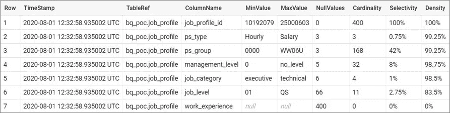

# 谷歌云平台上的数据质量分析

> 原文：<https://medium.com/google-cloud/simplifying-data-quality-analysis-808e9fb8667f?source=collection_archive---------0----------------------->

## 从 BigQuery 表生成数据质量统计的系统方法

数据质量分析使组织能够降低识别和修复系统中不良数据的成本。收获有意义的洞见是组织不可或缺的一部分。在这个博客中，很少收集重要的数据质量统计数据，这可以确保只有可信的数据用于决策，从而增加对分析系统的信心。收集了以下统计数据:

1.  **空值:**列中缺失值的数量
2.  **基数:**一列中唯一值的数量
3.  **选择性:**基数与行数的比率，它提供了一列中数据的惟一性
4.  **Density:** 一列中的值相对于行数的数量，即一列中非空值的数量

下面描述了与该解决方案相关的多个步骤:

## 步骤 1:创建大查询表

创建一个 BigQuery 表来存储数据质量统计信息。在此解决方案中，数据集名称用作“ *bq_poc* ”，表名称用作“ *dq_report* ”。对 BigQuery 数据集和表名的更改必须反映在配置文件( *dq.yaml* )中。

```
CREATE TABLE **bq_poc**.**dq_report** (
    TimeStamp   TIMESTAMP,
    TableRef    STRING,
    ColumnName  STRING,
    MinValue    STRING,
    MaxValue    STRING,
    NullValues  STRING,
    Cardinality STRING,
    Selectivity STRING,
    Density     STRING
)
```

## 步骤 2:构建和部署

在这个解决方案中，输入参数是从一个配置文件中读取的，该文件提供了在不改变源代码的情况下更改输入值的灵活性。创建一个指定的表来存储收集的统计数据，该表包括一个时间戳列来维护所有统计数据的历史记录。

数据质量分析的应用代码

灵活的配置文件旨在允许分析特定的列，并允许一次从多个数据集的多个表中计算统计数据。

配置文件

用户定义的库函数用于执行日常活动，如从表中提取数据、生成动态 SQL 和计算统计数据，这些可以在多个应用程序中重用。

BigQuery 的库函数

## 步骤 3:数据质量统计

使用基于代码的解决方案收集数据质量统计信息，并存储在 BigQuery 表中用于报告。被分析的每一列都有一个时间戳(UTC)和一个表引用(<dataset name="">)。)。与选择性和密度相关的公式定义如下:</dataset> 

```
**Selectivity** = Cardinality / Number of Rows * 100%
**Density** = (Number of Rows - Number of NULLs)/(Number of Rows) * 100%
```



存储在 BigQuery 表中的数据质量统计信息

## 源代码库

[https://github . com/soumendra-mis HRA/data-quality-analysis . git](https://github.com/soumendra-mishra/data-quality-analysis.git)