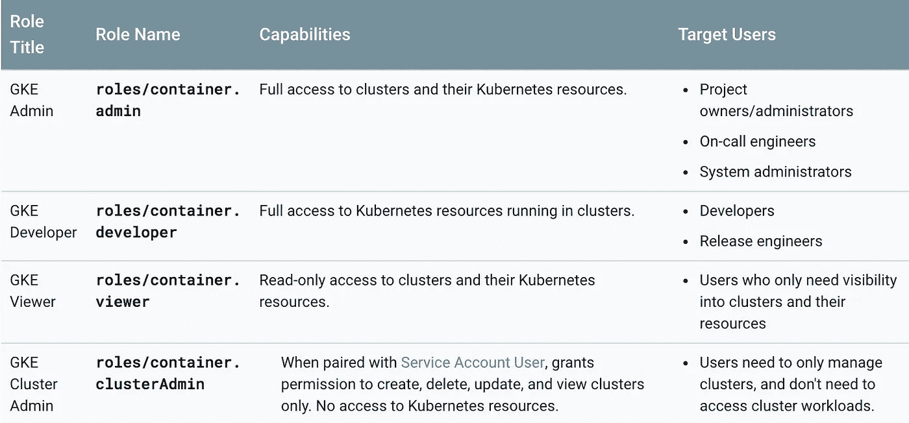
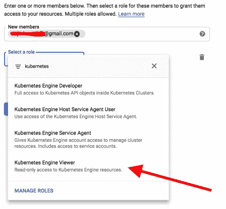
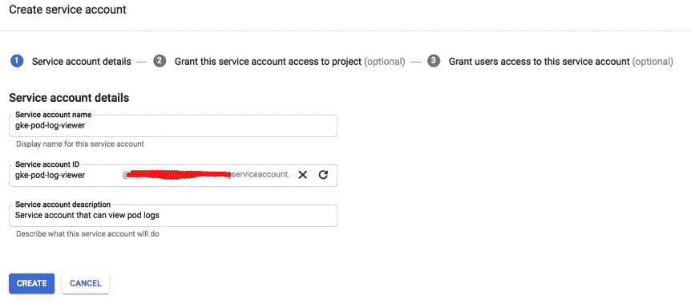
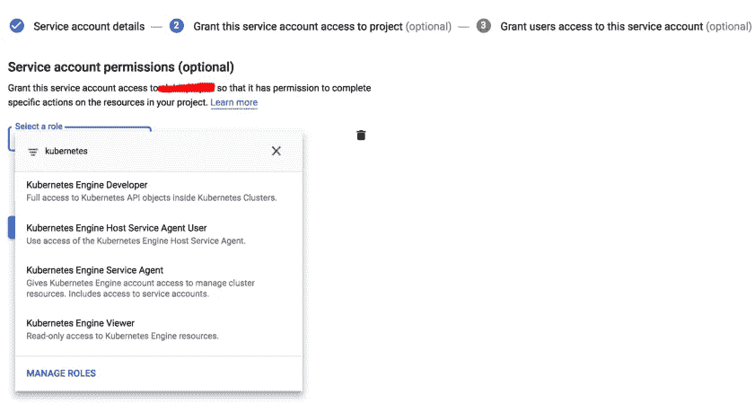
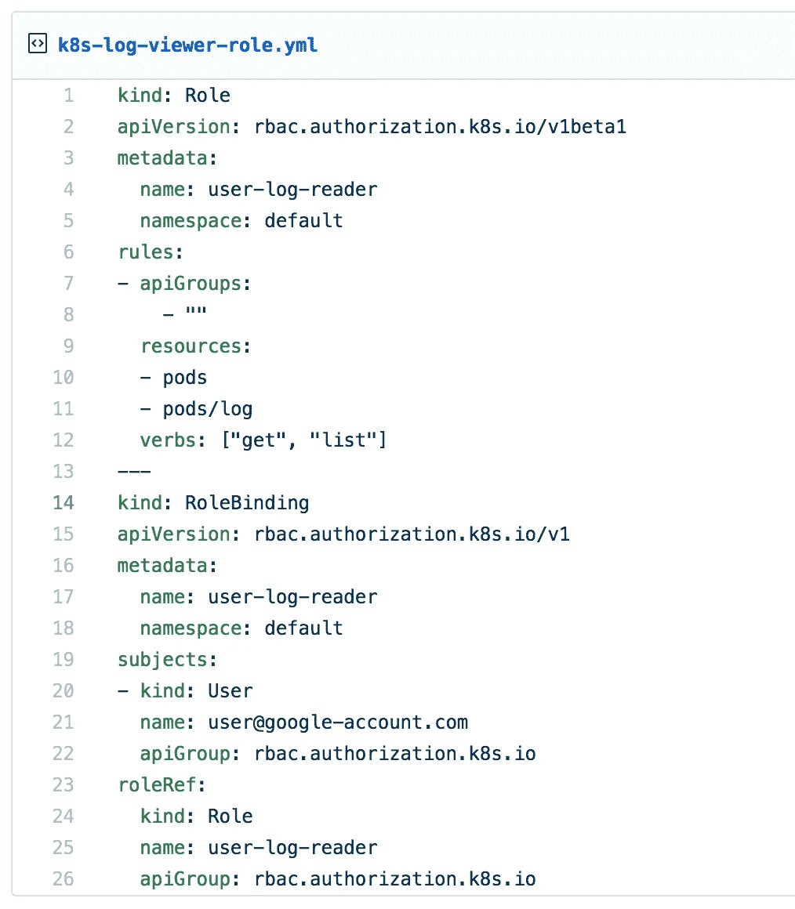

# 使用 IAM 和 RBAC 简化 Kubernetes(GKE)上的粒度访问控制

> 原文：<https://medium.com/google-cloud/simplifying-granular-access-control-on-kubernetes-gke-using-iam-and-rbac-19a627e3aa18?source=collection_archive---------0----------------------->

Google Kubernetes Engine(GKE)是由 Google Cloud Platform 提供的托管 Kubernetes 引擎，是易于使用的生产级服务，能够立即创建和运行 K8s 集群。GKE 的访问控制与云身份和访问管理(IAM)很好地集成在一起，后者抽象了对 Kubernetes 集群资源的授权和认证。


适用于 GKE 的 Cloud IAM 上的几个角色是:

*   GKE 管理
*   GKE 开发商
*   GKE 观察报
*   GKE 集群管理



但是云 IAM 仍然不足以进行粒度访问控制，因为 IAM 工作在项目级，不能管理对名称空间级的访问。例如，如果我们必须授予用户查看 pods 日志、编辑部署、编辑配置图的权限，则 IAM 无法控制这一级别。为此，我们需要 RBAC(基于角色的访问控制)。但是如果我们结合使用云 IAM 和 RBAC，我们可以配置安全的方式进行认证和授权。

在这篇文章中，我将考虑授予 Kubernetes pod 日志查看器对 google 帐户(G Suite 或 Gmail 或服务帐户)的访问权限的情况，该帐户具有集群凭据的 Cloud IAM 身份验证和对同一帐户(电子邮件)的仅日志查看权限的 RBAC。

## 创建新的集群

```
gcloud container clusters create mycluster --zone us-central1-b
```

## Kubernetes 认证和 IAM

目前，GKE 有三种 Kubernetes 认证方式:

*   使用谷歌账户
*   使用谷歌云平台(GCP)服务账户
*   使用 Kubernetes 服务帐户

在这篇文章中，我们将讨论前两种方法。

让我们在 Cloud IAM 中添加一个 google 帐户，并授予**对 Kubernetes 引擎资源**的只读访问权限。



同样，如果我们需要授权访问服务帐户，我们必须从 [IAM 服务帐户](https://console.cloud.google.com/iam-admin/serviceaccounts)页面为项目创建一个服务帐户，并在创建帐户时添加角色。



## g 云认证

对于一个 google 帐户，gcloud sdk 可以通过简单的命令`gcloud auth login`进行身份验证，该命令通过基于 web 的授权流获得凭证。

对于服务帐户，我们首先激活帐户

```
gcloud auth activate-service-account [ACCOUNT EMAIL] --key-file=KEY_FILE
```

## 获取集群凭据

获取正在运行的集群`mycluster`在`us-central1-b`区域的凭证的时间。

```
gcloud container clusters get-credentials mycluster --zone us-central1-b
```

确认集群访问

```
kubectl get pods --all-namespaces
```

## 库伯内特 RBAC 的时间到了

基于角色的访问控制(RBAC)是一种根据集群中的角色使用适当的权限来管理对 Kubernetes 资源的访问的方法。为了在名称空间中向用户授予仅日志查看器访问权限，我们需要创建角色和角色绑定。



[https://gist . github . com/dwdraju/60 fdffecae 03440313922d 0 eaba 56 f 9d](https://gist.github.com/dwdraju/60fdffecae03440313922d0eaba56f9d)

用 google 帐户 ID 或服务帐户更改`name`,并应用清单。

```
kubectl apply -f k8s-log-viewer-role.yml
```

现在，用户只能查看日志和列表窗格。

```
kubectl logs [pod-name]
```

这样，我们可以通过与 Google Cloud IAM 集成，为用户提供对 Kubernetes 资源的细粒度访问。