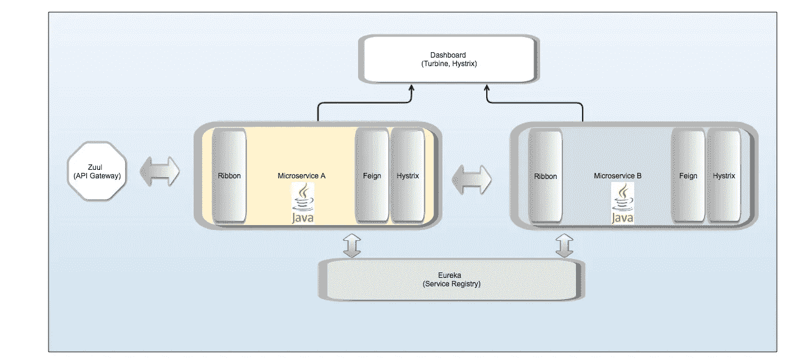
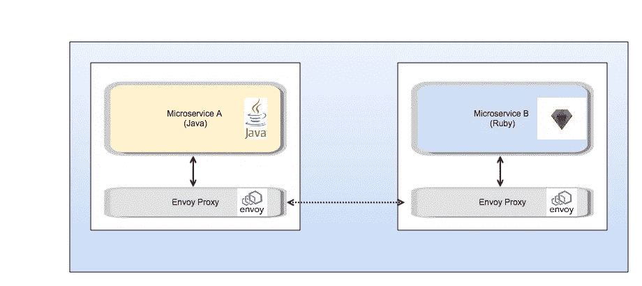
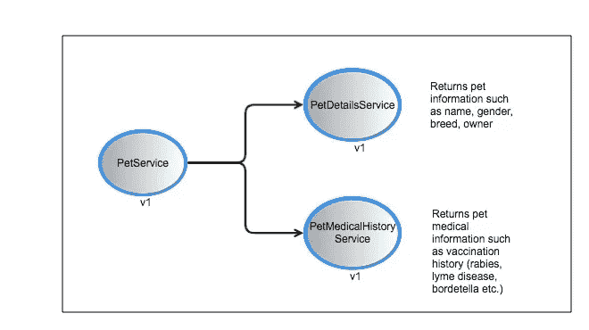
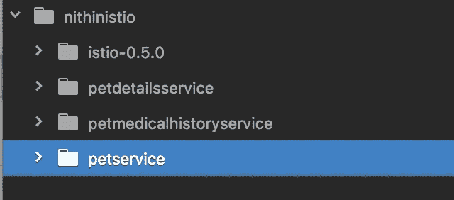

# 使用 Google Kubernetes 引擎中的 Istio 简化微服务—第一部分

> 原文：<https://medium.com/google-cloud/simplifying-microservices-with-istio-in-google-kubernetes-engine-part-i-849555f922b8?source=collection_archive---------0----------------------->

Istio 简化了服务对服务的通信、流量上升、容错、性能监控、跟踪等等。我们如何利用它从我们的微服务中抽象出基础设施和横切功能？

> 我写的关于 Istio 的内容是 Istio 网站上[精彩文档](https://istio.io/docs/)的一个子集。请阅读官方文件以了解更多信息。
> 
> **注意**:熟悉微服务的可以跳过后台部分。

在本系列的第一部分中，我们将涉及以下领域:

*   **背景**:单片应用和微服务介绍
*   **春云网飞栈**及其优点
*   介绍 **Istio**
*   **使用 Istio 的服务-服务通信示例**

# B背景:

> 在过去，我们有“无所不能”的大型单一应用程序。这是将我们的产品推向市场的一种方式，最初效果很好，因为我们只需将我们的第一个应用程序上线，我们可以随时回来改进它。部署一个大型应用程序比构建和部署多个较小的应用程序更容易。
> 
> 然而，这样的应用程序开发导致了“大爆炸”式的工作(我们会在几个月的工作后立即部署整个应用程序)，并且由于构建/测试/部署/发布周期的复杂性，增量更改会在很长一段时间内错开。但是，如果您是产品所有者，尤其是在部署了新版本的应用程序之后发现了一个严重的 bug，那么这并不是很划算。这甚至会导致应用程序回滚。将如此大的应用程序部署到云中并扩展它们也不容易，因为整个应用程序需要相对较小的组件进行扩展。
> 
> **进入微服务:**
> 
> 微服务是在它们自己的流程中运行的独立可部署的服务套件。它们通常使用 HTTP 资源进行通信，并且每个服务通常负责应用程序中的一个区域。在流行的电子商务目录示例中，可以有一个 ItemsService、一个 ReviewService 和一个 RatingsService，每个都专注于一个领域。
> 
> 这种方法帮助分布式团队为各种服务做出贡献，而不必为每个服务变更构建/测试/部署整个应用程序，也不必遍历彼此的代码。将服务部署到云也更容易，因为单个服务可以根据需要自动扩展。
> 
> 多语言服务(用不同语言编写的服务)也通过这种方法成为可能，因为我们可以让 Java/C++服务做更多的处理密集型工作，而 Rails/Node.js 服务可以用来支持前端应用程序等等。

# S 春云网飞:

随着微服务的流行，出现了大量简化服务创建和管理的框架。2015 年我个人最喜欢的是网飞 OSS 栈( [Spring Cloud 网飞](https://cloud.spring.io/spring-cloud-netflix/))，它向我介绍了一种从我的 [Spring 工具套件](https://spring.io/tools/sts/all) IDE 中用 Java 创建微服务**的简单方法。**

我可以从网飞套件中获得以下特性(如下图 1 所示):

*   使用 **Eureka** 的服务注册中心—用于服务的注册和发现
*   使用 **Ribbon** 实现客户端负载平衡—客户端可以选择将请求发送到哪个服务器。
*   声明性 REST 客户端**假装**与其他服务对话。在内部，它使用丝带。
*   带有 **Zuul** 的 API 网关—管理所有 API 调用、路由规则等的单一入口点。我们的微服务
*   带**磁滞回线**的断路器——处理容错，并且能够在短时间内关闭通信通道(断开电路),并在目标服务关闭时返回用户友好的响应
*   带有 Hystrix 和**涡轮**的仪表盘—可视化交通和断路器



图 1:微服务的 Spring Cloud 网飞实现

然而，这种构建和部署应用程序的方法也有其自身的挑战。

# 挑战:

> ***部署*** *:我们如何以一致的方式将我们的服务部署到云中，确保它们始终可用，并根据我们的需求自动扩展？*
> 
> ***横切关注点*** *:我们如何在对每个微服务* *进行很少甚至没有代码更改的情况下，获得我们在上述*的 Spring Cloud 网飞实现中看到的所有特性，再加上更多的***？* ***还有，*** ***我们如何处理用不同语言编写的服务？*****

# 解决方案:

> ***部署****:*[*Kubernetes*](https://kubernetes.io/)*为在 Google Kubernetes 引擎(GKE)中高效部署和编排 Docker 容器铺平了道路。Kubernetes 抽象了基础设施，并允许我们通过 API 与之交互。请查看本文末尾的链接了解更多细节。*
> 
> ***横切关注点:*** *我们可以用*[***Istio***](https://istio.io/docs/concepts/what-is-istio/overview.html)*。Istio 网站上的官方解释说*“**Istio 提供了一种简单的方法来创建一个部署了负载平衡、服务到服务认证、监控等服务的网络，而不需要对服务代码进行任何更改。您可以通过在整个环境中部署一个特殊的 sidecar 代理来为服务添加 Istio 支持，该代理可以拦截微服务之间的所有网络通信，并使用 Istio 的控制平面功能进行配置和管理**。”

# 介绍组织:

换句话说，通过 Istio，我们可以创建我们的微服务，并将其与"**轻量级边车代理**"(如下图 2)一起部署，后者将处理我们的许多跨领域需求，例如:

*   服务-服务通信
*   描摹
*   断路(类似 Hystrix 的功能)和重试
*   性能监控和仪表板(类似于 Hystrix 和涡轮仪表板)
*   流量路由(例如:向我们应用的 v2 发送 x%的流量)，金丝雀部署
*   一个额外的好处是(特别是如果您正在处理**敏感数据**，如医疗保健中的 PHI)—egress(对 Istio 服务网格之外的外部服务进行的调用)需要明确配置，并且可以防止服务在服务网格之外进行特别调用。



图 2:使用 Envoy 代理在多语言服务之间通信

在上面的图 2 中，我们删除了图 1 中出现的许多组件，并添加了一个新组件( [Envoy Proxy](https://www.envoyproxy.io/) )。需要与另一个服务(B)对话的每个服务(A)与其代理通信，该代理预先配置了路由到其他目的地代理的规则。代理与代理对话。因为所有的通信都是通过代理进行的，所以很容易监控流量、收集指标、应用断路器规则等。根据需要。

> 声明性地为横切特性配置规则和策略，而不必对我们的服务进行代码更改，这使我们能够专注于最重要的事情:构建交付业务价值的高质量服务。

总体而言，Istio 具有以下组件:

*   **Envoy** :高性能、低占用空间的代理，支持服务之间的通信，并有助于负载平衡、服务发现等。
*   **Mixer** :负责生态系统(服务网格)中所有服务的访问控制策略，并收集 Envoy 和其他服务发送的遥测信息
*   **Pilot** :帮助服务发现、流量斜坡和容错(断路、重试等)。)
*   **Istio-Auth** :用于服务-服务认证以及使用相互 TLS 的最终用户认证。本文中的示例没有使用 Istio-Auth

# 服务-与 Istio 的服务通信:

## 实践中来看看吧！

我们举一个简单的例子，展示 3 个微服务通过 Envoy 代理进行通信。它们是在 **Node.js** 中创建的，但是，如前所述，它们可以是任何语言的。 [**Github**](https://github.com/nmallya/istiodemo)



图 3:用于获取宠物详细信息的 3 个微服务的逻辑视图

1.  **PetService** :通过调用 PetDetailsService 和 PetMedicalHistoryService 返回宠物的信息和病史。它将在端口 9080 上运行。
2.  **PetDetailsService** :返回宠物信息，如名字、年龄、品种、主人等。它将在端口 9081 上运行。
3.  **PetMedicalHistoryService**:返回宠物的病史(接种疫苗)。它将在端口 9082 上运行。

## 步骤:

在 GKE 创建一个 Kubernetes 集群。确保默认服务帐户具有以下权限:

`roles/container.admin` (Kubernetes 引擎管理)

按照[https://istio.io/docs/setup/kubernetes/quick-start.html](https://istio.io/docs/setup/kubernetes/quick-start.html)中的描述安装 istio

1.  现在，我们准备将我们的应用程序(上面的 3 个服务)部署到 GKE，并将 sidecar 代理注入到部署中
2.  在 [**github repo**](https://github.com/nmallya/istiodemo) 中，你会看到 4 个文件夹(我安装各种组件时创建的 istio 文件夹和我的微服务的 3 个文件夹)



5.对于每个微服务，我在 petinfo.yaml 文件的 **kube** 文件夹中创建了相应的 Kubernetes *部署*和*服务*。*服务*被称为 **petservice、petdetailsservice 和 petmedicalhistoryservice** 。因为 PetService 是可公开访问的，所以它有一个指向 **petservice** *服务*的 Kubernetes *入口*。

6.您可以转到每个服务文件夹，在 **deploy.sh 文件**中更新您的项目和集群名称并运行它。它构建服务，创建 Docker 映像，将其上传到 Google 容器注册中心，然后运行 **istioctl** 来注入特使代理。例如，对于 PetService，它看起来像:

```
#!/usr/bin/env bashexport PROJECT=nithinistioproject 
export CONTAINER_VERSION=feb4v2
export IMAGE=gcr.io/$PROJECT/petservice:$CONTAINER_VERSION
export BUILD_HOME=.gcloud config set project $PROJECT
gcloud container clusters get-credentials nithinistiocluster --zone us-central1-a --project $PROJECTecho $IMAGE
docker build -t petservice -f "${PWD}/Dockerfile" $BUILD_HOME
echo 'Successfully built ' $IMAGEdocker tag petservice $IMAGE
echo 'Successfully tagged ' $IMAGE#push to google container registry
gcloud docker -- push $IMAGE
echo 'Successfully pushed to Google Container Registry ' $IMAGE# inject envoy proxy
**kubectl apply -f <(istioctl kube-inject -f "${PWD}/kube/petinfo.yaml")**
```

在上面的代码中，突出显示的行显示了我们如何使用 Istio 命令行工具( **istioctl** )将代理注入到我们的各种 Kubernetes 部署中。

petservice 文件夹下的 **petinfo.yaml 文件**包含一个*服务*、一个*部署*和一个*入口*的配置。看起来像是:

```
apiVersion: v1
kind: Service
metadata:
  name: petservice
  labels:
    app: petservice
spec:
  ports:
  - port: 9080
    name: http
  selector:
    app: petservice
---
apiVersion: extensions/v1beta1
kind: Deployment
metadata:
  name: petservice-v1
spec:
  replicas: 1
  template:
    metadata:
      labels:
        app: petservice
        version: v1
    spec:
      containers:
      - name: petservice
        image: gcr.io/nithinistioproject/petservice:feb4v2
        imagePullPolicy: IfNotPresent
        ports:
        - containerPort: 9080
---###########################################################################
# Ingress resource (gateway)
##########################################################################
apiVersion: extensions/v1beta1
kind: Ingress
metadata:
  name: gateway
  annotations:
    kubernetes.io/ingress.class: "istio"
spec:
  rules:
  - http:
      paths:
      - path: /pet/.*
        backend:
          serviceName: petservice
          servicePort: 9080
---
```

为 3 个服务中的每一个运行 deploy.sh *后，您可以通过执行以下命令来检查部署、服务和入口是否已经创建:*

```
mallyn01$ **kubectl get deployment**NAME                          DESIRED   CURRENT   UP-TO-DATE   AVAILABLE   AGEpetdetailsservice-v1          1         1         1            1           1hpetmedicalhistoryservice-v1   1         1         1            1           58mpetservice-v1                 1         1         1            1           54mmallyn01$ **kubectl get service**NAME                       TYPE        CLUSTER-IP     EXTERNAL-IP   PORT(S)    AGEkubernetes                 ClusterIP   10.51.240.1    <none>        443/TCP    2dpetdetailsservice          ClusterIP   10.51.255.10   <none>        9081/TCP   1hpetmedicalhistoryservice   ClusterIP   10.51.244.19   <none>        9082/TCP   59mpetservice                 ClusterIP   10.51.242.18   <none>        9080/TCP   1h petservice mallyn01$ **kubectl get ing**NAME      HOSTS     ADDRESS        PORTS     AGEgateway   *         **108.59.82.93**   80        1hmallyn01$ **kubectl get pods**NAME                                           READY     STATUS    RESTARTS   AGEpetdetailsservice-v1-5bb8c65577-jmn6r          **2/2**       Running   0          12hpetmedicalhistoryservice-v1-5757f98898-tq5j8   **2/2**       Running   0          12hpetservice-v1-587696b469-qttqk                 **2/2**       Running   0          12h
```

当您在上面的控制台输出中查看 **pods** 时，您会注意到 **2/2** 容器正在运行，即使您只为每个容器部署了 1 个服务。另一个容器是由 istioctl 命令注入的 sidecar 代理。

7.一旦以上所有程序运行，您就可以使用入口的 IP 地址并调用一个示例端点来获取宠物的详细信息。

```
mallyn01$ **curl** [**http://108.59.82.93/pet/123**](http://108.59.82.93/pet/123){
  "petDetails": {
    "petName": "Maximus",
    "petAge": 5,
    "petOwner": "Nithin Mallya",
    "petBreed": "Dog"
  },
  "petMedicalHistory": {
    "vaccinationList": [
      "Bordetella, Leptospirosis, Rabies, Lyme Disease"
    ]
  }
}
```

**注意**:由于 PetService 调用了 PetDetailsService 和 PetMedicalHistoryService，实际的调用看起来像这样:

```
fetch('[http://**petdetailsservice:9081**/pet/123/details'](http://petdetailsservice:9081/pet/123/details'))
          .then(res => res.text())
          .then(body => console.log(body));
        ;fetch('[http://**petmedicalhistoryservice:9082**/pet/123/medicalhistory'](http://petmedicalhistoryservice:9082/pet/123/medicalhistory'))
          .then(res => res.text())
          .then(body => console.log(body));
        ;
```

**结论**:我们讨论了很多材料(这只是第一部分！！)

在随后的部分中，我将详细介绍如何使用其他 Istio 功能，例如将流量转移到新版本的应用程序，使用性能监控仪表板等。

特别感谢 [Ray Tsang](https://medium.com/u/a535baed6389?source=post_page-----849555f922b8--------------------------------) 在 Istio 上的[演讲](https://www.youtube.com/watch?v=AGztKw580yQ&t=231s)

**资源**

1.  Istio 主页[https://istio.io/](https://istio.io/)
2.  DevOxx Istio 演示由[Ray Tsang](https://medium.com/u/a535baed6389?source=post_page-----849555f922b8--------------------------------):【https://www.youtube.com/watch?v=AGztKw580yQ】T2&t = 231
3.  Github 链接到这个例子:【https://github.com/nmallya/istiodemo 
4.  所有的事情 Kubernetes:[https://kubernetes.io/](https://kubernetes.io/)
5.  微服务:[https://martinfowler.com/articles/microservices.html](https://martinfowler.com/articles/microservices.html)
6.  春云 https://github.com/spring-cloud/spring-cloud-netflix[网飞](https://github.com/spring-cloud/spring-cloud-netflix)