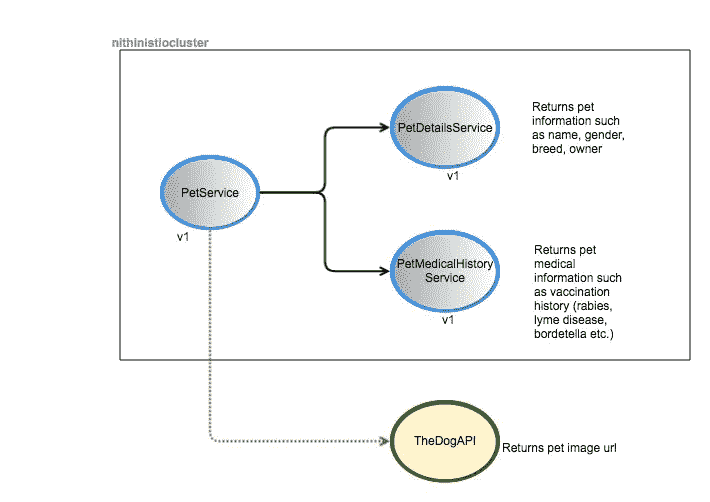
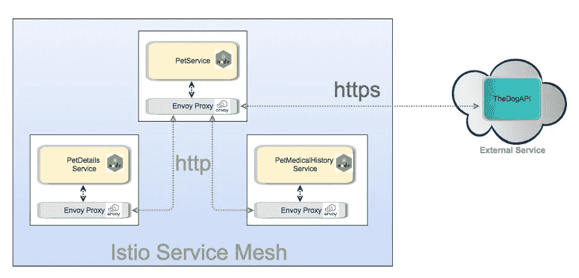
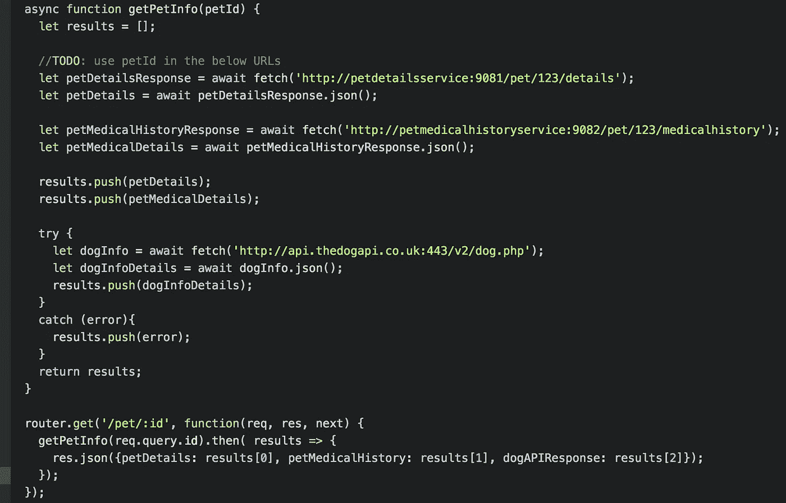

# 使用 Google Kubernetes 引擎中的 Istio 简化微服务—第二部分

> 原文：<https://medium.com/google-cloud/simplifying-microservices-with-istio-in-google-kubernetes-engine-part-ii-7461b1833089?source=collection_archive---------0----------------------->

> 我写的关于 Istio 的内容是 Istio 网站上[精彩文档](https://istio.io/docs/)的一个子集。请阅读官方文件以了解更多信息。

在本系列的[第一部分](/google-cloud/simplifying-microservices-with-istio-in-google-kubernetes-engine-part-i-849555f922b8)中，我们看到了如何使用 [Istio](https://istio.io/) 来简化微服务之间的通信。

> **在这一部分中，我们将看到 Istio 服务网格中的服务如何通过 HTTPS 与外部服务进行通信**



图 1:服务通信模型的逻辑视图

在上面的图 1 中，我们的 PetService(与 PetDetailsService 和 PetMedicalHistoryService 对话)**现在也将调用位于**[**https://thedogapi.co.uk/**](https://thedogapi.co.uk/)**的外部服务，该服务返回狗的图像 URL。**

来自 Istio 服务网格内部的外部服务通信如下面的图 2 所示。

*   与往常一样，服务网格中服务之间的所有通信都是通过 HTTP 上的代理进行的
*   为了通过 HTTPS 与外部服务通信，内部服务仍然会发送 HTTP 请求，这些请求会被 sidecar 代理截获，该代理发起 TLS 并通过加密通道与外部服务通信。



图 2:与外部服务通信的 Istio 服务网格表示

[**Github 回购**](https://github.com/nmallya/istiodemo)

完成这项工作的 **petservice** 代码如下所示:



> **注意**:请看我们如何调用 DogAPI 的 https url 作为**http**://API . the DogAPI . co . uk**:443**/v2/dog . PHP

让我们看看当我们运行以下命令时会发生什么，其中 108.59.82.93 是入口 IP 地址。(见第一部分)

```
curl http://108.59.82.93/pet/123
```

响应看起来像:

```
{
  "petDetails": {
    "petName": "Maximus",
    "petAge": 5,
    "petOwner": "Nithin Mallya",
    "petBreed": "Dog"
  },
  "petMedicalHistory": {
    "vaccinationList": [
      "Bordetella, Leptospirosis, Rabies, Lyme Disease"
    ]
  },
  "**dogAPIResponse": {
    "message": "request to** [**https://api.thedogapi.co.uk/v2/dog.php**](https://api.thedogapi.co.uk/v2/dog.php) **failed, reason: read ECONNRESET",
    "type": "system",
    "errno": "ECONNRESET",
    "code": "ECONNRESET"**
  }
}
```

您将在上面的响应中注意到，当我们的 **petservice** 试图访问位于[https://api.thedogapi.co.uk](https://api.thedogapi.co.uk)的外部服务时，dogAPIResponse(不是最原始的名称)部分有一个错误

这是因为默认情况下，所有外部流量(出口)都被阻止。前一篇文章中解释的 sidecar 代理只允许集群内部的通信。

> **注意**:正如我在第一部分中提到的，当我们想要控制我们的服务与外部服务对话的方式，并防止与外部系统进行任何未经授权的通信时，这个限制非常有用。
> 
> 医疗保健/金融系统尤其可以利用这一功能来保护 PHI/PII 数据不被内部服务无意甚至恶意共享。

要启用出口流量，您需要创建一个**出口规则**，如下所示:

```
cat <<EOF | istioctl create -f -
apiVersion: config.istio.io/v1alpha2
kind: EgressRule
metadata:
  name: dogapi-egress-rule
spec:
  destination:
    service: api.thedogapi.co.uk
  ports:
    - port: 443
      protocol: https
EOF
```

要检查这个出口规则是否已经创建，您可以运行下面的命令，您应该看到出口规则 **dogapi-egress-rule** 已经创建。

```
kubectl get egressruleNAME                 AGEdogapi-egress-rule   5m
```

让我们再次尝试上面的 curl 命令:

```
$ curl [http://108.59.82.93/pet/123](http://108.59.82.93/pet/123){
  "petDetails": {
    "petName": "Maximus",
    "petAge": 5,
    "petOwner": "Nithin Mallya",
    "petBreed": "Dog"
  },
  "petMedicalHistory": {
    "vaccinationList": [
      "Bordetella, Leptospirosis, Rabies, Lyme Disease"
    ]
  },
  "dogAPIResponse": {
    "count": 1,
    "api_version": "v2",
    "error": null,
    "data": [
      {
        "id": "rCaz-LNuzCC",
        **"url": "**[**https://i.thedogapi.co.uk/rCaz-LNuzCC.jpg**](https://i.thedogapi.co.uk/rCaz-LNuzCC.jpg)**",**
        "time": "2017-08-30T21:43:03.0",
        "format": "jpg",
        "verified": "1",
        "checked": "1"
      }
    ],
    "response_code": 200
  }
}
```

而且很管用！您可以在 DogAPI 响应中看到一个宠物图片的示例 url。

**结论**:我们看到了如何通过创建显式规则来实现从服务网格到外部服务的通信。

在后续文章中，我们将看到如何做其他重要的任务，如流量路由和斜坡，使用断路器等。

**资源**:

1.  本系列文章第一部分:[https://medium . com/Google-cloud/simplizing-micro services-with-istio-in-Google-kubernetes-engine-part-I-849555 f 922 b 8](/google-cloud/simplifying-microservices-with-istio-in-google-kubernetes-engine-part-i-849555f922b8)
2.  Istio 主页[https://istio.io/](https://istio.io/)
3.  DevOxx Istio 演示由[Ray Tsang](https://medium.com/u/a535baed6389?source=post_page-----7461b1833089--------------------------------):[https://www.youtube.com/watch?v=AGztKw580yQ&t = 231 秒](https://www.youtube.com/watch?v=AGztKw580yQ&t=231s)
4.  Github 链接到这个例子:[https://github.com/nmallya/istiodemo](https://github.com/nmallya/istiodemo)
5.  库伯内斯:[https://kubernetes.io/](https://kubernetes.io/)
6.  DogAPI 页面:[https://thedogapi.co.uk/](https://thedogapi.co.uk/)