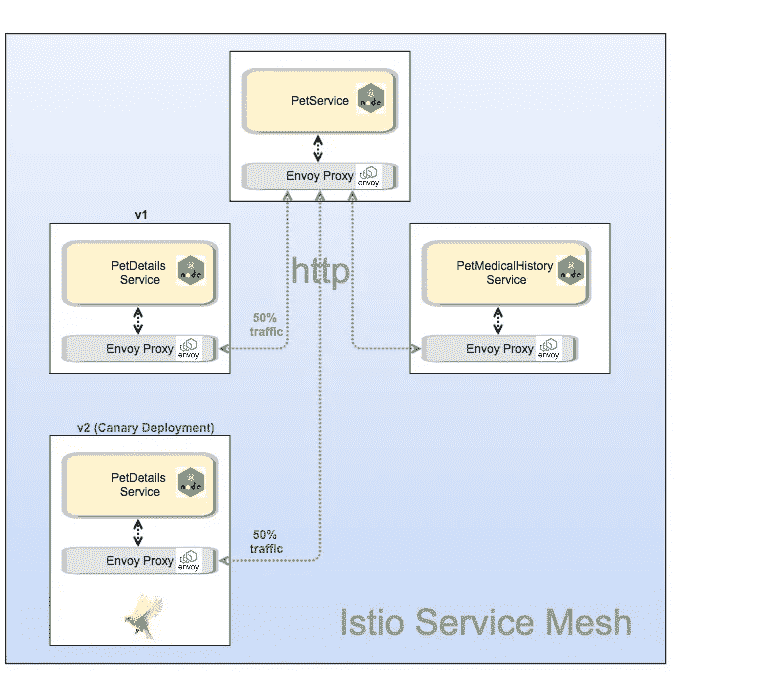

# 使用 Google Kubernetes 引擎中的 Istio 简化微服务—第三部分

> 原文：<https://medium.com/google-cloud/simplifying-microservices-with-istio-in-google-kubernetes-engine-part-iii-6b62876d0a7d?source=collection_archive---------1----------------------->

> 我写的关于 Istio 的内容是 Istio 网站上[精彩文档](https://istio.io/docs/)的一个子集。请阅读官方文件以了解更多信息。

在本系列的[第一部分](/google-cloud/simplifying-microservices-with-istio-in-google-kubernetes-engine-part-i-849555f922b8)中，我们看到了如何使用 [Istio](https://istio.io/) 来简化微服务之间的通信。

在本系列的第二篇文章中，我们学习了使用 Istio 出口规则来控制对服务网格之外的服务的访问。

> **在这一部分中，我们将了解如何使用 Istio** 进行金丝雀部署和增加流量

**背景**:在[过去的文章](/@nithinmallya4/blue-green-deployments-for-a-rails-app-in-google-container-engine-gke-49ddcc1b002)中，我详细解释了我们如何使用 Kubernetes 进行蓝/绿部署。这是一种部署技术，我们使用应用程序的当前版本**和新版本**部署相同的生产环境。这项技术使我们能够进行零停机部署(ZDD)，以确保我们的用户在切换到新版本时不会受到影响。拥有两个版本(当前版本和新版本)也使我们能够在新版本出现任何问题时回滚。

我们**还需要**能够**将流量**提升(或降低)到我们应用的新版本，并监控它以确保没有负面影响。实现这一点的一个方法是用 [**部署**](https://martinfowler.com/bliki/CanaryRelease.html) 或者金丝雀释放。

> 不那么有趣的事实:矿工进入矿井时会带着金丝雀。任何有毒气体都会首先杀死金丝雀，并警告矿工离开矿井。

同样，在应用程序部署领域，通过 Canary 部署，我们可以将应用程序的新版本部署到生产环境中，并且只将一小部分流量发送到这个新部署。这个新版本**将与当前版本**并行运行**，并在我们将所有流量切换到新版本**之前提醒我们任何问题。

例如:我们的应用程序 v1 可以获得 90%的流量，v2 可以获得另外的 10%。如果一切正常，我们可以将 v2 流量提升至 25%、50%，最终达到 100%。Istio Canary 部署的另一个优势是，我们可以根据请求中的自定义报头来增加流量。例如，将 10%具有特定 cookie 头值的流量提升至我们应用的 v2。

> **注意**:虽然 Canary 部署“可以”与 A/B 测试结合使用，从业务指标的角度来看用户对新版本的反应，但其背后的真正动机是确保应用程序从功能角度来看表现令人满意。此外，业务所有者可能希望运行 A/B 测试活动的时间比 Canary ramp 可能需要的时间更长(例如:许多天甚至几周)。因此，将它们分开是明智的。

# **让我们看看它的实际效果吧！**

从第一部分我们知道，我们的 PetService 与 PetDetailsService(v1)和 PetMedicalHistoryService(v1)进行对话。对 PetService 的调用的输出如下所示:

```
$ **curl** [**http://108.59.82.93/pet/123**](http://108.59.82.93/pet/123){
  "petDetails": {
    "petName": "Maximus",
    "petAge": 5,
    "petOwner": "Nithin Mallya",
    **"petBreed": "Dog"**
  },
  "petMedicalHistory": {
    "vaccinationList": [
      "Bordetella, Leptospirosis, Rabies, Lyme Disease"
    ]
  }
}
```

在上面的回答中，你会注意到宠物的名字是“狗”。**然而，Maximus 碰巧是一只德国牧羊犬，我们需要修改 PetDetailsService，以便正确返回该品种。**

因此，我们创建了 PetDetailsService 的 v2，它现在将返回“德国牧羊犬”。但是，我们希望确保在将所有流量驱动到 v2 之前，我们可以用一小部分用户测试该服务的 v2。

在下面的图 1 中，我们看到流量被配置为 50%的请求将被定向到 v1，50%的请求将被定向到 v2，即我们的 Canary 部署。(可以是任何数字，具体取决于变化的程度，并尽量减少负面影响)。



图 1:我们可以将 PetDetailsService 的 v2 部署为金丝雀部署并增加流量

# 步骤:

1.  创建 PetDetailsService 的版本 v2，并像以前一样部署它。(参见 petdetailservice/kube 文件夹下的 petinfo.yaml)

```
$ kubectl get podsNAME                                         READY     STATUS    RESTARTS   AGEpetdetailsservice-v1-2831216563-qnl10        2/2       Running   0          19h**petdetailsservice-v2-2943472296-nhdxt**        2/2       Running   0          2hpetmedicalhistoryservice-v1-28468096-hd7ld   2/2       Running   0          19hpetservice-v1-1652684438-3l112               2/2       Running   0          19h
```

2.创建一个 **RouteRule** ，将流量分成 **petdetailsservice** 的 50%(v1)和 50%(v2)，如下所示:

```
cat <<EOF | istioctl create -f -
apiVersion: config.istio.io/v1alpha2
kind: RouteRule
metadata:
  name: petdetailsservice-default
spec:
  destination:
    name: petdetailsservice
  route:
  - labels:
      **version: v1
    weight: 50**
  - labels:
      **version: v2
    weight: 50**
EOF$ **istioctl get routerule**NAME    KIND     NAMESPACEpetdetailsservice-default RouteRule.v1alpha2.config.istio.io default
```

3.现在，如果您访问 PetService，您应该看到交替请求分别返回“Dog”和“German Shepherd Dog ”,如下所示:

```
$ **curl** [**http://108.59.82.93/pet/123**](http://108.59.82.93/pet/123){
  "petDetails": {
    "petName": "Maximus",
    "petAge": 5,
    "petOwner": "Nithin Mallya",
    **"petBreed": "Dog"**
  },
  "petMedicalHistory": {
    "vaccinationList": [
      "Bordetella, Leptospirosis, Rabies, Lyme Disease"
    ]
  }
}$ **curl** [**http://108.59.82.93/pet/123**](http://108.59.82.93/pet/123){
  "petDetails": {
    "petName": "Maximus",
    "petAge": 5,
    "petOwner": "Nithin Mallya",
    **"petBreed": "German Shepherd Dog"**
  },
  "petMedicalHistory": {
    "vaccinationList": [
      "Bordetella, Leptospirosis, Rabies, Lyme Disease"
    ]
  }
}
```

而且很管用！

> ***这就引出了一个问题:难道我们不能用***[***Kubernetes 金丝雀部署***](https://kubernetes.io/docs/concepts/workloads/controllers/deployment/#canary-deployment) ***来做这件事吗？简单的回答是肯定的。***

但是，这样做的步骤比较复杂，并且有一些限制:

*   您仍将创建 PetDetailsService 的两个部署(v1 和 v2 ),但是您需要在部署期间手动限制 v2 副本的数量，以保持 v1:v2 的比率。例如:您可以用 10 个副本部署 v1，用 2 个副本部署 v2，以实现 10:2 的负载平衡，依此类推。
*   由于所有的 pods，**与版本**无关，都被同等对待，因此 Kubernetes 集群中的流量负载平衡仍然具有随机性。
*   基于流量的自动扩展 pod 也存在问题，因为我们需要分别自动扩展两个部署，这两个部署会根据每个服务上的流量负载分布表现不同
*   如果我们希望根据某些标准(如请求头)只允许/限制某些用户的流量，Kubernetes Canary 部署可能无法实现这一点。

> ***结论:您刚刚看到了使用 Istio 创建金丝雀部署和斜坡流量是多么容易。马克西姆斯也很快乐！***


**资源**:

1.  本系列文章第一部分:[https://medium . com/Google-cloud/simplizing-micro services-with-istio-in-Google-kubernetes-engine-part-I-849555 f 922 b 8](/google-cloud/simplifying-microservices-with-istio-in-google-kubernetes-engine-part-i-849555f922b8)
2.  本文章系列第二部分:[https://medium . com/Google-cloud/simplizing-micro services-with-istio-in-Google-kubernetes-engine-part-II-7461 b 1833089](/google-cloud/simplifying-microservices-with-istio-in-google-kubernetes-engine-part-ii-7461b1833089)
3.  Istio 主页[https://istio.io/](https://istio.io/)
4.  DevOxx Istio 演示由[Ray Tsang](https://medium.com/u/a535baed6389?source=post_page-----6b62876d0a7d--------------------------------):[https://www.youtube.com/watch?v=AGztKw580yQ&t = 231 秒](https://www.youtube.com/watch?v=AGztKw580yQ&t=231s)
5.  Github 链接到这个例子:[https://github.com/nmallya/istiodemo](https://github.com/nmallya/istiodemo)
6.  库伯内斯:[https://kubernetes.io/](https://kubernetes.io/)