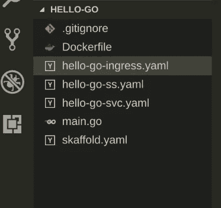
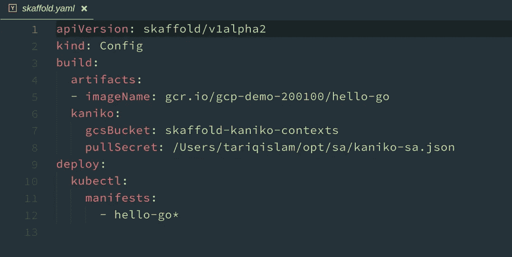
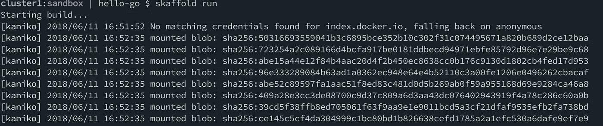
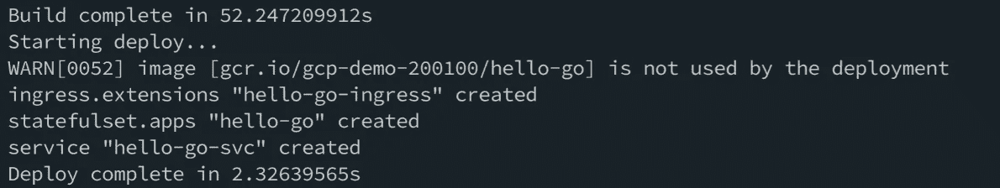
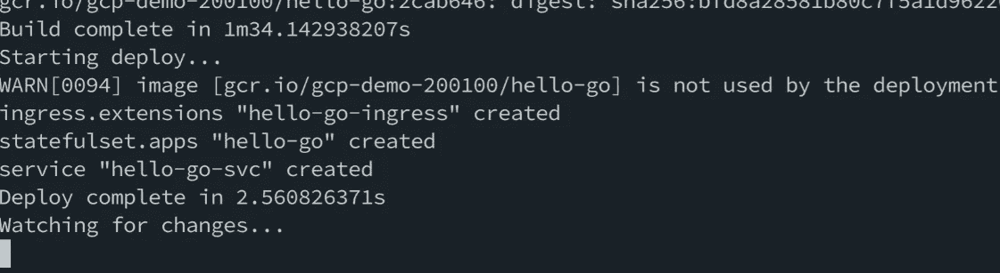
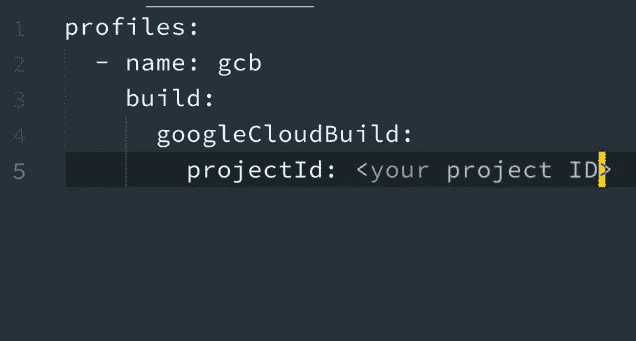

# Skaffold 和 Kaniko:将 Kubernetes 带给开发者

> 原文：<https://medium.com/google-cloud/skaffold-and-kaniko-bringing-kubernetes-to-developers-a43914777af9?source=collection_archive---------1----------------------->


图片鸣谢:[https://www . Lynda . com/NET-tutorials/Create-NET-Standard-library-Linux-using-CLI/672255/729660-4 . html](https://www.lynda.com/NET-tutorials/Create-NET-Standard-library-Linux-using-CLI/672255/729660-4.html)

当谈到 Kubernetes (k8s)时，在开发者生态系统方面有很多(可能太多)正在发生。工具不缺。不要担心，这个帖子不会第 58 次把它们都进行比较。我想在这里为您概述的是一种作为开发人员使用 Kubernetes 的非常规范、轻量级和非常灵活的方式。所以让我们减肥吧。

# 为什么我们应该关心

首先我要说，如果没有 Docker，Kubernetes 就不会有今天。无论你对该公司的看法如何，技术本身绝对是 Kubernetes 成功的关键。然而，我们发现自己正处在一个十字路口，Docker 推广的技术(Linux 容器)几乎完全变成了商品。记住 Linux 容器只是几个基于 Linux 的构造的集合，我们突然发现自己不像以前那样需要 Docker 来构建和管理常见的容器。根据最近的容器构建工具，Docker 提出的“守护进程”对于大多数开发需求来说太重了。

这发生在 Docker 的发展过程中(作为一家公司)。我在我的工作站上注意到了这一点，因为我看到 Docker 从一个处理容器的很酷的小工具变成了一个成熟的平台，由于 Kubernetes 的普遍性和实用性，我不需要或不想使用其中的大部分。“守护进程”变得太大了。

我最近开始大幅削减我的工作流程。我希望能够在本地开发，但我也希望利用 Kubernetes 中的部署环境来保持与其他人部署方式的一致性。坦率地说，环境中的这种一致性从我的本地工作站无缝地转换到生产环境中，简直是不朽的。我想加入。

进入[斯卡福德](https://github.com/GoogleContainerTools/skaffold)和[佳美子](https://github.com/GoogleContainerTools/kaniko)。你可以在他们各自的 GitHub (JitHub？lol)页面，但这里有一个快速的两行入门:

*   Skaffold:一个命令行实用程序，允许针对 Kubernetes 集群进行迭代本地开发。
*   Kaniko:一种构建机制，通过这种机制可以构建容器映像并将其推送到注册表中，而无需使用 Docker。这是最近整合到斯卡福德。

您可以将这些集成到您喜欢的任何级别的现有管道中(使用现有的 CI / CD 工具)，但是这些工具不是它们的替代品。

这个工具链允许我专注于我的代码，顺便说一下，我没有在我的本地工作站上安装 Docker，因为作为一名开发人员，我真的只想输出一个结果映像来部署、测试和迭代。我也不必担心维护运行 Kubernetes 或其发行版的本地 VM，除非我有进行离线开发的硬性要求。即便如此，如果你想要完整的线下体验，Skaffold 和 Kaniko 也可以在本地运营。然而，在这里，我使用 GKE，因为它也符合我如何快速有效地发展。让我们从查看我的代码树开始:



更新:你可以在 https://gitlab.com/tariqislam/hello-go 的[找到代码](https://gitlab.com/tariqislam/hello-go)

快速概述:

*   是的。这可能是 Docker 唯一最大的持久遗产。
*   这是一份常规的入境清单。这将导致谷歌云负载平衡器(业界最好的)自动供应和全球分布。
*   这是我的有状态集合清单(这是一个用 go 编写的有状态应用程序)
*   这是我的部署的服务清单
*   main.go:这是我的应用
*   yaml:这是我定义我想要构建的映像的本地开发“管道”的地方，我想要它去哪里，以及在构建中包含什么文件。这也是我指定要使用 Kaniko 而不是 Docker 来构建容器映像的地方。

# 开始运行

在斯卡福德清单中，我定义了三件事，然后才能忘记:

*   映像名称(完全限定为包括目标注册表)
*   kaniko 作为构建机制，包括我的源上下文放入的 GCP 桶，以及 kaniko 自己将图像推送到注册表的服务帐户秘密
*   一个通配符模式，用于检测要包含在我的迭代部署中的文件

看起来是这样的:



这份文件正是我让斯卡福德和卡尼科为我工作所需要的。根据 Kubernetes 清单、Dockerfile 和代码，其他的一切都是您所期望的。如果您还没有，您可以使用以下内容快速创建一个存储桶:

`gsutil mb gs://<bucket name>`

接下来，您需要为 Kaniko 创建一个常规服务帐户，以便能够将构建的图像推送到您的 Google 容器注册中心。这个服务帐户应该被授予`Storage Admin`权限，您需要为上面文件中引用的服务帐户下载相应的密钥。您可以使用以下命令来完成此操作:

```
gcloud iam service-accounts create <SA-NAME> \
    --display-name "SA-DISPLAY-NAME"
```

使用以下内容检索 json 键(将其移动到 skaffold.yaml 文件中指定的路径):

```
gcloud iam service-accounts keys create /download/path/ --iam-account <SA-NAME>
```

在这一点上，我可以设置它并忘记它。斯卡福德和卡尼科都把自己移到背景中，让我无缝地使用。现在，我只需要提供一个 Kubernetes 环境，作为一名开发人员，我可以将它视为我自己的开发工作区，而不必担心多租户问题:

`gcloud container clusters create my-dev-cluster --zone=us-east4-a`

等待几分钟，让群集启动，然后:

`skaffold run`

这将把 Kaniko 作为一个临时 Pod 注入到我的集群中，然后构建我的容器映像，把它放入指定的注册表中，然后 Skaffold 将使用我的 k8s 配置中的上下文把该映像部署到我的集群中。这是一个单一的、一次性的构建。

它看起来会像这样:



如果我想迭代开发，Skaffold 提供了一个选项，可以自动检测我代码中的变化，重建映像，推送映像，并重新部署到我自己的 k8s 环境中。为此，我们使用以下命令:

`skaffold dev`

它将侦听更改并输出后续的构建和部署:



仅此而已。我拥有作为一名开发人员所需要的东西，能够在没有干扰和开销的情况下进行迭代开发。如果我的需求或环境发生变化，Skaffold 本身足够灵活，可以使用不同的构建环境(local Docker、Google Cloud Builder 等),这些环境可以在一个 Skaffold 配置中指定为概要文件。例如，如果我决定使用 Google Cloud Builder 而不是 Kaniko，我可以简单地将以下代码片段添加到我的配置文件中:



并运行以下命令:

`skaffold run -p gcb`

我希望这有助于您开始有效地使用 Kubernetes 环境进行开发。这些项目刚刚起步，因此潜力巨大。