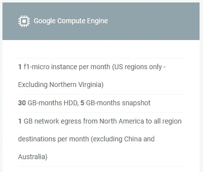
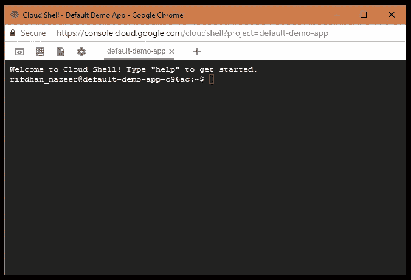
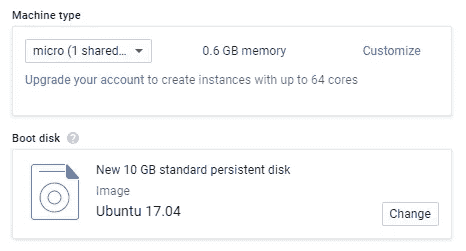

# 前途无量:谷歌云平台

> 原文：<https://medium.com/google-cloud/skys-the-limit-google-cloud-platform-9dd7fa3354e4?source=collection_archive---------0----------------------->

在我最近的实习期间，我开发了一个不和谐机器人，作为一个有趣的个人项目。我在自己家里的一台备用电脑上托管了它，因为这在当时似乎是最简单的解决方案。虽然它开始时只是一个小小的爱好项目，但它的发展远远超出了我的预期。很快，我就收到了许多朋友的请求，要我将这个机器人添加到他们的 Discord 服务器上，我需要一个合适的托管解决方案来避免在家里托管、脆弱的电源和互联网服务带来的尴尬中断。此外，我直到后来才意识到全天候运行家庭服务器的高电力成本——这是所有自助者的重要考虑因素。


我用来托管我的不和谐机器人的备用机器

# 成本比较

一开始，从我的家庭服务器上运行这个机器人似乎是一个很好的解决方案，因为它没有前期成本。然而，我没有考虑它将使用的电力成本，这至少可以忽略不计。一个简单的计算:我运行它的备用计算机(一台小型媒体中心 PC)的电源额定为 300 瓦。正常运行期间，CPU 使用率平均为 15%左右。因此，我们估计系统平均功耗约为 200 W。用一天中的 24 小时乘以一个月中的 30 天，我们得到 144 千瓦时。令我惊讶的是，我简单的自托管机器人占了我家总耗电量的 15%,而且花费了相当多的钱！为真正的 VPS 服务付费会更便宜。这种认识给了我最终探索其他地方托管的动力。

我最初计划将机器人移植到亚马逊的网络服务，因为它是主机游戏中最大的名字。在我实习期间，我获得了一些使用 AWS 的经验，它似乎是一个坚实的托管平台。然而，几个星期后，我在 Hacker News 上看到了一个关于 Google 云平台 [always-free tier](https://cloud.google.com/free/) 的帖子，这确实引起了我的注意。虽然 AWS 为其核心服务提供了 12 个月的免费试用，但 GCP 提供了许多类似的服务，而且是永久免费的(或者直到他们决定修改等级)！最重要的是，谷歌提供 300 美元的免费积分，供你在第一年选择任何服务时使用！作为一名学生，免费的东西看起来真的很有吸引力，所以在[和](http://www.infoworld.com/article/3179785/cloud-computing/aws-vs-azure-vs-google-cloud-which-free-tier-is-best.html)一番比较后，我选择了去 GCP。



谷歌计算引擎的永远免费层产品

# 报名

注册后，我被扔进了 GCP 的仪表盘，那里有很多面板、菜单和状态信息——至少可以说有点让人不知所措。右边栏提示做一个快速教程来学习诀窍，这对于像我这样的初学者来说是一个非常受欢迎的内容。该教程向我展示了如何克隆一个 NodeJS 项目并将其部署到 Google App Engine。这相当简单，在这个过程中，我了解了[云外壳](https://cloud.google.com/shell/docs/features)——一个方便的基于网络的终端会话，由 GCP 上一个短暂的虚拟机支持。然而，值得注意的是，该教程缺乏关于如何拆除示例项目的细节(如果继续运行，它会吃掉我的配额)，我最终找到了关于如何正确完成该任务的[指南](https://cloud.google.com/nodejs/getting-started/delete-tutorial-resources)。



Google Cloud Shell——一个小巧的基于浏览器的终端

在对 web 用户界面有所了解之后，我必须决定我需要哪些服务。有两个选项:1)使用应用引擎和云 SQL，或者 2)使用带有计算引擎的虚拟机。第一个选项将提供更好的性能和更酷的好处，如与 CI 的集成和更容易的部署，但云 SQL 不是作为一种永远免费的服务提供的(Amazon RDS 也不是)。因此，第一年之后，我花了很多钱来经营它。与此同时，Compute Engine 提供了一个永远免费的 f1 微实例，这将让我免费继续运行超过一年的机器人。由于这项工作背后的主要动机之一是节约成本，我选择了选项 2。如果我想尝试一下 App Engine，将来总有可能改变这一点。

为了在计算引擎中创建一个虚拟机，[我使用了 web UI](https://console.cloud.google.com/compute/instancesAdd) 。配置和启动相当简单。我选择了 f1-micro 配置，并选择了 Ubuntu 17.04，因为我已经非常熟悉 Ubuntu 环境。如果你想留在自由层，请确保选择一个美国地区，而不是北弗吉尼亚。在花了几分钟进行初始启动后，我能够使用 Google Cloud Shell 进行 SSH。在那里，我在 VM 中安装了 Python、NodeJS 和 MySQL 服务器。我克隆了机器人的回购，完成了初始设置。



我用于计算引擎虚拟机的配置

# 迁移数据库

为了将 SQL 数据从我的家庭服务器迁移到计算引擎虚拟机，我使用了`mysqldump`实用程序。在 Windows 服务器上，我毫不费力地导出了数据库:

```
cd C:\Program Files\MySQL\MySQL Server 5.7\bin
mysqldump -u [username] -p[password] [database name] > C:\data.sql
```

请注意，`-p`标志和密码之间没有空格。

之后，我将导出的数据文件复制到 VM，并导入它。注意，在导入数据之前，您必须在目标 SQL server 上创建数据库本身。导入数据也很容易:

```
mysql -u root -p -h localhost [database name] < ~/data.sql
```

迁移后，我只是简单地浏览了一下数据库，以确保一切正常。

# 命令行生活方式

由于我的家庭服务器运行 Windows(不要评价我)，并且有一个完整的窗口服务器，很容易在一个窗口启动机器人，在另一个窗口做其他事情。然而，在计算引擎虚拟机上，我想只使用终端接口，这样就不会牺牲性能。因此，我努力设置`npm start`和`npm stop`命令，在一个单独的进程中启动机器人，而不阻塞我正在使用的终端，也不牺牲查看`stdout`日志的能力。经过大量的研究和反复试验，我决定采用以下方法(在我的`package.json`):

```
"scripts": {
  "start": "nohup node main.js > log.txt 2>&1 & echo $! > pid.txt",
  "stop": "kill $(tail pid.txt)",
  ...
}
```

这将在一个新的进程中启动 NodeJS(经典的`&`)，使用输出重定向将`stdout`和`stderr`发送到本地日志文件`log.txt`，并将新的 PID 保存到`pid.txt`。`nohup`实用程序阻止指定的可执行文件接收挂起(HUP)信号。这意味着终端会话可以安全地结束(即当从 SSH 断开连接时),而不会终止 NodeJS 子进程。然后要停止 NodeJS 进程，我们可以简单地用保存的 PID 杀死进程！

所以要启动 bot，我只需使用`npm start`，它会在启动 bot 后将终端会话返回给我，我可以继续做任何事情。然后当我想停止机器人时，我只需`npm stop`。我可以使用`tail -f log.txt`随时实时查看日志。

# 结论

我将我的 Discord bot 从我的家庭服务器迁移到谷歌云平台，本质上是使用计算引擎作为 VPS。因此，我为自己节省了自主托管的电费，而不必为我目前在 GCP 上使用的性能水平支付任何费用。一路走来，我也学会了谷歌云平台的诀窍——这是我很高兴掌握的东西。如果将来 bot 的使用量大幅增加，我可以轻松地扩展 VM 配置，或者可能探索迁移到 App Engine 和云 SQL，这本身将是另一次冒险。