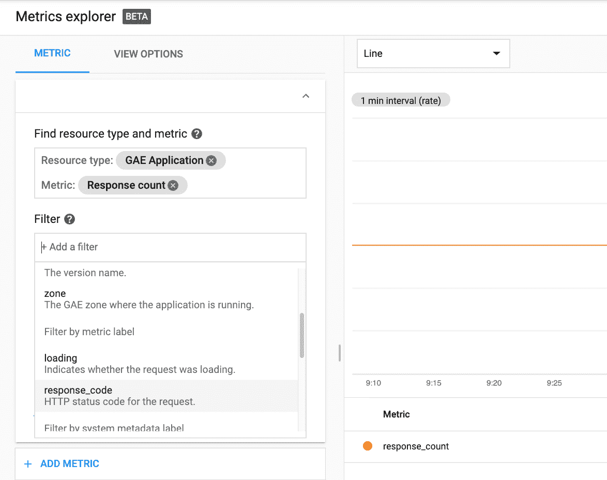

# SLOs 与 Stackdriver 服务监控

> 原文：<https://medium.com/google-cloud/slos-with-stackdriver-service-monitoring-62f193147b3f?source=collection_archive---------0----------------------->

服务水平目标是[现场可靠性工程](https://landing.google.com/sre/)的基本原则之一。我们使用它们来精确量化我们希望在服务中实现的可靠性目标。我们还使用他们的逆[误差预算](https://landing.google.com/sre/sre-book/chapters/embracing-risk/#xref_risk-management_unreliability-budgets)，来做出在任何给定时间我们可以承担多大风险的明智决定。例如，这让我们能够确定我们是否可以推进生产或基础架构升级。

然而，Stackdriver 从来没有给我们实际创建、跟踪、提醒和报告 SLO 的能力——直到现在。服务监控 API 在秋天的 NEXT London 上发布了公开测试版，我想借此机会尝试一下。这是我的发现。

# 服务

在创建服务级别目标之前，我需要一个服务。因为最初发布的 [API](https://cloud.google.com/monitoring/service-monitoring/) 只支持 App Engine、GKE 上的 Istio 和云端点，所以我想我会尝试最简单的选择——App Engine Standard。我用 Mux 路由器在 Go 中创建了一个基本的 Hello World 应用程序——下面是它的[代码](https://github.com/yuriatgoogle/stack-doctor/tree/master/service-monitoring-demo/gae):

然后，我创建了 app.yaml 文件:

```
runtime: go112 # replace with go111 for Go 1.11
```

接下来，我使用“gcloud app deploy”部署了该应用。此时，构建过程失败了，我不得不按照这些[指令](https://github.com/golang/go/wiki/Modules#how-to-define-a-module)来定义一个模块。我不是围棋专家，我猜这是一个本地环境配置的问题，我懒得去解决。尽管如此，我还是按照这些说明部署了这个应用程序。

最后，我设置了一个全球正常运行时间检查，以获得稳定的流量流向我的新应用程序:


# 定义 SLI

现在我已经创建了一个服务，可以继续了。我发现关于概念的[文档](https://cloud.google.com/monitoring/service-monitoring/)非常有帮助，即使是对这个主题非常熟悉的人。在这个练习中，我想创建一个简单的可用性服务水平指标(SLI ),来衡量“良好”请求占总数的百分比。这需要三个决定:

*   如何计算请求总数
*   如何计算“好的”请求
*   我的 SLI 使用什么时间框架

幸运的是，App Engine 提供了一个有用的响应计数指标:


**请注意**如果 GAE 应用程序被禁用(我通过禁用该应用程序来模拟失败，从而了解到这一点)，则不会写入该指标。

此指标可以进一步按响应代码进行筛选:



为了简单起见，我决定使用未过滤的指标来计算请求总数，并过滤响应代码为 200 的请求来计算“好”的请求。

> N **注意到**这对于任何生产应用来说都可能过于简单。例如，这将把 404 算作“坏”请求，而它们很可能是错误配置的客户端甚至外部扫描器的结果。

# 创造了 SLI 和 SLO

此时，我已经准备好使用 [API](https://cloud.google.com/monitoring/service-monitoring/identifying-custom-sli) 来定义我的 SLO。正如“[构建 SLI](https://cloud.google.com/monitoring/service-monitoring/identifying-custom-sli#configure-sli) ”一节中所推荐的，我使用 Metrics Explorer 创建了一个图表，显示了我的“总”请求数:


从那里，我能够复制过滤器的 JSON:

```
"metric.type=\"appengine.googleapis.com/http/server/response_count\" resource.type=\"gae_app\" resource.label.\"module_id\"=\"default\""
```

然后我修改了图表，只统计“好的”请求，过滤 response_code=200，并复制了 JSON:

```
"metric.type=\"appengine.googleapis.com/http/server/response_count\" resource.type=\"gae_app\" resource.label.\"module_id\"=\"default\" metric.label.\"response_code\"=\"200\""
```

此时，我已经准备好建造 SLI 了:

我选择了“基于请求”类型的 SLI，因为我希望捕捉全部请求中好的部分。其他选项[包括](https://cloud.google.com/monitoring/service-monitoring/api-structures#sli-structs) *【基本】*，这对于我在这里的目的来说可能已经足够好了，还有“*基于窗口的*”，它允许您统计服务满足定义的健康阈值的周期数。我可能会回来，在另一篇文章中重新讨论后者。

从那里，我定义了 SLO:

最后，我使用 [Postman](https://www.getpostman.com/) 将请求提交给 API——您可以使用 API Explorer 甚至 curl 做同样的事情。响应是成功的，并在正文中返回了 SLO 的名字:

# 警惕 SLO

既然我的 SLO 已经定义好了，我想实现两件事——为 SLO 违规创建一个警报，并弄清楚如何在不触发警报的情况下获得状态。我能够使用 UI 创建一个使用“SLO 燃烧率”条件类型的警报策略:


在设置警报策略时，我遇到了两个字段，它们的含义我并不清楚。第一个是回望持续时间。我在[文档](https://cloud.google.com/monitoring/alerts/concepts-indepth#condition-types)中找到了解释——因为燃烧速率从根本上来说是一个变化率条件，你可以选择指定一个定制的回顾窗口。对于其他变化率条件，回看设置为 10 分钟，不能更改。从变化率条件的文档中:

> 该条件对过去 10 分钟的指标值进行平均，然后将结果与持续时间窗口之前测量的 10 分钟平均值进行比较。指标变化率条件使用的 10 分钟回顾窗口是一个固定值；你不能改变它。但是，在创建条件时，您需要指定持续时间窗口。

# 触发警报

配置好我的警报策略后，我想看看如果出现可用性问题会发生什么。我重写了服务，以便有一半时间抛出一个错误:

并重新部署了应用程序。很快，我遇到了一个事故:


我对此感到满意，并重新部署了原始代码的应用程序，让它再次工作。很快，事件得到了解决。

# 正在检索 SLO 状态

对错误预算烧警报显然是必要的，但有时我们需要在问题出现之前很久就知道我们的 SLO 的状态。因此，我需要一种方法来查询 SLO 数据。我遵循了[文档](https://cloud.google.com/monitoring/service-monitoring/timeseries-selectors)并使用了监控 API 的 [timeSeries.list](https://cloud.google.com/monitoring/api/ref_v3/rest/v3/projects.timeSeries/list) 方法。

我想到了我希望能够回答的两个主要问题——在给定的时间段内我的服务的可用性如何，以及在给定的时间点我的误差预算的状态如何？

# SLO 地位

第一个问题用“选择慢动作健康”时间序列来回答。我向[https://monitoring.googleapis.com/v3/projects/<项目 ID/时间序列](https://monitoring.googleapis.com/v3/projects/stack-doctor/timeSeries)发送了一个带有以下参数的请求:

```
name:projects/<project ID>filter:select_slo_health("projects/<project number>/services/gae:<project ID>_default/serviceLevelObjectives/<SLO name>")interval.endTime:2020-01-06T17:17:00.0Zinterval.startTime:2020-01-05T17:17:00.0Zaggregation.alignmentPeriod:3600saggregation.perSeriesAligner:ALIGN_MEAN
```

我使用了在前面的步骤中创建 SLO 时返回的 SLO 名称。我还可以调用[**【https://monitoring.googleapis.com/v3/projects/】**](https://monitoring.googleapis.com/v3/projects/)**<项目 ID > /services/gae: <项目 ID>_ default/serviceLevelObjectives**来检索我针对默认应用引擎服务配置的 SLO。

我指定了一个 24 小时的间隔来检索数据，使用平均对齐器进行 1 小时的对齐。如果我要绘制数据图表，我可以使用更短的校准周期和更精确的校准器，但这足以满足我的目的。结果看起来像这样:

正如预期的那样，输出显示了在总时间间隔(由 interval.startTime 和 endTime 指定)内，每个时间间隔(与我的 alignmentPeriod 匹配)的良好请求与总请求的百分比。对于我的服务，每个值都是 1，这意味着每个小时间隔内 100%的请求都是好的。

# 错误预算状态

我想回答的第二个问题是“我还有多少误差预算？”该操作符是 select_slo_budget_fraction。请求中唯一的变化是改变过滤器:

```
name:projects/<project ID>filter:select_slo_budget_fraction("projects/<project number>/services/gae:<project ID>_default/serviceLevelObjectives/<SLO name>")interval.endTime:2020-01-06T17:17:00.0Zinterval.startTime:2020-01-05T17:17:00.0Zaggregation.alignmentPeriod:3600saggregation.perSeriesAligner:ALIGN_MEAN
```

在向 timeSeries.list 方法发出请求后，我得到了以下返回:

如前所述，每个“值”代表该点剩余的误差预算的一部分。因为我的服务没有消耗错误预算，所以数字保持在 1。我还可以使用 select_slo_budget 操作符来获得实际的剩余预算——剩余的错误数。

# 总之…

我希望对服务监控 API 的介绍对您有所帮助。感谢您的阅读，如果您有任何反馈，请告诉我。下次见！