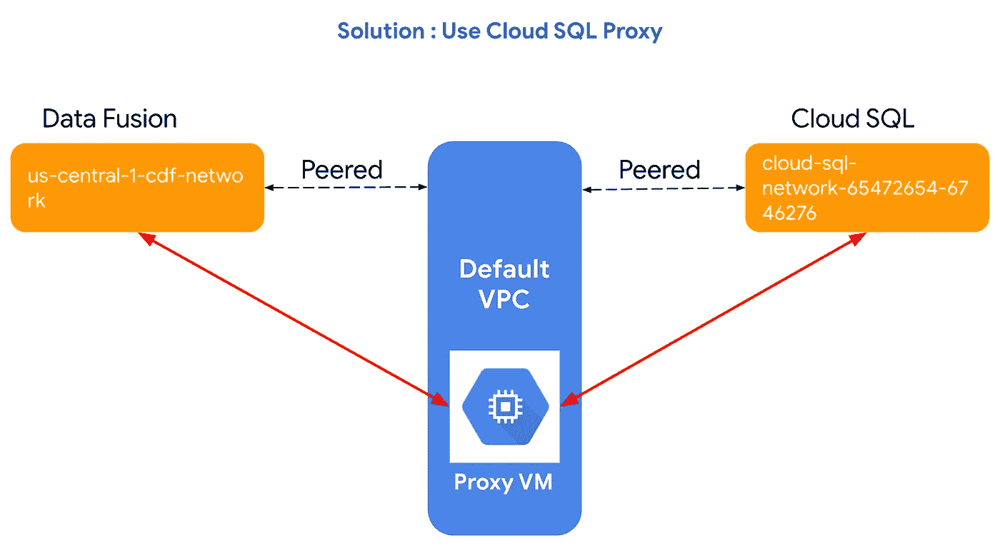

# 解决方案:无法从私有数据融合实例连接到私有云 SQL 实例？

> 原文：<https://medium.com/google-cloud/solution-not-able-to-connect-to-a-private-cloud-sql-instance-from-a-private-data-fusion-instance-7c01e8e4aa4?source=collection_archive---------0----------------------->

> 为什么使用私有 IP 的云数据融合“无法”与使用私有 IP 的云 SQL 实例连接，尽管使用了相同的 VPC 网络？
> 
> 我可以从云数据融合访问公共数据融合实例，而无需额外设置，但为什么它不能用于私有 IP？

请阅读这篇文章，找出这一挑战背后的原因并找到解决方案。

可以从云数据融合访问公共云 SQL 实例，但出于安全原因，建议将私有实例用于云 SQL 和云数据融合。

# 挑战

当您在同一个 VPC 中创建一个[私有数据融合实例](https://cloud.google.com/data-fusion/docs/how-to/create-private-ip#create_a_peering_connection)和一个[私有云 SQL 实例](https://cloud.google.com/sql/docs/mysql/connect-instance-private-ip)并尝试从云数据融合实例访问云 SQL 实例(MySQL 或 SQLServer)时，您无法在它们之间建立连接并得到以下错误:

# 背景

当您提供专用数据融合实例时，您将看到在 VPC 网络→您的 VPC 网络→专用服务连接下创建的专用服务连接，如下所示:

每当您创建云数据融合(CDF)实例时，它都会在幕后创建一个 Dataproc 集群，并运行所有的 sqoop 作业。现在，Dataproc 实例将只有一个私有 IP，这是创建具有私有 IP 地址的 CDF 实例的整个概念。当您按照[这个](https://cloud.google.com/data-fusion/docs/how-to/create-private-ip)配置私有 CDF 实例时，它会引导您在您当前的 VPC 网络(比如默认网络)和云融合租户项目网络之间创建 VPC 对等。因此，每当 CDF 实例运行时，它都作为租户项目运行。

> 租户项目 ID 是“at”符号( **@** )和后面的句点(**)之间的部分。**)。例如，如果服务帐户值为
> `cloud-datafusion-management-sa@r8170c9b5e7699803-tp.iam.gserviceaccount.com`，则租户项目 ID 为`r8170c9b5e7699803-tp`。

VPC 与租户项目对等

当您仅使用私有 IP 地址调配云 SQL 实例时，它会在后台创建一个 VPC 对等，这在您当前的 VPC 和特定于云 SQL 的对等 VPC 之间隐式发生。

# 连接失败的原因

现在我们知道了当两个私有实例都被提供时会发生什么。让我们来看看尽管设置了，连接还是没有建立的原因。无论何时创建私有数据融合实例，用户都会在当前网络和租户项目网络之间创建对等关系。每当再次创建私有云 SQL 实例时，当前网络和云 SQL 特定网络之间就会发生对等。
现在，这两种不同的 peerings 正在当前网络(即您的默认网络)之间发生。但是云数据融合网络和云 SQL 网络并不是对等的，这就是为什么您不能在两个私有实例之间创建连接。

VPC 对等不是可传递的

虽然看起来两个实例都在同一个网络中，但是如果深入了解细节，您会发现这是两个不同的网络，没有对等关系；因此，无法访问它们的内部 IP。
现在我们来谈谈解决方案。

# 解决办法

要从私有云数据融合实例连接到私有云 SQL 实例，请使用代理计算引擎虚拟机。之所以需要代理，是因为云 SQL 网络并不直接与云数据融合网络对等，并且可传递对等体无法相互通信。要了解更多关于 VPC 对等的信息，请点击[这里](https://cloud.google.com/vpc/docs/vpc-peering)。

代理虚拟机

**解决方案的步骤:**

1)使用此[文档](https://cloud.google.com/sql/docs/mysql/connect-instance-private-ip)创建一个私有 IP 云 SQL 实例。这将包括两个步骤:

*   建立 VPC
*   分配 IP 范围

2)使用此[文档](https://cloud.google.com/data-fusion/docs/how-to/create-private-ip)创建一个私有云数据融合实例。

***注意:*** 云 SQL 会创建自动访问私有 IP 实例所需的 VPC 对等，而数据融合则不会。你必须明确地创建 VPC 凝视你自己。确保完成[这一步。](https://cloud.google.com/data-fusion/docs/how-to/create-private-ip#set-up-vpc-peering)

3)完成上述步骤后，您应该会看到控制台中创建了 3 个 VPC peering。

*   云 SQL
*   服务网络
*   云数据融合

VPC 对等

4)使用此[文档](https://cloud.google.com/sql/docs/mysql/connect-admin-proxy)创建云 SQL 代理。

5)创建或确保防火墙规则允许流量从专用 CDF 实例通过所需端口到达您的代理虚拟机。CDF 的 IP 地址范围可以在 CDF 实例详细信息页面上找到。

防火墙规则

**从云数据融合实例访问云 SQL 实例**

6)在云数据融合中创建数据库连接

*   转到 CDF 控制台(外部 URL)
*   在主屏幕上，选择牧马人
*   从连接屏幕中，选择添加连接
*   然后选择数据库

云数据融合中的数据库连接

7)在开始从云数据融合实例访问云 SQL 实例之前，请确保已经从 Hub 安装了 mysql/sqlserver 驱动程序。

中心

8)完成云数据融合中的数据库连接。您将能够成功地从私有云数据融合实例连接到私有云 SQL 实例。

成功连接

希望这篇文章对你有所帮助。你可以在 [LinkedIn](https://www.linkedin.com/in/megha-bedi-990/) 上联系我。