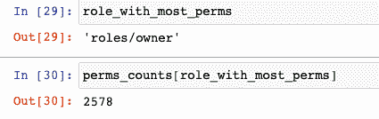
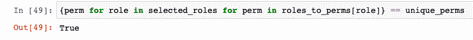
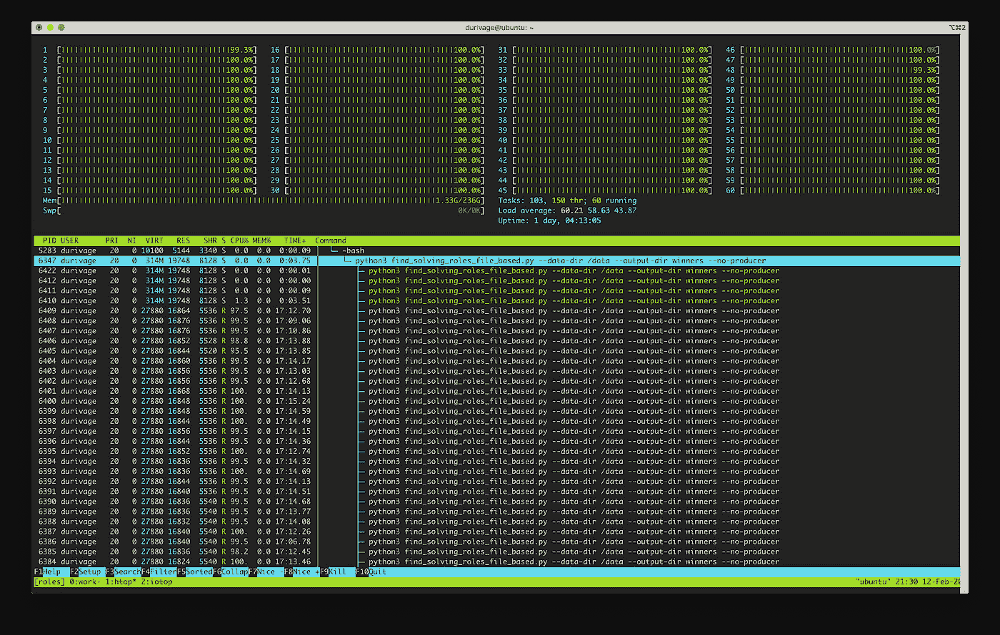

# GCP 云 IAM 中集合覆盖问题的求解

> 原文：<https://medium.com/google-cloud/solving-a-set-cover-problem-in-cloud-iam-on-gcp-6c509b39271b?source=collection_archive---------0----------------------->

最近，一位战略云工程师同事从一位谷歌云客户那里提出了一个有趣的问题，引发了我们的集体兴趣。他们曾问过如何以最少的工作量获得谷歌云平台上所有可能的许可。GCP 有数百个角色和数千个权限。为了回答这个问题，我们必须看每一个。这需要用代码来解决。

请注意，这主要是一个思考练习。授予每一个可能的权限的明显问题是，它违反了职责分离等最佳实践，即按照完成用户或团队工作所需的最小特权原则授予访问权限。获取的范围是巨大的，应该非常小心以防止误用或滥用。我强烈推荐阅读这篇[博客文章](https://cloud.google.com/blog/products/identity-security/dont-get-pwned-practicing-the-principle-of-least-privilege)，了解更多关于安全使用 IAM 的信息。

首先，让我们对一些基本的谷歌云平台(GCP) IAM 概念进行水平设置。 [Cloud IAM](https://cloud.google.com/iam) 提供了授权访问谷歌云资源的框架。用最简单的话来说， [IAM 策略](https://cloud.google.com/iam/docs/overview#cloud-iam-policy)授予成员在云资源上执行特定操作的权限。

在 GCP 使用资源，比如列出或创建 Google 计算引擎实例，需要特定的[权限](https://cloud.google.com/iam/docs/overview#permissions):分别是 compute.instances.list 或 compute instances.create。权限通常对应于 GCP API 方法。

[角色](https://cloud.google.com/iam/docs/overview#roles)是授予 IAM 策略的[成员](https://cloud.google.com/iam/docs/overview#concepts_related_identity)的权限包。成员可以是用户、服务帐户、组或域。谷歌提供了许多各种类型的[预定义角色](https://cloud.google.com/iam/docs/understanding-roles#role_types)——有时与成员可能执行的工作职能相关——如数据库管理员、需要 BigQuery 读取权限的数据科学家或监督整个平台安全控制的安全工程师。没有一个角色包含所有可能的权限，这些权限数以千计，并将继续增长。

IAM 策略适用于各种资源:组织、文件夹、项目、实例等。一个策略将成员绑定到一个角色**。**在资源上设置策略时，最终会授予访问权限。

为了解决用最少的可能角色授予每个权限的问题，你可以使用 [Python 3](https://docs.python.org/3/) 和 [Jupyter](https://jupyter.org/) 中的 prototype，因为这是迭代算法的好方法。

首先，我们需要获得可用 IAM 角色的完整列表以及其中包含的权限。在下面的代码中，我使用 Google API 的 [Python 客户端](https://github.com/googleapis/google-api-python-client)来列出和描述角色，直到结果用尽。

通过查询 API 枚举 GCP IAM 角色。

随着角色及其权限的变化，您可以选择将字典作为一个 JSON 文件转储，作为一个简单的、人类可读的结果缓存。在迭代算法时，您可能会节省数百个 API 调用，或者您可以选择将数据用于以后的分析。

让我们看一下结果的前几行。角色(即[roles/access approval . approver](https://console.cloud.google.com/iam-admin/roles/details/roles%3Caccessapproval.approver))是键，值是原始的 *describe* API 调用结果。“includedPermissions”的数组值正是我们要寻找的。

GCP IAM 角色结果为 JSON，被截断。

乍一看，结果可能不会很大，只有 751K 的重复数据。数据中存在多对多的关系，因此为了处理结果，您需要执行一些查找，比如识别特定角色中的权限，或者发现哪些角色包含给定的权限。您还需要确定哪些独特的权限是可用的，这样就有可能产生一组提供所有这些权限的角色。

对数据进行一次迭代，并为每个查找创建几个字典。在迭代数据时，计算并存储每个角色包含多少权限——这在以后会很有用。通过创建和填充权限集来跟踪唯一权限。这不仅是一个有用的数据结构，而且您需要知道所有可能的权限值，以便知道何时找到满意的答案。

通过将角色映射到其权限来处理角色数据，反之亦然。

按角色包含的权限数量对角色进行排序。这在下一步和后面的选择算法中很有用。

GCP 中的角色通常是另一个角色的子集，这意味着它们包含的权限可以完全包含在另一个更全面的角色中。在运行选择算法之前消除子集角色将提高选择的质量。

查找子集角色

这个被解决的问题叫做[集合覆盖问题](https://en.wikipedia.org/wiki/Set_cover_problem)。有一个包含所有可能的唯一权限的集合(称为[领域](https://en.wikipedia.org/wiki/Universe_(mathematics)))和一个权限(角色)集合的集合，其[联合](https://en.wikipedia.org/wiki/Union_(set_theory))等于领域。您只需要找出哪些角色加在一起等于所有可能的权限。

我用来寻找集合的算法叫做[贪婪算法](https://en.wikipedia.org/wiki/Greedy_algorithm)。目标是首先找到包含最多权限的角色。我们将从集合中删除该角色满足的权限，然后处理剩余的权限。在每一次迭代中，我们查看剩余集合中的一个权限。我们查看包含该权限的角色集，然后根据每个角色包含多少权限对该列表进行排序。我们总是选择包含最多权限的角色。这样，我们就有最大的机会在每次迭代中从剩余的集合中移除权限。我们跟踪我们选择的每个角色，当不再有权限时，我们知道我们已经为每个角色解决了问题。

先抢权限最多的角色。

该角色最终成为拥有 2578 个权限的 [*所有者*](https://console.cloud.google.com/iam-admin/roles/details/roles%3Cowner) 。



在 [Jupyter](https://jupyter.org/) 中处理结果。

创建一个所选角色的[集合](https://docs.python.org/3/tutorial/datastructures.html#sets)，并用被识别为包含最多权限的*所有者*角色对其进行初始化。

接下来，计算*所有者*角色尚未满足的权限以及唯一权限的范围。下面，使用集合上的减号运算符计算[差](https://docs.python.org/3.8/library/stdtypes.html#frozenset.difference)；结果设置在*剩余的*变量中。

虽然仍有权限需要我们选择的角色来满足，但算法会继续尝试并找到满意的角色。因为它很贪婪，所以它总是使用拥有最多权限的角色来满足所需的权限。每次迭代后，它会重新计算剩余的权限，并循环直到没有剩余权限。

选择满足必要的剩余权限的角色。

该算法选择了以下 16 个角色，按字母顺序排序:

```
roles/axt.admin
roles/billing.admin
roles/billing.creator
roles/compute.xpnAdmin
roles/container.hostServiceAgentUser
roles/datacatalog.categoryFineGrainedReader
roles/datafusion.serviceAgent
roles/iam.serviceAccountTokenCreator
roles/iap.httpsResourceAccessor
roles/orgpolicy.policyAdmin
roles/owner
roles/remotebuildexecution.actionCacheWriter
roles/resourcemanager.folderAdmin
roles/resourcemanager.organizationAdmin
roles/resourcemanager.projectCreator
roles/serverless.serviceAgent
```

您可以验证所选角色是否包含全域中的所有权限:



确认所选角色包含所有可能的权限。

现在，您有了一组角色，这些角色授予了 GCP 的所有独特权限。但是这是最小可能的角色集合吗？

不。嗯，可能不会。

该算法不会选择最小的可能集合。更糟糕的是，集合覆盖问题是 [NP-hard](https://en.wikipedia.org/wiki/NP-hardness) ，这意味着你必须计算所有可能的角色组合才能找到——或者至少多达 15 个角色，因为你现在知道有一个解决方案只有 16 个角色组合。

使用[组合学](https://en.wikipedia.org/wiki/Combinatorics)来计算需要多少[组合](https://en.wikipedia.org/wiki/Combination)才能*潜在地*找到更好的答案——不排除任何角色——给我们 1.187552 x 10 个⁸组合。这是一个巨大的数字！通过排除 485 到 39 个角色的子集，组合的数量减少到大约 540 亿，以便找到多达 15 个角色的解决方案——这至少在可能的范围内。检查所有的组合需要一段时间，所以我编写了一个应用程序来完成这项工作。

为了一劳永逸地找到答案，我编写了一个命令行应用程序，使用强力方法尝试我们 39 个非子集角色中多达 15 个选择的每种可能组合。该应用程序在 15 停止，因为我们有一个贪婪算法的 16 个角色的解决方案。任何解决方案——如果有的话——都需要包含 15 个或更少。

命令行应用程序分两步运行。首先，它产生每个可能的角色组合，并将这些组合写入磁盘。这一步被称为*生产者*阶段。接下来，在 *worker* 阶段，为机器上的每个 CPU 核心启动一个进程，每个核心评估所有组合中的一部分，直到没有剩余。

为了给每个进程提供最强大的 CPU 资源，我选择了计算优化的实例类型 [c2-standard-60](https://cloud.google.com/compute/docs/machine-types#c2_machine_types) ，提供了 60 个 vcpu，因此有 60 个工作线程来分析组合，充分利用了实例的计算资源。



htop 的屏幕截图，显示了计算实例在强行获取答案时 CPU 的全部利用率。

运行该生成器在不到 9 小时的总运行时间内产生了超过 2tb 的数据。60 名工作人员对组合数据进行了超过 28 小时的处理，发现了 8 个解决方案，每个方案包含 15 个角色。这里有一个例子:

```
roles/axt.admin
roles/billing.admin
roles/billing.creator
roles/compute.xpnAdmin
roles/container.hostServiceAgentUser
roles/datacatalog.categoryFineGrainedReader
roles/datafusion.serviceAgent
roles/iam.securityAdmin
roles/iam.serviceAccountTokenCreator
roles/iap.httpsResourceAccessor
roles/orgpolicy.policyAdmin
roles/owner
roles/remotebuildexecution.actionCacheWriter
roles/resourcemanager.folderAdmin
roles/resourcemanager.projectCreator
```

尽管在技术上不正确，但贪婪算法很快(在数百毫秒内)产生了足够好的解决方案，我发现与一天半计算出来的绝对正确的答案相比，这是一个合理的权衡。

这篇博文中的代码和数据是[开源](https://github.com/angstwad/set-cover-iam-roles)。

如果你选择使用这种算法来授予自己新的、无所不能的、无所不包的 IAM 权限，愿你非常小心地使用它们。在大多数情况下，这种访问级别不适合大多数组织。了解风险，认真执行 IAM。