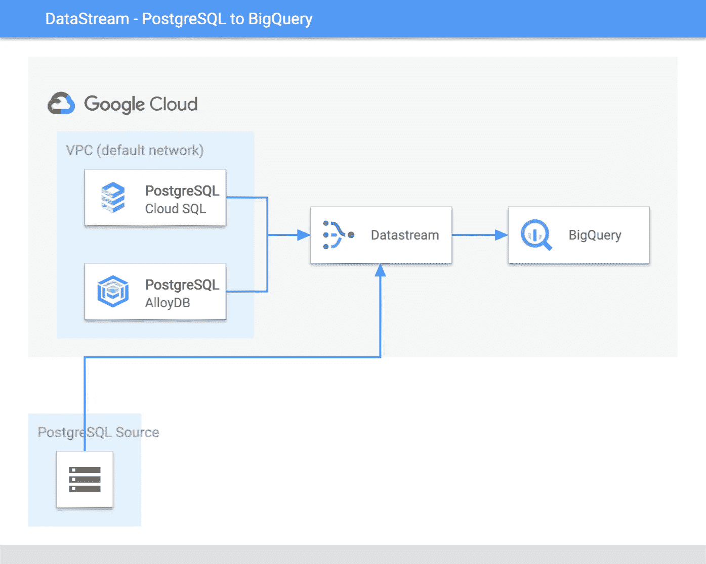

# 为 PostgreSQL 和 BigQuery 解决数据流上的真实场景。

> 原文：<https://medium.com/google-cloud/solving-real-world-scenarios-on-datastream-for-postgresql-and-bigquery-b79334a065fc?source=collection_archive---------3----------------------->

> Datastream 博客系列致力于不同的现实世界需求，以及使用 Datastream 直接从 PostgreSQL 到 BigQuery 的流变化的解决方案。

近年来，采用开源选项的数据库越来越多。PostgreSQL 是开源数据库之一，被客户广泛接受，并作为托管实例在不同的云提供商上提供。Google Cloud 通过 CloudSQL 和 AlloyDB 为企业级客户提供 PostgreSQL 托管实例，并提供敏捷性来支持要求苛刻的应用程序上的关键工作负载。

BigQuery 是一个无服务器的企业数据仓库，为客户提供数据驱动的决策，并支持多云。

数据流是一种服务，它弥补了最广泛采用的开源数据库之一和经济高效的无服务器企业数据仓库之间的复制需求差距。Datastream 提供无服务器复制服务来捕获 DML 更改，即从不同的关系数据库到 BigQuery 或 Google 云存储的插入、更新和删除。

随着最新的 [*公开预览版*](https://cloud.google.com/datastream/docs/release-notes#September_15_2022) ，数据流支持使用逻辑复制直接从 PostgreSQL 到 BigQuery 的流式更改。

Google 云数据流— PostgreSQL 到 BigQuery

本系列是一个专门的、精选的不同现实场景或需求的列表，当我们从 PostgreSQL 数据库作为源设计一个流解决方案以直接在 BigQuery 中使用它时，会出现这些场景或需求。

我们的[文档](https://cloud.google.com/datastream/docs)是熟悉数据流的重要资源，它涵盖了如何、什么和不同的特性。在本系列中，我们将了解客户可能会有的不同需求，如何使用 PostgreSQL 或 BigQuery 特性来实现这些需求，以及数据流如何支持这些需求。

## 场景 1 —使用数据流仅将 PostgreSQL 上的某些 DML 配置为源。

> 我们可能有一个功能需求，只对特定的表列表进行流插入或者只进行插入和更新。目前，Datastream 不提供支持选择性数据操作事件的特性来捕获和应用 BigQuery

查看博客，了解如何使用 PostgreSQL 发布配置来实现这一点。

> [***仅将 PostgreSQL 上某些 DML 的数据流配置为源。***](/google-cloud/configure-google-cloud-datastream-for-only-certain-dmls-on-postgresql-as-source-16e4ad789ef8)

## 场景 2—使用数据流配置从 PostgreSQL 中的分区表到 BigQuery 中的非分区的流。

> 我们可以将 PostgreSQL 中不同分区的数据合并为源数据，并在 BigQuery 中合并为单个目标表。

查看博客，了解如何使用 PostgreSQL 发布配置"***publish _ via _ partition _ root***"来实现这一点。

> [***使用 Datastream 配置从 PostgreSQL 中分区表到 BigQuery 中非分区的流。***](/google-cloud/configure-streams-from-partition-table-in-postgresql-to-non-partition-in-bigquery-using-datastream-3238fe3321d9)

## 场景 3—使用 PostgreSQL 的 BigQuery 中预定义的表作为源来配置数据流中的流。

> 如果我们有一个客户场景，让 PostgreSQL to BigQuery 从作为源的**非分区**表复制到**分区**表或 **alter columns 数据类型。**总的来说，客户正在寻找一种选择，与使用由数据流创建的默认表格相比，使用**预定义表格并进行必要的更改**。

查看博客，深入了解如何使用 PostgreSQL、使用没有强制约束的 BigQuery 表定义来实现这一点。

> [***使用 PostgreSQL 的 BigQuery 中预定义的表作为源，在数据流中配置流***](/google-cloud/configure-streams-in-datastream-with-predefined-tables-in-bigquery-for-postgresql-as-source-528340f7989b)