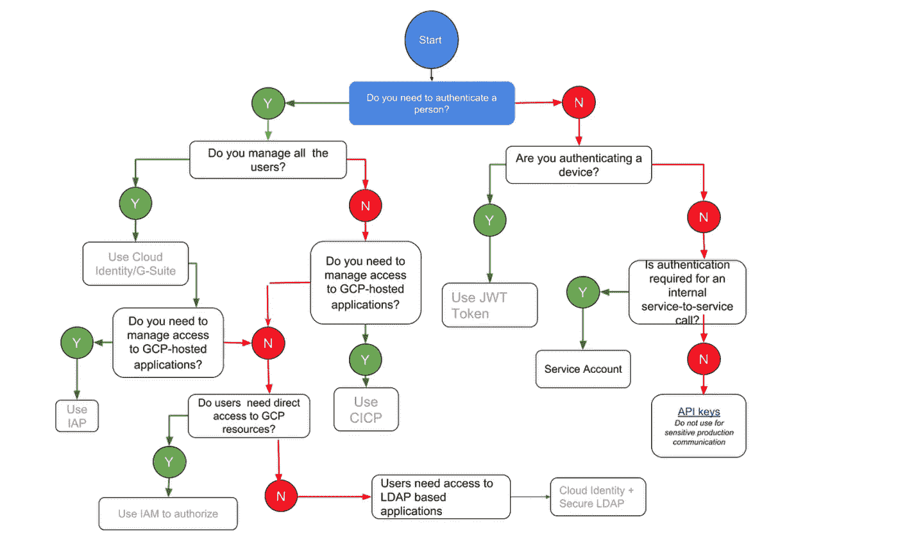
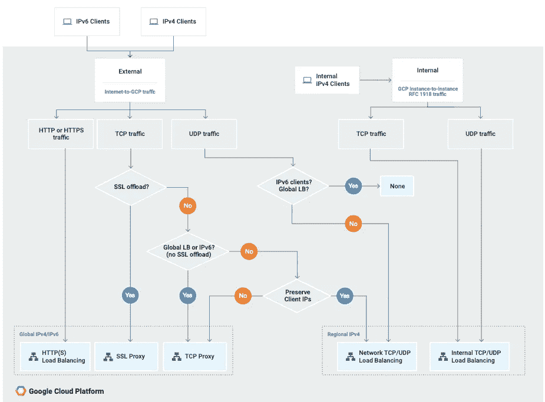
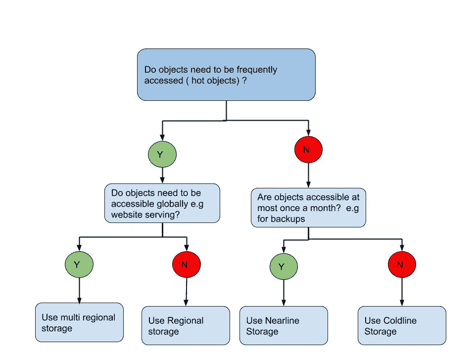
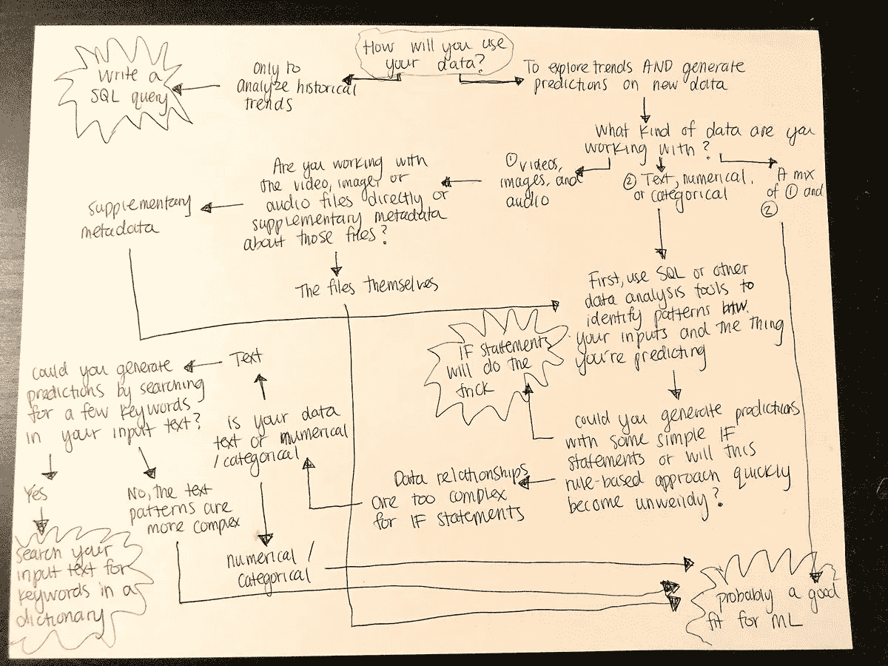

# 更多 GCP 流程图

> 原文：<https://medium.com/google-cloud/some-more-gcp-flowcharts-dc0bb6f7c94e?source=collection_archive---------1----------------------->

更新:截至 2019 年 6 月:我在这里维护我的流程图收藏

我与任何培训公司或第三方都没有联系。这些帖子是免费的，可以帮助人们理解谷歌云！

我喜欢流程图，正如那些读过本系列前几篇文章的人所知道的。这是我的系列中第三个与 GCP 相关的流程图。第一部可以在这里找到，第二部可以在这里找到。

我对该系列迄今为止的受欢迎程度感到惊讶，并感谢您阅读它们。我希望这个新的收藏能够像这个系列中的其他收藏一样对你有用！

*归属:图形&流程图除了莎拉的&云存储一个愉快地从谷歌云平台或博客网站*

# 需要身份管理产品吗？

如何管理您的身份取决于使用案例。需要管理哪些用户可以直接访问 GCP 资源，哪些用户需要访问你在 GCP 托管的应用？不同的需求，因此需要不同的解决方案。这里有一个流程图，可以帮助您找出适合您的用例的正确解决方案

与流程图配套的文字可以在[这里](https://cloud.google.com/blog/products/identity-security/identity-and-authentication-the-google-cloud-way)找到。

# 选择负载平衡器

负载平衡非常棒，它允许您将一组计算资源视为单个实体，提供一个入口点，在 GCP 负载平衡服务的情况下，该入口点具有单个任播 IP 地址。将 GCP 负载平衡器与自动扩展相结合，您可以根据您配置的指标来增减资源。还有很多很酷的功能，但你会明白的。那么，您需要什么类型的负载平衡服务呢？第 7 层，第 4 层，全球，地区？也许你需要一个内部负载均衡器，这里有一个流程图可以帮助你决定(好吧，你知道会这样，不是吗？😃)

[这里](https://cloud.google.com/load-balancing/docs/choosing-load-balancer)是跟流程图配套的文字。一旦你想出了什么样的负载平衡选项可以满足你的需求，那么在开始之前，先看看[负载平衡概述](https://cloud.google.com/load-balancing/docs/load-balancing-overview)页面。

# 为您的使用案例选择云存储类别

云存储(GCS)是一项非常棒的服务，适合各种使用情形。问题是它有不同的类，每个类都针对不同的[用例进行了优化。](https://cloud.google.com/storage/docs/storage-classes#comparison_of_storage_classes)所有存储类别都提供低延迟(到达第一个字节的时间通常为数十毫秒)和高耐用性。您可以使用相同的 APiIs、生命周期规则等。基本上，这些类别的不同之处在于它们的可用性、最小存储持续时间以及存储和访问费用。

有 4 个类你需要关心。

多区域— [地理冗余](https://cloud.google.com/storage/docs/key-terms#geo-redundant)存储针对存储频繁访问的数据(“热”对象)进行了优化，例如网站服务和多媒体流。

区域性—数据可以以较低的成本存储，数据存储在特定的区域位置，而不是将冗余分布在一个大的地理区域。当您需要数据靠近处理数据的计算资源时，比如使用 Dataproc 时，这是非常理想的。

近线—近线存储非常适合您计划平均每月读取或修改一次或更少的数据。存储在多区域位置的近线存储数据在多个区域之间是冗余的，提供了比存储在区域位置的近线存储数据更高的可用性。这非常适合备份。您应该至少每月进行一次定期灾难恢复消防演习，包括从备份中恢复数据！

cold line——一种成本非常低、非常耐用的存储服务。对于您计划每年最多访问一次的数据，它是最佳选择，因为它的可用性稍低，最低存储持续时间为 90 天，数据访问成本和每次操作成本较高。这是长期归档使用情形的理想选择

这里有一个流程图，当您不想阅读太多文字来判断您的选择时，它可以帮助您决定哪个存储类适合您的使用情形(毕竟这就是流程图的用途)。

有关 GCS 存储类的概述，请参见[此处](https://cloud.google.com/storage/docs/storage-classes)

# ML 还是 SQL？

我一直想知道你是否真的需要使用 ML 或者一个 SQL 查询是否就足够了 [Sara Robinson](https://medium.com/u/7f2ab73b39f8?source=post_page-----dc0bb6f7c94e--------------------------------) 在推特上发布了这个流程图

来自[https://twitter.com/SRobTweets/status/1053273512079699968](https://twitter.com/SRobTweets/status/1053273512079699968)

然后，她写了一些文字来补充流程图[这里](/@srobtweets/when-should-you-use-machine-learning-part-1-b0028603ac3a)，然后写了[一些文字](/@srobtweets/sql-or-ml-the-same-dataset-two-ways-233e611619bd)带你了解 ML 是否很适合你的预测任务。您可能只需要一个 SQL 查询。使用合适的工具完成工作。我很喜欢这两个帖子，我看了两遍流程图！