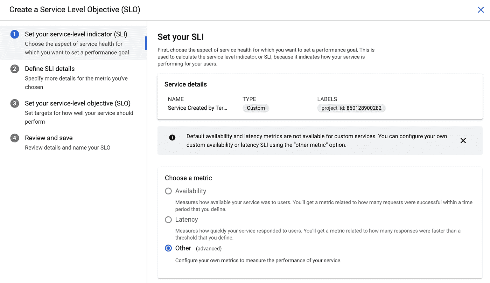
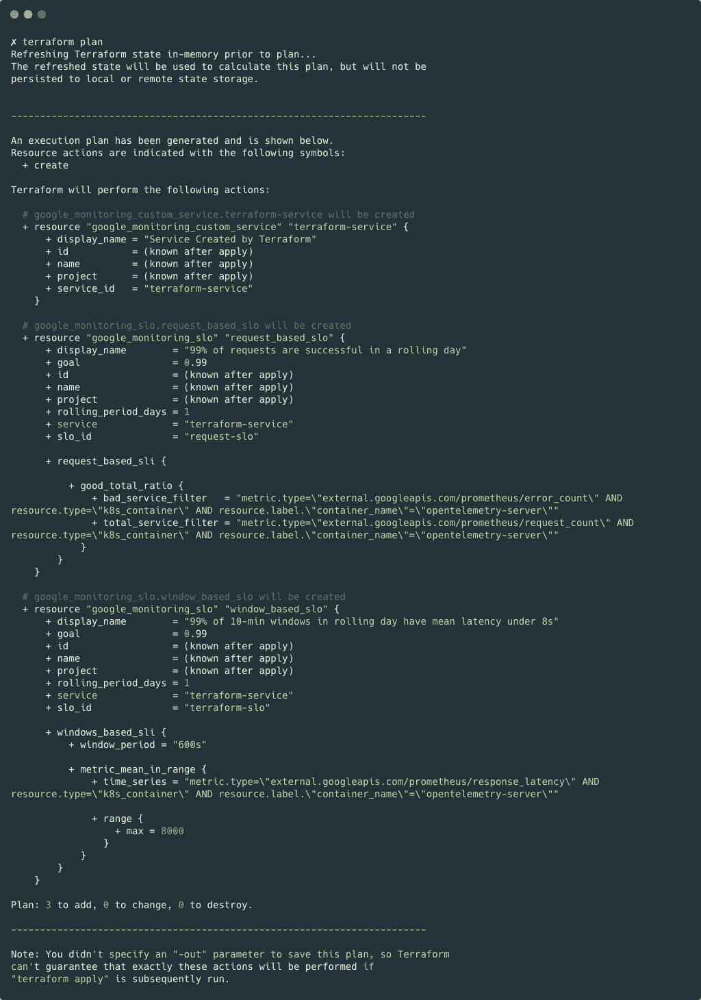
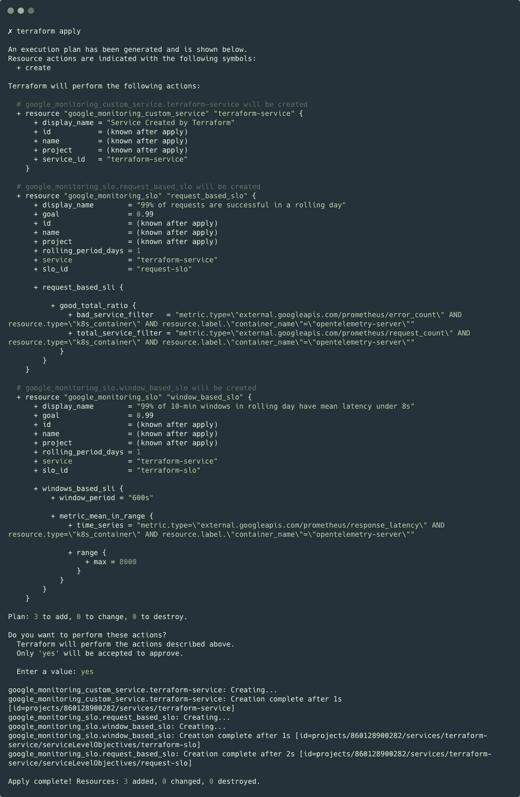
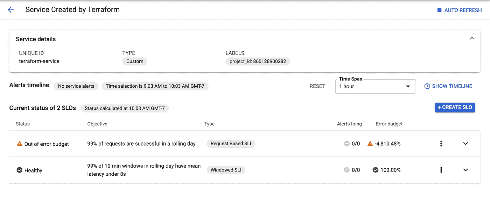

# 使用 Terraform 创建 SLO

> 原文：<https://medium.com/google-cloud/some-time-ago-i-looked-at-using-the-service-monitoring-api-to-create-basic-slos-against-out-of-b3555b08036f?source=collection_archive---------0----------------------->

前一段时间，我[看了看](/google-cloud/slos-with-stackdriver-service-monitoring-62f193147b3f?source=---------6------------------)使用服务监控 API 创建基本的 SLO 来对抗“开箱即用”的服务，比如 App Engine。从那时起，这个功能已经有了很多更新，现在有了对创建定制[服务](https://www.terraform.io/docs/providers/google/r/monitoring_service.html)和 [SLOs](https://www.terraform.io/docs/providers/google/r/monitoring_slo.html) 的 Terraform 支持。我想亲自尝试一下，看看它是如何工作的。

# 创建服务

如果您使用 Istio、App Engine 或云端点等工具，SLO 监控可以很好地为您识别服务。但是如果你的服务是在 GCE 上呢？在这种情况下，您需要将其定义为定制服务，这将允许您针对它定义 SLO。

下面是如何在 Terraform 中定义一个“[监控服务](https://www.terraform.io/docs/providers/google/r/monitoring_service.html)”:

服务定义实际上非常简单——您只需提供一个项目特有的服务 ID 和一个显示名称。运行“terraform apply”后，服务便会出现在控制台中:

从那里，您可以使用 UI 来创建一个 SLO:

**请注意**您必须使用“其他”作为衡量标准—定制服务对可用性和延迟没有“现成的”理解。所以，你需要有一个好的 SLI 为你服务。您可以使用基于日志的指标，如果您正在使用 Google Cloud 负载平衡器，可以使用它发出的指标，或者由服务编写的自定义指标。让我们来看看如何使用后者定义 SLO。

# 定义 SLO

以下是使用 Terraform 定义 SLO 的方法:

这里需要考虑 3 个主要因素:

*   **基础知识** —资源 ID、SLO ID、用于定义 SLO 的服务以及 SLO 显示名称。
*   SLI**——您将使用基于请求的还是基于 windows 的 SLI？如果是基于请求的—您将如何计算总请求数并区分好的和坏的请求？**

**在我的例子中，我使用了一个服务，该服务可以发出两个独立的指标——一个统计所有请求，另一个统计错误。这使得事情变得非常简单。**

*   ****目标**——你的 SLO 的实际目标是什么？**

**在本例中，我们的目标是在一天内 99%的请求成功。**

# **创建和验证**

**此时，运行`terraform plan`以确保一切正常:**

****

**“地形图”的输出**

**如果一切正常，运行`terraform apply`来创建服务和 SLO:**

****

**“地形应用”的输出**

****注意**我的文件有两个 SLO——一个是基于请求的可用性 SLO，另一个是基于 windows 的延迟 SLO。这就是创建 3 个资源的原因。**

**此时，您可以返回控制台并检查您的新服务:**

****

**我显然没有正确设置我的可用性目标(或者我的服务有一些严重的问题)——在我采取下一步措施设置错误预算燃烧警报之前，我绝对应该重新考虑这个问题。**

# **摘要**

**我真的很高兴看到服务和 SLO 支持来到 Terraform，我希望许多人将利用这一点来扩展他们的自动化能力。此时，一旦项目启动，所有主要的监控原语都可以自动创建——这是个好消息！感谢阅读，并让我知道你的想法！**