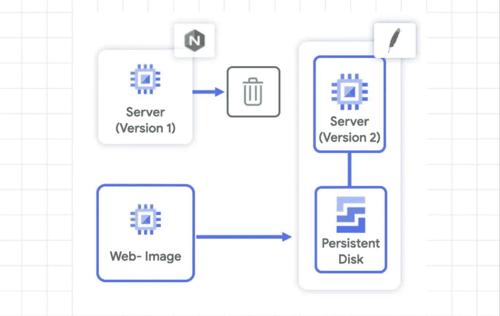

# 有时变化是不好的:不可变的基础设施

> 原文：<https://medium.com/google-cloud/sometimes-change-is-bad-immutable-infrastructure-624a8e3482d6?source=collection_archive---------3----------------------->

## 规模季节

# 介绍

“规模季节”是一个博客和视频系列，旨在帮助企业和开发人员在设计模式中构建规模和弹性。在这一系列文章中，我们计划向您介绍一些创建具有弹性和可伸缩性的应用程序的模式和实践，这是许多现代架构实践的两个基本目标。

在第 1 季中，我们将介绍基础架构自动化和高可用性:

1.  [可扩展和弹性应用的模式](/google-cloud/scale-and-resilience-arent-just-buzzwords-ce748360e80)
2.  [基础设施为代码](/google-cloud/why-should-you-treat-infrastructure-like-software-3865ed0e4b03)
3.  [不变的基础设施](https://medium.com/p/624a8e3482d6/edit)(本文)
4.  [在哪里扩展您的工作负载](/@swongful/where-to-scale-your-workloads-6420150bf825)
5.  [全球自动扩展 web 服务](/@swongful/globally-autoscaling-web-services-4b650cc6fc49)
6.  [高可用性(自动修复&自动更新)](/@swongful/give-your-vms-a-steady-pulse-with-autohealing-and-autoupdates-ae2c0828ecc9)

在本文中，我将带您了解不可变基础设施背后的基础知识。

# 看看这个视频

# 回顾

我们了解了 Critter Junction，这是一家多人游戏公司，在过去的几个月里广受欢迎。在线玩家可以在一个模拟生物的虚拟世界中相互交流。

他们习惯于传统的基础架构创建方法，即手动调配资源，这既耗时又容易出错。幸运的是，他们已经将[基础设施作为代码](https://cloud.google.com/solutions/infrastructure-as-code) (IAC)来使用代码自动提供云资源。他们可以为可再现性创建模板，并将配置文件存储在源代码版本控制中。现在，他们希望在升级过程中优化他们的开发运维实践，并遵循最佳实践来实现最终的可扩展性和可审核性。

# 可变基础设施

你听说过“变化是生活中唯一不变的”这句话吗？虽然这对于大多数事情来说可能是正确的，但是您不希望它对于您的基础架构也是正确的。

> “可变”的意思是“能够改变”

可变基础设施意味着可以改变的云资源——相同的服务器用于更新、补丁和配置改变。对于我们在 Critter Junction 的朋友来说，他们从托管 web 服务器的虚拟机开始。

他们的虚拟机最初被设计为可变的，因为它给了他们短期的灵活性。每个虚拟机都可以更精确地适应其上运行的应用程序，并且很容易为每台机器运行自定义更新。团队经常依赖于单独的机器，如果他们需要快速解决特定的问题，这有时会很有用。

例如，他们用 NGINX 运行一个虚拟机，用本地写的数据运行他们的 web 服务器版本 1。当他们想切换到 Apache 时，他们很容易直接在服务器上执行升级并运行版本 2。

从表面上看，这似乎很棒。他们使用现有的服务器，不必担心将数据转移到其他机器，或者创建新的机器。但在现实世界中，事情可能会出错。Apache 升级失败的原因有很多，比如网络问题。在他们的案例中，一些服务器更新很快，而另一些则在安装时被挂起。

他们留下了一些成功运行版本 2 的服务器，一些升级了应用程序但无法运行，一些服务器仍在运行版本 1。他们的许多虚拟机出现故障的方式略有不同，他们现在面临着:

*   用户流量被路由到其 web 服务器的不同运行版本的复杂性
*   无法回滚到以前的版本
*   和未记录的更新状态，因此无法跟踪版本

# 不可变的基础设施:更好的方式

他们应该将他们的环境改变成*不可变的*，而不是改变他们现有的每个虚拟机。

> 虚拟机一旦部署，就无法修改:没有更新、没有补丁、没有配置更改。

如果您想要更改应用程序代码或应用补丁，您应该构建一个新的映像，并将其部署为替换。因为新环境可以在几分钟之内在云中产生，所以不可变的基础设施易于设计和部署。

## 第二次

在长时间恢复他们的应用程序版本 1 后，下面是 Critter Junction 如何处理他们的下一次部署。他们没有对每台机器进行适当的更改，而是使用 Apache 和他们的应用程序版本 2 创建了一个全新的虚拟机映像，并将任何本地写入的数据移动到一个附加的持久磁盘上。在进行了一些测试以确保新镜像正常工作后，他们使用新镜像启动了多台服务器。现在，他们可以安全地将流量切换到新的虚拟机，并关闭运行版本 1 的实例。

**在谷歌云上，他们的团队看起来是这样的:**

1.  他们使用[云构建](https://cloud.google.com/cloud-build)来建立与他们的存储库的持续集成，自动化构建和测试。
2.  虚拟机是使用[映像族](https://cloud.google.com/ai-platform/deep-learning-vm/docs/concepts-images)指定的，因此它们可以拥有多个版本的映像，如果需要回滚，可以放弃最新的版本。
3.  而且，他们使用[云部署管理器](https://cloud.google.com/deployment-manager)指定了所有的资源，以便自动供应资源。

## 集装箱呢？

使用[容器](https://cloud.google.com/solutions/best-practices-for-operating-containers#immutability)时也是同样的模式:创建一个完整的运行时环境，并以映像的形式交付。对于容器，运行时环境是一个程序和它需要运行的文件。使用不可变的基础设施，您可以交付一个根据需要配置的完整操作系统，以及程序和它们的文件。在这两种情况下，您都不断地交付版本化的映像。

# 结论

创建不可变的基础设施使 Critter Junction 免受配置漂移的影响，因为他们现在知道了机器的确切状态，可以避免任何意外。此外，他们现在可以轻松地跟踪版本，回滚发布，并且由于他们的环境之间有记录的差异，有一个更一致的测试过程。不可变的基础设施听起来可能与敏捷架构不一致。但实际上，它给了您灵活性，因为您知道环境中每个资源的细节和代码状态。请继续关注，了解《生物交汇点》的精彩内容。

记住，永远要做架构设计。

# 后续步骤和参考:

*   在[谷歌云平台媒体](https://medium.com/google-cloud)上关注这个博客系列。
*   参考:[可伸缩和弹性应用的模式](https://goo.gle/3hpxUdE)。
*   关注[季 Scale 视频系列](http://bit.ly/seasonofscale)，订阅谷歌云平台 YouTube 频道。
*   想要更多的故事？在[媒体](/@swongful)和[推特](http://twitter.com/swongful)上给我喊话。
*   与我们一起享受这个迷你系列的旅程，并了解更多关于谷歌云解决方案的信息！