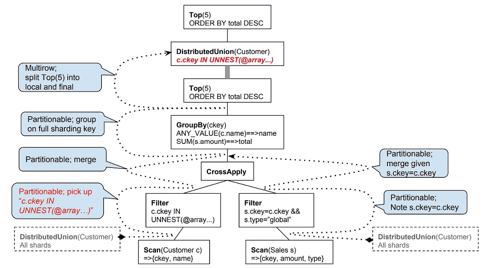

# 扳手的 SQL 故事

> 原文：<https://medium.com/google-cloud/spanners-sql-story-79bda8bb632d?source=collection_archive---------0----------------------->

Spanner 是 Google 不久前启动的一个分布式数据库，用于为自己的工作负载构建一个高度可用和高度一致的数据库。Spanner 最初是作为一个键/值而构建的，它的形状与今天完全不同，它有不同的目标。从一开始，它就具有事务处理能力、外部一致性，并且能够透明地进行故障转移。随着时间的推移，Spanner 采用了强类型模式和其他一些关系数据库特性。在过去的几年里，它增加了 SQL 支持*。今天，我们正在同时改进 SQL 方言和关系数据库特性。有时会混淆 Spanner 是否支持 SQL。简单的回答是肯定的。长的回答就是这篇文章。

## 早年

Spanner 最初是为内部工作负载而构建的，没有人能够看到 Google 将启动云业务并将 Spanner 外部化。如果你不太了解谷歌，我们的内部堆栈经常被认为是一个不同的宇宙。在谷歌，包括存储和数据库服务在内的所有系统都提供自己专有的 API 和客户端。当你加入 Google 的时候，你打算使用你最喜欢的 ORM 库吗？不幸的是，这是不可能的。我们的基础设施服务提供了自己的 Stubby/gRPC API 和客户端库。如果您关心 API 熟悉度，这是一个小缺点，但它是一个强大的优势，因为我们可以提供更具表达力的 API 来表示我们基础架构的差异化功能。

不同的特性在通用 API 中通常表现不佳。一种尺寸不适合所有人。通用 API 只能针对通用特性。分布式数据库已经与传统的关系数据库有了很大的不同。我将在本文中给出两个例子来说明显式 API 是如何发挥作用的。

分布式系统失败的方式不同，也更频繁。为了处理这个问题，分布式系统实现了重试机制。当我们无法提交事务时，扳手客户端透明地重试事务。这使得我们不必向用户暴露每个临时故障。我们透明地用正确的退避策略重试。

在下面的代码片段中，您会看到一些 Go 代码开始一个新的读写事务。它提供了一个可以查询和操作数据的函数。当出现中止或冲突时，它会自动重试该功能。 [ReadWriteTransaction](https://godoc.org/cloud.google.com/go/spanner#Client.ReadWriteTransaction) 记录了这种行为，并记录了该函数重试应该是安全的(例如，告诉开发人员不要持有应用程序状态)。这允许我们向用户传达分布式数据库的独特现实。我们还可以提供像自动重试这样的功能，这在传统 ORM 中很难实现。

```
import "cloud.google.com/go/spanner"_, err := client.ReadWriteTransaction(ctx, func(ctx context.Context, txn *spanner.ReadWriteTransaction) error {
    // User code here.
})
```

另一个例子是隔离级别。Spanner 实现的隔离级别优于 SQL 标准中描述的最严格的隔离级别(serializable)。Spanner 不允许您为读/写事务选择任何不太严格的东西。但是对于多区域设置和只读事务，提供最强的隔离并不总是可行的。光速考验着我们的极限。对于不介意稍微陈旧的数据的用户，Spanner 能够提供陈旧的读取。陈旧读取允许用户读取区域副本中可用的版本。他们可以设定自己能容忍的陈旧程度。例如，下面的事务最多可以容忍 10 秒。

```
import "cloud.google.com/go/spanner"client.ReadOnlyTransaction().
    WithTimestampBound(spanner.MaxStaleness(10*time.Second)).
    Query(ctx, query)
```

陈旧 API 允许我们明确表达快照隔离如何工作，以及如果副本非常过时，Spanner 如何获取最新数据。它还使我们能够强调多区域复制是一个多么困难的问题，即使有 Spanner 这样的数据库，您也可以考虑在多区域设置中为了更好的延迟特性而牺牲一致性。

## 子一代

[F1](https://static.googleusercontent.com/media/research.google.com/en//pubs/archive/41344.pdf) 是在 Spanner 中实现 SQL 支持的第一步的原始实验。F1 是 Google 的一个分布式数据库，建立在 Spanner 之上。与扳手不同，它支持:

*   分布式 SQL 查询
*   事务一致的辅助索引
*   改变历史和潮流

它在 Spanner 之上的一个协调层中实现了这些特性，并将所有其他功能交给了 Spanner。

F1 的建立是为了支持我们的广告产品。鉴于广告业务的性质和我们广告产品的复杂性，能够编写和运行复杂的查询是至关重要的。F1 使 Spanner 更容易被业务逻辑繁重的系统使用。

## 云扳手

很快，谷歌云为我们的外部客户推出了 Spanner。当它第一次发布时，它只支持 SQL 查询数据。它缺少 INSERT、UPDATE 和 DELETE 语句。

鉴于当时它还没有一个完整的 SQL 数据库，它也缺乏对[【JDBC】](https://cloud.google.com/spanner/docs/jdbc-drivers)、[数据库/sql](https://github.com/rakyll/go-sql-driver-spanner) 和类似的驱动支持。当 Cloud Spanner [实现了](https://cloud.google.com/spanner/docs/release-notes#October_10_2018)一种支持插入、更新和删除的数据操作语言(DML)时，驱动程序支持成为可能。

如今，Cloud Spanner 同时支持 DDLs(针对模式)和 DMLs(针对数据)。Cloud Spanner 使用了 Google 使用的一种 SQL 方言。这种方言的原生解析器和分析器 ZetaSQL 不久前已经开源了。到今天为止，Cloud Spanner 还提供了一个查询分析工具。



来自 Spanner 的查询分析器的查询分析示例。

## 下一个？

当前的挑战源于我们的 SQL 方言中存在的差异。这是我们正在积极努力改进的一个领域。不仅仅是我们不希望我们的用户处理一种新的 SQL 风格，目前的情况也减缓了我们在 ORM 集成方面的工作。一些 ORM 框架在生成查询时硬编码 SQL，并且给驱动程序很少的灵活性来覆盖行为。为了避免任何不一致，我们正在努力消除与流行方言的差异。

方言差异并不是影响我们 SQL 支持的唯一问题。另一个明显的差距是缺少一些常见的传统数据库特性。Spanner 从不支持像默认值或自动生成的 id 这样的特性。当我们在改善方言差异时，同时解决这些显著的差距总是在我们的考虑范围之内。

—

(*)关于 Spanner 的查询工作的初始工作发表为 [Spanner:成为 SQL 系统](https://research.google/pubs/pub46103/)。