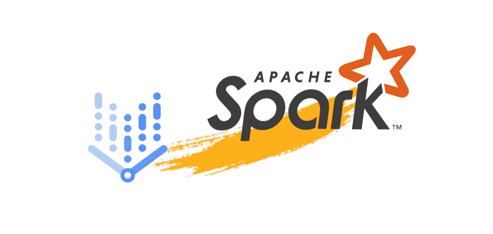

# 闪亮顶点人工智能管道

> 原文：<https://medium.com/google-cloud/sparkling-vertex-ai-pipeline-cfe6e19334f7?source=collection_archive---------0----------------------->

## 如何使用顶点人工智能管道部署一个简单的 Spark ML 管道



图 1。闪亮顶点人工智能管道

## ***更新***

*   *2022 年 4 月 11 日:顶点 AI 管道现在支持* [*顶点 AI 管道的 Dataproc 无服务器组件*](https://cloud.google.com/blog/topics/developers-practitioners/announcing-serverless-spark-components-vertex-ai-pipelines) *。有了这些组件，您就可以使用本地的 KFP 操作符轻松地将基于 Spark 的 ML 管道与 Vertex AI 管道和 Dataproc 无服务器进行协调。*

## 好吧，你说吧，我会听的！

关于 [**谷歌云数据科学**](https://cloud.google.com/data-science) 你有什么想法想看吗？请在此表格 上填写 [**告知。这将有助于我在未来的博客文章中=)**](https://forms.gle/H89eNLTVtCdpP1ro6)

## **免责声明**

本文假设您已经对 MLOps、机器学习管道和顶点人工智能有了一些了解。如果您没有，我建议您观看以下来自 [Priyanka Vergadia](https://medium.com/u/9b9e67983b04?source=post_page-----cfe6e19334f7--------------------------------) 的视频，以获得快速概述:[mlop 和 Vertex Pipelines 简介](https://www.youtube.com/watch?v=Jrh-QLrVCvM)和[带有 Vertex AI 的端到端 mlop](https://www.youtube.com/watch?v=1ykDWsnL2LE)。

## 前提

[顶点人工智能管道](https://cloud.google.com/vertex-ai/docs/pipelines/introduction)是今年在谷歌云上推出的顶点人工智能 MLOps 功能中最强大的服务之一。它们使得使用 [Kubeflow](https://www.kubeflow.org/) 编排机器学习工作负载变得非常容易。实际上，您可以在管道组件中执行几乎任何操作。你并不局限于某些顶点函数。

那么，如果您有一个 PySpark ML 管道呢？

在本文中，我们将通过在一些顶点管道组件中使用 Spark 来说明这种通用性。特别是，我将展示如何结合[data roc](https://cloud.google.com/dataproc)使用 Vertex AI Pipelines 来训练和部署一个 ML 模型，用于接近实时的预测性维护应用。

## 我们的场景

假设你是一名 ML 工程师，现在你的公司正在向云迁移，你被告知领导一个概念验证，并证明如何训练一个预测性维护管道。基本上，目标是连续处理从本地加载到云的机器日志文件，用于训练和部署已经在本地构建的 ML 管道。

关于这个过程，为了加速实验阶段，你需要变得更加独立于运行(ML)工作负载。此外，我们需要采用 MLOps 实践，以使整个团队的流程可靠、可扩展和可重复。

最后，你会发现顶点人工智能管道完成了所有这些。

事实上，您将能够使用基于 Kubeflow 的技术提交 ML 作业，与其他集群编排工具如 [Workflow](https://cloud.google.com/workflows) 相比，我们假设您已经熟悉这种技术。此外，它们使您能够通过关联的元数据存储和其他顶点人工智能服务，如[数据集](https://cloud.google.com/vertex-ai/docs/datasets/datasets)、[特征存储](https://cloud.google.com/vertex-ai/docs/featurestore)和[实验](https://cloud.google.com/vertex-ai/docs/experiments)，跟踪您的 ML 工作流中的数据、特征、模型和实验指标的工件和血统。

## 数据集

为了实现这一场景，我们使用 [UCI 机器学习— AI4I 2020 预测性维护](https://archive.ics.uci.edu/ml/datasets/AI4I+2020+Predictive+Maintenance+Dataset)数据集，这是一个反映行业中遇到的真实预测性维护数据的合成数据集。它由 14 个与加工过程相关的特性组成，如加工温度、转速和扭矩。并且目标机器故障标签指示该机器是否对于至少一个定义的故障模式发生了故障。

## 我们管道的剖析:架构、组件和表现

关于顶点人工智能管道，我们假设

*管道的每个组件都必须创建一个 Dataproc 集群，处理一个 PySpark 作业并销毁该集群。*

有人可能会认为这种模式增加了额外的运行时间。确实如此，但是管道的每一步可能需要不同数量的资源，然后需要不同的集群配置。一个例子是通常需要更多处理能力的超参数调谐步骤。此外，使用 Dataproc 的一个优点与临时集群的概念有关，它同时提供了更多的控制和灵活性。

也就是说，下面你可以找到管道架构


图二。我们管道的剖析

查看其组件，您会发现:

*   ***prepare_data*** 组件摄取数据，做一些简单的数据准备并创建[顶点数据集](https://cloud.google.com/vertex-ai/docs/datasets/datasets)来训练模型和评估模型
*   ***train_model*** 组件使用 [PySpark MLlib 库](https://spark.apache.org/docs/latest/ml-guide.html)训练一个简单的*gbt 分类器*，计算几个分类度量，如*areasuprc、混淆矩阵、准确度* 并使用[顶点元数据](https://cloud.google.com/vertex-ai/docs/ml-metadata/introduction)记录它们

然后，如果精确召回曲线下的 ***面积大于预定义的度量阈值*** :

*   ***hypertune_gb*** 组件使用 *ParamGridBuilder* 和*cross validator***方法寻找最佳模型和参数。所有指标和超调元数据再次使用元数据服务存储在管道沿袭中。**
*   *****deploy_gb*** 组件使用 [Spark Streaming](https://spark.apache.org/docs/latest/streaming-programming-guide.html#:~:text=Spark%20Streaming%20is%20an%20extension,processing%20of%20live%20data%20streams.&text=Spark%20Streaming%20provides%20a%20high,a%20continuous%20stream%20of%20data.) 在 Google Cloud Dataproc 集群上部署最终模型**

**一旦你弄清楚了每个组件，你就可以使用 [Kubeflow Pipelines SDK](https://kubeflow-pipelines.readthedocs.io/en/stable/) 来实现它们。**

**事实上，在我写这篇文章的时候，在[Google Cloud Pipeline Components SDK](https://google-cloud-pipeline-components.readthedocs.io/en/google-cloud-pipeline-components-0.1.5/)中没有与 Dataproc 交互的预构建组件。但是你总是可以建立自定义的！**

**在我们的例子中，由于我们所做的假设，组件需要使用 [Dataproc SDK](https://googleapis.dev/python/dataproc/latest/index.html) 来:**

1.  **创建 Dataproc 集群**
2.  **检查集群状态**
3.  **提交 Pyspark 作业**
4.  **检查作业状态**
5.  **删除集群**

**首先，构建管道组件的一种方式是通过装饰器来[。例如，对于 ***列车 _ 模型组件*** 我们有](https://kubeflow-pipelines.readthedocs.io/en/stable/source/kfp.dsl.html#kfp.dsl.component)**

```
@component(base_image="gcr.io/google.com/cloudsdktool/cloud-sdk:latest", packages_to_install=["google-cloud-dataproc==2.5.0", "google-cloud-storage==1.41.1", "scikit-learn==0.24.2"], output_component_file="2_sparkling_vertex_train_gb.yaml")def train_gb(project_id:str, region:str, bucket_name:str,
            cluster_spec:str,
            train_dataset:Input[Dataset],
            test_dataset:Input[Dataset],
            val_dataset:Input[Dataset],
            metrics: Output[Metrics],
            graph_metrics: Output[ClassificationMetrics],
            model: Output[Model])-> NamedTuple("Outputs",
                                    [("metrics_dict", str),
                                     ("thold_metric", float),
                                     ("model_uri", str),
                                     ("train_dataset_uri", str),
                                     ("val_dataset_uri", str),],):
```

***一旦导入库并定义变量*，就创建了 [Dataproc API](https://cloud.google.com/dataproc/docs/guides/submit-job) 所需的 PySpark 作业配置。**

```
train_gb_pyspark_job_spec = {
     'reference': {
         'project_id': project_id,
         'job_id': train_gb_job_id
     },
     'placement': {
         'cluster_name': cluster_name
     },
     'pyspark_job': {
         'main_python_file_uri': f'gs://{bucket_name}/train_gb.py',
         'args': ['--project-id', project_id,
                  '--bucket', f'gs://{bucket_name}',
                  '--train-uri', train_dataset.uri,
                  '--test-uri', test_dataset.uri,
                  '--metrics-file', metrics_file_name,
                  '--model', model_name]
                  }
 }
```

**然后，您可以为我们在 component⁴.中提到的每个任务包装一个方法下面您可以找到一个使用 Python Client for Google Cloud data proc API 提交 Pyspark 作业[的方法示例。](https://googleapis.dev/python/dataproc/latest/index.html)**

```
def _submit_pyspark_job*(*project_id, region, job_spec*)*: # create the job client.
    job_client = dataproc.JobControllerClient*(* client_options=*{* 'api_endpoint':
            f'*{*region*}*-dataproc.googleapis.com:443'
        *})* # create the job operation.
    job_op = job_client.submit_job_as_operation*(* request=*{*"project_id": project_id,
                 "region": region,
                 "job": job_spec*}
    )*result = job_op.result*()* return result
```

**最后，您提交作业，并可以使用[内置的 Kubeflow SDK 功能](https://www.kubeflow.org/docs/components/pipelines/sdk/output-viewer/)来利用顶点管道功能，如度量和元数据。例如，如果您想记录培训指标，我们可以**

```
 # submit the job

 print*(*f"Submitting job *{*train_gb_job_id*}*."*)* job_result = _submit_pyspark_job*(*project_id, region, 
                                  train_gb_pyspark_job_spec*)*if _check_job_state*(*project_id, region, 
                     train_gb_job_id*)* == 'state.done':
   print*(*f"Job *{*train_gb_job_id*}* successfully completed."*)*else:
   raise RuntimeError*(*f'Job *{*train_gb_job_id*}* failed.'
                      f'Please check logs.'*)* # -------------------------------------------- # log metrics
 metrics.log_metric*(*"areaUnderROC", area_roc*)* metrics.log_metric*(*"areaUnderPRC", area_prc*)* metrics.log_metric*(*"Accuracy", acc*)* metrics.log_metric*(*"f1-score", f1*)* metrics.log_metric*(*"Precision", w_prec*)* metrics.log_metric*(*"Recall", w_rec*)*
```

**使用 with *_check_job_state* 作为辅助方法来获取作业状态，并且所有指标都是预先计算的。**

**当然，这里的目的是提供一种可能的方法。你还可以探索其他的可能性。最后，如果您对每个步骤使用相同的设计，我们将拥有所有四个组件，并将获得以下管道表示**

```
@kfp.dsl.pipeline*(*name=f"pyspark-anomaly-detection-pipeline-*{*ID*}*", pipeline_root=PIPELINE_ROOT*)* def pipeline*(*project_id:str = PROJECT_ID,
            region:str = REGION,
            bucket_name:str = BUCKET,
            cluster_spec: BASE_CLUSTER_SPEC,
            raw_data: str = RAW_DATA_PATH,
            thold: float = AUPR_THRESHOLD,
            stream_folder: str = STREAM_FOLDER
            *)*:
   *"""
   Combine prepare_data, train_model, hypertune_gb and deploy_gb components in order to train and serve the predictive maintenance model.

    Args:
        project_id: The name of pipeline GPC project
        region: The region where the pipeline will run
        bucket_name: The bucket name where training data are stored
        cluster_spec: The basic cluster spec to run pyspark jobs
        raw_data: The name of training data source
        thold: The minimum performance threshold to deploy the model
        stream_folder: The name of folder to store the predictions

    """* # Create the prepare_data operation to get training data
  prepare_data_op = prepare_data*(* project_id=project_id,
      region=region,
      bucket_name=bucket_name,
      cluster_spec=cluster_spec,
      raw_file=raw_data*)* # Create the train_gb operation to train and evaluate model
  train_gb_op = *(*train_gb*(* project_id=project_id,
      region=region,
      bucket_name=bucket_name,
      cluster_spec=cluster_spec,
      train_dataset=prepare_data_op.outputs*[*'train_dataset'*]*,
      test_dataset=prepare_data_op.outputs*[*'test_dataset'*]*,
      val_dataset=prepare_data_op.outputs*[*'val_dataset'*])* .after*(*prepare_data_op*))* # Set Condition to validate the model compared au_prc threshold
  with Condition*(*train_gb_op.outputs*[*'thold_metric'*]* > thold,
                 name=AUPR_HYPERTUNE_CONDITION*)*:# Create the hypertune_gb operation to hypertune and evaluate model
   hypertune_gb_op = *(*hypertune_gb*(* project_id=project_id,
       region=region,
       bucket_name=bucket_name,
       cluster_spec=cluster_spec,
       train_dataset_uri=train_gb_op.outputs*[*'train_dataset_uri'*]*,
       val_dataset_uri=train_gb_op.outputs*[*'val_dataset_uri'*])* .after*(*train_gb_op*))* # Create the deploy_op to deploy the model on Dataproc cluster
    deploy_gb_op = deploy_gb*(* project_id=project_id,
        region=region,
        bucket_name=bucket_name,
        cluster_spec=cluster_spec,
        stream_folder=stream_folder,
        model=hypertune_gb_op.outputs*[*'tune_model'*])*
```

**下面你可以看到当你把管道提交给顶点 AI 时，执行图是什么样子的**

****

**图 3。Spark 流水线执行图**

## **好处:模拟接近实时的预测**

**出于演示目的，您还可以模拟接近实时的预测，其中数据被加载到 staging bucket，模型使用 [Spark Streaming](https://spark.apache.org/docs/latest/streaming-programming-guide.html#:~:text=Spark%20Streaming%20is%20an%20extension,processing%20of%20live%20data%20streams.&text=Spark%20Streaming%20provides%20a%20high,a%20continuous%20stream%20of%20data.) 生成部署在 Google Cloud Dataproc 集群上的预测。下面的***run _ get _ prediction _ transform***函数可以用来生成预测。**

```
def run_get_prediction_transform*(*args*)*:
    bucket = args.bucket
    stream_uri = f'*{*args.bucket*}*/*{*args.stream_folder*}*'
    tune_model_uri = args.tune_model_uri

    # create a spark session
    logging.info*(*f"Instantiating the *{*APP_NAME*}* Spark session."*)* spark = *(*SparkSession.builder \
             .master*(*"local"*)* \
             .appName*(*APP_NAME*)* \
             .getOrCreate*())* try:

        # start prediction process
        logging.info*(*f"Ingest streaming data under *{*stream_uri*}*."*)* stream_raw_df = *(*spark.readStream \
                         .option*(*"header", True*)* \
                         .option*(*"delimiter", ','*)* \
                         .option*(*"maxFilesPerTrigger", 1*)* \
                         .option*(*"rowsPerSecond", 10*)* \
                         .schema*(*DATA_SCHEMA*)* \
                         .csv*(*stream_uri*))*logging.info*(*f"Load model into memory."*)* tune_model = CrossValidatorModel.load*(*tune_model_uri*)*logging.info*(*f" Start streaming prediction process."*)* gb_prediction_transform = get_prediction_transform*(* stream_raw_df,
            tune_model*)*logging.info*(*f" Run prediction query."*)* predictions_query = *(*gb_prediction_transform \
                             .writeStream \
                             .format*(*"console"*)* \
                             .outputMode*(*"append"*)* \
                             .queryName*(*"predictions"*)* \
                             .start*())* predictions_query.awaitTermination*()*except RuntimeError as error:
        logging.info*(*error*)*
```

**最后，您通过在 Dataproc 作业 UI 中查看 *deploy_gb_2021xxxx* 作业的日志来检查预测。**

****

**图 4。Dataproc 作业 UI 中的预测日志**

## **下一步是什么**

**在本文中，我们探讨了如何使用顶点 AI 管道结合云 Dataproc 来训练和部署使用 Spark MLlib 的 ML 管道。我们对该场景做了一些假设，并设想了一种可能的管道架构来实现这一点。最后，我们展示了如何使用 Kubeflow Pipelines SDK 实现管道，以及如何使用 Spark streaming 模拟接近实时的预测。**

**我们可以做得更多。例如，我们没有在这里讨论模型监控。实际上，我们可以构建一个定制的服务容器来部署 SparkML 模型，然后利用顶点监控及其与顶点预测的集成来监控它们。此外，谷歌云最近宣布了与 Databricks 的新合作伙伴关系，我们也可以探索 MLFlow 和 Vertex AI 平台的几个集成用例。**

**现在，我希望你喜欢这篇文章。如果有，就鼓掌或者留言评论。此外，如果你想了解更多关于这个场景的信息，或者你有关于你想看的 ML 内容的想法，请随时通过 LinkedIn 或 T2 Twitter 联系我，让我们一起讨论。**

**直到下一个帖子…**

***感谢马克·科恩和布拉德·米罗的反馈。感谢 Gianluca Ruffa，他教会了我“构建、记录、打包和发布”的艺术。***

## **参考**

*   **[https://cloud.google.com/vertex-ai](https://cloud.google.com/vertex-ai)**
*   **[https://cloud . Google . com/architecture/using-Apache-spark-dstreams-with-data proc-and-pubsub # creating-a-service-account-for-data proc](https://cloud.google.com/architecture/using-apache-spark-dstreams-with-dataproc-and-pubsub#creating-a-service-account-for-dataproc)**
*   **[https://github.com/GoogleCloudPlatform/vertex-ai-samples](https://github.com/GoogleCloudPlatform/vertex-ai-samples)**
*   **[https://googleapis.dev/python/aiplatform/latest/index.html](https://googleapis.dev/python/aiplatform/latest/index.html)**
*   **[https://Google-cloud-pipeline-components . readthedocs . io/en/Google-cloud-pipeline-components-0 . 1 . 5/index . html](https://google-cloud-pipeline-components.readthedocs.io/en/google-cloud-pipeline-components-0.1.5/index.html)**
*   **[https://spark.apache.org/docs/latest/index.html](https://spark.apache.org/docs/latest/index.html)**
*   **[https://spark.apache.org/docs/latest/ml-guide.html](https://spark.apache.org/docs/latest/ml-guide.html)**

**这个场景与我的经历密切相关。事实上，我看到当编排取决于谁管理集群的环境及其工具时，ML 工程师需要很长时间才能提交模型培训。**

***为了简单起见，我只训练一个模型。但是你可以多次复制同一个组件。***

***我选择这个指标是因为不平衡的使用。当然，你可以选择符合你问题的。***

**⁴ *在组件中建议包装方式。另一种方法是将它作为一个软件包来安装。***