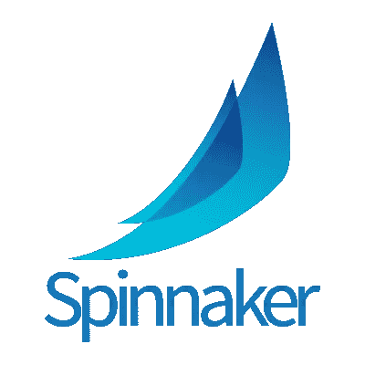
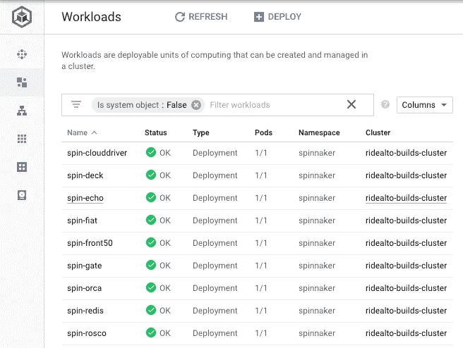
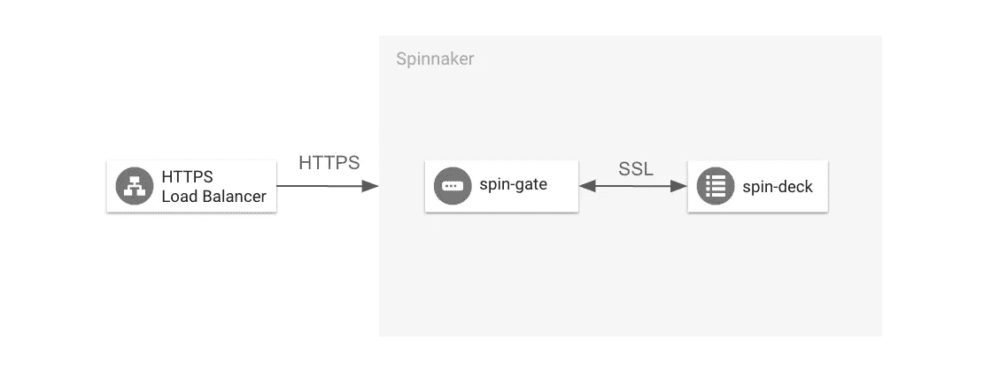
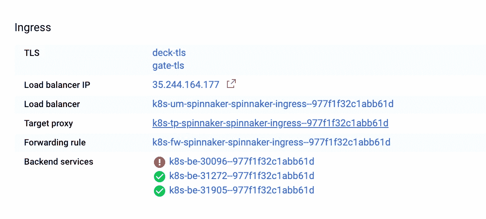
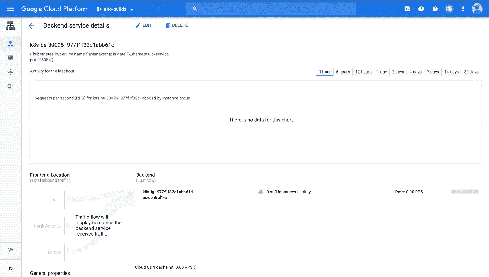
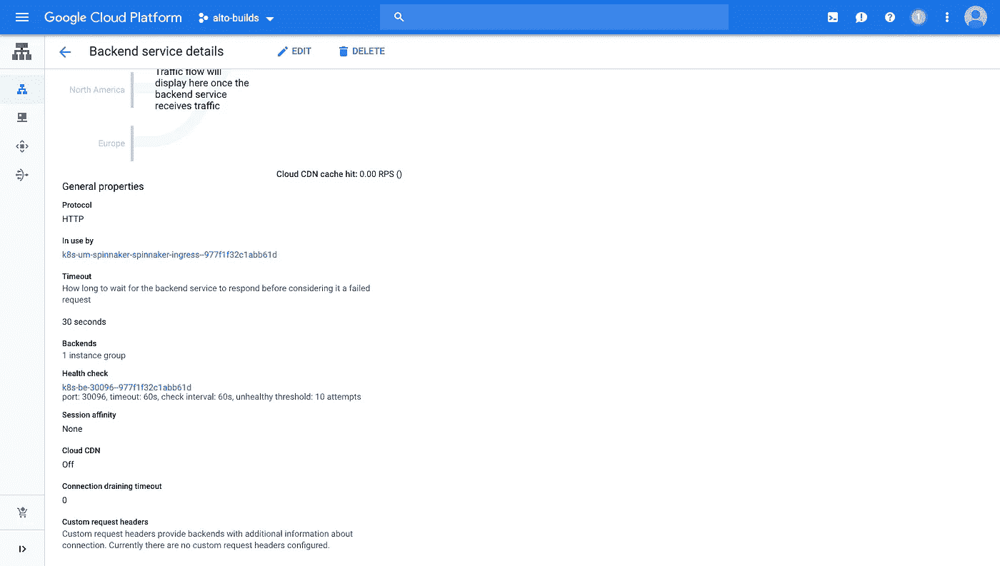
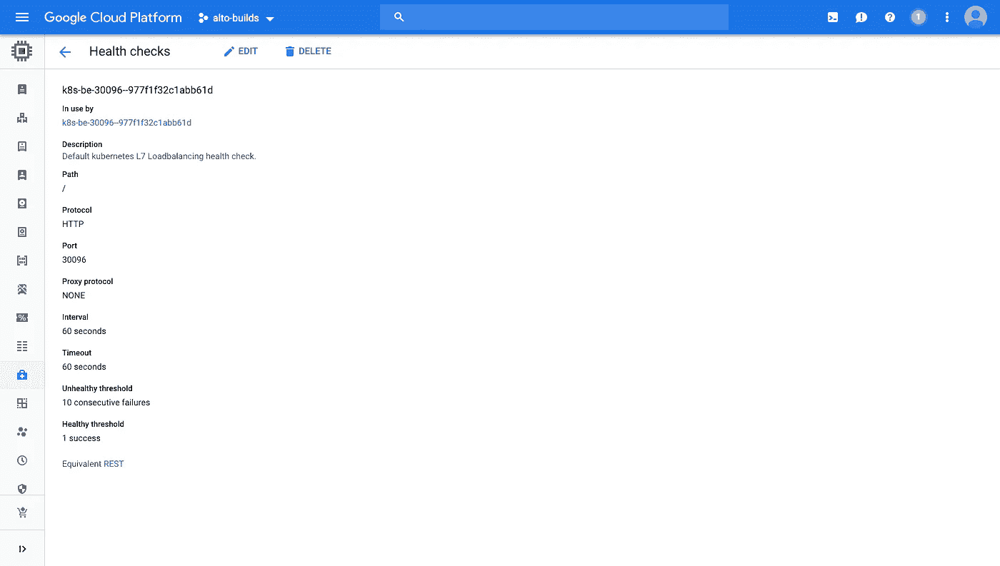
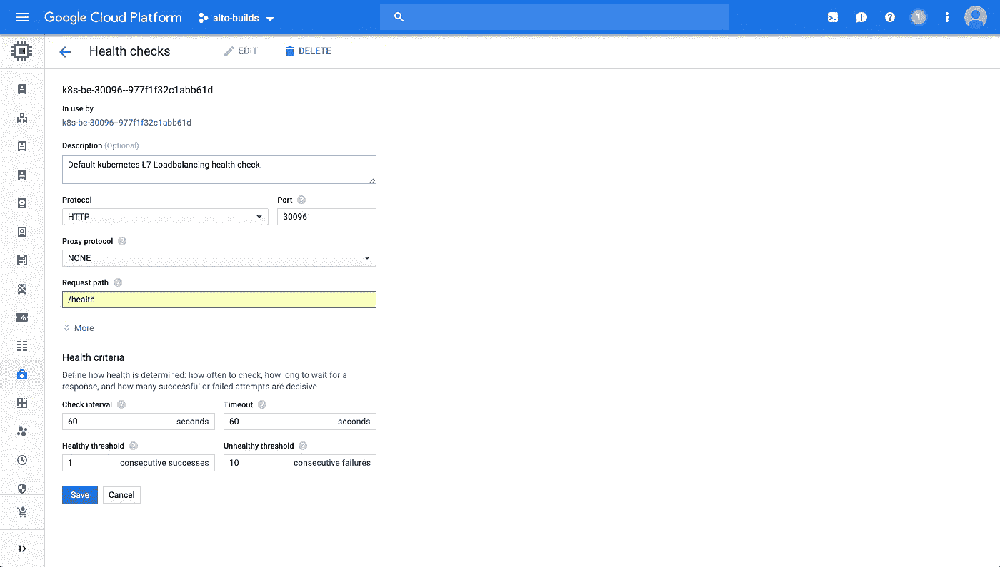

# 与 GKE 在 GCP 的三角帆

> 原文：<https://medium.com/google-cloud/spinnaker-on-gcp-with-gke-edfa994652f7?source=collection_archive---------0----------------------->

Google 云平台上的 Spinnaker，带有 Google Kubernetes 引擎

在谷歌云平台(GCP)和谷歌 Kuberenetes 引擎(GKE)上使用 Kubernetes 一段时间后，我对推出我的应用程序的新版本变得非常舒服。现在我正与一个不断壮大的拥有各种技能的开发团队一起工作，我知道是时候离开命令行，实现一个更好的发布过程了。

# 为什么是大三角帆？

Spinnaker 是发布复杂管道的最简单方法，几乎不需要工程交互。Spinnaker 最初由网飞创建，现在已经发展到支持多种云和多种架构。我觉得 Spinnaker 的亮点在于它与 Kubernetes 的集成。

对于我们的环境，我有一个非常具体的要求列表:

*   能够跨多个 GCP 项目和 GKE 集群进行可靠部署
*   基于 Google 云构建触发器启动管道
*   允许低接触工程发布
*   与 GSuite 集成

还有许多其他的帖子，你可以去阅读更多关于 Spinnaker 的背景知识。在这篇文章中，我将讲述我是如何使用 Spinnaker 的许多特性来创建一个令我自豪的构建系统的。除了一些注释，我将向您介绍我采取的具体步骤，并提供代码。有一些非常具体的地方，我卡住了，我会包括我如何克服这些问题在这篇文章中。准备，预备，开始！

# 安装选项:升降索 vs 头盔

如果你读过我以前的文章，你就会知道我是赫尔姆的粉丝。当我第一次开始使用 Spinnaker 时，我看到有几种不同的安装方式，[推荐的方式是使用升降索](https://www.spinnaker.io/setup/install/halyard/)，其他选项[包括掌舵](https://github.com/helm/charts/tree/master/stable/spinnaker)和[部署经理](https://github.com/istio/istio/tree/master/install/gcp/deployment_manager)。让我开门见山地说吧，我确信其他的选择是可行的，但这相当痛苦，我很难将它们视为伟大的选择。在快速排除了部署管理器和与 Helm 的来回数小时后，我放弃了其他选项，开始使用 Halyard。虽然 Halyard 是外来的，但它很容易安装，也很容易理解。

用[升降索](https://www.spinnaker.io/setup/install/halyard/)就行了。

Halyard 可以轻松地安装在您的本地机器上，并远程连接到您正在运行 Spinnaker 的集群。现在，您可以从您的计算机安装、更改设置和管理您的 Spinnaker 实例。

# 我们要去哪里？

在本文的剩余部分，我将一步一步地详细介绍对 Spinnaker 的学习和理解。我将假设您已经有了一个 GKE 集群，可以安装 Spinnaker 了。如果您需要一些帮助来创建 Kubernetes 集群，我推荐您查看我以前的一些关于在 GKE 创建 Kubernetes 集群的文章。

 [## Kubernetes:第一天

### 这是 Kubernetes 帖子的必选步骤之一。如果你对 Kubernetes 感兴趣，你可能已经读过 100 本了…

medium.com](/google-cloud/kubernetes-day-one-30a80b5dcb29) 

# 在 GKE 上安装三角帆

安装 Halyard 后的第一步是将 Halyard 连接到您的 Kubernetes 集群，以便您可以安装 Spinnaker。使用 GCP，这个任务相当简单，但是它要求您向 Halyard 提供一个具有访问您的集群所需权限的服务帐户。为此，我们需要从您的本地计算机访问 GCP，获取集群的*。kubeconfig* 然后提供给升降索。让我们一步一步来。下面的代码单步执行每个部分。

向 Halyard 注册第一个提供商帐户(集群)

您可能会注意到，我将我的帐户命名为“spinnaker-account”。这是因为我最终希望不同的集群有多个帐户。一个集群用于 Spinnaker，其他集群用于我的各种开发环境。这是个人喜好。如果您想在 Spinnaker 实例中添加更多的帐户，那么您需要为每个集群重新运行最后几个步骤，如下所述。

向 Halyard 注册第二个(或更多)提供商帐户(集群)

> **结账~/。在你的本地计算机上，有一个新的文件夹可以存储你所有的升降索设置。我建议现在花点时间找到这个文件并签出~/。Hal/配置。您需要习惯于查看这个 config yaml 文件。如果有任何不正常的地方，你可以在这里看到实际的设置。习惯就好。**

有了您的提供者帐户设置，我们只需要将 Spinnaker 部署到我们的 Spinnaker 集群，然后我们就可以定制我们的安装了。

最后安装三角帆

给它一点时间。这将需要一段时间，但当尘埃落定时，您可以转到您的 Kubernetes 集群的工作负载，您将看到以下非常令人满意的屏幕。

三角帆安装完毕！

我们现在可以开始定制 Spinnaker 成为我们自己的。可悲的是，这也是我开始碰到各种问题的地方。别担心，你不会有和我一样的问题，这就是为什么你在读这篇文章。

# 启用 Google 云存储

随着 Spinnaker 的运行，我们定制的第一个方面是设置 Spinnaker 保存自己的数据的位置。默认情况下，Spinnaker 不包括持久性存储，所以这是我们需要设置的第一件事。

为此，我们需要做的第一件事是创建另一个服务帐户，该帐户包含编辑 Google 云存储桶的权限，然后启用 GCS。

这大部分[无情地取自 Spinnaker 文档](https://www.spinnaker.io/setup/install/storage/gcs/)

你可以回到谷歌云，慢慢看着更新进行。耐心点，这需要几分钟。如果 GCS bucket 还不存在，Spinnaker 将为您创建它。基本上，这是少了一件需要担心的事情，是时候进入下一步了。

# 添加 GCS 工件支持

对于我们的管道，我们需要让 Spinnaker 能够连接到 GCS，这样我们就可以提取舵图、YAML 文件和其他任何可能存储在 GCS 中的东西。开始了。

让 Spinnaker 从 GCS 中提取工件

再说一次，[的医生很好地处理了这个解释。这很简单。现在 Spinnaker 可以在必要的时候拉工件了。](https://www.spinnaker.io/setup/artifacts/gcs/)

# 使用 SSL 和证书管理器保护 Spinnaker

好吧，这就是事情开始分崩离析的时候。我变得很坚强，感觉自己在走到这一步之前不会犯任何错误，但你不会遇到同样的问题。

我们的下一步

正如您在前面的图表中看到的，您可以看到我们实际上需要使用 SSL 来保护 Spinnaker 进入 Spinnaker 入口。我们将为我们的 Spinnaker 集群使用 Cert-Manager。

## 为 Spinnaker 入口使用证书管理器

处理了一部分安全性之后，我们需要继续保护 Spinnaker 的入口。为此，我们需要将 Helm 添加到我们的集群中，以便安装 Cert-Manager。

因为这一步可能很复杂，所以我把它分成了单独的一篇文章。现在就去看看！

 [## HTTPS 与 GKE 证书管理器

### 在某些时候，通常是在发布的时候，你开始担心像 HTTPS 和如何暴露你的…

medium.com](/@jonbcampos/https-with-cert-manager-on-gke-49a70985d99b) 

## 等等！我的入口/负载平衡器不工作！我再也无法访问三角帆了！

好吧，这就是事情变得复杂的地方。似乎一切都不工作，某些后端系统正在失败，事情变得很糟糕。当我查看我的 Kubernetes 服务时，我发现 Spinnaker Ingress 有一些失败的后端服务。*但是为什么！？！*

特定后端服务失败。点击失败的后端服务。

此时，我觉得设置 Spinnaker 的能力可能超出了我的能力。经过大量的研究(和一些幸运的谷歌搜索)，我发现了这个问题。负载均衡器被设置为寻找`/`，当它需要寻找的实际健康检查路径是`/health`时，一旦你做出改变，一切又开始工作。下图将向您展示如何确定要更新的运行状况检查以及必要的更新。

在失败的后端服务中…

向下滚动到运行状况检查，然后单击那里…

一旦你进入健康检查，你会发现路径是错误的…

编辑从/到/health 的路径，点击保存就完成了

一旦这个过程完成，你需要给它几分钟的时间让健康检查稳定下来，一切准备就绪。请耐心等待，当您的后端服务一切正常时再回来。

## 哇哦。危机解除。

太棒了，只差一步，还有几步。我们需要接下来设置我们的登录方法。

# 启用 GSuite 帐户

随着我的系统再次工作，是时候设置身份验证了，这样只有组织中的人才能访问 Spinnaker。这非常简单，Spinnaker 文档基本上处理了所有的认证问题。我把它放在一个 bash 脚本中，使它变得简单。

现在，每当我点击我的 Spinnaker 链接，只有我的组织内的人可以看到我的管道。非常好。

# 使用谷歌云构建的谷歌发布/订阅触发器

我最不希望的就是每当云构建完成时触发我的构建。同样，这相当简单，所以我将分享我的 bash 脚本。

现在，每当 Cloud Build 完成一个构建时，产生的 pubsub 消息将被 Spinnaker 获取，并可以用作我的管道的触发器。

# 关闭

诚然，设置 Spinnaker 并不容易。一旦完成，我发现这是自动部署 Kubernetes 工作负载的最简单的方法。如果您经历了我刚刚写下的所有内容，那么恭喜您，您已经经历了 Spinnaker 的艰难历程。最近，谷歌增加了一种更简单的方法来用 GCP 安装 Spinnaker】。老实说，我没有尝试过它，所以我不知道它是否提供了所有的功能或安装后易于管理，但我会检查它，如果我要在走艰难的道路之前再做一遍。看看吧！

 [## 在谷歌云平台|谷歌云上安装和管理 Spinnaker

### Google 云平台上的 Spinnaker 是一个工具，用于轻松安装 Spinnaker 的生产就绪实例，并用于…

cloud.google.com](https://cloud.google.com/docs/ci-cd/spinnaker/spinnaker-for-gcp) 

[Jonathan Campos](http://jonbcampos.com/) 是一个狂热的开发者，喜欢学习新事物。我相信我们应该不断学习、成长和失败。我总是开发社区的支持者，并且总是愿意提供帮助。因此，如果您对这个故事有任何问题或评论，请在下面添加。在 [LinkedIn](https://www.linkedin.com/in/jonbcampos/) 或 [Twitter](https://twitter.com/jonbcampos) 上与我联系，并提及这个故事。