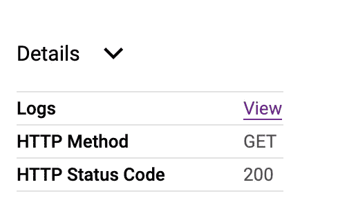

# GCP 的 Spring Boot 伐木公司

> 原文：<https://medium.com/google-cloud/spring-boot-logging-in-gcp-stackdriver-40da0ac53a28?source=collection_archive---------0----------------------->

如果你正在谷歌云平台上部署一个 Spring Boot 应用，并试图找出如何有效地登录 Stackdriver，这是适合你的帖子。


堆叠驱动测井

## 一些考虑

*   **格式**:stack driver 的构造方式，默认的 spring boot 日志格式不方便。JSON 格式更理想。GCP 的建议是使用 [*LogEntry*](https://cloud.google.com/logging/docs/reference/v2/rest/v2/LogEntry) 对象及其关联格式。

```
{
  "logName": string,
  "resource": {
    object ([MonitoredResource](https://cloud.google.com/logging/docs/reference/v2/rest/v2/MonitoredResource))
  },
  "timestamp": string,
  "receiveTimestamp": string,
  "severity": enum ([LogSeverity](https://cloud.google.com/logging/docs/reference/v2/rest/v2/LogEntry#LogSeverity)),
  "insertId": string,
  "httpRequest": {
    object ([HttpRequest](https://cloud.google.com/logging/docs/reference/v2/rest/v2/LogEntry#HttpRequest))
  },
  "labels": {
    string: string,
    ...
  },
  "metadata": {
    object ([MonitoredResourceMetadata](https://cloud.google.com/logging/docs/reference/v2/rest/v2/LogEntry#MonitoredResourceMetadata))
  },
  "operation": {
    object ([LogEntryOperation](https://cloud.google.com/logging/docs/reference/v2/rest/v2/LogEntry#LogEntryOperation))
  },
  "trace": string,
  "spanId": string,
  "traceSampled": boolean,
  "sourceLocation": {
    object ([LogEntrySourceLocation](https://cloud.google.com/logging/docs/reference/v2/rest/v2/LogEntry#LogEntrySourceLocation))
  },

  // Union field payload can be only one of the following:
  "protoPayload": {
    "@type": string,
    field1: ...,
    ...
  },
  "textPayload": string,
  "jsonPayload": {
    object
  }
  // End of list of possible types for union field payload.
}
```

*   **跟踪**:默认的 spring boot 日志捕获跟踪和 span 信息，这也需要捕获 JSON 格式。为此，我们将使用 [*春云侦探*](https://spring.io/projects/spring-cloud-sleuth) 。
*   链接**堆栈驱动跟踪**和**堆栈驱动记录**:每当你点击堆栈驱动跟踪中的一个跟踪时，会有一个类似这样的小按钮



当您单击堆栈驱动程序跟踪中的跟踪时

当我们单击*视图*时，我们将被重定向到 Stackdriver 日志记录部分，其中包含该特定跟踪下的所有日志。嗯，至少那是理想状态。

为了实现这一点，当我们将日志写入 [Stackdriver Logging](https://cloud.google.com/logging/) 时，我们需要使用格式**“项目/[项目标识]/跟踪/[跟踪标识]”**来设置 LogEntry“跟踪”字段。

示例:

追踪:`projects/my-projectid/traces/06796866738c859f2f19b7cfb3214824`

N注:如果您通过 Fluentd 使用 [Google Kubernetes 引擎](https://cloud.google.com/kubernetes-engine/)或 [Stackdriver 日志代理](https://cloud.google.com/logging/docs/agent/)，我们可以通过使用**" Logging . Google APIs . com/trace "**和**" Logging . Google APIs . com/span_id "**关键字编写结构化日志来设置 LogEntry "trace "和" span _ id "字段。

示例:

logging.googleapis.com/trace:`projects/my-projectid/traces/06796866738c859f2f19b7cfb3214824`

logging.googleapis.com/spanId:`2797cfb321482485`

我们可以通过使用 [*春云 GCP 项目的 Spring-Cloud-GCP-starter-logging*](http://spring-cloud-gcp-starter-logging)*来实现。*

# 履行

创建 Spring Boot 应用程序。

pom.xml:

```
*<?***xml version="1.0" encoding="UTF-8"***?>* <**project  xmlns:xsi="http://www.w3.org/2001/XMLSchema-instance"
       xsi:schemaLocation="http://maven.apache.org/POM/4.0.0 https://maven.apache.org/xsd/maven-4.0.0.xsd"**>
   <**modelVersion**>4.0.0</**modelVersion**>
   <**parent**>
      <**groupId**>org.springframework.boot</**groupId**>
      <**artifactId**>spring-boot-starter-parent</**artifactId**>
      <**version**>2.2.2.RELEASE</**version**>
      <**relativePath**/> *<!-- lookup parent from repository -->* </**parent**>
   <**groupId**>com.anoophp</**groupId**>
   <**artifactId**>gcp-stackdriver-logging</**artifactId**>
   <**version**>0.0.1-SNAPSHOT</**version**>
   <**name**>gcp-stackdriver-logging</**name**>
   <**description**>GCP Stackdriver Logging example</**description**>

   <**properties**>
      <**java.version**>1.8</**java.version**>
      <**spring-cloud.version**>Hoxton.SR1</**spring-cloud.version**>
   </**properties**>

   <**dependencies**>
      <**dependency**>
         <**groupId**>org.springframework.boot</**groupId**>
         <**artifactId**>spring-boot-starter-webflux</**artifactId**>
      </**dependency**>
      <**dependency**>
         <**groupId**>org.springframework.cloud</**groupId**>
         <**artifactId**>spring-cloud-gcp-starter-logging</**artifactId**>
      </**dependency**>
      <**dependency**>
         <**groupId**>org.springframework.cloud</**groupId**>
         <**artifactId**>spring-cloud-starter-sleuth</**artifactId**>
      </**dependency**>

      <**dependency**>
         <**groupId**>org.projectlombok</**groupId**>
         <**artifactId**>lombok</**artifactId**>
         <**optional**>true</**optional**>
      </**dependency**>
      <**dependency**>
         <**groupId**>org.springframework.boot</**groupId**>
         <**artifactId**>spring-boot-starter-test</**artifactId**>
         <**scope**>test</**scope**>
         <**exclusions**>
            <**exclusion**>
               <**groupId**>org.junit.vintage</**groupId**>
               <**artifactId**>junit-vintage-engine</**artifactId**>
            </**exclusion**>
         </**exclusions**>
      </**dependency**>
      <**dependency**>
         <**groupId**>io.projectreactor</**groupId**>
         <**artifactId**>reactor-test</**artifactId**>
         <**scope**>test</**scope**>
      </**dependency**>
   </**dependencies**>

   <**dependencyManagement**>
      <**dependencies**>
         <**dependency**>
            <**groupId**>org.springframework.cloud</**groupId**>
            <**artifactId**>spring-cloud-dependencies</**artifactId**>
            <**version**>${spring-cloud.version}</**version**>
            <**type**>pom</**type**>
            <**scope**>import</**scope**>
         </**dependency**>
      </**dependencies**>
   </**dependencyManagement**>

   <**build**>
      <**plugins**>
         <**plugin**>
            <**groupId**>org.springframework.boot</**groupId**>
            <**artifactId**>spring-boot-maven-plugin</**artifactId**>
         </**plugin**>
      </**plugins**>
   </**build**>

</**project**>
```

在 *main/resources* 下创建一个文件

*logback-spring.xml* :

```
<**configuration**>

    <**property name="projectId" value="${projectId:-${GOOGLE_CLOUD_PROJECT}}"**/>

    <**appender name="CONSOLE_JSON" class="ch.qos.logback.core.ConsoleAppender"**>
        <**encoder class="ch.qos.logback.core.encoder.LayoutWrappingEncoder"**>
            <**layout class="org.springframework.cloud.gcp.logging.StackdriverJsonLayout"**>
                <**projectId**>${projectId}</**projectId**>
            </**layout**>
        </**encoder**>
    </**appender**>

    <**root level="INFO"**>
        <**appender-ref ref="CONSOLE_JSON"** />
    </**root**>
</**configuration**>
```

我们正在使用**org . spring framework . cloud . gcp . Logging . stackdriverjsonlayout**Layout**提供我们已经导入到 POM 中的 GCP 日志记录启动项目。**

**这确保了在 GKE 和 GCE 中部署时自动设置项目 ID。**

***gcpstackdriverloggingapplication . Java:***

```
**package** com.anoophp.gcpstackdriverlogging;

**import** lombok.extern.slf4j.Slf4j;
**import** org.springframework.boot.SpringApplication;
**import** org.springframework.boot.autoconfigure.SpringBootApplication;
**import** org.springframework.web.bind.annotation.GetMapping;
**import** org.springframework.web.bind.annotation.RestController;

@SpringBootApplication
**public class** GcpStackdriverLoggingApplication {

   **public static void** main(String[] args) {
      SpringApplication.*run*(GcpStackdriverLoggingApplication.**class**, args);
   }

}

@RestController
@Slf4j
**class** Foo {

   @GetMapping(**"/foo"**)
   **public** String bar() {
      ***log***.info(**"Test log"**);
      **return "bar"**;
   }
}
```

**就是这样！！**

**当您在 GCP 内外运行这个应用程序并点击/foo 端点时，您会看到这个。**

```
/Library/Java/JavaVirtualMachines/jdk1.8.0_172.jdk/Contents/Home/bin/java com.anoophp.gcpstackdriverlogging.GcpStackdriverLoggingApplication.   ____          _            __ _ _
 /\\ / ___'_ __ _ _(_)_ __  __ _ \ \ \ \
( ( )\___ | '_ | '_| | '_ \/ _` | \ \ \ \
 \\/  ___)| |_)| | | | | || (_| |  ) ) ) )
  '  |____| .__|_| |_|_| |_\__, | / / / /
 =========|_|==============|___/=/_/_/_/
 :: Spring Boot ::        (v2.2.2.RELEASE){"timestampSeconds":1577607033,"timestampNanos":29000000,"severity":"INFO","thread":"main","logger":"com.anoophp.gcpstackdriverlogging.GcpStackdriverLoggingApplication","message":"No active profile set, falling back to default profiles: default","context":"default"}
{"timestampSeconds":1577607033,"timestampNanos":479000000,"severity":"INFO","thread":"main","logger":"org.springframework.cloud.context.scope.GenericScope","message":"BeanFactory id\u003dc7b095b5-61ce-30c0-b7a7-fcc51940dbd3","context":"default"}{"timestampSeconds":1577607033,"timestampNanos":686000000,"severity":"INFO","thread":"main","logger":"org.springframework.context.support.PostProcessorRegistrationDelegate$BeanPostProcessorChecker","message":"Bean \u0027org.springframework.cloud.sleuth.instrument.web.client.TraceWebClientAutoConfiguration$NettyConfiguration\u0027 of type [org.springframework.cloud.sleuth.instrument.web.client.TraceWebClientAutoConfiguration$NettyConfiguration] is not eligible for getting processed by all BeanPostProcessors (for example: not eligible for auto-proxying)","context":"default"}{"timestampSeconds":1577607034,"timestampNanos":131000000,"severity":"INFO","thread":"main","logger":"com.google.auth.oauth2.ComputeEngineCredentials","message":"Failed to detect whether we are running on Google Compute Engine.","context":"default"}{"timestampSeconds":1577607034,"timestampNanos":131000000,"severity":"WARN","thread":"main","logger":"org.springframework.cloud.gcp.core.DefaultCredentialsProvider","message":"No core credentials are set. Service-specific credentials (e.g., spring.cloud.gcp.pubsub.credentials.*) should be used if your app uses services that require credentials.","context":"default"}{"timestampSeconds":1577607034,"timestampNanos":133000000,"severity":"INFO","thread":"main","logger":"org.springframework.cloud.gcp.autoconfigure.core.GcpContextAutoConfiguration","message":"The default project ID is gcp-webflux-logging-tracing","context":"default"}{"timestampSeconds":1577607034,"timestampNanos":325000000,"severity":"INFO","thread":"main","logger":"org.springframework.boot.web.embedded.netty.NettyWebServer","message":"Netty started on port(s): 8080","context":"default"}{"timestampSeconds":1577607034,"timestampNanos":330000000,"severity":"INFO","thread":"main","logger":"com.anoophp.gcpstackdriverlogging.GcpStackdriverLoggingApplication","message":"Started GcpStackdriverLoggingApplication in 1.998 seconds (JVM running for 2.472)","context":"default"}{**"traceId":"5e8a279c5b6f16ab"**,"spanId":"5e8a279c5b6f16ab","spanExportable":"false","timestampSeconds":1577607071,"timestampNanos":863000000,"severity":"INFO","thread":"reactor-http-nio-2","logger":"com.anoophp.gcpstackdriverlogging.Foo","message":"Test log","context":"default","logging.googleapis.com/trace":**"projects/gcp-webflux-logging-tracing/traces/00000000000000005e8a279c5b6f16ab"**,**"logging.googleapis.com/spanId":"5e8a279c5b6f16ab"**}
```

**如果您导航到 Stackdriver Trace ->单击一个 Trace -> View 来查看 Stackdriver 日志记录和该特定跟踪的所有相关日志。**

**你可以在 GitHub [中找到完整的项目。](https://github.com/anoophp777/gcp-stackdriver-logging)**

**如果你有任何问题，请留言。**