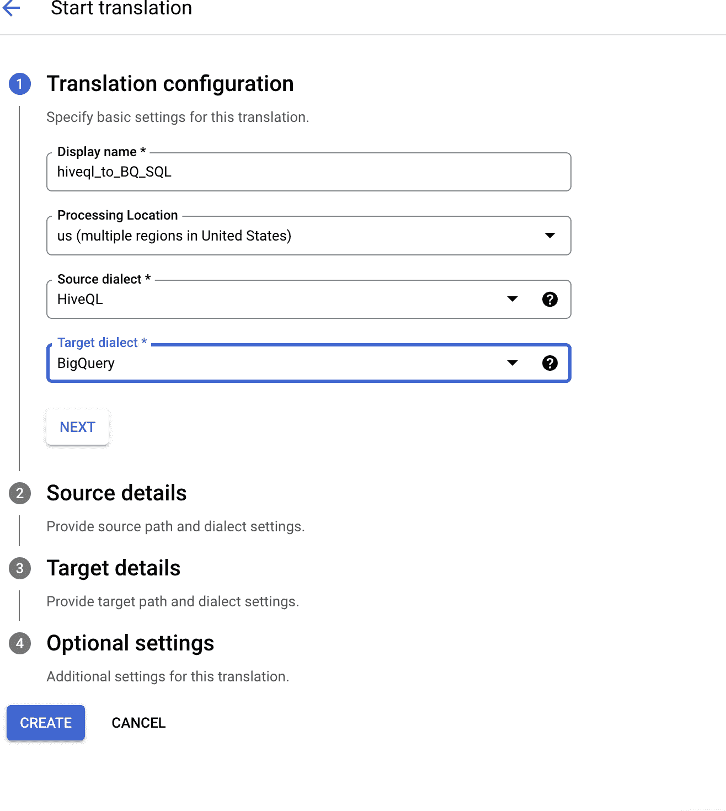

# SQL 是结构化查询语言，但不同数据库的结构可能不同。

> 原文：<https://medium.com/google-cloud/sql-is-structured-query-language-but-the-structure-can-be-different-in-different-databases-3f38b90c319?source=collection_archive---------1----------------------->

# BigQuery 翻译服务和超越它。

从一个数据库迁移到另一个数据库时，您是否厌倦了翻译 sql 方言？

在迁移到 BigQuery 时，您不需要担心。

# 介绍

本文概述了组织如何利用 BigQuery 翻译服务将现有的基石 Hive SQL 查询转换为 BigQuery 原生查询。我们将讨论这些方法、特性、产品限制和解决方法。

本文还概述了 BigQuery 翻译服务的当前局限性，并提供了使用 Python 实用程序的实现指南。

下面描述了三种方法及其局限性和解决方法。

1.  使用 Interactive SQL 转换

# 角色

以下预定义角色提供了使用 interactive SQL 转换器所需的权限:

按照下面概述的步骤使用批量 SQL 转换

**步骤 1:** 启用 SQL 翻译

**第二步:**默认情况下，Teradata 将作为源。通过单击突出显示的下拉菜单将其更改为 HiveQL

**步骤 3:** 将您的 sql 语句粘贴到左侧，然后单击翻译。我用你的 DDL 脚本运行了它。

**步骤 4:** 翻译后的查询出现在右侧。

**翻译注意事项:**

1.  可以通过以下方式对 BigQuery 表进行分区:

*   **时间单位列**:根据表中的时间戳、日期或日期时间列对表进行分区。
*   **摄取时间**:当 BigQuery 摄取数据时，根据时间戳对表进行分区。
*   **整数范围**:基于整数列对表进行分区。

在 HiveQl 中，分区是在字符串字段上进行的，所以在翻译的 sql 中，它将其翻译为集群，就像在 BigQuery 中可以在字符串字段上进行的那样。

1.  BigQuery 需要指定 datasetname，因为在源 HiveQL 中没有提到 schema_name，所以它在将其转换为 BigQuery SQL 后显示错误。

表“table1”必须用数据集限定(例如 dataset.table)

# 限制

1.  如果必须添加或替换任何默认的数据集或项目名称，那么您不能从这个交互式 UI 中执行此操作。**你必须通过批量 SQL 转换(这将在下面解释)。**
2.  任何参数都需要手动替换
3.  DDL 语句需要是 SQL 输入的一部分

# 2.使用批处理 SQL 转换器

**步骤 1:** 左侧工具栏→转到迁移→ Sql 翻译→点击开始翻译

**步骤 3:** 将所有 sql 脚本保存在 GCS bucket 的一个文件夹中，并在 Source Details 中给出该路径的详细信息。

**第 4 步**:提供翻译后的输出将被存储的目标细节

**步骤 5:** 提供默认的项目和数据集名称

**步骤 6:** 在目的地桶中生成翻译后的查询。

有一个名为“batch_translation_report.csv”的文件，如果有任何语句由于某种原因没有转换，该文件将包含所有错误。

源脚本***batch _ translation _ hive QL . SQL***没有任何特殊字符，因此按照预期进行了翻译。

但是脚本***batch _ translation _ hive QL 1 . SQL***无法翻译，因为它有“##”符号

***输出文件夹中的 batch _ translation _ hive QL 1 . SQL***:

在“batch_translation_report.csv”文件中，显示了脚本***batch _ translation _ hive QL 1 . SQL***无法翻译的原因。

**batch _ translation _ report . CSV 的内容:**

时间戳，文件路径，文件名，脚本行，脚本列，TranspilerComponent，环境，对象名，严重性，类别，消息，脚本上下文，操作

1671557757534，GS://source _ Hive QL/batch_translation_hiveql1.sql，batch _ translation _ Hive QL 1 . sql，10，24，TranspilerCompiler:compiler，Hive: bq_translation_db，， **ERROR，LexicalError，未知令牌:#，M table _ 2 WHERE((column _ a>= {>HERE<} #，检查输入的 SQL 是否正确并分类在**

所以它不能翻译剧本。

在这种情况下，我们必须删除或预处理查询。然而，从这份报告中，我们将获得足够的见解，什么要取代。

此外，UDF 和专门的功能，你必须在翻译后单独创建。

它能翻译的常用函数很少。

在这种情况下，替换' ## '后，它被翻译。

batch_translation_hiveql.sql 已使用默认项目名称和数据集名称进行了翻译。

# 限制

1.  目前缺少参数映射/替换。使用 python 工具查看以下解决方法。

# 3.使用 Google 构建的 Python 实用程序通过一个宏文件来克服这个词法问题。

如果需要的话，这是提供从源到目标的对象映射的另一种方法。

这些代码必须在本地运行，或者在某个虚拟机或云外壳上运行。

**步骤 1:** 在你的机器上克隆下面的 github repo

吉西卜:[https://github.com/google/dwh-migration-tools.git](https://github.com/google/dwh-migration-tools.git)

**第二步:****CD dwh-迁移-工具/客户端**

**第三步:**根据需要更新配置文件。存储库中有一个示例文件。

> *#版权所有 2022 谷歌公司*
> 
> *#根据 Apache 许可证 2.0 版许可(“许可证”)；*
> 
> 除非符合许可证的规定，否则您不得使用本文件。
> 
> *#您可以在*获得许可证的副本
> 
> 【http://www.apache.org/licenses/LICENSE-2.0】#
> 
> **#除非适用法律要求或书面同意，软件**
> 
> **#根据许可证分发是基于“原样”分发，**
> 
> **#无任何明示或暗示的担保或条件。**
> 
> **#请参见许可协议，了解特定语言的管理权限和**
> 
> **#许可下的限制。**
> 
> **gcp_settings:**
> 
> **# GCP 项目编号。**
> 
> **项目编号:' bq_translation_demo_proj'**
> 
> **# Google 云存储桶，示例:'示范性 _ 客户端 _ 测试 _ 外部'**
> 
> **GCS _ bucket:' temp _ hive QL _ bq _ translation '**
> 
> **翻译 _ 配置:**
> 
> **#翻译类型需要是以下类型之一:Translation_Teradata2BQ，Translation_Redshift2BQ，Translation_Bteq2BQ，**
> 
> **# Translation_Oracle2BQ，Translation_HiveQL2BQ，Translation_SparkSQL2BQ，Translation_Snowflake2BQ，**
> 
> **# Translation_Netezza2BQ，Translation _ AzureSynapse2BQ，Translation_Vertica2BQ，Translation_SQLServer2BQ，**
> 
> **# Translation_Presto2BQ，Translation_MySQL2BQ。**
> 
> **Translation _ type:Translation _ hive QL 2 bq**
> 
> **#位置需要是以下之一:美国、欧盟、亚洲-东北 1、亚洲-东南 1、欧洲-西方 2、亚洲-南方 1、**
> 
> **#澳洲-东南 1，南美-东 1。**
> 
> **地点:“美国”**
> 
> **#[可选字段]当缺少数据库名称时，完全限定 SQL 对象的默认数据库名称。**
> 
> **默认 _ 数据库:' bq_translation_db'**
> 
> **#【可选字段】模式搜索路径。当 SQL 对象缺少模式名时，翻译引擎将搜索该列表以找到该值。**
> 
> **schema _ search _ path:[' bq _ translation _ schema ']**
> 
> **#将此项设置为 True(默认值)以清理‘中的临时数据。“tmp_processed”文件夹。**
> 
> **clean _ up _ tmp _ files:False**

***第四步:***

*如果需要替换输入脚本中的某些变量，请更新 **macros.yaml** 文件。*

*资源库中提供了示例 macros.yaml 文件。*

*这是用于翻译的一个。*

> **Macros.yaml
> #版权所有 2022 Google LLC
> #
> #根据 Apache 许可证 2.0 版(“许可证”)获得许可；
> #除非符合许可，否则不得使用本文件。
> #您可以在
> #
> #*[*http://www.apache.org/licenses/LICENSE-2.0*](http://www.apache.org/licenses/LICENSE-2.0) *#
> #获得许可的副本，除非适用法律要求或书面同意，根据许可分发的软件
> #按“原样”分发，
> #不附带任何种类的明示或暗示的担保或条件。
> #参见许可协议，了解许可协议下的特定语言管理权限和
> #限制。**
> 
> **#示例宏替换图定义。
> #要启用宏替换，请在运行 Python 工具时传递 arg '-m macro _ substitution _ map . YAML '。工具
> #将对查询文件执行以下操作。
> #翻译开始前(预处理):对于每个以'结尾的文件。sql '，' ${MACRO_1} '和' %MACRO_2% '将分别替换为
> # 'macro_replacement_1 '和' macro_replacement_2 '。对于文件' 2.sql '，该工具还会将
> # 'templated_column '替换为' replacing_column '。
> #翻译完成后(后处理):该工具将通过用映射中的键替换
> #值来反转所有输出查询文件的替换。**
> 
> **#注意，该工具只对单个
> #路径中的所有宏(映射中定义的键)执行严格的字符串替换。
> #在后处理期间，首先通过简单地交换
> #映射中每个文件的关键字和值来计算反向映射。如果不同的宏映射到相同的值，可能会发生冲突。**
> 
> **宏:
> '*。SQL ':
> ' # # month _ for _ no _ days _ ago # # ':' 03 ' "
> ' # # current _ month # # ':' 05 ' "**

*到目前为止，这个实用程序还不支持 marcos.yaml 文件中的 regex，所以您必须提供您想要替换或替代的每个参数，或者给出词法错误的每个参数。*

***步骤 5:** 在这种情况下不使用对象映射，但如果需要，这里有一个 object_mapping.json 文件的示例:*

> **{
> 【名称映射】:[{
> 【源】:{
> 【类型】:"关系"、
> 【数据库】:"源 _ 数据库 _ 名称"、
> 【模式】:"源 _ 模式 _ 名称"、
> "关系":"源 _ 表 _ 名称"
> }、
> "目标":{
> "数据库":"目标 _ 数据库 _ 名称"、
> "模式":"目标 _ 目标**

***第六步:**创建输入输出目录。*

*输入目录的默认值是客户端/输入。要覆盖它，请在运行上述命令时添加标志— input path/to/input_dir。*

*存储翻译作业输出的输出目录的默认值是 client/output。要覆盖它，请在运行上述命令时添加标志—输出路径/to/output_dir。*

*这里我展示了如何覆盖默认的输入和输出目录，然后执行。*

*创建了这两个文件夹:替换为您的路径*

***输入 _ 目录**:'/home/* * * * */dwh-migration-tools/client/input/SQL _ input/'*

***输出 _ 目录**:'/home/* * * * */dwh-migration-tools/client/output/'*

*请在**输入目录下输入 sql 脚本。***

***样本输入 SQL1:***

*创建表格 table1*

*如同*

*选择案例*

*当((column_a 为空时*

*或者 IBECTrim(column_a) IN(''，' '，'-'，' empty '))*

*然后(“”)*

*ELSE (IBECTrim(column_a))*

*以 columna_a1 结尾，*

*列 _b*

*来自表 2*

*其中((column _ a > = # # month _ for _ no _ days _ ago #*

*和 column_a <= ##current_month##)*

*AND column_b = ‘0’);*

***样本输入 SQL2:***

*select * from foo where day > = $ { hive conf:CURRENT _ DATE }；*

*在这两种情况下，都有像“##”和“$”这样的符号，使用这些符号，Bigquery 翻译服务将失败。*

*将它们放在如下输入文件夹中。*

**

***步骤 7:** 使用这些输入、输出目录和宏文件执行实用程序*

*从“~/dwh-migration-tools/”路径启动以下命令*

***bin/dwh-migration-client-input/home/* * * * */dwh-migration-tools/client/input/SQL _ input-output/home/* * * * */dwh-migration-tools/client/output-m client/macros . YAML***

*翻译后的输出脚本将与 batch_translation_report.csv 一起存储在输出目录中*

**

***为 sql1.sql 翻译的 sql:***

*创建表 bq _ translation _ db . bq _ translation _ schema . TABLE 1*

*如同*

*挑选*

*情况*

*当 table_2.column_a 为空时*

*或者 ibectrim(table_2.column_a)在(*

*'，'，'-'，'空'*

*)然后''*

*ELSE ibectrim(table_2.column_a)*

*以 columna_a1 结尾，*

*表 2 .列 b*

*从*

*bq _ translation _ db . bq _ translation _ schema . table _ 2*

*其中 table _ 2 . column _ a > = # # month _ for _ no _ days _ ago # #*

*和 table_2.column_a <= ##current_month##*

*AND table_2.column_b = ‘0’*

*;*

*   *Default projectname, dataset_name, table names are added in the translated script and it translated the symbols as is from source script without giving any error.*

***执行脚本时需要记住的几点:***

1.  *如果您想在没有 macros.yaml 和对象映射的情况下运行，并使用默认的输入/输出目录，请执行下面的命令*

***bin/dwh-迁移-客户端***

*2.如果您希望在没有 macros.yaml 和对象映射的情况下运行，并且希望覆盖默认的输入/输出目录并使用您自己的目录，请执行以下命令*

***bin/dwh-migration-client —输入路径/to/input_dir —输出路径/to/output_dir***

*3.如果您想用宏运行并覆盖输入/输出目录*

***bin/dwh-migration-client-input/home/* * * * */dwh-migration-tools/client/input/SQL _ input-output/home/* * * * */dwh-migration-tools/client/output-m client/macros . YAML***

*4.如果要使用对象映射运行:*

***bin/dwh-migration-client -o 客户端/object_mapping.json***

*快乐迁徙。翻译愉快。:)*