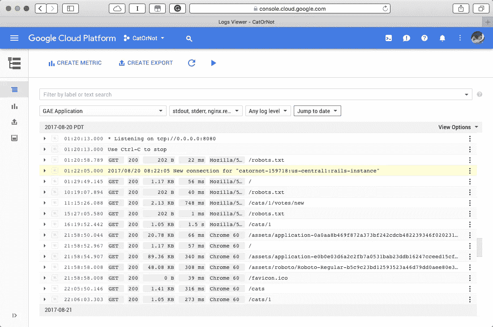
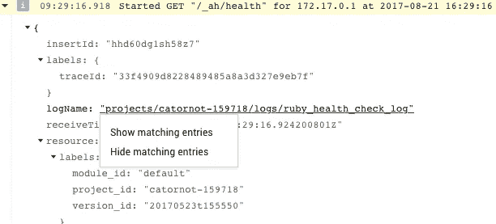
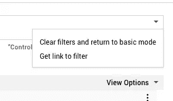

# Stackdriver 高级过滤器

> 原文：<https://medium.com/google-cloud/stackdriver-advanced-filters-9416fcba8f50?source=collection_archive---------0----------------------->



堆栈驱动程序日志高级过滤器视图

除非您有一个全职的操作角色，否则您可能只在两种情况下查看您的日志和监控工具:一次是在您设置它们的时候，另一次是在出现问题的时候。我知道我通常是这样做事的。这种方法的问题是，当您面临停机的压力时，您只有机会学习如何使用您的工具。一些我非常尊敬的人建议每天花 5 到 10 分钟来学习和改进你的工具。这篇文章应该有助于您了解 Stackdriver 日志记录的一些高级用户特性。我鼓励你尝试一下帖子中的一些东西，这样当你在解决一个中断时，你已经很了解这些工具了。

# 高级过滤

大多数人认为可以通过在日志页面顶部的框中输入内容来过滤日志结果。很少有人意识到，通过点击框右边缘的三角形，可以切换到高级过滤模式。您可以使用一个特殊的语法来指定您想要查看的确切日志。例如，要将视图限制为仅记录来自 GAE 的消息，您可以这样做:

```
resource.type="gae_app"
```

要向筛选器添加更多子句，您可以添加更多行。此过滤器显示特定 GAE 版本的日志。

```
resource.type="gae_app" 
resource.labels.version_id="20170523t155550"
```

您还可以使用运算符，如 AND、OR、NOT、>、

```
severity=("ERROR" OR "CRITICAL")
```

严重性映射为数值，因此您也可以对其进行数学比较，如下所示:

```
resource.type = gae_app AND severity >= ERROR
```

我很难记住字段名和可能的值。幸运的是，用户界面会自动完成它所能完成的，包括字段名和字段的可能值，如 severity。

# 基于现有日志进行过滤



如果你不知道你的滤波器需要什么，有一个更简单的方法来找到正确的值。简单地浏览你的日志，直到你找到你想要关注的信息类型。然后单击一个字段，并单击“显示匹配条目”这将用正确的值填充过滤器。

您还可以使用“隐藏匹配条目”来删除分散您对正在尝试解决的问题的注意力的消息。

# 保存和共享

一旦你花时间找出了正确的过滤器，你可能会想要保存它们或者与你团队中的其他人分享。如果您单击过滤器框中的三角形，您可以获得指向此特定过滤器的链接，您可以与队友共享或保存在文档或收藏夹栏中。



这篇文章让高级过滤器看起来很简单。但是，就像计算中的许多事情一样，除非你以独特的方式组合构件，否则你看不到该功能的强大之处。为经常性的调试和分析任务保存一个过滤器要比用一组 shell 脚本来提取相关数据好得多。只有你知道你的系统的脆弱点，以及当一切似乎都坏了的时候，查看数据的最有用的方法。

如果你更喜欢看高级过滤器的视频，这里有一个云分钟，涵盖了这一功能的基础。

08/22/17

*原载于 2017 年 8 月 24 日*[*【www.thagomizer.com】*](http://www.thagomizer.com/blog/2017/08/24/stackdriver-advanced-filters.html)*。*