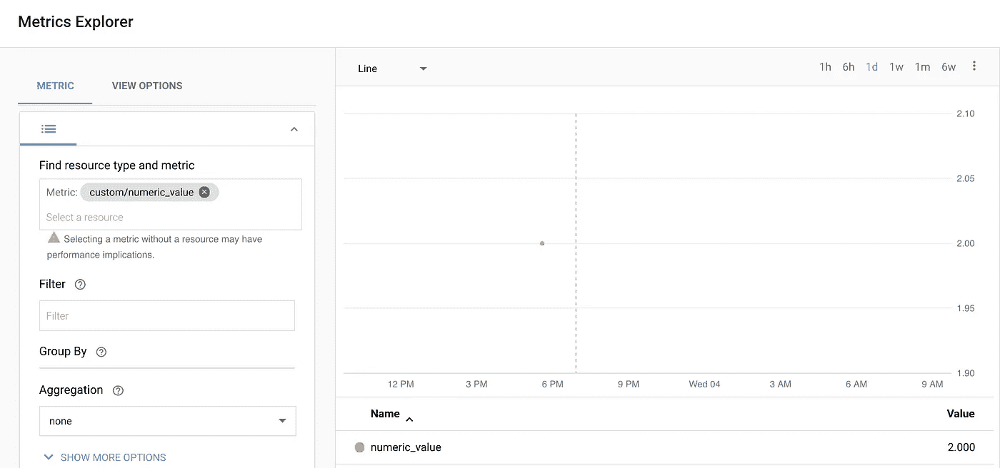

# Python 中的 Stackdriver 自定义指标

> 原文：<https://medium.com/google-cloud/stackdriver-custom-metrics-in-python-30fafb585a1d?source=collection_archive---------1----------------------->

作为 [GCP 直播](https://youtube.com/GCPLive)团队的一员，我最近在这个会议上介绍了 Stackdriver 监控 API 的基础知识，并展示了如何在 Node.js(或者是 node.js？).

GCP 在线会议#51:堆栈驱动自定义指标

会议结束后，我意识到我总是在 Node 中做这些事情，而 Node 实际上似乎并不像 Python 那样广泛用于这种“快速点击”演示。因此，在对 Python 几乎一无所知的情况下，我开始在那里复制一个类似的演示。

如果你有兴趣看到结果，你可以在这里看到 GitHub 回购[。它现在包含了原始的 Node.js 代码和我将在这里介绍的 Python 代码。](https://github.com/yuriatgoogle/stackdriver-custom-metrics)

我使用了两种资源来完成这项工作。第一个是 Miguel Grinberg 的这个神奇的烧瓶教程。我需要这个，因为当我开始的时候，我完全不知道如何用 Python 构建一个简单的 web 应用程序。第二个是 Stackdriver 监控客户端[文档](https://cloud.google.com/monitoring/docs/reference/libraries)的 Python 部分。有了这两个，我就有足够的时间来构建一个非常简单的带有表单输入的 web 页面，它接受输入的值，并将其作为自定义的时间序列度量发送给 Stackdriver。


一个孤独的数据点

用乔恩·洛维特的不朽名言来说——让我们开始吧。

**第 1 部分—环境设置**

因为我完全不知道我在用 Python 做什么，所以我不得不从头开始。谢天谢地，米格尔的[教程](https://blog.miguelgrinberg.com/post/the-flask-mega-tutorial-part-i-hello-world)也从那里开始。我真的不需要在这里重现，但基本步骤包括:

1.  安装 Python——我没有这样做，因为我的 Mac 已经安装了它。
2.  创建虚拟环境——这是 Python 特有的事情(我从未在 Node.js 中做过类似的事情，它将包保存在项目的本地)。
3.  安装 Flask 和其他几个包——在没有它的情况下，我遇到了一堆权限问题，于是我使用了`--user`选项。

**第 2 部分—网络“应用程序”**

我在这里把“app”放在引号中，因为我构建的东西勉强够得上这个名字。我四处询问，被告知 Flask 是我应该使用的框架，因为我对 Express 有点满意，它看起来很适合，特别是因为它使用了(我认为的)相同的路由概念。当然，我弄错了，它们实际上并不是一回事——但这足以让我绞尽脑汁。

因为我真正关心的事情是调用监控 API，所以我没有花太多时间来使应用程序本身有吸引力，特别是功能性，或者以任何方式有趣。看起来是这样的:


现代网络表单的典范

我真的不认为有人在这里是为了 Python 教程中的 Flask 和/或 Web 开发，所以我将再次向您推荐 Miguel 的优秀作品。你可以在 [GitHub](https://github.com/yuriatgoogle/stackdriver-custom-metrics) 上看到我实现的细节，但这是这个应用程序如何构建的主要要点:

*   [**__init__。py**](https://github.com/yuriatgoogle/stackdriver-custom-metrics/blob/master/app/__init__.py) 文件相当简单:


__init__。巴拉圭

*   输入表单在 [**forms.py**](https://github.com/yuriatgoogle/stackdriver-custom-metrics/blob/master/app/forms.py) 中定义:


forms.py

*   接下来，这里是要提供的实际的 [**html**](https://github.com/yuriatgoogle/stackdriver-custom-metrics/blob/master/app/templates/index_python.html) 页面:


超文本标记语言

*   最后， [**routes.py**](https://github.com/yuriatgoogle/stackdriver-custom-metrics/blob/master/app/routes.py) 是实际 app 逻辑所在


处理初始 GET、后续的表单 POST 和…


…处理完表单数据后，重定向回原始页面

**第 3 部分—调用监控 API**

现在我们有了一个可以运行的应用程序

*   为主页服务
*   接受单个输入
*   处理输入的内容(尽管不对其进行任何有意义的验证)

我们可以接受该输入并调用 Stackdriver 监控 API 来创建一个定制的指标。为此，我们需要:

*   添加谷歌云监控**库**

```
from google.cloud import monitoring
```

*   在`POST`路径中实例化我们的**客户端**

```
client = monitoring.Client()
```

*   定义我们正在编写的度量标准。我只是使用一个基本的指标名称，但是您可以使用一个更复杂的路径，一旦您开始使用许多定制指标，这将非常有用。

```
metric = client.metric(
  type_='custom.googleapis.com/numeric_value',
  labels={}
)
```

*   定义我们编写这个指标所依据的**资源**。我只是根据`global`资源来写，但是你可以根据需要提供特定的 GCP 资源。
*   **警告—** 为了简单起见，我针对“全局”资源来编写这个指标。如果这个代码要在多个地方执行，例如在多个容器单元中，可能会有潜在的冲突。在实际的生产部署中，请确保针对指定的资源而不是“全局”进行写入。

```
resource = client.resource(
  type_='global',
  labels={}
)
```

*   写度量值！

```
client.write_point(metric, resource, int(form.metric.data))
```

这里有两点需要注意。首先，我使用表单输入的`.data`属性来获取输入的值。第二个是我(实际上我不确定这是否有必要)在写之前把它转换成`int`。

如果一切都做得正确，你可以确保你有你的 GCP 证书排序(我用了`gcloud auth application-default login,` )，启动你的应用程序，并测试输入。如果它工作正常，您可以到 Stackdriver 中的 Metric Explorer 查看您的度量！



太美了。

如果您不熟悉 Python、Stackdriver 或监控 API，我希望这对您有用！