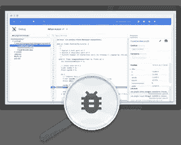
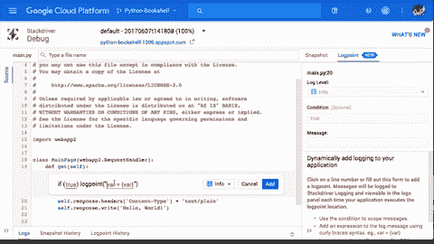
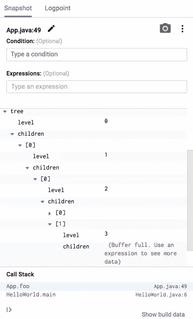
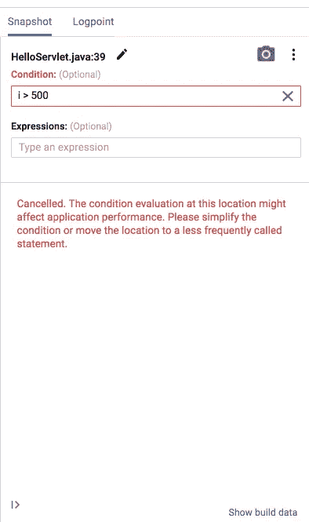
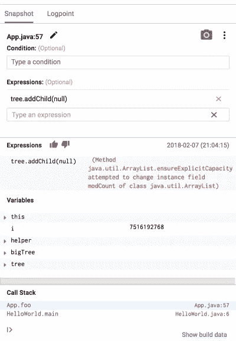

# Stackdriver 调试器安全功能

> 原文：<https://medium.com/google-cloud/stackdriver-debugger-safety-features-66eac661c127?source=collection_archive---------1----------------------->

最近我一直在玩 [Stackdriver 调试器](https://cloud.google.com/debugger/)。这是一个非常有用的工具，可以用来理解那些似乎只发生在生产中的错误。Stackdriver Debugger 可以在您自己的硬件、Google 云平台或其他云提供商上运行时调试您的应用程序。今天，它通常适用于 Java 和 Python。Ruby、Node.js 和 Go 都在测试中。这是 PHP 的 alpha 版本。。NET 支持即将推出。如果你想加入。网，留个评论。

当然，在生产中使用调试器时，我首先担心的是，“这会降低我的程序速度吗？”在和 Stackdriver Debugger 的产品经理谈过之后，我的担心减轻了。他分享了许多技术细节，解释了为什么调试器的性能和稳定性影响是绝对最小的。

Stackdriver Debugger 是一个强大的工具，允许开发人员有效地设置断点并向生产应用程序添加日志语句，而不会影响服务的最终用户体验。确保调试器不会影响生产服务的稳定性或延迟是 Stackdriver Debugger 独特之处的一部分，我们已经进行了大量投资来确保这一点。

我们还在谷歌内部使用调试器，这意味着它必须能够在极端规模下运行。我们为 Debugger 在 Google 服务上工作所做的这些改进，比如 DoubleClick，在 Stackdriver Debugger 中也有。

虽然本文主要关注 Java 调试器代理中的特性，但是我们在大多数语言中都有类似的功能。

# 保证快速性能

首先，需要注意的是，虽然在 Stackdriver Debugger 中创建的快照非常类似于断点，但它们不会暂停应用程序的执行。相反，应用程序状态(变量和调用堆栈)被捕获，但允许不受阻碍地继续执行。

然而，单个快照在捕获过程中确实会产生一个小的(毫秒级)延迟。为了确保在同一服务的多个实例之间将这种性能损失降至最低，调试器会在应用程序的所有实例上触发快照指令后，立即将其删除。此外，从快照收集的数据上限为 64KB，以减少捕获快照的影响。如果在 64KB 快照中没有捕获到一个重要的变量，您可以通过使用表达式来确定它的优先级。

快照条件也有可能降低应用程序的执行速度，因为每次运行快照代码行时都必须对它们进行评估。为了解决这个问题，调试器代理监控自己的 CPU 消耗，如果在应用程序的特定实例上使用超过 1%的 CPU 时间，就会自动删除快照。如果发生这种情况，您将在调试器 UI 中收到一条消息，并且所有已删除的快照将在所有实例中自动删除。

Logpoints 也具有类似的保护功能，但是要记住，与应用程序原始源代码中包含的日志语句相比，logpoints 不会引入任何明显的开销，这一点很重要。然而，由于 Logpoints 跳过了正常的测试和发布周期，所以保证服务不会因为添加它们而受到负面影响是很重要的，这就是为什么它们被限制在每个实例每秒 50 个日志语句和 20KB 的日志数据。

# 保留应用程序状态

虽然不影响应用程序的性能是一个非常重要的目标，调试器也保证它不会影响应用程序在执行过程中的状态。如果您使用 Java，这尤其重要，因为我们允许 Java 开发人员在条件和表达式中使用方法。

为了解决这个问题，我们创建了一个定制的 Java 解释器来执行和分析条件和表达式中包含的函数，并确定它们是否有任何潜在的副作用。例如，修改类的静态成员有副作用，会被拒绝，但是创建或修改临时变量没有副作用，可以在条件或表达式中使用。包含在条件或表达式中的应用程序类不会加载到 JVM 中，而是加载到这个解释器中，这进一步消除了与类加载相关的副作用。

# 结论

在 Google，我们必须考虑我们添加到代码库中的任何工具对性能和可靠性的影响。由于调试器每天都在生产谷歌服务上使用，我们必须确保它的影响尽可能小。

Stackdriver 调试器用户可以利用这些相同的创新，无论他们的应用程序是部署到 Kubernetes、VMs 还是 Google App Engine。与 Stackdriver APM 套件的其余部分一样，Stackdriver Debugger 可以针对任何地方托管的应用程序。试一试，让我知道你的想法！