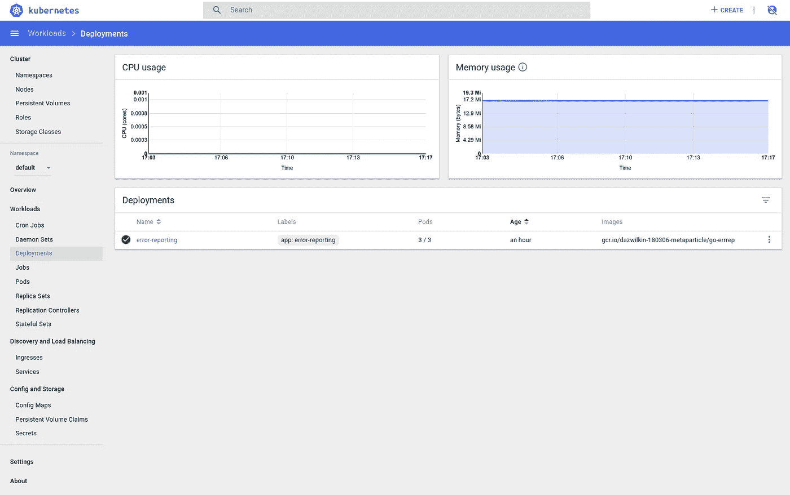
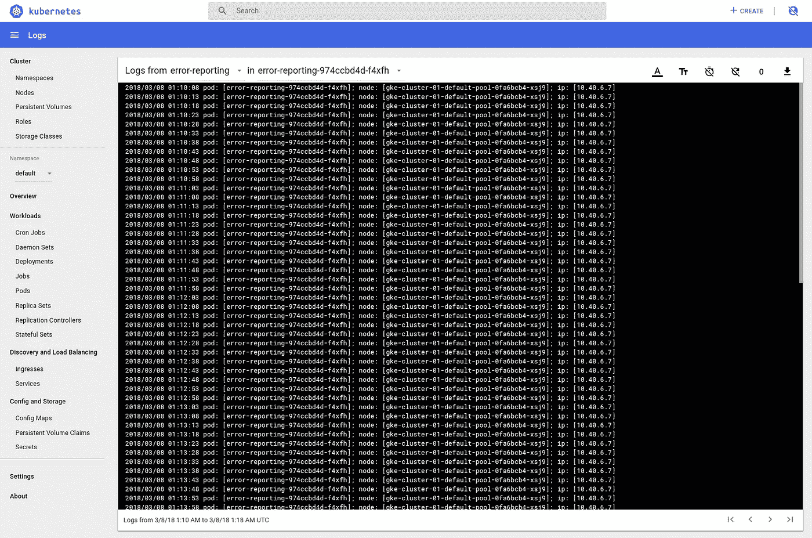
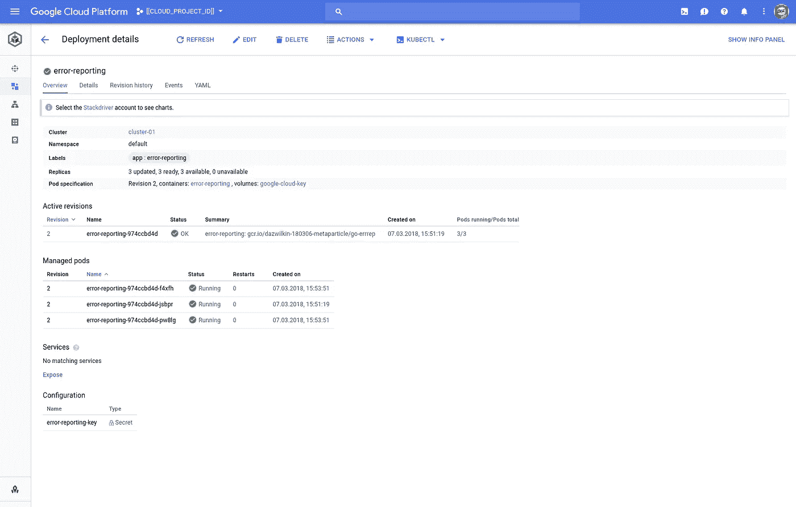
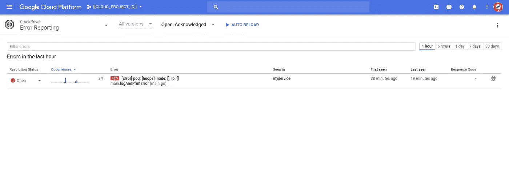
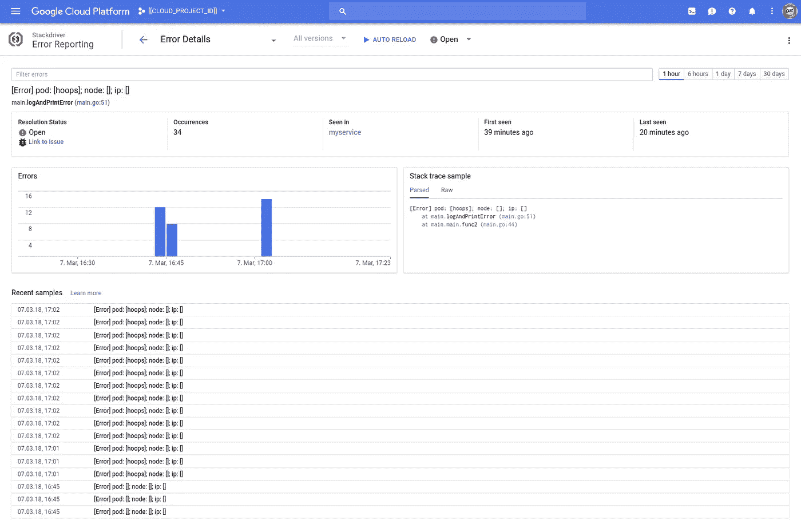
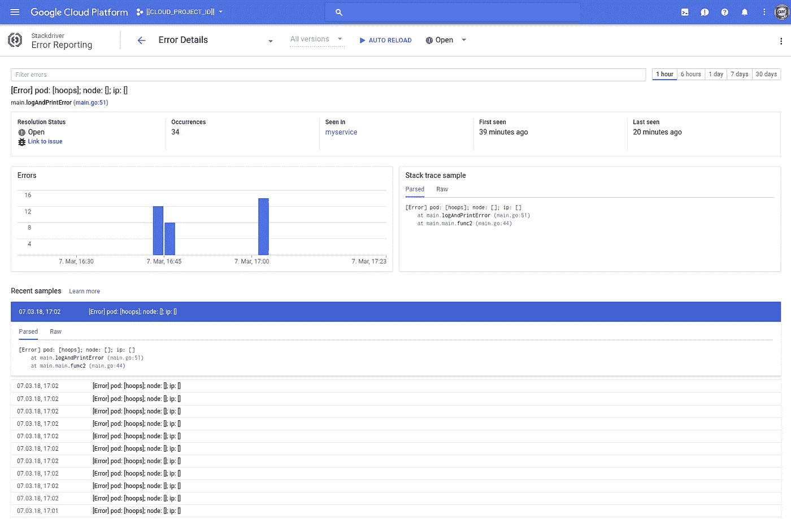
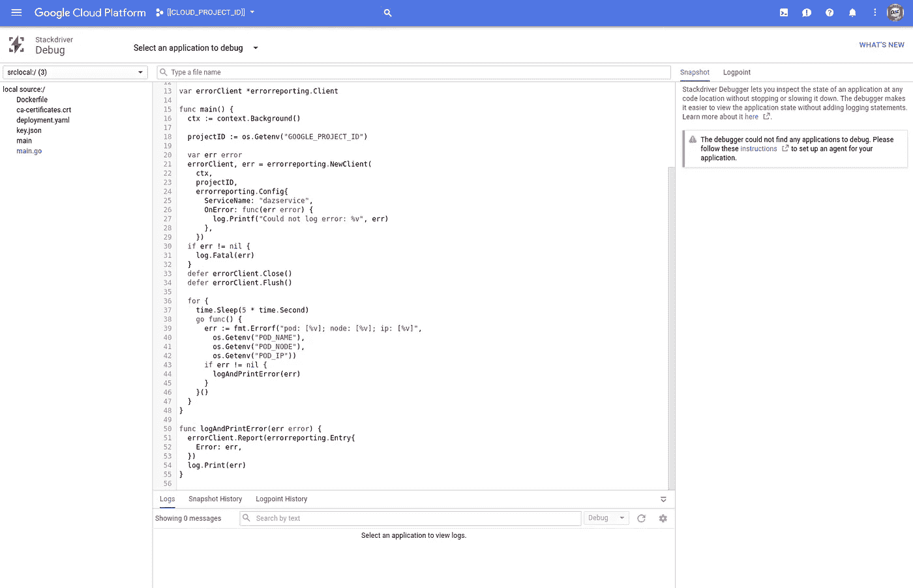

# Stackdriver 错误报告:第 1 部分

> 原文：<https://medium.com/google-cloud/stackdriver-error-reporting-8e86be630533?source=collection_archive---------1----------------------->

## 带 Golang 和 Kubernetes 发动机的进一步探险

我的同事建议我写一个关于 Stackdriver 错误报告的博客。他拿 Golang 库逗我(没错！)而我决定部署到 Kubernetes 引擎(woop！).

所以… Stackdriver 错误报告三方:本地，Docker 和 Kubernetes 引擎。

## 设置

我假设你有一个 Kubernetes 发动机'婴儿'集群…继续前进，前进[地区](https://cloud.google.com/kubernetes-engine/docs/concepts/multi-zone-and-regional-clusters#regional)。您可以在 3 个区域中运行 1 个节点。我建议抓住机会，探索 Kubernetes 发动机在这一引人注目的配置。而且，一个小时左右的时间，费用并不贵。

## 堆栈驱动程序错误报告

[](https://cloud.google.com/error-reporting/) [## Stackdriver 错误报告|谷歌云平台

### Stackdriver 错误报告基于云服务的堆栈跟踪来统计和汇总来自云服务的崩溃。

cloud.google.com](https://cloud.google.com/error-reporting/) 

Go(lang)的文档包括部署到 Kubernetes 引擎[https://cloud . Google . com/error-reporting/docs/setup/Go # Kubernetes _ Engine](https://cloud.google.com/error-reporting/docs/setup/go#kubernetes_engine)

Google 提供的示例确实如其所言，但是让我们稍微调整一下。我们实际上只需要一个`error`,所以让我们创建一个，然后定期触发它，这样我们就可以在 Stackdriver 中捕获大量信息。代码如下:

对 Google 提供的示例的唯一更改是第 18 行使用环境变量(`GOOGLE_PROJECT_ID`)来表示当前项目，以及第 36–47 行，其中一个无限循环每 5 秒触发一个 go 例程(可以随意修改这个计时),这会产生一个错误(当然是静态的),但是…

为了使用 Stackdriver 错误报告，我们必须在项目中启用该服务。假设你使用环境变量`GOOGLE_PROJECT_ID`来反映你的谷歌云平台项目 ID，你可以:

```
gcloud services enable clouderrorreporting.googleapis.com \
--project=${GOOGLE_PROJECT_ID}
```

和往常一样，我建议您使用[应用默认凭证](https://cloud.google.com/docs/authentication/production)(ADC)来验证您的代码，这样我们就可以在本地、Dockerized 和 Kubernetes 上运行它，而无需更改。

## 1.使用用户凭据的本地

要在本地运行上述代码:

```
GOOGLE_PROJECT_ID=[[YOUR-PROJECT-ID]]
DIR=[[YOUR-WORKING-DIRECTORY]]
mkdir -p ${HOME}/tmp/${DIR}/goexport GOPATH=${HOME}/tmp/${DIR}/go
export PATH=$PATH:$GOPATH/bingo get -u cloud.google.com/go/errorreportingwget --output-document ${HOME}/tmp/${DIR}/go/src/main.go [https://gist.githubusercontent.com/DazWilkin/fb372dff70fdcfc34179ef83383f67ff/raw/6c7daf9c5c1f7385bc88940cc5135cec086bb4d9/main.go](https://gist.githubusercontent.com/DazWilkin/fb372dff70fdcfc34179ef83383f67ff/raw/6c7daf9c5c1f7385bc88940cc5135cec086bb4d9/main.go)go run ${HOME}/tmp/${DIR}/go/src/main.go
```

只要您已经使用 ADC 进行了身份验证，并且正确设置了`GOOGLE_CLOUD_PROJECT`，您应该会看到:

```
2018/03/07 16:23:09 [Error] pod: []; node: []; ip: []
2018/03/07 16:23:14 [Error] pod: []; node: []; ip: []
2018/03/07 16:23:19 [Error] pod: []; node: []; ip: []
```

如果你想更加勤奋，我们可以用下面的方式给`pod`、`node`和`ip`赋值:

```
POD_NAME="N" POD_NODE="X" POD_IP="0.0.0.0" go run main.go
```

然后您应该会看到:

```
2018/03/07 16:25:23 [Error] pod: [N]; node: [X]; ip: [0.0.0.0]
2018/03/07 16:25:28 [Error] pod: [N]; node: [X]; ip: [0.0.0.0]
2018/03/07 16:25:33 [Error] pod: [N]; node: [X]; ip: [0.0.0.0]
```

到目前为止一切顺利！

## 2.本地使用服务帐户凭据

通常最好对 ADC 使用服务帐户凭证，而不是(我们在上面所做的)使用用户凭证。要使用服务帐户，我们必须首先创建一个帐户，为它生成一个密钥，然后使用 IAM 为它分配适当的权限。所有上述内容可通过以下方式实现:

```
ROBOT=[[YOUR-ROBOT-NAME]]   # gke-error-reporting
EMAIL=${GOOGLE_PROJECT_ID}.iam.gserviceaccount.comgcloud iam service-accounts create $ROBOT \
--display-name=$ROBOT \
--project=${GOOGLE_PROJECT_ID}gcloud iam service-accounts keys create ./key.json \
--iam-account=${ROBOT}@${EMAIL} \
--project=${GOOGLE_PROJECT_ID}gcloud projects add-iam-policy-binding ${GOOGLE_PROJECT_ID} \
--member=serviceAccount:${ROBOT}@${EMAIL} \
--role=roles/errorreporting.usergcloud projects add-iam-policy-binding ${GOOGLE_PROJECT_ID} \
--member=serviceAccount:${ROBOT}@${EMAIL} \
--role=roles/errorreporting.writer
```

> 为了简单起见，我将假设您要么`cd ${HOME}/tmp/${DIR}/go/src`要么只在那个目录中创建确保文件。

要使用服务帐户而不是使用凭据，

```
GOOGLE_APPLICATION_CREDENTIALS=./key.json
```

并重新运行 Golang:

```
go run main.go
```

就是这样！

## 3.使用服务帐户凭据的 Docker

这里有一个 Dockerfile 文件:

Golang 的一个(众多)令人惊叹的特性是，该工具使得生成简洁、静态的二进制文件(以及为您的 Raspberry Pis、Omega2s 等进行交叉编译)变得非常简单。—稍后更详细)。为了节省几百 MB，我喜欢构建一个静态二进制文件并使用`SCRATCH`映像。要使用它，你需要为`amd64`做如下事情:

```
CGO_ENABLED=0 GOOS=linux go build -a -installsuffix cgo -o main .
```

您还需要将`ca-certificates.crt`复制到您的工作目录中，这个文件通常位于`/etc/ssl/certs`中，因此:

```
cp /etc/ssl/certs/ca-certificates.crt ${HOME}/tmp/${DIR}/go/src
```

您现在可以构建 Docker 映像，让我们使用我最喜欢的 Google 容器注册中心(GCR)为我们托管它(靠近 Kubernetes 引擎):

```
CGO_ENABLED=0 GOOS=linux go build -a -installsuffix cgo -o main .docker build --tag=gcr.io/${GOOGLE_PROJECT_ID}/go-errrep .
gcloud docker -- push gcr.io/${GOOGLE_PROJECT_ID}/go-errrep
```

好了，我们现在可以使用 Docker 和服务帐户运行示例了。在下面的命令中，我伪造了一个值`POD_NAME`,以确认错误包括以下内容:

```
docker run \
--env=GOOGLE_APPLICATION_CREDENTIALS=/key.json \
--env=GOOGLE_PROJECT_ID=${GOOGLE_PROJECT_ID} \
--env=POD_NAME=hoops \
--volume=$PWD/key.json:/key.json \
gcr.io/${PROJECT}/go-errrep
```

和以前一样，您应该会看到类似于:

```
2018/03/08 01:01:49 [Error] pod: [hoops]; node: []; ip: []
2018/03/08 01:01:54 [Error] pod: [hoops]; node: []; ip: []
2018/03/08 01:01:59 [Error] pod: [hoops]; node: []; ip: []
```

## 4.库伯内特斯国王

好吧…我们有一个明显的工作码头工人的形象。希望你有一个集群在云中咕噜咕噜地叫着准备工作。我们有一个具有适当身份验证的服务帐户，您还记得我们启用了 Stackdriver 错误报告服务。让我们部署到库伯内特。

有一个优雅的解决方案可以让在 Kubernetes 上运行的 Pods 访问服务帐户。我们必须首先将服务帐户的密钥作为秘密上传到 Kubernetes 集群:

```
kubectl create secret generic error-reporting-key \
--from-file=key.json=${HOME}/tmp/${DIR}/go/src/key.json
```

然后，为了我们的部署，我们将会把这个密匙作为一个文件映射到 Pod 中。这类似于我们在 Docker 下本地运行解决方案时执行的`--volume=$PWD/key.json:/key.json`步骤。

这里有一个部署文件供您使用:

> **注意**请将第 19 行和第 27 行中的值`${GOOGLE_PROJECT_ID}`替换为您的 Google 云平台项目 ID 的实际值。

第 13–16 行创建了一个名为`google-cloud-key`的卷，其中包含了被转换成名为`error-reporting-key`的 Kubernetes 秘密的`key.json`文件。然后将该卷安装到`/var/secrets/google`下第 20–22 行的 Pod 中。然后通过一个名为`GOOGLE_APPLCIATION_CREDENTIALS`的环境变量显式引用该文件。您应该还记得，这是我们在本地使用 Docker 时引用键时使用的环境变量。

这是一个相当复杂的过程，但这是一个解决问题的强有力的方法，或者安全地向 Kubernetes Pods 呈现服务帐户密钥。

当我们在这里时，第 28–39 行利用 Kubernetes 的[向下 API](https://kubernetes.io/docs/tasks/inject-data-application/downward-api-volume-expose-pod-information/) 向我们的 pod 中的容器提供关于它们的配置的细节。您可能会觉得这是实现这一点的一种迂回方式，但它代表了一种最佳实践，正如您在本地运行容器时看到的那样，允许我们保持容器与 Kubernetes 的解耦。

让我们将其部署到您的集群中:

```
kubectl apply --filename=deployment.yaml
```

如果您使用的是 Kubernetes 用户界面:



部署“错误报告”

并且，如果您选择 pod 并检查其日志:



Pod“错误报告”日志

谷歌云控制台为 Kubernetes 引擎提供了越来越具有可比性的 UI:



云控制台“错误报告”

但是，你可能会问…..那又怎样？所有这些 Stackdriver 错误报告的优点到底提供了什么？

## 返回堆栈驱动程序错误报告

我们得到这个:

https://console.cloud.google.com/errors?project=${ GOOGLE _ PROJECT _ ID }



堆栈驱动程序错误报告

还有这个:



打开其中一个样品:



我们可能会点击扩展示例中的`main.go`链接，并发现:



## 结论

Stackdriver 错误报告是一个强大的服务。希望这篇文章能帮助你理解如何从 Golang 应用程序中访问错误报告。为了演示这一点，我们创建了一个简单的 Golang 示例，它会重复生成错误。我们在本地部署了这个示例(1 );(2)本地下 Docker(3)使用 Kubernetes 发动机。

为了完整起见，第四个额外的方法是，在 Docker 下本地运行时，可以引用您的用户凭证(而不是服务帐户):

```
docker run \
--env=GOOGLE_PROJECT_ID=${GOOGLE_PROJECT_ID} \
--volume=${HOME}/.config/gcloud:/.config/gcloud \
gcr.io/${GOOGLE_PROJECT_ID}/go-errrep
```

随时欢迎反馈！

就是这样。