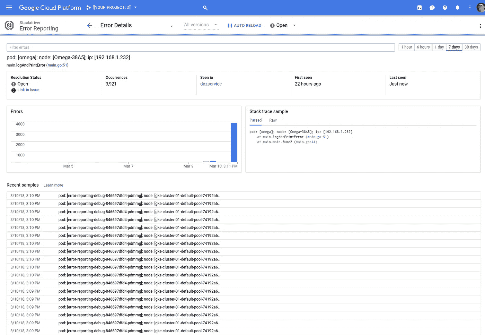

# 堆栈驱动程序错误报告:第 2 部分

> 原文：<https://medium.com/google-cloud/stackdriver-error-reporting-part-2-826f40e00886?source=collection_archive---------0----------------------->

## 带 Golang 和 Kubernetes 发动机的进一步探险

** **更新 19–04–02**—这篇文章已经过时，一些关键部分不再正常工作。请查看谷歌的文档([链接](https://cloud.google.com/debugger/docs/setup/go))以获得明确的指导。为了理解如何将 Stackdriver 错误报告与 Kubernetes 引擎一起使用，这篇文章仍然会有所帮助。我将鼓励我的同行扩充 Google 文档，以更全面地解释 Kubernetes 引擎场景。

*** *更新 18–03–12**—我认为使用 Golang 的 Stackdriver 调试器只适用于使用 Go 版本≤1.9.x 构建的代码。我已经将我的大多数机器升级到 1.10.y，但这似乎不起作用。但是，使用 Go 1.9.4 创建二进制文件是可行的，并且我能够设置和捕获调试器快照。

我[写过](/@DazWilkin/stackdriver-error-reporting-8e86be630533)关于在 Golang 和 Kubernetes 中使用 [Stackdriver 错误报告](https://cloud.google.com/error-reporting/)。我仍然无法让 [Stackdriver 调试器](https://cloud.google.com/debugger/)处理结果。我将在这里写下我的尝试，然后当我的同事帮我找到解决方案时，我会更新这篇文章。

在这篇文章中，我添加了 Google [云资源仓库](https://cloud.google.com/source-repositories/)和[容器构建器](https://cloud.google.com/container-builder/)来自动化:

*   创建服务帐户|密钥和 Kubernetes 秘密
*   构建 Golang、Docker 映像并部署到 Kubernetes

## 启用 GCP 服务

除了云资源仓库、容器构建器和 Kubernetes 引擎之外，我们还需要 [Google IAM](https://cloud.google.com/iam/) 来提供服务帐户及其密钥，以及 Google [云资源管理器](https://cloud.google.com/resource-manager/)来更改项目的策略(主要是增强云构建器自己的服务帐户，以便它可以创建其他服务帐户并部署到 Kubernetes 引擎)。

让我们来启用服务:

```
for SERVICE in \
  cloudbuild \
  cloudresourcemanager \
  container \
  iam \
  sourcerepo
do
  gcloud services enable ${SERVICE}.googleapis.com \
  --async \
  --project=${PROJECT}
done
```

> 如果你更喜欢同步运行它们以确保你知道它们什么时候被启用，那么放下`--async`。

## 集装箱建造商和 Kubernetes 发动机区域集群

用于`kubectl` ( [链接](https://github.com/GoogleCloudPlatform/cloud-builders/tree/master/kubectl))的容器生成器无法管理[区域集群](https://cloud.google.com/kubernetes-engine/docs/concepts/multi-zone-and-regional-clusters#regional)。但是，如果您遵循本期 GitHub 的说明([链接](https://github.com/GoogleCloudPlatform/cloud-builders/issues/176))，您将能够创建一个支持区域集群的定制`kubectl`构建器。

> **注意**在下面的文档中，我假设您已经完成了这一步，并且正在使用 Kubernetes 引擎区域集群。

## 容器构建服务帐户、密钥和机密

您可能认为这一部分是题外话，但是我决定自动创建一个服务帐户、一个相关的密钥和一个代表服务帐户的 Kubernetes 秘密，以便部署到 Kubernetes 引擎的 Pods 可以使用该服务帐户。

因为以下脚本假设容器构建器服务可以创建服务帐户和服务帐户密钥并部署到 Kubernetes 引擎，所以我们必须在运行脚本之前向容器构建器服务帐户添加 IAM 角色来完成此任务:

```
NUM=$(gcloud projects describe ${PROJECT} \
--format='value(projectNumber)')for ROLE in \
  roles/container.developer \
  roles/iam.serviceAccountAdmin \
  roles/iam.serviceAccountKeyAdmin \
  roles/resourcemanager.projectIamAdmin
do
  gcloud projects add-iam-policy-binding ${PROJECT} \
  --member=serviceAccount:${NUM}[@](http://twitter.com/cloudbuild)cloudbuild.gserviceaccount.com \
  --role=${ROLE}
done
```

以下是一个容器构建器脚本:

> **注意**如前所述，我假设您正在对一个区域集群使用`kubectl`。如果没有，您可以删除上面的第 6 步，并将第 7 步的名称修改为`gcr.io/cloud-builders/kubectl`。

您可以使用以下命令从命令行运行该脚本:

```
gcloud container builds submit . \
--config cloudbuild.robot.yaml \
--substitutions=\
_CLUSTER=${CLUSTER},\
_REGION=${REGION},\
_ROBOT=robot-$(date +"%H%M") \
--project=$PROJECT
```

如果一切顺利，这应该会产生一个在默认名称空间中称为`error-reporting-key`的秘密:

```
kubectl get secrets
NAME                  TYPE      DATA      AGE
error-reporting-key   Opaque    1         1h
```

Kubernetes 部署脚本引用了这个秘密；如果您决定重命名`error-reporting-key`，请确保您也在部署脚本中反映了这一变化。

## 容器生成堆栈驱动程序调试器部署

不幸的是，这一步是我的问题开始。虽然能够使用 Go Builder 构建 Golang，但是当部署到 Kubernetes 时，生成的图像会产生错误。

因此，与其包括这些`go build`步骤:

```
steps:
- name: "gcr.io/cloud-builders/go"
  args: [
    "get",
    "cloud.google.com/go/errorreporting",
  ]
  env : [
    "GOPATH=/workspace",
  ]
- name: "gcr.io/cloud-builders/go"
  args: [
    "build",
    "-gcflags=-N",
    "-gcflags=-l",
    "-a",
    "-o","main",
  ]
  env: [
    "GOOS=linux",
    "GOPATH=/workspace",
  ]
```

我很不情愿地在本地构建 Go 文件(`go version go1.10 linux/amd64`)，并假设生成的二进制文件存在于 Cloud Builder 脚本中。所以，假设你也在用 Go 1.10:

```
CGO_ENABLED=0 go build -gcflags='-N -l'
```

其中应该生成`go-errrep`然后，生成[源上下文文件](https://cloud.google.com/debugger/docs/source-context#gke_go):

```
gcloud debug source gen-repo-info-file --output-directory .
```

这将生成`source-context.json`，然后:

这里是`Dockerfile.debugger`:

和`deployment.debugger.yaml`:

> **NB** 你必须在第 19 行和第 27 行用`${PROJECT}`的值替换`[[YOUR-PROJECT-ID]]`。

最后是缩减的`cloudbuild.yaml`:

您可以通过以下方式申请:

```
gcloud container builds submit . \
--config cloudbuild.debugger.yaml \
--substitutions=\
_CLUSTER=${CLUSTER},\
_REGION=${REGION} \
--project=$PROJECT
```

一切都好:

```
kubectl get deployments
NAME                    DESIRED   CURRENT   UP-TO-DATE   AVAILABLE
error-reporting-debug   1         1         1            1
```

并且:



堆栈驱动程序错误报告

但是:


展开单个错误报告

点击进入 Stackdriver Debugger，快照永远不会被触发:


等待戈多

## 整理

```
kubectl delete deployment/error-reporting-debug
kubectl delete secret/error-reporting-key
```

## GCE 虚拟机和错误报告

奇怪的是，该行为似乎与纯 GCE 虚拟机一致(即不起作用):

```
INSTANCE=instance-errrep
gcloud beta compute instances create ${INSTANCE} \
--project=${PROJECT} \
--zone=us-west1-c \
--machine-type=custom-2-8192 \
--scopes=[https://www.googleapis.com/auth/cloud-platform](https://www.googleapis.com/auth/cloud-platform) \
--image=ubuntu-1604-xenial-v20180306 \
--image-project=ubuntu-os-cloud \
--boot-disk-size=50
```

从我们的工作目录中，复制我们需要的内容:

```
for FILE in go-errrep source-context.json ${ROBOT}.key.json
do
  gcloud compute scp \
    ./${FILE} \
    ${INSTANCE}: \
  --project=$PROJECT
done
```

然后:

```
gcloud compute ssh ${INSTANCE} --project=${PROJECT}
```

最后，您需要在 VM 上为`ROBOT`提供一个值，但是剩余的值可以从元数据服务中提取。根据另一篇帖子对 Kubernetes Downward API 的引用，如果我在这个 VM 上的一个容器中运行，那么等值将从元数据服务中提取。

```
METADATA="[http://metadata.google.internal/computeMetadata/v1](http://metadata.google.internal/computeMetadata/v1/project/project-id)"
ROBOT=[[YOUR-ROBOT-NAME]]wget -O go-cloud-debug [https://storage.googleapis.com/cloud-debugger/compute-go/go-cloud-debug](https://storage.googleapis.com/cloud-debugger/compute-go/go-cloud-debug)chmod 0755 go-cloud-debugexport GOOGLE_APPLICATION_CREDENTIALS=./${ROBOT}.key.jsonexport GOOGLE_PROJECT_ID=$(\
  curl \
  --silent \
  --header "Metadata-Flavor: Google" \
  ${METADATA}[/project/project-id](http://metadata.google.internal/computeMetadata/v1/project/project-id))export POD_NAME=ubuntuexport POD_NODE=$(\
  curl \
  --silent \
  --header "Metadata-Flavor: Google" \
  [${METADATA}/instance/name](http://metadata.google.internal/computeMetadata/v1/instance/name))export POD_IP=$(\
  curl \
  --silent \
  --header "Metadata-Flavor: Google" \
  ${METADATA}/instance/network-interfaces/0/ip)./go-cloud-debug \
-sourcecontext=./source-context.json \
-appmodule=go-errrep \
-appversion=1 \
-- ./go-errrep
```

这会产生:

```
pod: [ubuntu]; node: [instance-errrep]; ip: [10.138.0.5]
pod: [ubuntu]; node: [instance-errrep]; ip: [10.138.0.5]
pod: [ubuntu]; node: [instance-errrep]; ip: [10.138.0.5]
pod: [ubuntu]; node: [instance-errrep]; ip: [10.138.0.5]
pod: [ubuntu]; node: [instance-errrep]; ip: [10.138.0.5]
error setting breakpoint at main.go:39: couldn't find file "main.go"
pod: [ubuntu]; node: [instance-errrep]; ip: [10.138.0.5]
error setting breakpoint at main.go:37: couldn't find file "main.go"
```

所以，我显然在某个地方做错了:-(

又试了一次(昨晚晚些时候),成功了:


(今天早上)又试了一次，还是不行:-(

## 哑初始化

将 Yelp 的`dumb-init` ( [链接](https://github.com/Yelp/dumb-init))整合到我的构建中，没有别的原因，只是因为我认为我应该这样做，而且我有一些时间。因为`Scratch`不包括`wget`，所以我将`dumb-init`作为组二进制文件的一部分(现在包括`go-errrep`和`go-cloud-debug`)。

因此，按照 Yelp 的指示，但调整到存储在当前目录:

```
wget --output-document ./dumb-init [https://github.com/Yelp/dumb-init/releases/download/v1.2.1/dumb-init_1.2.1_amd64](https://github.com/Yelp/dumb-init/releases/download/v1.2.1/dumb-init_1.2.1_amd64)
chmod +x ./dumb-init
```

然后稍微修改了一下`Dockerfile.debugger`:

其他一切保持不变。当您下一次构建和部署时，映像将包含作为 PID 1 的`dumb-init`。

## 日志

您可以使用 Kubernetes 仪表板、云控制台工作负载或从命令行跟踪容器的日志:

```
POD=$(\
  kubectl get pods \
  --selector=app=error-reporting-debug \
  --output=jsonpath="{.items[0].metadata.name}"\
)
kubectl logs pod/${POD} --follow
```

就是这样！