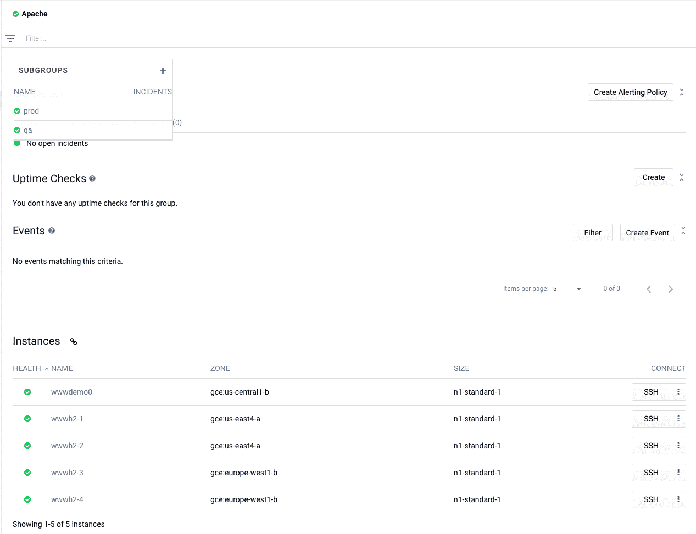

# 堆栈驱动程序监控自动化第 1 部分:堆栈驱动程序组

> 原文：<https://medium.com/google-cloud/stackdriver-monitoring-automation-part-1-stackdriver-groups-8e51f0aa9b03?source=collection_archive---------1----------------------->

许多开发人员和组织认识到自动化对于云基础设施和应用的长期管理至关重要。刚刚开始使用 Stackdriver Monitoring 的开发人员、站点可靠性工程师和运营团队可能想知道哪些组件可以用于自动化。我最近经历了为组织内创建的每个新项目自动创建 Stackdriver 监控组件的练习。

在这个系列中，我已经包括了我所采取的步骤和我用来创建自动化的方法。您可以使用这些步骤在您的环境中自动部署 Stackdriver 监控资源。这篇文章涉及堆栈驱动组，而第二部分和第三部分[分别涉及警报策略和正常运行时间检查。](/google-cloud/stackdriver-monitoring-automation-part-3-uptime-checks-476b8507f59c)

# 堆栈驱动程序监控中有哪些自动化功能？

以下组件可通过 API 获得，因此可用于自动化。

*   堆栈驱动程序组
*   警报策略
*   正常运行时间检查

Stackdriver 监控 API 可以通过 [REST API](https://cloud.google.com/monitoring/api/ref_v3/rest/) 和 [gRPC](https://cloud.google.com/monitoring/api/ref_v3/rpc/) 获得。相同的 REST APIs 可以用在[Google Cloud Deployment Manager](https://cloud.google.com/deployment-manager/docs/)甚至是 [gcloud](https://cloud.google.com/sdk/gcloud/) 命令行中。使用 Deployment Manager 可以轻松地将配置视为代码，并进一步自动化 Stackdriver 监控组件的管理。我使用部署管理器来实现自动化。

# 1.先决条件

首先，我设置了一个 Stackdriver 工作区和至少一个与该工作区相关联的 GCP 项目。在 2018 年 9 月 12 日之前，工作区以前称为 Stackdriver 帐户。更多详情见这篇[博文](https://cloud.google.com/blog/products/management-tools/using-stackdriver-workspaces-help-manage-your-hybrid-and-multicloud-environment)。

我使用了一个 GCP 环境，其中已经使用了许多不同的组件，包括云存储、BigQuery、计算引擎、Kubernetes 引擎、云函数和云 ML 引擎。使用一个有许多组件在使用的环境使我更容易监控组件。

# **2。堆栈驱动程序组**

[Stackdriver Groups](https://cloud.google.com/monitoring/groups/) 允许您在 Stackdriver Monitoring 中定义和监控资源的逻辑组。这些包括资源，如虚拟机实例和容器。然后，可以使用组作为单个实体来监控一组资源。组还可以包括子组，这些子组可用于在逻辑上构建组层次结构。

例如，我创建了一个组来监视与运行在 GCE 上的一组 apache 实例相关的所有资源。当我部署 GCE 资源时，我向每个 GCE 实例添加了标记 app:website，env:prod。您可以在下面看到贴在实例上的标签。

```
$ gcloud compute instances describe wwwhttp11 --zone us-west1-bcanIpForward: false
cpuPlatform: Intel Broadwell
creationTimestamp: '2018-09-24T13:16:33.497-07:00'
deletionProtection: false
...
id: '1488468442473625840'
kind: compute#instance
labelFingerprint: FrEu9_zPopQ=
**labels:
  app: website
  env: prod**
```

然后，当我创建 Stackdriver 组时，我可以过滤标签，以包括组中的那些特定资源。这也突出了群体的动态能力。我也可以使用名称或资源类型进行过滤。我还根据 env 标签将这些组分成子组，这允许我按照环境隔离 apache 实例。

[projects . groups . create](https://cloud.google.com/monitoring/api/ref_v3/rest/v3/projects.groups/create)API 列出了创建组所需的以下值。

```
{
 “name”: string,
 “displayName”: string,
 “parentName”: string,
 “filter”: string,
 “isCluster”: boolean
}
```

我使用了[项目.组.创建](https://cloud.google.com/monitoring/api/ref_v3/rest/v3/projects.groups/create)文档中的“尝试这个 API”侧栏来测试这个 API，确保我有正确的值。这是在将配置值添加到部署管理器或通过代码添加之前检查配置值的一种简单方法。

我使用以下值来测试创建一个简单的组:

```
{
  "displayName": “Apache test”,
  "parentName": “”,
  "filter":”metadata.user_labels.app=has_substring(\"website\")”,
  "isCluster": false
}
```

“尝试这个 API”过程很适合测试 API，尽管我想创建一个我可以自动化的可重复的过程。这就是部署管理器的用武之地。我创建了部署管理器配置文件来为 projects.groups.create API 提供值。我将模板分为 jinja 模板和 yaml 文件，这样我就可以为任何其他组重用 jinja 模板。

**stackdriver_groups.jinja**

```
resources:
- name:  {{ env["name"] }}
  type: gcp-types/monitoring-v3:projects.groups 
  properties:
    name: "projects/{{ env["project"] }}"
    displayName: {{ properties["group_display_name"] }}
    parentName: "{{ properties["group_parent_name"] }}" 
    filter: {{ properties["group_filter"] }}
    isCluster: {{ properties["group_is_cluster"] }}
```

注意，我在 yaml 文件中创建了 3 个独立的组:Apache、prod 和 qa。基于 app=website 标签，所有 apache 实例都包含在 Apache 组中。只有标有 env=qa 和 env=prod 的实例分别包含在 qa 和 prod 组中。qa 和 prod 组将 Apache 指定为父组，这告诉 Stackdriver Monitoring 这些是子组。

**stackdriver_groups.yaml**

```
imports: 
- path: stackdriver_groups.jinja
resources:
- name: create-apache-group
  type: stackdriver_groups.jinja 
  properties:
    group_display_name: "Apache"
    group_parent_name: ""
    group_filter: "metadata.user_labels.app=has_substring(\"website\")"
    group_is_cluster: false
- name: create-apache-prod-group
  type: stackdriver_groups.jinja
  properties:
    group_display_name: "prod"
    group_parent_name: $(ref.create-apache-group.name)
    group_filter: "metadata.user_labels.env=\"prod\""
    group_is_cluster: false
    metadata:
      dependsOn:
        create-apache-group
- name: create-apache-qa-group
  type: stackdriver_groups.jinja
  properties:
    group_display_name: "qa"
    group_parent_name: $(ref.create-apache-group.name)
    group_filter: "metadata.user_labels.env=\"qa\""
    group_is_cluster: false
    metadata:
      dependsOn:
        create-apache-group
```

你可以在 [github repo](https://github.com/charlesbaer/stackdriver-automation) 上找到 jinja 和 yaml 文件。

最后一步是使用下面的 gcloud 命令行，通过部署管理器实际创建 Stackdriver 组。我首先使用了`--preview`命令行参数来确保部署配置正确。

```
$ gcloud deployment-manager deployments create apachegroup --config stackdriver_groups.yaml --previewThe fingerprint of the deployment is nm2-shmY2Oj2tDQfCc4__g==
Waiting for create [operation-1538010937030-576d0138ff573-f3a4b3a2-a3ed8f5c]...done.
Create operation operation-1538010937030-576d0138ff573-f3a4b3a2-a3ed8f5c completed successfully.
NAME                      TYPE                                     STATE       ERRORS  INTENT
create-apache-group       gcp-types/monitoring-v3:projects.groups  IN_PREVIEW  []      CREATE_OR_ACQUIRE
create-apache-prod-group  gcp-types/monitoring-v3:projects.groups  IN_PREVIEW  []      CREATE_OR_ACQUIRE
create-apache-qa-group    gcp-types/monitoring-v3:projects.groups  IN_PREVIEW  []      CREATE_OR_ACQUIRE
```

配置没有产生任何错误，所以我提交了创建部署的命令。

```
$ gcloud deployment-manager deployments create apachegroup --config stackdriver_groups.yamlCreate operation operation-1537807543251-576a0b8593038-2a7c079e-38f54092 completed successfully.
NAME                      TYPE                                     STATE      ERRORS  INTENT
create-apache-group       gcp-types/monitoring-v3:projects.groups  COMPLETED  []
create-apache-prod-group  gcp-types/monitoring-v3:projects.groups  COMPLETED  []
create-apache-qa-group    gcp-types/monitoring-v3:projects.groups  COMPLETED  []
```

一旦创建了组，我就使用 Stackdriver 监控控制台来验证 Apache、qa 和 prod 组是否已经成功创建。请注意，prod 和 qa 子组出现在 Apache 组下。



本系列的第 1 部分到此结束。在本系列的其他文章和下面的参考资料中阅读更多关于 Stackdriver 监控自动化的内容。

*   [堆栈驱动自动化第 2 部分:堆栈驱动警报策略](/@charles.baer/stackdriver-automation-part-2-alerting-policies-9f42068603c4)
*   [堆栈驱动自动化第 3 部分:堆栈驱动正常运行时间检查](/@charles.baer/stackdriver-automation-part-3-uptime-checks-476b8507f59c)

参考资料:

*   [堆栈驱动监控文件](https://cloud.google.com/monitoring/docs/)
*   [栈驱动监控 API 文档](https://cloud.google.com/monitoring/api/ref_v3/rest/)
*   [堆栈驱动监控过滤器](https://cloud.google.com/monitoring/api/v3/filters)
*   [堆栈驱动程序监控指标](https://cloud.google.com/monitoring/api/metrics_gcp)
*   [谷歌云部署管理器](https://cloud.google.com/deployment-manager/docs/)
*   [部署管理器示例](https://github.com/GoogleCloudPlatform/deploymentmanager-samples)