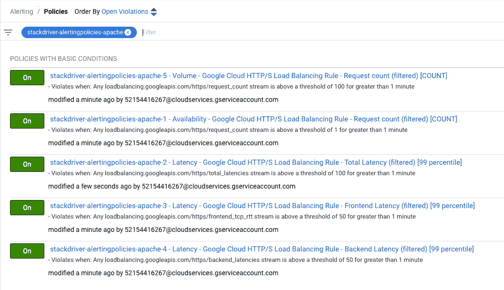
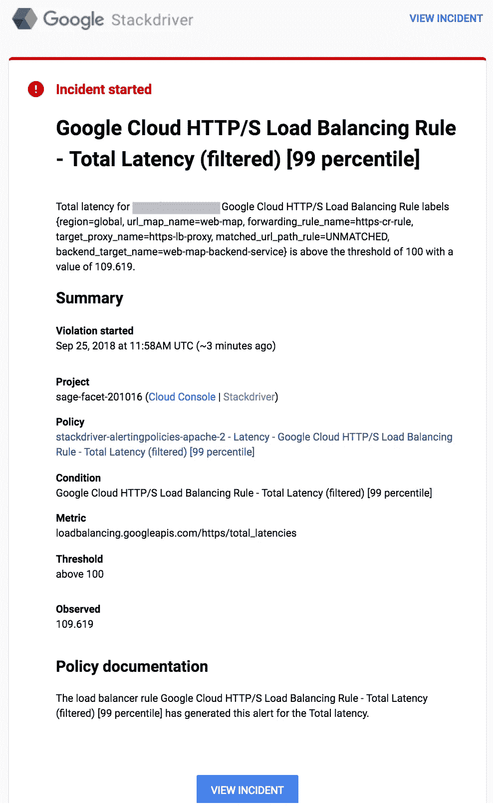
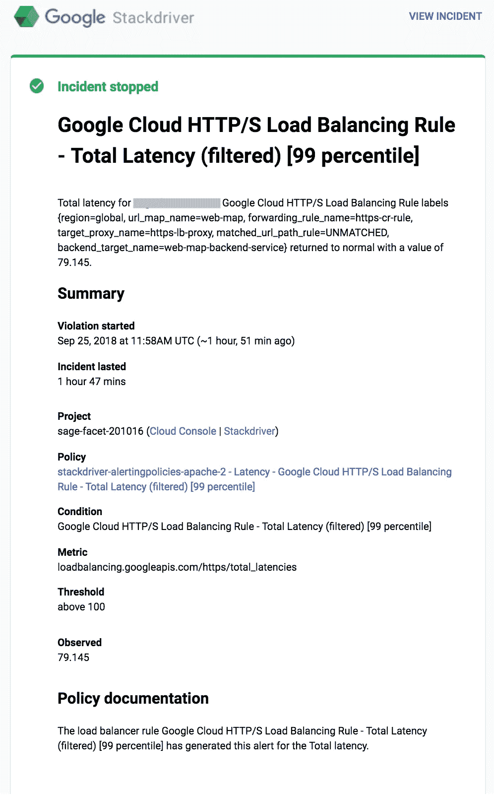

# 堆栈驱动程序监控自动化第 2 部分:警报策略

> 原文：<https://medium.com/google-cloud/stackdriver-monitoring-automation-part-2-alerting-policies-9f42068603c4?source=collection_archive---------0----------------------->

这篇文章是 Stackdriver 自动化系列的第 2 部分。在第 1 部分中，我介绍了 Stackdriver 组的自动化管理。在这篇文章中，我将介绍您可以用来自动管理警报策略的步骤。阅读第 1 部分了解背景知识和先决条件。

# 警报策略

[警报策略](https://cloud.google.com/monitoring/alerts/)允许您定义一组条件，当事件被触发时，这些条件将生成通知。通知可以选择性地包含文档和元数据，以向接收警报的人提供附加信息。警报策略可以是独立的，也可以附加到堆栈驱动程序组。

有几种不同的通知渠道，包括电子邮件和短信通知，以及与第三方的集成，如 PagerDuty、HipChat 和 Slack。或者，每当生成通知时，您可以使用 webhook 调用您定义的服务。[警报条件](https://cloud.google.com/monitoring/alerts/concepts-indepth#condition-types)的类型与监控过滤器一起提供了丰富的选项来定制您的通知。

例如，我基于我在第 1 部分中描述的 apache 基础设施创建了警报。该应用程序本身是一个简单的网站，由负载平衡器后面的 apache 服务器托管。选择 rational alerting 需要考虑应用程序的用户和应用程序架构。我求助于[站点可靠性工程](https://landing.google.com/sre/interview/ben-treynor.html) (SRE)方法来选择用于报警的指标。

SRE 有一个服务水平指标(SLIs)的概念，作为一种方法来跟踪你的应用程序的性能指标，通过用户影响来衡量。好的 SLIs 应该让你很容易知道什么时候你的应用程序的性能让你的用户感到沮丧，什么时候你的用户使用应用程序的体验很好。主要的 SLI 类别是延迟、可用性、数量和质量。本文使用这些 sli 来驱动警报。对于生产应用程序，sli 的选择应该更加严格。这毕竟是一个演示应用程序！

# SLI 预警指标

我选择的主要堆栈驱动程序警报条件、通知和文档如下:

**条件**

*可用性&质量:*

*   L7 负载平衡器错误请求计数= 0/秒

*等待时间:*

*   L7 负载平衡器总延迟> 100 毫秒
*   L7 负载平衡器前端 RTT 延迟> 50 毫秒
*   L7 负载平衡器后端 RTT 延迟> 50 毫秒

*为音量:*

*   L7 负载平衡器请求计数> 100/秒

**通知渠道**

*   邮箱:【website-oncall@example.com 
*   电子邮件:support-website@example.com

**文档**

*   描述每个警报策略的特定文本

既然已经确定了要监控的具体指标和通知方法，我需要将这些规则转换成 Stackdriver AlertingPolicies API 接受的格式。

[projects . alert policies . create](https://cloud.google.com/monitoring/api/ref_v3/rest/v3/projects.alertPolicies/create)API 列出了创建警报策略所需的以下值。

```
{
  "name": string,
  "displayName": string,
  "documentation": {
    object(Documentation)
  },
  "userLabels": {
    string: string,
    ...
  },
  "conditions": [
    {
      object(Condition)
    }
  ],
  "combiner": enum(ConditionCombinerType),
  "enabled": boolean,
  "notificationChannels": [
    string
  ],
  "creationRecord": {
    object(MutationRecord)
  },
  "mutationRecord": {
    object(MutationRecord)
  }
}
```

警报策略非常灵活，能够过滤、分组、聚合，然后测量指标随时间的变化。我尝试在 UI 中创建警报策略，然后使用[projects . alert policies . create](https://cloud.google.com/monitoring/api/ref_v3/rest/v3/projects.alertPolicies/create)文档中的“Try this API”侧栏来查看结果配置。这种方法以及 Stackdriver 监控文档有助于将我选择的 5 种警报条件转化为 5 种警报策略。我将模板分为 jinja 模板和 yaml 文件，这样我就可以将 jinja 模板重新用于任何其他警报策略。

**stack driver _ alerting policies . jinja**

```




resources:

- name: {{ PREFIX }}-email-{{ loop.index }}
  type: gcp-types/monitoring-v3:projects.notificationChannels
  properties:
    name: projects/{{ PROJECT }}
    type: email
    displayName: {{ email.displayName }}
    labels:
      email_address: {{ email.emailAddress }}
    enabled: true

- name: {{ PREFIX }}-alertingpolicy-{{ loop.index }}
  type: gcp-types/monitoring-v3:projects.alertPolicies
  properties:
    displayName: {{ PREFIX }}-{{ policy.name }}
    documentation:
      content: {{ policy.documentation.content }}
      mimeType:  {{ DEFAULT_MIME_TYPE }}
    combiner: OR
    conditions:

    - displayName: {{ condition.displayName }}
      conditionThreshold:
        filter: {{ condition.filter }}
        comparison: {{condition.comparison }}
        duration: {{ condition.duration }}
        thresholdValue: {{ condition.thresholdValue }}
        trigger: {{ condition.trigger }}
        aggregations: {{ condition.aggregations }}
        
    notificationChannels:

    - $(ref.{{ PREFIX }}-email-{{ loop.index }}.name)

    enabled: true

```

注意，我用多个通知通道和策略创建了 yaml。我将电子邮件通知的创建与策略分开，并将相同的电子邮件通知添加到 jinja 模板中的每个策略中。

**stack driver _ alerting policies . YAML**

请注意，为了便于阅读，我在这里只包括了两个警报策略。完整的 yaml 文件见 [github](https://github.com/charlesbaer/stackdriver-automation) repo。

[](https://github.com/charlesbaer/stackdriver-automation) [## Charles Baer/stack driver-自动化

### Stackdriver 监控自动化中后期的配套 github repo。…

github.com](https://github.com/charlesbaer/stackdriver-automation) 

```
imports:
- path: stackdriver_alertingpolicies.jinja
resources:
- name: create_alertingpolicies
  type: stackdriver_alertingpolicies.jinja
  properties:
    notificationEmails:
    - emailAddress: [website-oncall@example.com](mailto:website-oncall@example.com)
      displayName: "Website Oncall" 
    - emailAddress: [support-website@example.com](mailto:support-website@example.com)
      displayName: "Website Support"  
    policies:
    - name: "1 - Availability - Google Cloud HTTP/S Load Balancing Rule - Request count (filtered) [COUNT]"   
      conditions: 
      - filter: "metric.type=\"loadbalancing.googleapis.com/https/request_count\" resource.type=\"https_lb_rule\" metric.label.response_code!=\"200\"" 
        comparison: "COMPARISON_GT"
        duration: "60s" 
        thresholdValue: 1 
        trigger:
          count: 1
        aggregations:
        - alignmentPeriod: "60s"
          perSeriesAligner: "ALIGN_RATE"
          crossSeriesReducer: "REDUCE_COUNT"
        displayName: "Google Cloud HTTP/S Load Balancing Rule - Request count (filtered) [COUNT]"
      documentation:
        content: "The load balancer rule ${condition.display_name} has generated this alert for the ${metric.display_name}."
    - name: "2 - Latency - Google Cloud HTTP/S Load Balancing Rule - Total Latency (filtered) [99 percentile]"   
      conditions: 
      - filter: "metric.type=\"loadbalancing.googleapis.com/https/total_latencies\" resource.type=\"https_lb_rule\" resource.label.url_map_name=\"web-map\"" 
        comparison: "COMPARISON_GT"
        duration: "60s" 
        thresholdValue: 100 
        trigger:
          count: 1
        aggregations:
        - alignmentPeriod: "60s"
          perSeriesAligner: "ALIGN_PERCENTILE_99"
        displayName: "Google Cloud HTTP/S Load Balancing Rule - Total Latency (filtered) [99 percentile]"
      documentation:
        content: "The load balancer rule ${condition.display_name} has generated this alert for the ${metric.display_name}."
```

你可以在 [github repo](https://github.com/charlesbaer/stackdriver-automation) 上找到 jinja 和 yaml 文件。

最后一步是使用下面的 gcloud 命令行来实际创建 Stackdriver 警报策略。

```
$ gcloud deployment-manager deployments create stackdriver-alertingpolicies-apache --config stackdriver_alertingpolicies.yamlCreate operation operation-1537809007185-576a10f9b0c68-751256f4-45889de0 completed successfully.
NAME                                                  TYPE                                                   STATE      ERRORS  INTENT
stackdriver-alertingpolicies-apache-alertingpolicy-1  gcp-types/monitoring-v3:projects.alertPolicies         COMPLETED  []
stackdriver-alertingpolicies-apache-alertingpolicy-2  gcp-types/monitoring-v3:projects.alertPolicies         COMPLETED  []
stackdriver-alertingpolicies-apache-alertingpolicy-3  gcp-types/monitoring-v3:projects.alertPolicies         COMPLETED  []
stackdriver-alertingpolicies-apache-alertingpolicy-4  gcp-types/monitoring-v3:projects.alertPolicies         COMPLETED  []
stackdriver-alertingpolicies-apache-alertingpolicy-5  gcp-types/monitoring-v3:projects.alertPolicies         COMPLETED  []
stackdriver-alertingpolicies-apache-email-1           gcp-types/monitoring-v3:projects.notificationChannels  COMPLETED  []
stackdriver-alertingpolicies-apache-email-2           gcp-types/monitoring-v3:projects.notificationChannels  COMPLETED  []
```

创建警报策略后，我使用 Stackdriver 监控控制台来验证警报策略是否已成功创建。



# 测试警报

我有意将度量值设置得较低，以便于测试警报。在本例中，为警报选择低延迟值会生成警报，您可以使用这些警报来验证警报是否成功到达以及是否包含您想要的详细信息。这是我收到的一个警报示例。



只要导致警报的条件得到解决，警报就会自动得到解决。下面是电子邮件提醒解决方案的示例。



本系列的第 2 部分到此结束。在本系列的其他文章和下面的参考资料中阅读更多关于 Stackdriver 监控自动化的内容。

*   [Stackdriver 自动化第 1 部分:Stackdriver 组](/google-cloud/stackdriver-automation-part-1-stackdriver-groups-8e51f0aa9b03)
*   [堆栈驱动自动化第 3 部分:堆栈驱动正常运行时间检查](/@charles.baer/stackdriver-automation-part-3-uptime-checks-476b8507f59c)

参考资料:

*   [堆栈驱动监控文件](https://cloud.google.com/monitoring/docs/)
*   [栈驱动监控 API 文档](https://cloud.google.com/monitoring/api/ref_v3/rest/)
*   [堆栈驱动监控过滤器](https://cloud.google.com/monitoring/api/v3/filters)
*   [堆栈驱动程序监控指标](https://cloud.google.com/monitoring/api/metrics_gcp)
*   [谷歌云部署管理器](https://cloud.google.com/deployment-manager/docs/)
*   [部署管理器示例](https://github.com/GoogleCloudPlatform/deploymentmanager-samples)