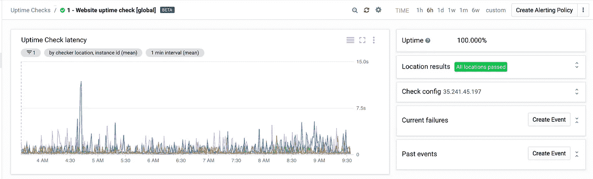

# 堆栈驱动程序监控自动化第 3 部分:正常运行时间检查

> 原文：<https://medium.com/google-cloud/stackdriver-monitoring-automation-part-3-uptime-checks-476b8507f59c?source=collection_archive---------3----------------------->

这篇文章是 Stackdriver 自动化系列的第 3 部分。在[第 1 部分](/google-cloud/stackdriver-automation-part-1-stackdriver-groups-8e51f0aa9b03)和[第 2 部分](/google-cloud/stackdriver-automation-part-2-alerting-policies-9f42068603c4)中，我分别介绍了 Stackdriver 组和警报策略的自动化管理。在这篇文章中，我将详细介绍可以用来自动化运行时间检查管理的步骤。阅读第 1 部分了解背景知识和先决条件。

# 正常运行时间检查

[正常运行时间检查](https://cloud.google.com/monitoring/uptime-checks/)让您通过 HTTP、HTTPS 或 TCP 健康检查来验证服务的可用性。Stackdriver 通过从世界各地访问应用程序的前端并报告结果(如延迟和响应代码)来提供这种服务。您可以使用此服务来了解您的用户是否可以从全球各地访问该服务。

例如，我基于我在第 1 部分和第 2 部分中描述的 apache 基础设施创建了一个正常运行时间检查。该应用程序本身是一个简单的网站，由负载平衡器后面的 apache 服务器托管。我创建了一个简单的 HTTP 正常运行时间检查来了解我的用户是否可以访问服务。

[projects . uptimecheckconfigs . create](https://cloud.google.com/monitoring/api/ref_v3/rest/v3/projects.uptimeCheckConfigs/create)API 列出了创建运行时间检查所需的以下值。

```
{
  "name": string,
  "displayName": string,
  "period": string,
  "timeout": string,
  "contentMatchers": [
    {
      object(ContentMatcher)
    }
  ],
  "selectedRegions": [
    enum(UptimeCheckRegion)
  ],
  "isInternal": boolean,
  "internalCheckers": [
    {
      object(InternalChecker)
    }
  ],// Union field resource can be only one of the following:
  "monitoredResource": {
    object(MonitoredResource)
  },
  "resourceGroup": {
    object(ResourceGroup)
  }
  // End of list of possible types for union field resource.// Union field check_request_type can be only one of the following:
  "httpCheck": {
    object(HttpCheck)
  },
  "tcpCheck": {
    object(TcpCheck)
  }
  // End of list of possible types for union field check_request_type.
}
```

我使用了[projects . uptimecheckconfigs . create](https://cloud.google.com/monitoring/api/ref_v3/rest/v3/projects.uptimeCheckConfigs/create)文档中的“Try this API”侧栏来测试这些值。我将模板分成了 jinja 模板和 yaml 文件，这样我就可以重用 jinja 模板进行任何其他的正常运行时间检查。

**stack driver _ uptimecheckconfigs . jinja**

```


resources:

- name: {{ PREFIX }}-uptimecheck-{{ loop.index }}
  type: gcp-types/monitoring-v3:monitoring.projects.uptimeCheckConfigs.create
  properties:
    parent: projects/{{ PROJECT }}
    displayName: {{ uptimecheck.name }}
    period: {{ uptimecheck.period }}
    timeout: {{ uptimecheck.timeout }}
    monitoredResource: {{ uptimecheck.monitoredResource }}
    httpCheck: {{ uptimecheck.httpCheck }}

```

注意，我创建的 yaml 能够在 Uptime Checks 块下创建多个正常运行时间检查。我针对我的负载平衡器的 URL 创建了一个标准的 httpCheck，它在 API 中表示为 monitoredResource 对象。

**stack driver _ uptimecheckconfigs . YAML**

请将您的项目标识值与您的 GCP 项目标识值以及您的主机 URL 值一起输入

```
imports:
- path: stackdriver_uptimecheckconfigs.jinja
resources:
- name: create_uptimechecks
  type: stackdriver_uptimecheckconfigs.jinja
  properties:
    uptimechecks:
    - name: "1 - Website uptime check [global]"
      period: "60s"
      timeout: "10s"
      monitoredResource:
        type: "uptime_url"
        labels:
          project_id: YOUR_PROJECT_ID
          host: "35.241.47.194"
      httpCheck:
        path: "/"
        port: 80
```

你可以在 [github repo](https://github.com/charlesbaer/stackdriver-automation) 上找到 jinja 和 yaml 文件。

最后一步是使用下面的 gcloud 命令行来实际创建 Stackdriver 正常运行时间检查。

```
$ gcloud deployment-manager deployments create website-uptimecheck --config stackdriver_uptimecheckconfigs.yaml                                                                                           
Create operation operation-1537814541833-576a2597f1329-1faf3a15-f226e553 completed successfully.
NAME                         TYPE                                                                   STATE      ERRORS  INTENT
website-uptimecheck-uptimecheck-1  gcp-types/monitoring-v3:monitoring.projects.uptimeCheckConfigs.create  COMPLETED  []
```

一旦创建了运行时间检查，我就使用 Stackdriver 监控控制台来验证运行时间检查是否已经成功创建。请记住，当您第一次创建运行时间检查时，根据[文档](https://cloud.google.com/monitoring/uptime-checks/management#before_you_begin)开始报告状态可能需要 25 分钟。



现在，正常运行时间检查处于活动状态，可以与警报策略结合使用，以便在正常运行时间检查失败或延迟超出容许范围时通知您。

# 结论:Stackdriver 监控自动化系列

Stackdriver 监控自动化系列到此结束。在本系列中，我介绍了通过 Google Cloud Deployment Manager 创建 Stackdriver 监控组件的步骤和方法。在第一篇文章中，我创建了一个 Stackdriver 组，用于将要监控的资源作为一个实体进行分组。在第二篇文章中，我创建了 Stackdriver 警报策略来定义何时发送警报以及发送什么警报。在第三篇文章中，我创建了 Stackdriver 正常运行时间检查来提供最终用户体验的基本情况。您可以使用这些步骤和配置文件作为模板，在您的环境中自动部署 Stackdriver 监控资源。

在本系列的其他文章和下面的参考资料中阅读更多关于 Stackdriver 监控自动化的内容。

*   [Stackdriver 自动化第 1 部分:Stackdriver 集团](/google-cloud/stackdriver-automation-part-1-stackdriver-groups-8e51f0aa9b03)
*   [堆栈驱动自动化第 2 部分:堆栈驱动警报策略](/@charles.baer/stackdriver-automation-part-2-alerting-policies-9f42068603c4)

参考资料:

*   [堆栈驱动程序监控文档](https://cloud.google.com/monitoring/docs/)
*   [栈驱动监控 API 文档](https://cloud.google.com/monitoring/api/ref_v3/rest/)
*   [堆栈驱动监控过滤器](https://cloud.google.com/monitoring/api/v3/filters)
*   [堆栈驱动程序监控指标](https://cloud.google.com/monitoring/api/metrics_gcp)
*   [谷歌云部署管理器](https://cloud.google.com/deployment-manager/docs/)
*   [部署管理器示例](https://github.com/GoogleCloudPlatform/deploymentmanager-samples)