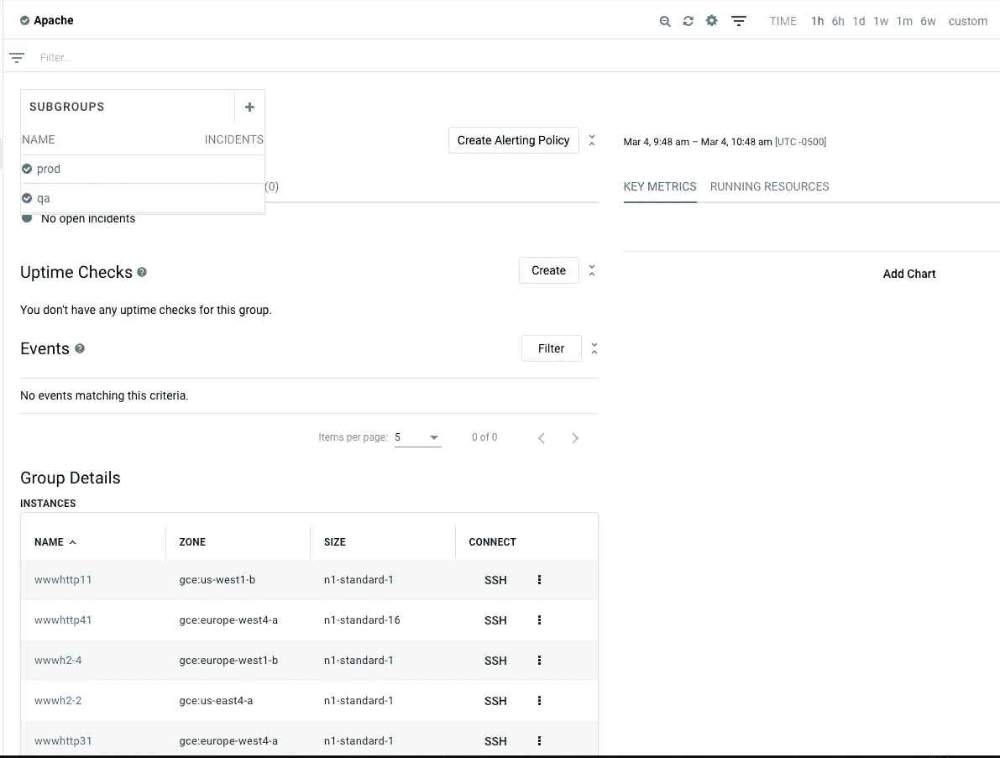

# 堆栈驱动监控自动化第 4 部分:具有地形的堆栈驱动组

> 原文：<https://medium.com/google-cloud/stackdriver-monitoring-automation-part-4-stackdriver-groups-with-terraform-910289d16d08?source=collection_archive---------1----------------------->

在我寻求通过自动化改善生活的过程中，我写了一个关于 Stackdriver 监控自动化的 3 部分系列文章，其中使用了 Google Cloud Deployment Manager 来部署监控资源。我最近坐下来将这种自动化转化为 Terraform，因为 Terraform 中添加了 Stackdriver 监控支持。您可以使用这些步骤，在使用 Terraform 的环境中自动部署 Stackdriver 监控资源。

在之前的系列文章中，我已经包括了最初的[stack driver Monitoring Automation](/google-cloud/stackdriver-monitoring-automation-part-1-stackdriver-groups-8e51f0aa9b03)系列文章中描述的相同 3 个场景的 Terraform 配置，这里不再重复这些场景。这篇文章涉及堆栈驱动组，而[第 5 部分](/google-cloud/stackdriver-monitoring-automation-part-5-alerting-policies-ff77b19b4b97)和[第 6 部分](/google-cloud/stackdriver-monitoring-automation-part-6-uptime-checks-with-terraform-76cb25b996a4)分别涉及警报策略和正常运行时间检查。

# Terraform 中有哪些可用于 Stackdriver 监控的自动化功能？

以下[组件](https://www.terraform.io/docs/providers/google/index.html)可用作 Terraform 数据源，因此可用于自动化。监控范围已经扩展到 4 个主要的 Stackdriver 配置，也可以通过监控 API 获得。

*   堆栈驱动程序组
*   警报策略
*   通知渠道
*   正常运行时间检查

# 设置用于监控的 Terraform

我决定利用 [Cloud Shell](https://cloud.google.com/shell/) 来运行我的 Terraform 脚本，因为 Cloud Shell 提供了一个简单的命令行界面，并自动提供了 Terraform 提供者。

第一步是配置 Google provider，用适合我的 GCP 环境的值替换每个条目。这是 Terraform [文档](https://www.terraform.io/docs/providers/google/provider_reference.html)中描述的格式。

```
provider "google" {
  credentials **=** "${file("account_key.**json**")}"
  project     **=** "abab-cdcd-023991"
  region      **=** "us-central1"
  zone        = "us-central1-c"}
```

我删除了配置中的凭证行，因为 Cloud Shell 默认提供凭证，因此不需要服务帐户密钥文件。部署所需的 IAM 角色已经作为项目所有者授予了我。如果您不是项目所有者，您将需要适当的 IAM 权限。

```
provider "google" {
  project = "abab-cdcd-023991"
  region  = "us-central1"
  zone    = "us-central1-c"
}
```

# 配置文件

我根据 Stackdriver 资源标签创建了 3 个独立的组:Apache、prod 和 qa。基于 app=website 标签，所有 apache 实例都包含在 Apache 组中。只有标有 env=qa 和 env=prod 的实例分别包含在 qa 和 prod 组中。

qa 和 prod 组将 Apache 指定为父组，这告诉 Stackdriver Monitoring 这些是子组。我使用了一个引用来指代每个子组的父名称。

```
provider "google" {
  project = "abab-cdcd-023991"
  region  = "us-central1"
  zone    = "us-central1-c"
}resource "google_monitoring_group" "apache_parent" {
  display_name = "Apache"
  filter = "metadata.user_labels.app=has_substring(\"website\")"
}resource "google_monitoring_group" "apache_prod_subgroup" {
  display_name = "prod"
  filter = "metadata.user_labels.env=\"prod\""
  parent_name =  "${google_monitoring_group.apache_parent.name}"
}resource "google_monitoring_group" "apache_qa_subgroup" {
  display_name = "qa"
  filter = "metadata.user_labels.env=\"qa\""
  parent_name =  "${google_monitoring_group.apache_parent.name}"
}
```

你可以在 [github repo](https://github.com/charlesbaer/stackdriver-automation) 上找到 main.tf 文件。

[](https://github.com/charlesbaer/stackdriver-automation) [## Charles Baer/stack driver-自动化

### Stackdriver 监控自动化中后期的配套 github repo。…

github.com](https://github.com/charlesbaer/stackdriver-automation) 

# 创建组和子组

添加 Stackdriver 组需要两个简单的步骤。首先，初始化 Terraform。

```
$ terraform initInitializing provider plugins...The following providers do not have any version constraints in configuration,
so the latest version was installed.To prevent automatic upgrades to new major versions that may contain breaking
changes, it is recommended to add version = "..." constraints to the
corresponding provider blocks in configuration, with the constraint strings
suggested below.* provider.google: version = "~> 2.1"
Terraform has been successfully initialized!
```

然后，标准的 Terraform apply 完成所有工作。

```
$ terraform apply
google_monitoring_group.apache_parent: Refreshing state... (ID: projects/abab-cdcd-023991/groups/4800045303134799755)
google_monitoring_group.apache_prod_subgroup: Refreshing state... (ID: projects/abab-cdcd-023991/groups/1346673955451905122)
google_monitoring_group.apache_qa_subgroup: Refreshing state... (ID: projects/abab-cdcd-023991/groups/2305611457471642078)An execution plan has been generated and is shown below.
Resource actions are indicated with the following symbols:
  + createTerraform will perform the following actions:+ google_monitoring_group.apache_parent
      id:           <computed>
      display_name: "Apache"
      filter:       "metadata.user_labels.app=has_substring(\"website\")"
      name:         <computed>
      project:      <computed>+ google_monitoring_group.apache_prod_subgroup
      id:           <computed>
      display_name: "prod"
      filter:       "metadata.user_labels.env=\"prod\""
      name:         <computed>
      parent_name:  "${google_monitoring_group.apache_parent.name}"
      project:      <computed>+ google_monitoring_group.apache_qa_subgroup
      id:           <computed>
      display_name: "qa"
      filter:       "metadata.user_labels.env=\"qa\""
      name:         <computed>
      parent_name:  "${google_monitoring_group.apache_parent.name}"
      project:      <computed>Plan: 3 to add, 0 to change, 0 to destroy.Do you want to perform these actions?
  Terraform will perform the actions described above.
  Only 'yes' will be accepted to approve.Enter a value: yesgoogle_monitoring_group.apache_parent: Creating...
  display_name: "" => "Apache"
  filter:       "" => "metadata.user_labels.app=has_substring(\"website\")"
  name:         "" => "<computed>"
  project:      "" => "<computed>"
google_monitoring_group.apache_parent: Creation complete after 1s (ID: projects/abab-cdcd-023991/groups/3905630164280032312)
google_monitoring_group.apache_qa_subgroup: Creating...
  display_name: "" => "qa"
  filter:       "" => "metadata.user_labels.env=\"qa\""
  name:         "" => "<computed>"
  parent_name:  "" => "projects/abab-cdcd-023991/groups/3905630164280032312"
  project:      "" => "<computed>"
google_monitoring_group.apache_prod_subgroup: Creating...
  display_name: "" => "prod"
  filter:       "" => "metadata.user_labels.env=\"prod\""
  name:         "" => "<computed>"
  parent_name:  "" => "projects/abab-cdcd-023991/groups/3905630164280032312"
  project:      "" => "<computed>"
google_monitoring_group.apache_qa_subgroup: Creation complete after 1s (ID: projects/abab-cdcd-023991/groups/7315859232068601075)
google_monitoring_group.apache_prod_subgroup: Creation complete after 2s (ID: projects/abab-cdcd-023991/groups/457136244756364624)
```

一旦创建了组，我就使用 Stackdriver 监控控制台来验证 Apache、qa 和 prod 组是否已经成功创建。请注意，prod 和 qa 子组出现在 Apache 组下。



本系列的第 4 部分到此结束。在本系列的其他文章和下面的参考资料中阅读更多关于使用 Terraform 的 Stackdriver 监控自动化的内容。

*   [堆栈驱动监控自动化第 5 部分:具有地形的堆栈驱动警报策略](/google-cloud/stackdriver-monitoring-automation-part-5-alerting-policies-ff77b19b4b97)
*   [Stackdriver 监控自动化第 6 部分:使用 Terraform 检查 Stackdriver 正常运行时间](/google-cloud/stackdriver-monitoring-automation-part-6-uptime-checks-with-terraform-76cb25b996a4)

参考资料:

*   [堆栈驱动程序监控文档](https://cloud.google.com/monitoring/docs/)
*   [栈驱动监控 API 文档](https://cloud.google.com/monitoring/api/ref_v3/rest/)
*   [堆栈驱动监控过滤器](https://cloud.google.com/monitoring/api/v3/filters)
*   [堆栈驱动程序监控指标](https://cloud.google.com/monitoring/api/metrics_gcp)
*   [谷歌平台提供商](https://www.terraform.io/docs/providers/google/provider_reference.html)