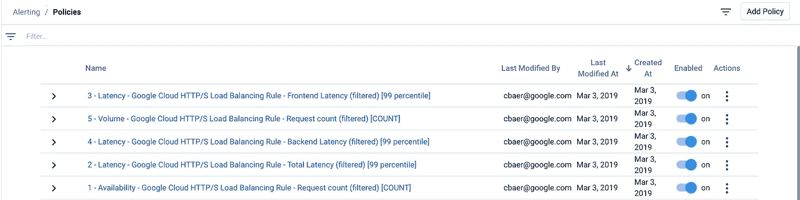

# 堆栈驱动程序监控自动化第 5 部分:警报策略

> 原文：<https://medium.com/google-cloud/stackdriver-monitoring-automation-part-5-alerting-policies-ff77b19b4b97?source=collection_archive---------0----------------------->

这篇文章是 Stackdriver 自动化系列的第 5 部分。在这篇文章中，我将介绍使用 Terraform 自动管理 Stackdriver 监控警报策略的步骤。

# SLI 预警指标

请阅读[第 2 部分](/google-cloud/stackdriver-monitoring-automation-part-2-alerting-policies-9f42068603c4)，了解这些警报策略所实施的警报场景的详细信息。概括地说，我选择的主要堆栈驱动程序警报条件、通知和文档如下:

**条件**

*供货情况&质量:*

*   L7 负载平衡器错误请求计数= 0/秒

*等待时间:*

*   L7 负载平衡器总延迟> 100 毫秒
*   L7 负载平衡器前端 RTT 延迟> 50 毫秒
*   L7 负载平衡器后端 RTT 延迟> 50 毫秒

*对于体积:*

*   L7 负载平衡器请求计数> 100/秒

**通知渠道**

*   电子邮件:[website-oncall@example.com](mailto:apache-website-oncall@example.com)
*   电子邮件:support-website@example.com

**文档**

*   描述每个警报策略的特定文本

# 通知通道配置

上述 5 个警报条件转化为 5 个警报策略和 2 个单独的通知渠道。首先，我创建了通知通道配置。如果您在自己的项目中运行，不要忘记更改项目值。

```
provider "google" {
  project = "abab-cdcd-023991"
  region  = "us-central1"
  zone    = "us-central1-c"
}resource "google_monitoring_notification_channel" "email0" {
  display_name = "Website Oncall"
  type = "email"
  labels = {
    email_address = "[website-oncall@example.com](mailto:website-oncall@example.com)"
  }
}resource "google_monitoring_notification_channel" "email1" {
  display_name = "Website Support"
  type = "email"
  labels = {
    email_address = "[support-website@example.com](mailto:support-website@example.com)"
  }
}output "email0_id" {
  value = "${google_monitoring_notification_channel.email0.name}"
}output "email1_id" {
  value = "${google_monitoring_notification_channel.email1.name}"
}
```

# 创建通知渠道

创建通知通道需要两个简单的步骤。首先，初始化 Terraform。

```
$ terraform initInitializing provider plugins...The following providers do not have any version constraints in configuration,
so the latest version was installed.To prevent automatic upgrades to new major versions that may contain breaking
changes, it is recommended to add version = "..." constraints to the
corresponding provider blocks in configuration, with the constraint strings
suggested below.* provider.google: version = "~> 2.1"Terraform has been successfully initialized!
```

然后，标准的 Terraform apply 完成所有工作。

```
$ terraform applygoogle_monitoring_notification_channel.email1: Refreshing state... (ID: projects/abab-cdcd-023991/notificationChannels/12532464389112270325)
google_monitoring_notification_channel.email0: Refreshing state... (ID: abab-cdcd-023991/notificationChannels/11497409249297891355)An execution plan has been generated and is shown below.
Resource actions are indicated with the following symbols:
  ~ update in-placeTerraform will perform the following actions:~ google_monitoring_notification_channel.email0
      labels.email_address: "[website-oncall@example.com](mailto:website-oncall@example.com)" => "[website-oncall-a@example.com](mailto:website-oncall-a@example.com)"~ google_monitoring_notification_channel.email1
      labels.email_address: "[support-website@example.com](mailto:support-website@example.com)" => "[support-website-a@example.com](mailto:support-website-a@example.com)"Plan: 0 to add, 2 to change, 0 to destroy.Do you want to perform these actions?
  Terraform will perform the actions described above.
  Only 'yes' will be accepted to approve.Enter a value: yesgoogle_monitoring_notification_channel.email1: Modifying... (ID: projects/abab-cdcd-023991/notificationChannels/12532464389112270325)
  labels.email_address: "[support-website@example.com](mailto:support-website@example.com)" => "[support-website-a@example.com](mailto:support-website-a@example.com)"
google_monitoring_notification_channel.email0: Modifying... (ID: projects/abab-cdcd-023991/notificationChannels/11497409249297891355)
  labels.email_address: "[website-oncall@example.com](mailto:website-oncall@example.com)" => "[website-oncall-a@example.com](mailto:website-oncall-a@example.com)"
google_monitoring_notification_channel.email1: Modifications complete after 1s (ID: projects/abab-cdcd-023991/notificationChannels/12532464389112270325)
google_monitoring_notification_channel.email0: Modifications complete after 2s (ID: projects/abab-cdcd-023991/notificationChannels/11497409249297891355)Apply complete! Resources: 0 added, 2 changed, 0 destroyed.Outputs:email0_id = projects/abab-cdcd-023991/notificationChannels/11497409249297891355
email1_id = projects/abab-cdcd-023991/notificationChannels/12532464389112270325
```

# 警报策略配置

我从通知通道(上面的 email0_id 和 email1_id)获取输出，并将它们作为本地变量添加到警报策略配置中。上述 5 种警报条件转化为 5 种警报策略。请注意，为了便于阅读，我在这里只包括了两个警报策略。你可以在 [github repo](https://github.com/charlesbaer/stackdriver-automation) 上找到完整的配置文件。

在标准初始化之后，terraform apply 完成所有工作并创建警报策略。

```
$ terraform applygoogle_monitoring_notification_channel.email0: Refreshing state... (ID: projects/abab-cdcd-023991/notificationChannels/6314605697446264142)
google_monitoring_alert_policy.alert_policy0: Refreshing state... (ID: projects/abab-cdcd-023991/alertPolicies/48947729567500594)
google_monitoring_alert_policy.alert_policy4: Refreshing state... (ID: projects/abab-cdcd-023991/alertPolicies/16071394893024794286)
google_monitoring_alert_policy.alert_policy2: Refreshing state... (ID: projects/abab-cdcd-023991/alertPolicies/5670542644520942633)
google_monitoring_alert_policy.alert_policy3: Refreshing state... (ID: projects/abab-cdcd-023991/alertPolicies/6104269770159121403)
google_monitoring_notification_channel.email1: Refreshing state... (ID: projects/abab-cdcd-023991/notificationChannels/10463049156064412054)
google_monitoring_alert_policy.alert_policy1: Refreshing state... (ID: projects/abab-cdcd-023991/alertPolicies/5985603450478517474)
```

创建警报策略后，我使用 Stackdriver 监控控制台来验证警报策略是否已成功创建。



本系列的第 5 部分到此结束。在本系列的其他文章和下面的参考资料中阅读更多关于使用 Terraform 的 Stackdriver 监控自动化的内容。

*   [堆栈驱动监控自动化第 4 部分:具有地形的堆栈驱动组](/google-cloud/stackdriver-monitoring-automation-part-4-stackdriver-groups-with-terraform-910289d16d08)
*   [Stackdriver 监控自动化第 6 部分:使用 Terraform 检查 Stackdriver 正常运行时间](/google-cloud/stackdriver-monitoring-automation-part-6-uptime-checks-with-terraform-76cb25b996a4)

参考资料:

*   [堆栈驱动监控文件](https://cloud.google.com/monitoring/docs/)
*   [栈驱动监控 API 文档](https://cloud.google.com/monitoring/api/ref_v3/rest/)
*   [堆栈驱动监控过滤器](https://cloud.google.com/monitoring/api/v3/filters)
*   [堆栈驱动程序监控指标](https://cloud.google.com/monitoring/api/metrics_gcp)
*   [Terraform 谷歌提供商](https://www.terraform.io/docs/providers/google/provider_reference.html)