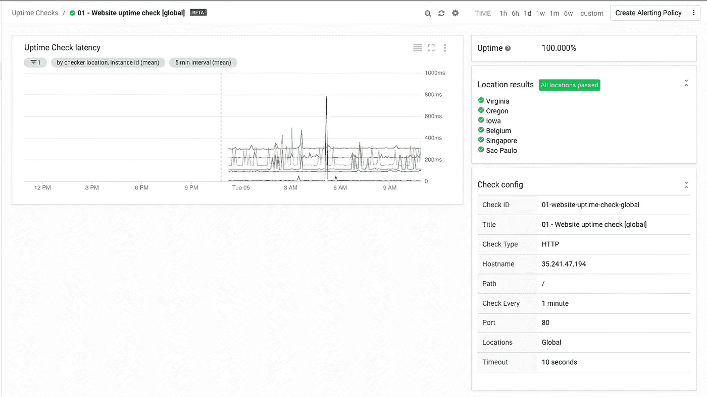

# Stackdriver 监控自动化第 6 部分:使用 Terraform 检查正常运行时间

> 原文：<https://medium.com/google-cloud/stackdriver-monitoring-automation-part-6-uptime-checks-with-terraform-76cb25b996a4?source=collection_archive---------2----------------------->

这篇文章是 Stackdriver 自动化系列的第 6 部分。在这篇文章中，我将详细介绍使用 Terraform 自动管理 Stackdriver 监控正常运行时间检查的步骤。

# 正常运行时间检查

[正常运行时间检查](https://cloud.google.com/monitoring/uptime-checks/)允许您通过 HTTP、HTTPS 或 TCP 健康检查来验证服务的可用性。Stackdriver 通过从世界各地访问应用程序的前端并报告结果(如延迟和响应代码)来提供这种服务。您可以使用此服务来了解您的用户是否可以从全球各地访问该服务。

# 正常运行时间检查配置

例如，我创建了一个基于 apache 基础设施的正常运行时间检查，我在本系列的第 1 部分和第 2 部分中对此进行了描述。该应用程序本身是一个简单的网站，由负载平衡器后面的 apache 服务器托管。我创建了一个简单的 HTTP 正常运行时间检查来了解我的用户是否可以访问服务。

```
provider "google" {
  project = "abab-cdcd-023991"
  region  = "us-central1"
  zone    = "us-central1-c"
}resource "google_monitoring_uptime_check_config" "http" {
  display_name = "1 - Website uptime check [global]"
  timeout = "10s"
  period = "60s" http_check {
    path = "/"
    port = "80"
  } monitored_resource {
    type = "uptime_url"
    labels = {
      host = "35.241.47.194"
    }
  }}
```

你可以在 [github repo](https://github.com/charlesbaer/stackdriver-automation) 上找到完整的配置文件。

在标准初始化之后，terraform apply 完成所有工作并创建正常运行时间检查。

```
$ terraform applyAn execution plan has been generated and is shown below.
Resource actions are indicated with the following symbols:
  + createTerraform will perform the following actions:+ google_monitoring_uptime_check_config.http
      id:                               <computed>
      display_name:                     "01 - Website uptime check [global]"
      http_check.#:                     "1"
      http_check.0.path:                "/"
      http_check.0.port:                "80"
      monitored_resource.#:             "1"
      monitored_resource.0.labels.%:    "1"
      monitored_resource.0.labels.host: "35.241.47.194"
      monitored_resource.0.type:        "uptime_url"
      name:                             <computed>
      period:                           "60s"
      project:                          <computed>
      timeout:                          "10s"Plan: 1 to add, 0 to change, 0 to destroy.Do you want to perform these actions?
  Terraform will perform the actions described above.
  Only 'yes' will be accepted to approve.Enter a value: yesgoogle_monitoring_uptime_check_config.http: Creating...
  display_name:                     "" => "01 - Website uptime check [global]"
  http_check.#:                     "" => "1"
  http_check.0.path:                "" => "/"
  http_check.0.port:                "" => "80"
  monitored_resource.#:             "" => "1"
  monitored_resource.0.labels.%:    "" => "1"
  monitored_resource.0.labels.host: "" => "35.241.47.194"
  monitored_resource.0.type:        "" => "uptime_url"
  name:                             "" => "<computed>"
  period:                           "" => "60s"
  project:                          "" => "<computed>"
  timeout:                          "" => "10s"
google_monitoring_uptime_check_config.http: Creation complete after 1s (ID: projects/abab-cdcd-023991/uptimeCheckConfigs/01-website-uptime-check-global)Apply complete! Resources: 1 added, 0 changed, 0 destroyed.
```

一旦创建了运行时间检查，我就使用 Stackdriver 监控控制台来验证运行时间检查是否已经成功创建。请记住，当您第一次创建运行时间检查时，根据[文档](https://cloud.google.com/monitoring/uptime-checks/)，可能需要长达 5 分钟的时间来开始报告状态。



现在，正常运行时间检查处于活动状态，可以与警报策略结合使用，以便在正常运行时间检查失败或延迟超出容许范围时通知您。

# 结论:Stackdriver 监控自动化系列

Stackdriver 监控自动化系列到此结束。在本系列中，我介绍了通过 Google Cloud Deployment Manager 和 Terraform 创建 Stackdriver 监控组件的步骤和方法。在文章 1 和 4 中，我创建了一个 Stackdriver 组，用于将要监控的资源作为一个实体进行分组。在文章 2 和 5 中，我创建了 Stackdriver 警报策略来定义何时发送警报以及发送什么警报。在文章 3 和 6 中，我创建了 Stackdriver 正常运行时间检查来提供最终用户体验的基本情况。您可以使用这些步骤和配置文件作为模板，在您的环境中自动部署 Stackdriver 监控资源。

在本系列的其他文章和下面的参考资料中阅读更多关于 Stackdriver 监控自动化的内容。

*   堆栈驱动监控自动化第 1 部分:堆栈驱动组
*   [堆栈驱动监控自动化第 2 部分:堆栈驱动警报策略](/@charles.baer/stackdriver-automation-part-2-alerting-policies-9f42068603c4)
*   [Stackdriver 监控自动化第 3 部分:正常运行时间检查](/google-cloud/stackdriver-monitoring-automation-part-3-uptime-checks-476b8507f59c)
*   [堆栈驱动监控自动化第 4 部分:具有地形的堆栈驱动组](/google-cloud/stackdriver-monitoring-automation-part-4-stackdriver-groups-with-terraform-910289d16d08)
*   [Stackdriver 监控自动化第 5 部分:Terraform 下的 Stackdriver 警报策略](/google-cloud/stackdriver-monitoring-automation-part-5-alerting-policies-ff77b19b4b97)

参考资料:

*   [堆栈驱动监控文件](https://cloud.google.com/monitoring/docs/)
*   [栈驱动监控 API 文档](https://cloud.google.com/monitoring/api/ref_v3/rest/)
*   [堆栈驱动程序监控过滤器](https://cloud.google.com/monitoring/api/v3/filters)
*   [堆栈驱动程序监控指标](https://cloud.google.com/monitoring/api/metrics_gcp)
*   [谷歌平台提供商](https://www.terraform.io/docs/providers/google/provider_reference.html)