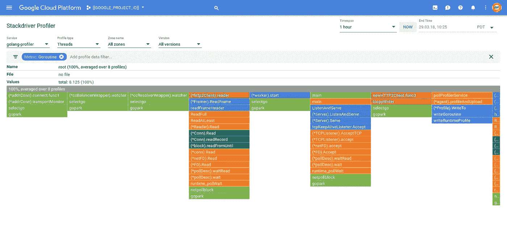
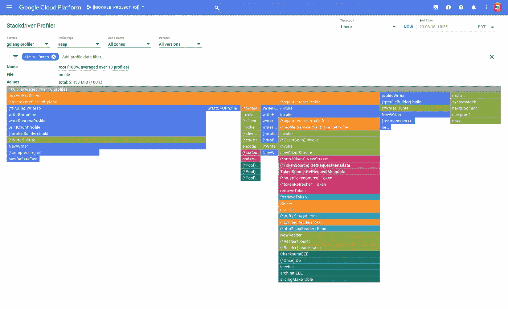
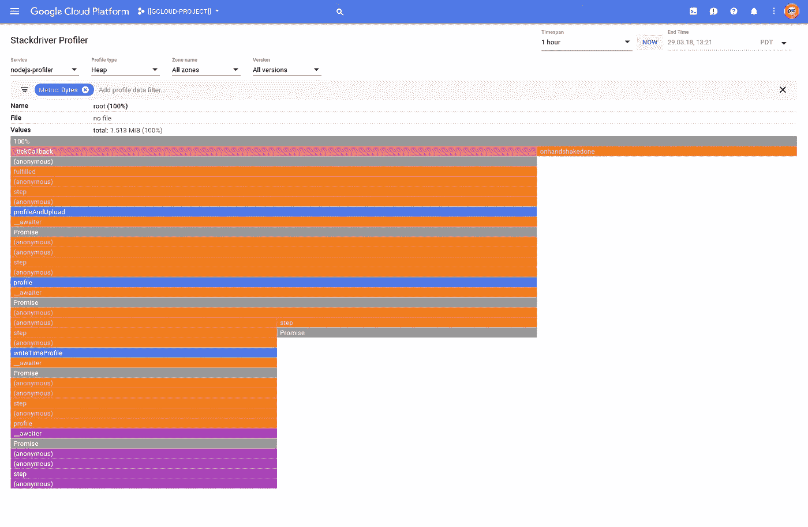
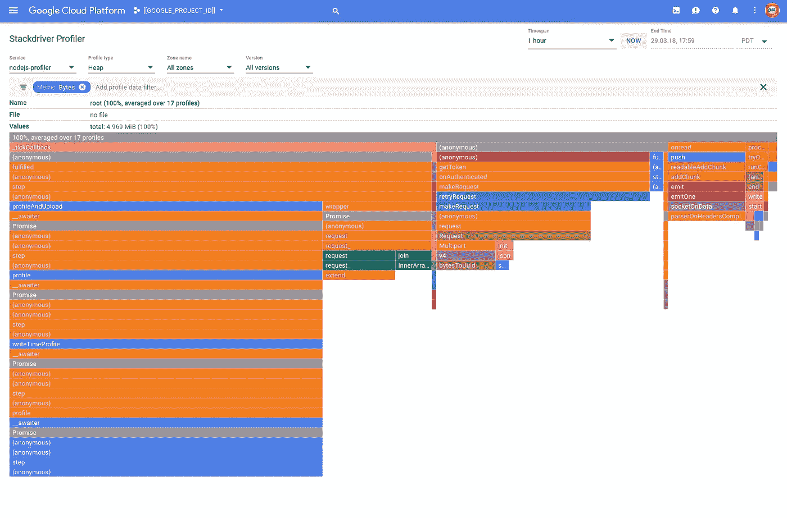

# 堆栈驱动分析器

> 原文：<https://medium.com/google-cloud/stackdriver-profiler-671fb481236d?source=collection_archive---------0----------------------->

最近在我的[公开普查](http://opencensus.io)探险中，我在杂草丛生的地方。所以当 Google 昨天发布 [Stackdriver Profiler](http://cloud.google.com/profiler) 的时候，我碰巧有一个 Kubernetes 引擎集群和一堆代码。

这里有一个关于使用 Golang 和 Node 的 Stackdriver Profiler 的快速链接。JS 代码。我的一位同事建议我也向您推荐[快速入门](https://cloud.google.com/profiler/docs/quickstart)。

## 设置

至少你需要一个谷歌云平台项目来启用 Stackdriver Profiler。

如果您想用容器进行测试，您也需要一个服务帐户，并且它必须额外拥有角色`roles\cloudprofiler.agent`。

如果您想要将容器部署到 Kubernetes 引擎，请确保您有一个集群，并且您已经将服务帐户的密钥作为机密上传到集群。

> **注意**如果您只是将上述角色添加到帐户中，则不需要重新上传密钥。

```
export GOOGLE_PROJECT_ID=[[GOOGLE_PROJECT_ID]]gcloud services enable cloudprofiler.googleapis.com \
--project=${GOOGLE_PROJECT_ID}
```

*创建服务账户:*

```
ROBOT=[[YOUR-ROBOT-NAME]]
EMAIL=${GOOGLE_PROJECT_ID}.iam.gserviceaccount.comgcloud iam service-accounts create ${ROBOT} \
--display-name=${ROBOT} \
--project=${GOOGLE_PROJECT_ID}gcloud iam service-accounts keys create ./${ROBOT}.key.json \
--iam-account=${ROBOT}@${EMAIL} \
--project=${GOOGLE_PROJECT_ID}gcloud projects add-iam-policy-binding ${GOOGLE_PROJECT_ID} \
--member=serviceAccount:${ROBOT}@${EMAIL} \
--role=roles/cloudprofiler.agent
```

*上传服务账号密钥到 Kubernetes:*

```
kubectl create secret generic ${ROBOT}-key \
--from-file=${ROBOT}.key.json=${PWD}/${ROBOT}.key.json
```

## 戈朗

主页面:

> **NB** :不要的话省略属性`DebugLogging: true`。

您应该能够:

```
go get ./...
go run main.go
```

然后点击端点几次:

```
curl http://localhost:8080
```

并且，通过云控制台中的 Stackdriver Profiler 用户界面:

https://console.cloud.google.com/profiler?project=${GOOGLE_PROJECT_ID}



堆栈驱动程序分析器:线程

并且:



堆栈驱动程序分析器:堆

如果您想将应用程序容器化:

Dockerfile:

然后:

```
CGO_ENABLED=0 GOOS=linux go build -a -installsuffix cgo -o main .docker build \
--tag=gcr.io/${GOOGLE_PROJECT_ID}/golang-profiler \
.gcloud docker -- push gcr.io/${GOOGLE_PROJECT_ID}/golang-profilerdocker run \
--env=GOOGLE_PROJECT_ID=${GOOGLE_PROJECT_ID} \
--env=GOOGLE_APPLICATION_CREDENTIALS=/key.json \
--volume=$PWD/${ROBOT}.key.json:/key.json \
--publish=8080:8080 \
gcr.io/${GOOGLE_PROJECT_ID}/golang-profiler
```

并且:

```
curl [http://localhost:8080](http://localhost:8080)
```

您应该会继续看到生成的探查器数据。

如果您想将映像部署到 Kubernetes:

部署. yaml:

> **NB** 你将需要用它们的值替换变量:`${ROBOT}`在第 16+28 行；而`$(GOOGLE_PROJECT_ID}`在 19+30 线。

```
kubectl apply --filename=deployment.yaml
```

为了避免在 Kubernetes 上部署时打开防火墙来访问您的服务，您可以通过任何(我们将使用第一个)节点对服务的节点端口进行端口转发:

```
NODE_HOST=$(\
  kubectl get nodes \
  --output=jsonpath="{.items[0].metadata.name}")
NODE_PORT=$(\
  kubectl get services/golang-profiler \
  --output=jsonpath="{.spec.ports[0].nodePort}")gcloud compute ssh ${NODE_HOST} \
--project=${GOOGLE_PROJECT_ID} \
--ssh-flag="-L ${NODE_PORT}:localhost:${NODE_PORT}"
```

然后:

```
curl http://localhost:${NODE_PORT}
```

当然，您应该会继续看到生成的分析器数据。如果这不起作用，您可以遵循 Pod 的日志:

```
POD=$(\
  kubectl get pods \
  --selector=app=golang-profiler \
  --output=jsonpath="{.items[0].metadata.name}")
kubectl logs pod/${POD} --follow
```

完成后，您可以删除部署:

```
kubectl delete --filename=deployment.yaml
```

## 节点。射流研究…

server.js:

package.json:

如果您在本地安装了节点和 npm，则:

```
npm install
npm start
```

并且:

```
curl http://localhost:8080
```

并且:

https://console.cloud.google/com/profiler?project=${GOOGLE_PROJECT_ID}



堆栈驱动程序分析器:堆

如果您想将应用程序容器化:

Dockerfile:

然后:

```
docker build \
--tag=gcr.io/${GOOGLE_PROJECT_ID}/nodejs-profiler \
.gcloud docker -- push gcr.io/${GOOGLE_PROJECT_ID}/nodejs-profilerdocker run \
--env=GOOGLE_PROJECT_ID=${GOOGLE_PROJECT_ID} \
--env=GOOGLE_APPLICATION_CREDENTIALS=/key.json \
--volume=$PWD/${ROBOT}.key.json:/key.json \
--publish=8080:8080 \
gcr.io/${GOOGLE_PROJECT_ID}/nodejs-profiler
```

并且:

```
curl http://localhost:8080
```

不起作用:-(

我已经向工程部门提交了一份报告。

```
Server on :8080
WARN:[@google](http://twitter.com/google)-cloud/profiler: Failed to create profile, waiting 199ms to try again: Error: Forbidden
WARN:[@google](http://twitter.com/google)-cloud/profiler: Failed to create profile, waiting 1.2s to try again: Error: Forbidden
WARN:[@google](http://twitter.com/google)-cloud/profiler: Failed to create profile, waiting 1.3s to try again: Error: Forbidden
WARN:[@google](http://twitter.com/google)-cloud/profiler: Failed to create profile, waiting 466ms to try again: Error: Forbidden
WARN:[@google](http://twitter.com/google)-cloud/profiler: Failed to create profile, waiting 2.8s to try again: Error: Forbidden
```

我调整了代码来调用一个不同的 GCP 服务，这是可行的，所以这是关于 containerised Node、版本(`node:carbon`)或其他不太明显的东西使它不可行。

当我从工程部门得到更新时，我会更新这篇文章。

**更新时间:18–03–29 17:48**

一个侧写员证实了文档中有错误。节点。JS 启动功能取`{projectID, serviceContext}`。所以，这里是修正后的 server.js:

> **NB** 第 11–18 行包含正确定位的(并重命名为另一个 bug) `ProjectId`和值。

然后:

```
docker build \
--tag=gcr.io/${GOOGLE_PROJECT_ID}/nodejs-profiler \
.
gcloud docker -- push gcr.io/${GOOGLE_PROJECT_ID}/nodejs-profilerdocker run \
--env=GOOGLE_PROJECT_ID=${GOOGLE_PROJECT_ID} \
--env=GOOGLE_APPLICATION_CREDENTIALS=/key.json \
--volume=$PWD/${ROBOT}.key.json:/key.json \
--publish=8080:8080 \
gcr.io/${GOOGLE_PROJECT_ID}/nodejs-profiler
```

现在，当您运行代码并使用以下命令访问端点时:

```
curl http://localhost:8080
```

您应该会看到类似如下的内容:

```
nodejs-profiler@0.0.1 start /usr/src/app
> node server.js[nodejs-profiler:global] ProjectID: ${GOOGLE_PROJECT_ID}
Server on :8080
[nodejs-profiler:handle] Entered
[nodejs-profiler:handle] Exited
[nodejs-profiler:handle] Entered
[nodejs-profiler:handle] Exited
[nodejs-profiler:handle] Entered
[nodejs-profiler:handle] Exited
[nodejs-profiler:handle] Entered
[nodejs-profiler:handle] Exited
```

并且:



堆栈驱动程序分析器:堆

并且使用以下 deployment.yaml:

您可以使用以下工具部署到 Kubernetes:

```
kubectl apply --filename=deployment.yaml
```

为了避免在 Kubernetes 上部署时打开防火墙来访问您的服务，您可以通过任何(我们将使用第一个)节点对服务的节点端口进行端口转发:

```
NODE_HOST=$(\
  kubectl get nodes \
  --output=jsonpath="{.items[0].metadata.name}")
NODE_PORT=$(\
  kubectl get services/nodejs-profiler \
  --output=jsonpath="{.spec.ports[0].nodePort}")gcloud compute ssh ${NODE_HOST} \
--project=${GOOGLE_PROJECT_ID} \
--ssh-flag="-L ${NODE_PORT}:localhost:${NODE_PORT}"
```

然后:

```
curl [http://localhost:${NODE_PORT}](http://localhost:${NODE_PORT})
```

当然，您应该会继续看到生成的分析器数据。如果这不起作用，您可以遵循 Pod 的日志:

```
POD=$(\
  kubectl get pods \
  --selector=app=nodejs-profiler \
  --output=jsonpath="{.items[0].metadata.name}")
kubectl logs pod/${POD} --follow
```

完成后，您可以删除部署:

```
kubectl delete --filename=deployment.yaml
```

## 结论

Stackdriver Profiler 是对 Stackdriver 服务集的有力补充，它为开发人员提供了另一种在生产时识别应用程序性能问题的工具。

仅此而已！