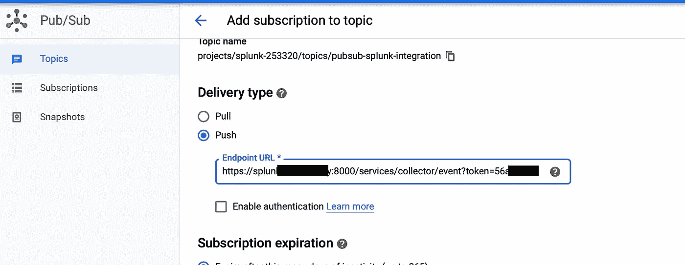

# Stackdriver 推送至 Splunk

> 原文：<https://medium.com/google-cloud/stackdriver-push-to-splunk-f825b3183c40?source=collection_archive---------0----------------------->

在我的职业生涯中(在技术领域)，我与许多客户打过交道，安全性是他们最关心的问题之一。

因此，总有改进的空间，但毫无疑问，通信方向和有状态防火墙是首先要考虑的因素。

说到日志和审计信息，根据经验，最好将日志聚合器存储在云提供商范围之外。一个很好的对数相关性是*。它拥有尖端人工智能驱动的规则引擎所需的所有功能。它允许你拥有*自愈*以及*事件关联*。*

*一方面是系统日志，另一方面是虚拟机管理程序日志。谈到云环境，每个参与者都有自己的定制解决方案。在**谷歌云平台** ( *gcp* )的情况下，游戏的名字是 ***Stackdriver*** 。*

****Stackdriver*** 存储日志并从/向不同平台发送日志。为了实现从 ***gcp*** (具体是从 ***Stackdriver*** )到 ***Splunk*** 的推送通信，发起方必须是 ***Stackdriver*** 。*

****Stackdriver*** 有几种方法可以将日志导出到不同的平台，其中，能够满足在推送的基础上连接到 ***Splunk*** 的所有要求的一种方法是 ***PubSub*** 。*

****PubSub*** 是提供消息队列通信的托管服务。这意味着，每次消息到达时，都会触发一个事件。此类事件将消息排队到 ***Splunk*** 上。*

**

*所需的事件捕获并导出到 ***Splunk****

*按照架构图，我们必须配置 ***PubSub*** 才能到达 ***Splunk*** 服务。*

***披露者:***

*   ****PubSub*** 只向 ***gcp*** 上预先验证的域发送消息。*
*   ****PubSub 的*** 认证机制是预定义的，运行时不能修改。*
*   ****PubSub 的*** url 端点必须使用预定义的第三方证书颁发机构颁发的有效证书来支持 SSL。*

*因此，在 ***Splunk*** (云或其他)中需要进行一些修改，以便我们让这些部分协同工作。*

*首先，我们需要一个可以在 ***gcp*** 中验证的自定义域名。通常你可以使用 ***CloudDNS*** 来完成这个任务。*

*其次，我们需要生成一个方法，通过 url 请求参数来验证 ***Splunk 的******HEC***(记住，我们不能修改 ***PubSub 的*** auth 机制)。*

*最后，我们需要在 ***Splunk*** 上有一个由第三方验证的有效 SSL 终端(对于这一部分，我们建议只使用 ***让我们加密*** ，它是 ***PubSub*** 的一个有效且可信的证书颁发机构)。*

***在 *Splunk* 侧:***

*   *生成一个 SSL 证书(使用 ***让我们加密*** )并将其添加为***【Splunk】***(包括 HEC 请求)的前端。*

**

*将 ***Splunk*** 实例配置为使用加密证书链*

*   *从*[***Splunkbase***](https://splunkbase.splunk.com/app/1922/)*安装 Base64 二进制。***

****

**将下载的 base64 app 上传到 ***Splunk*** 实例。**

*   **配置 HEC，使令牌可以作为 URL 的一部分作为参数传递([允许查询字符串](http://dev.splunk.com/view/event-collector/SP-CAAAE6P#auth))。**

****

**创建一个 HEC，将数据馈送到 ***Splunk*** 实例**

*   **允许基于 SSL 的 HEC。**

****

**通过启用“常规”部分中的所有令牌来允许基于 SSL 的 HEC**

*   **最后，指定 HEC 要使用的 SSL 证书(priv_key 应该包含带有加密私钥的完整链)**

****

**server.conf 使用 SSL 加密证书链**

****在 *gcp* 侧:****

*   **在 ***gcp*** 上验证 ***Splunk*** 域。**

****

*   **使用正确的格式构建一个 ***PubSub*** 主题，其中包含***Splunk******HEC***端点(enpoind 的格式必须为*https://****Splunk _ URL****:8088/services/collector/raw？TOKEN =****TOKEN _ ID***)。**

****

*****PubSub*** 使用推送订阅向 ***Splunk*** 发送消息**

*   **为 ***Stackdriver*** 生成一个 sink，将日志推送到 ***PubSub*** 上。**

****

**创建一个 ***StackDriver*** 日志接收器，并将消息发送到先前创建的 ***PubSub*** 主题**

**一旦每个部分都就位并相互对话，这就是从 ***PubSub*** 发送的消息从 ***Splunk*** 的角度看起来的样子:**

****

**来自 ***PubSub*** 的原始消息**

**或通过 WebUI 的等效功能:**

****

*****Splunk*** 展示通过 ***PubSub*** 接收的消息**

**请注意，默认情况下，该消息由 ***PubSub*** 进行 base64 编码。通过使用以下查询，可以在运行时在 ***Splunk*** 内对消息进行解码。**

```
**message.data="*" | fields message.data,subscription,message.messageId,message.publishTime | rex field=message.data "(?<data>.*)" | base64 field=data mode=append action=decode | table message.messageId, message.publishTime, subscription, base64**
```

**通过***Splunk******WebUI***获得的样本结果的图形表示:**

****

*****Splunk*** 使用 base64 模块对 ***PubSub*** 提供的内容进行解码**

****结论:****

**已经证明，至少有一种方法可以通过 push 将 ***Stackdriver*** 连接到 ***Splunk*** ，而不需要第三方甚至自定义或自制代码的介入。**

**我知道这种方法在大量突发事件发生时缺乏消息确认和流量控制。**

**为了从当前提案中构建解决方案，还有很多改进的空间。**

**我的理解是，无论 Splunk 上的消息推送的官方提议是什么，它都应该以云原生计划的形式出现。无论何时解决方案发布，我都准备好去尝试它。与此同时，这就足够了。**