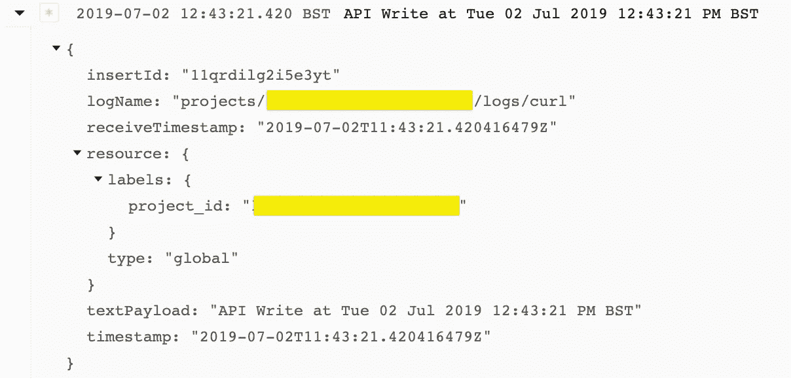
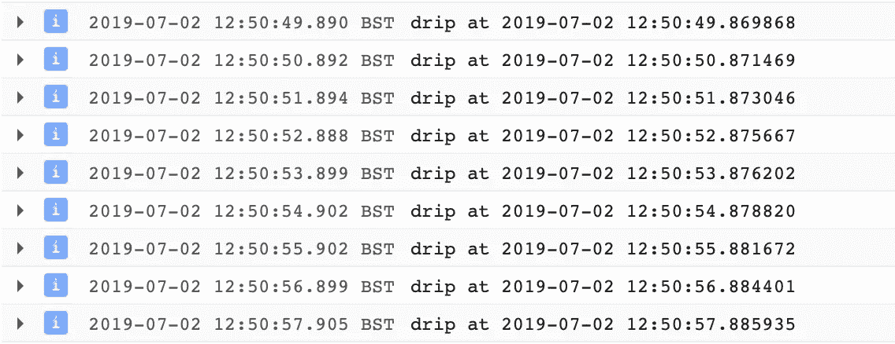
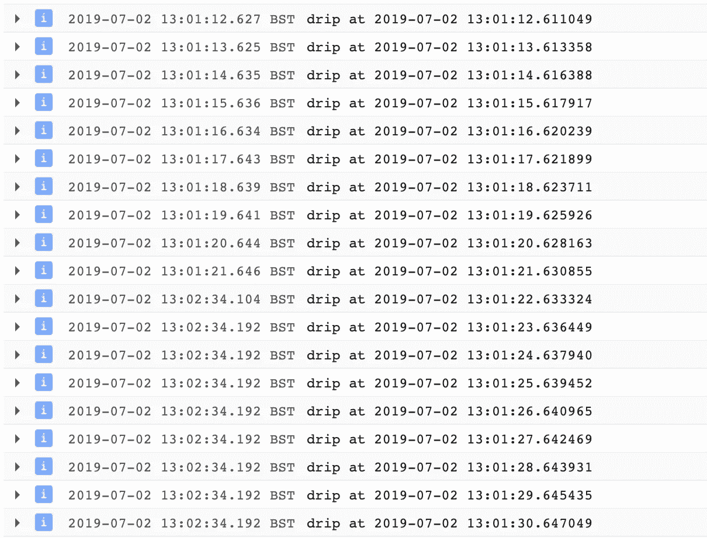

# 堆栈驱动弹性和代理

> 原文：<https://medium.com/google-cloud/stackdriver-resiliency-and-proxies-132602747801?source=collection_archive---------0----------------------->

# 介绍

有时候你不能直接连接到 GCP API，而是需要使用代理。这可能有多种原因。

> 您如何知道您的应用程序——在这种情况下是登录到 stack driver——对您的代理有弹性？你如何测试它？

这篇博客将带您一步一步地使用 nginx 代理设置一个简单的测试，证明您正在使用代理，并展示 Stackdriver Python 客户端库对代理(和网络)的弹性。

# 要求

*   你用的是 Linux
*   您已经安装了 nginx
*   您机器的端口 443 (https)上没有运行任何东西
*   您可以访问/etc/hosts 和 nginx 配置
*   你已经认证了 gcloud，一个项目，并且可以访问 Stackdriver

# 设置代理

## 编辑 nginx 配置

添加下面的配置/etc/nginx/nginx.conf。这将在端口 443 上获取到 nginx(在本地机器上)的所有传入连接，并创建到 googleapis.l.google.com 端口 443 的转发连接(原始 TCP/IP)。

```
stream {
  server {
    listen 443;
    proxy_pass [googleapis.l.google.com:443](http://googleapis.l.google.com:443/);
  }
}
```

请注意，由于它是一个原始转发连接，因此不会干扰 SSL 端到端连接。这只是转发数据，而不是解密和重新加密数据。

## 重启 nginx

*这里假设你使用的是 systemd(现代 Linux)。*

```
service nginx restart
```

## 配置 DNS

编辑/etc/hosts 允许您只为本地机器重新配置 DNS。这仅用于测试目的。添加下面的映射。

```
; temporary
127.0.0.1       logging.googleapis.com
```

这将导致所有到 logging.googleapis.com 和 logging.googleapis.com 的连接被路由到 127.0.0.1。

测试这一点最简单(也是最古老)的方法是使用 telnet，如果您安装了它的话:

```
telnet logging.googleapis.com 443
```

您应该会在顶部看到“正在尝试 127.0.0.1 ”,并且应该会建立连接。这个连接通过 nginx 代理重定向到本地主机，并连接到 googleapis.l.google.com 端口 443。

## 为什么会这样？

这有点棘手。首先，您应该使用 host 来查看 logging.googleapis.com 的真实 DNS:

```
host logging.googleapis.com
```

截至发稿时，结果如下:

```
logging.googleapis.com is an alias for googleapis.l.google.com.
googleapis.l.google.com has address 74.125.140.95
googleapis.l.google.com has address 173.194.76.95
googleapis.l.google.com has address 64.233.167.95
googleapis.l.google.com has IPv6 address 2a00:1450:400c:c00::5f
```

所以 logging.googleapis.com 是 googleapis.l.google.com 的别名。这样我们就可以把东西直接传给 googleapis.l.google.com。

客户端**认为**正在连接到 logging.googleapis.com。它实际上是到本地主机，然后通过代理传输到 Google APIs . l . Google。SSL 加密像正常一样进行，证书被验证，代理没有办法解密通过的数据。

# 测试 it —基础

```
TOKEN=$(gcloud auth print-access-token)
DATE=$(date)
PROJECT=$(gcloud config get-value project)
DATA="
{
  'entries': [
    {
      'logName': 'projects/${PROJECT}/logs/curl',
      'resource': {
         'type': 'global',
         'labels': { 'project_id': '${PROJECT}' } },
      'textPayload': 'API Write at ${DATE}'
    }
  ],
}
"curl -v -X "POST" \
        -H "Content-Type: application/json" \
        --data "${DATA}" \
        -H "Authorization: Bearer ${TOKEN}" \
        -H "Content-Type: application/http" \
           "[https://logging.googleapis.com/v2/entries:write](https://logging.googleapis.com/v2/entries:write)"
```

这将从 gcloud、当前默认项目、当前日期获取您当前的不记名令牌，创建一个 JSON 消息，然后使用 [write 方法](https://cloud.google.com/logging/docs/reference/v2/rest/v2/entries/write)写入日志消息。

## 堆栈驱动程序日志消息

然后您可以进入 Stackdriver 控制台，应该会看到消息出现在默认项目的“Global”过滤器中。可能需要几分钟才能显示出来。



注意 receiveTimestamp 和 textPayload 中的时间戳。这是 Stackdriver(从 REST API)收到消息和生成日志消息之间的延迟。这里是相同的时间(在一秒钟之内)。

# 测试 it —高级

首先，我们从一个小的 Python 脚本开始——使用 google-cloud-logging pip 包——写入 Stackdriver。这要求您使用 gcloud 进行身份验证，或者运行在具有写入 Stackdriver 日志记录范围的 GCE 实例上。

运行该脚本将每秒生成日志消息，日志消息文本包含日志消息生成的时间。这与 Stackdriver 可能收到的消息不同。(虽然通常延迟很短！)

我用 Python 3.6.5 和 1.11.0 运行这个。

## Python 脚本:

```
import time
import logging
import datetime# Imports the Google Cloud client library
import google.cloud.logging# Instantiates a client
client = google.cloud.logging.Client()client.setup_logging()logger = logging.getLogger()
logger.setLevel(logging.INFO)while True:
    time.sleep(1)
    n = str(datetime.datetime.now())
    [logger.info](http://logger.info/)('drip at {}'.format(n))
```

一旦开始运行这个脚本，您就可以返回到 Stackdriver 日志记录，并看到出现的日志消息。

## 日志消息—正常工作的代理:



## 中断代理

但是现在变得有趣了。让我们停止并启动 nginx 代理 15 秒钟，看看会发生什么。

在一个单独的 shell 中——让您的 python 脚本继续运行，密切关注它——运行以下代码:

```
sudo systemctl stop nginx
```

然后你可以看到你的程序像平常一样继续运行。(注意，早期版本的 google-cloud-logging 可能会有不同的表现)大约一分钟后，重新启用 nginx 代理:

```
sudo systemctl start nginx
```

现在检查 Stackdriver 日志消息。

## 堆栈驱动程序日志消息



您可以看到，前几条消息的日志接收时间戳(左栏)与日志消息本身相似。但是，您也可以看到 13:01:21 和 13:02:34 之间的间隔，其中所有以下日志消息都具有相同的接收时间戳。日志消息继续其正常的时间增量。

# 结论

现在，您已经在使用 Stackdriver 编写日志消息时使用 nginx 代理进行了测试，并看到它是如何从中断的连接中恢复的。

*一定要清理你的/etc/hosts！你不想破坏你的系统。*