# 开始在数据湖中溅起水花:用 Dataplex (2)

> 原文：<https://medium.com/google-cloud/start-splashing-in-the-data-lake-with-dataplex-2-6726300fea48?source=collection_archive---------0----------------------->

在我之前的博客中，我讨论过 [Dataplex](https://cloud.google.com/dataplex) 如何简化数据湖管理。只需点击几下鼠标，就可以创建湖泊、定义区域、添加资产和进行探索！

一旦数据区就绪，就必须定义数据区的属性。例如，如果原始区域在 GCS 中，那么数据源中推荐/可接受的文件**格式**是什么？在数据进入原始区之前，是否应该有任何正在进行的转换？数据应该存储多长时间？应该只为数据或**增量**维护**历史**？还有更多..这些考虑通常因用例以及所选技术的不同而不同。

在这篇博客中，我将讨论两个关键的用例——一个解决**数据管理**问题，另一个解决**数据质量**问题。

# 场景 1:将数据(文件)格式与区域特定格式对齐

处理区域间数据的最常见模式之一是文件格式转换。例如，数据源推送 CSV、JSON 等格式，这些文件最终会保存在原始区域中。对于数据工程和分析工作负载，处理和存储数据(以及消费)的一种常见格式是 Parquet。所以问题是，有没有一种方法可以在数据湖中处理 JSON 到 Parquet 格式的转换，并且只需点击几下鼠标？

答案是肯定的！让我们看看如何做到这一点..

**第一步:创建任务**

从 Dataplex 控制台>点击 Process > Create Task

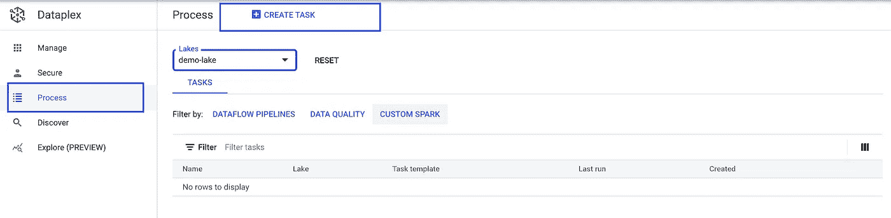

**第二步:选择数据准备任务**

单击>转换为策划格式

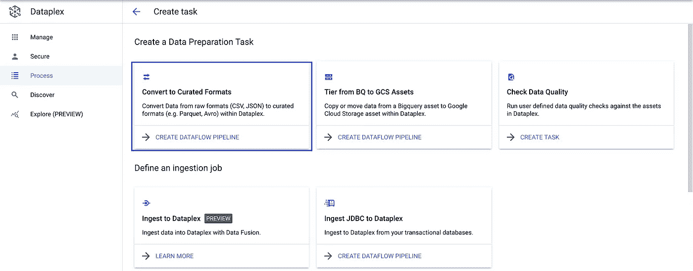

**步骤 3a:选择数据湖**

数据流转换模板是自动填充的。

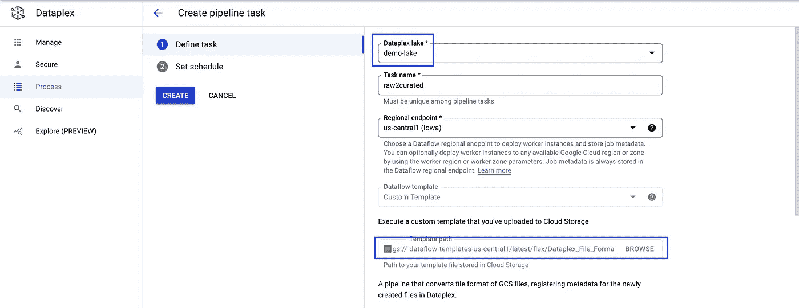

**步骤 3b:输入来源&目标资产路径**

输入数据的目标格式，在本例中为拼花地板。

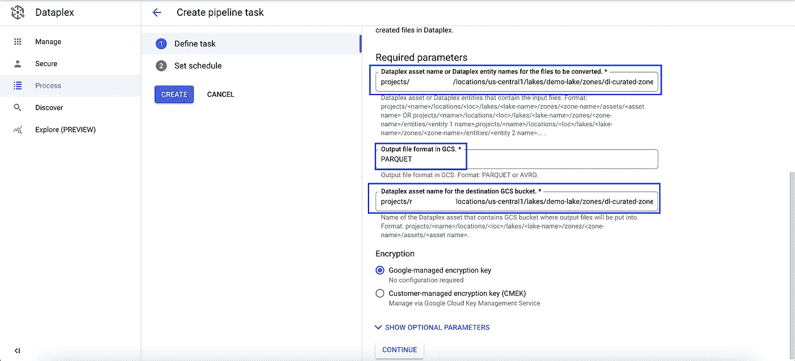

**步骤 3c:指定可选参数**

压缩格式(快节奏、GZIP)、动作(目标文件覆盖、失败、跳过等)。)、工人、机器类型、网络、子网等。

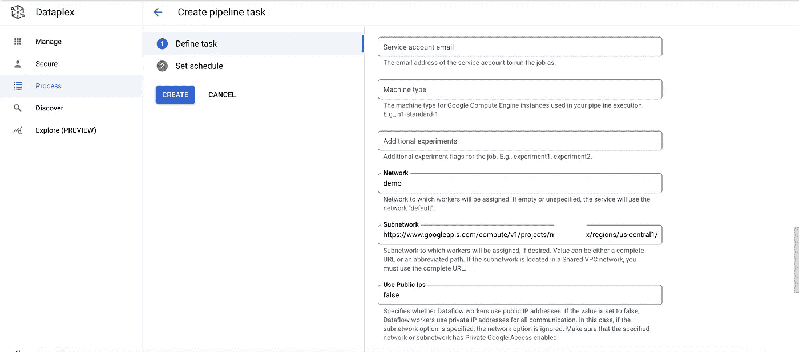

**第四步:设定日程**

然后单击创建..

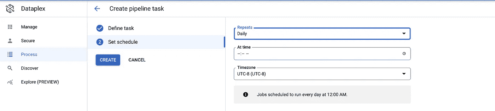

与 dataplex lake 关联的数据管道已经准备好执行了！

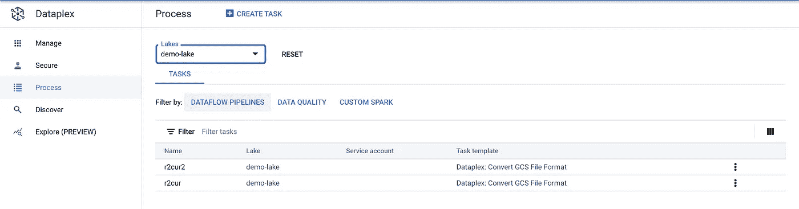

# 场景 2:验证数据质量

既然我们已经开始在湖中加载数据，问题是我们如何确保数据质量？Dataplex 通过几个简单的步骤实现了 DQ 验证任务。在幕后，它使用 Dataproc 无服务器来执行 DQ 任务。

**第一步:创建一个任务**

从 Dataplex 控制台>点击 Process > Create Task >点击 Check Data Quality

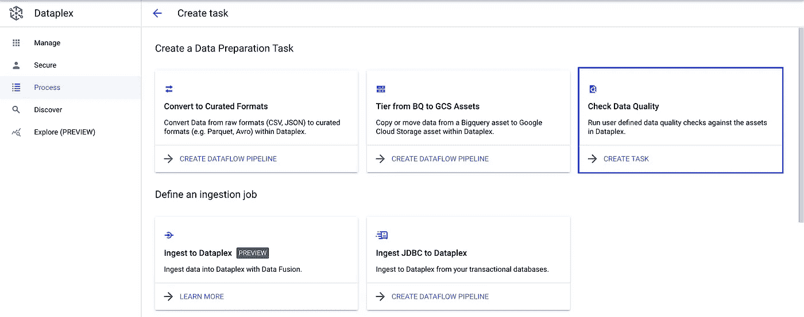

**步骤 2a:选择 dataplex 数据湖**

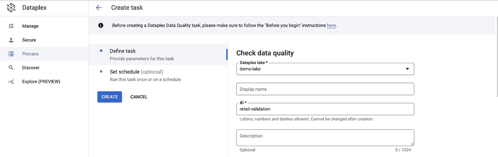

**步骤 2b:配置任务**

选择定义了 DQ 规则的 yaml 文件。设置用于存储验证输出的目标数据集和 BQ 表。

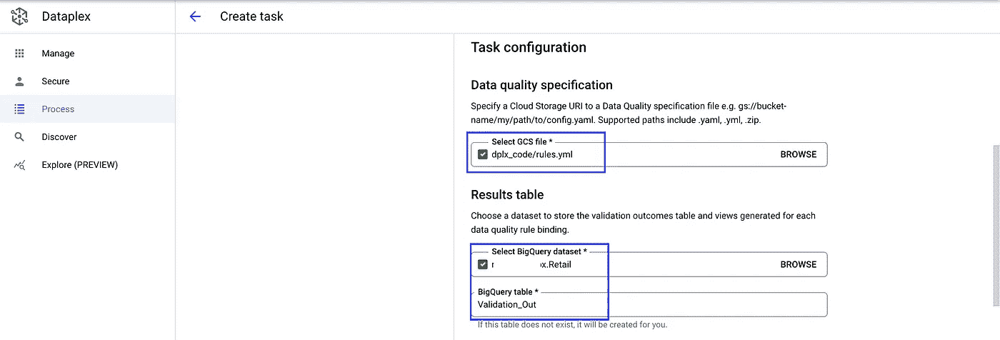

DQ 规则的 yaml 示例如下所示。

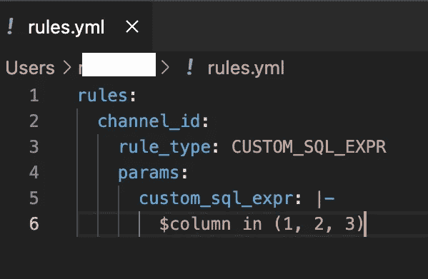

**步骤 2c:设置服务账户和网络配置**

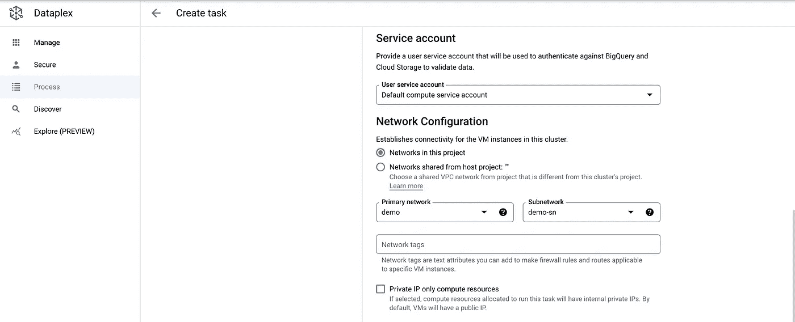

**第三步:设置日程**

然后单击创建..

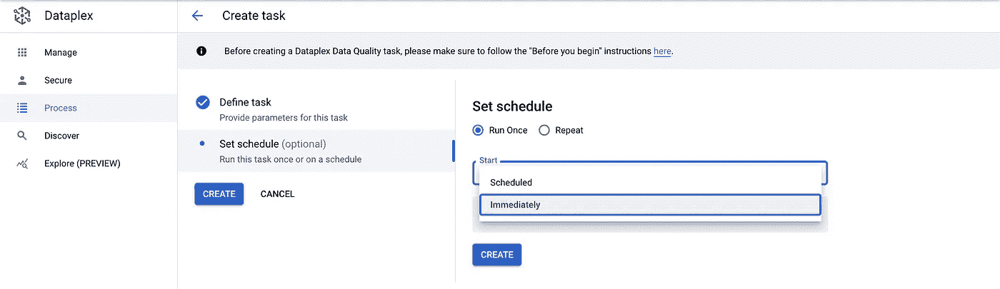

每次验证运行的输出都存储在 BQ 表中。验证报告具有关键属性，如 dataplex 数据湖、运行信息、dataplex 资产表、已验证的表/列、已验证的运行次数、成功/失败统计。

总之，Dataplex 以一种简单的方式解决了一些关键的数据管理/数据质量功能。这是通过与 GCP 本地工具的无缝集成实现的，例如 [Dataflow](https://cloud.google.com/dataflow) 、 [Dataproc](https://cloud.google.com/dataproc) Serverless 和 [BigQuery](https://cloud.google.com/bigquery) 等等。

要探索更多有趣的功能，请观看此空间！