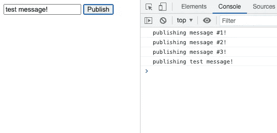
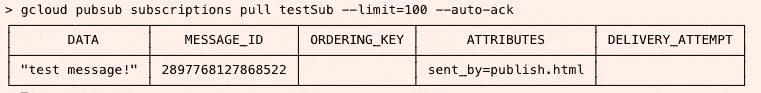

# 静态网站发布到云发布/订阅

> 原文：<https://medium.com/google-cloud/static-website-publishing-to-pubsub-b5ea2d35d232?source=collection_archive---------1----------------------->

# 概观

您有没有发现自己正在制作想要发送到 PubSub 中的 JSON 数据？希望有某种 GUI、WebService 或 CLI 来简化这一过程吗？

*一个* ***静态*** *网页怎么样，在 https 端点上内部托管，作为一种快速简单的方法？*

这也依赖于 GCP 本土的安全模式。网页充当格式化工具(像 CLI！)通过 OAuth 使用最终用户凭证发布数据。

# 给我看看！

这是一系列的步骤——小步骤——来建立一个 HTML 网页。错误检查、用户反馈和风格都作为练习。

## HTML 表单

首先，我们将从一个非常简单的 HTML 表单开始。这将在屏幕上显示一个带有消息和发布按钮的表单。

```
<!DOCTYPE html>
<html>
<head>
<meta charset='utf-8'/>
<body>
  <!-- Form for submitting data to the topic -->
  <form onsubmit="publish('testTopic', [window['message'].value]);
                  return false;">
    <input type="text" id='message' name="msg"></input>
    <input type="submit" value="Publish"></submit>
  </form>
</body>
</html>
```

唯一缺少的是**发布** ( **主题，消息** ) 方法。

## 发布消息

**发布** ( **主题**，**消息**)方法是一个瘦包装器，调用这个 [REST API 端点](https://cloud.google.com/pubsub/docs/reference/rest/v1/projects.topics/publish)。这在下面实现，它使用 **gapi.client.request** 方法——管理 OAuth——这将在下一节实现。

```
<!-- Publish -->
<script type="text/javascript">const PROJECT_ID = '<your-project>';// Publish topic (as a promise)
async function publish(topic, messages) {
  const attrs = {
    'sent_by': 'publish.html'
  };// Create payload to send as per REST specification
let body = { 'messages': [] };
  for (let i = 0; i < messages.length; i++) {
    console.log('publishing', messages[i]);
    body['messages'].push({
      'data': btoa(JSON.stringify(messages[i])),
      'attributes': attrs
    });
  }// Return 
return await gapi.client.request({
    'path':'[https://pubsub.googleapis.com/v1/projects/'](https://pubsub.googleapis.com/v1/projects/') +
            PROJECT_ID + '/topics/' + topic + ':publish',
    'method':'POST',
    'headers': {},
    'body': body,
  });
}
</script>
```

## GAPI 客户端初始化

我们将使用 Javascript 的 async/await 来加载 GAPI 客户端，用 CLIENT_ID、Scope 和 API_KEY 初始化它，最后，如果需要的话，登录。这是使用 [GAPI Javascript 客户端 API](https://github.com/google/google-api-javascript-client/blob/master/docs/start.md) 。这将提示用户授权客户代表用户行事。

下一节将详细介绍 CLIENT_ID 和 API_KEY。

```
<!-- Login using OAuth -->
<script type="text/javascript"
        src="[https://apis.google.com/js/client.js](https://apis.google.com/js/client.js)">
</script>
<script type="text/javascript">
const CLIENT_ID = '<CLIENT_ID>';
const PUBSUB_SCOPE = '[https://www.googleapis.com/auth/pubsub'](https://www.googleapis.com/auth/pubsub');
const API_KEY = '<API_KEY>';// Login (as a promise)
async function doLogin() { // Load auth libraries. These need to be
  // wrapped in a promise to use async/await.
  await new Promise((resolve, reject) => {
    gapi.load('client:auth2', resolve);
  }); // Await the GAPI api to initialise.
  await gapi.client.init({
      apiKey: API_KEY,
      clientId: CLIENT_ID,
      scope: PUBSUB_SCOPE,
  }); // Sign in if needed
  if (!gapi.auth2.getAuthInstance().isSignedIn.get()) {
    await gapi.auth2.getAuthInstance().signIn();
  }
}// Do the login
// Use promise results to update screen status?
doLogin();</script>
```

## 客户端标识和 API 密钥

客户端 ID 和 API 密钥都来自谷歌云的 [API 服务>凭证](https://console.cloud.google.com/apis/credentials)部分。

**创建客户端 ID**

回顾[设置 OAuth 2.0](https://support.google.com/cloud/answer/6158849) 并记住以下几点:

*   需要为静态网站设置授权的 Javascript 源。这可以是本地主机(可以是 http)或支持 https 的 web 服务器。它必须被托管在某个地方！
*   这是一个网络应用程序。

**创建 API 密钥**

使用 API 密钥检查[并创建一个新的 API 密钥。还可以将 API 密钥限制在特定的域和 API 中，以提高密钥的安全性。](http://Using API keys)

# 把它放在一起

在让一切正常工作之前，请记住:

*   使用具有发布 IAM 权限的最终用户(网页用户)创建主题。在本例中，使用了 testTopic。
*   为您可以从中提取的主题创建订阅。在本例中，使用了 testSub。

## 网页

该网页具有简单的输入和发布。“测试消息！”正在发送的消息。



查看浏览器控制台是查看事情是否出错的好地方。

## g 云订阅拉动

发布后，`gcloud pubsub subscriptions pull`可用于获取消息:



# 结论

有很大的改进空间，但是使用 OAuth 创建一个简单的发布订阅发布网页非常简单。对于面向公众的解决方案，不建议这样做(每条 PubSub 消息都要花钱！)，但对于面向内部的工具，这可能就是解决方案。