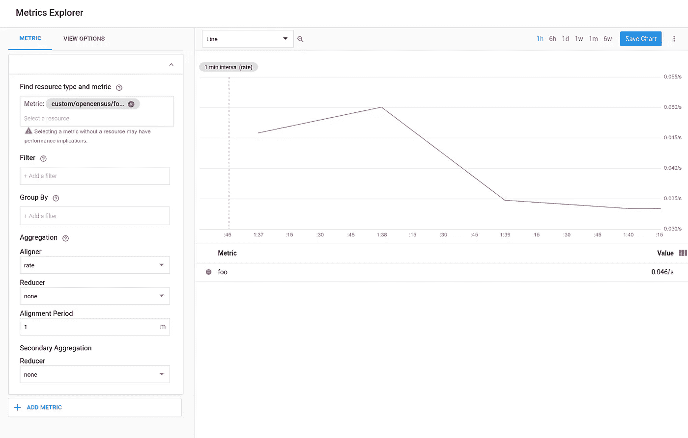
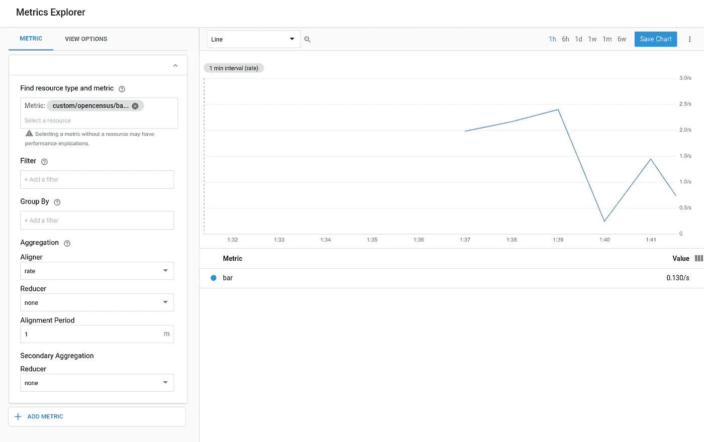
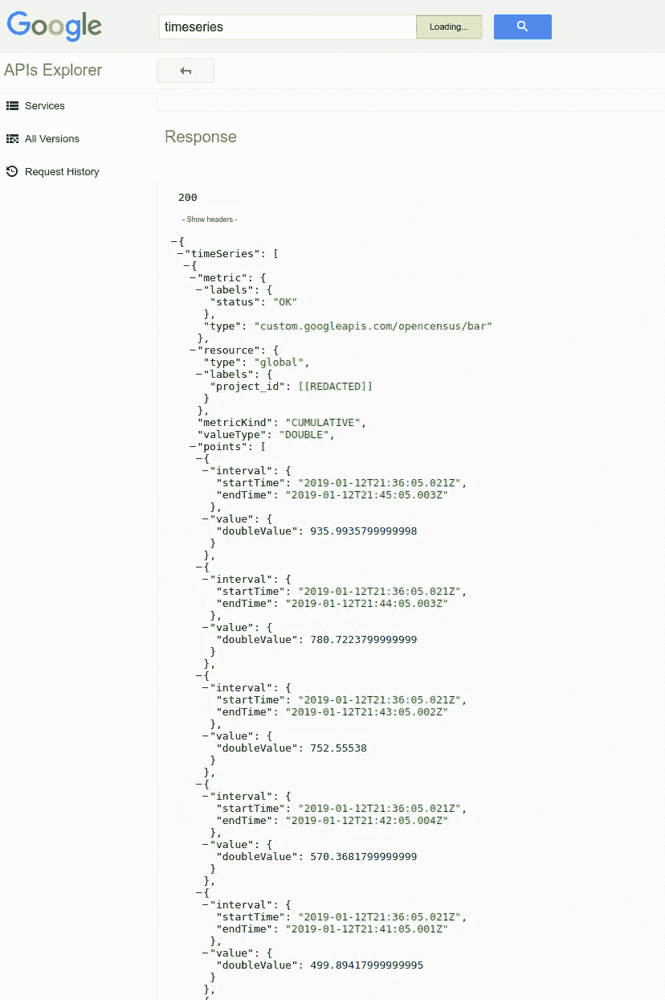
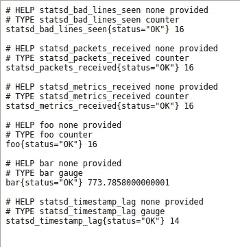

# StatsD 开放普查后端

> 原文：<https://medium.com/google-cloud/statsd-opencensus-backend-33297c6a58b5?source=collection_archive---------1----------------------->

Datadog 的 OpenCensus [实现](https://github.com/DataDog/opencensus-go-exporter-datadog)利用 Datadog 的[代理](https://docs.datadoghq.com/agent)将指标数据路由到它的服务。具体来说，它的 OpenCensus 客户端使用代理的 [DogStatsD](https://docs.datadoghq.com/developers/dogstatsd/) 实现。本质上，DogStatsD 是一个带铃铛的 StatsD 客户端。

这让我想到，通用的 [StatsD](https://github.com/etsy/statsd) 后端对 [OpenCensus](http://opencensus.io) 有用吗？谁知道呢！但是我开始玩一个。叫做[statsd-open census-back end](https://github.com/DazWilkin/statsd-opencensus-backend)。

**完全公开**:它目前不能与 Stackdriver(调试)一起工作，但可以与 Prometheus 一起工作。

更新:它对斯塔克怀特和普罗米修斯都有效。我应该听从我自己的建议。如果您不为您的 GCP 项目分配计费，将不会报告指标！:-)

**要求**

对于普罗米修斯，你不需要额外的东西。

对于 Stackdriver，你需要一个谷歌云平台账户(和账单)；可以写入 Stackdriver 的服务帐户；和一个 Stackdriver 工作区(目前只能使用浏览器客户端 grr！):

```
PROJECT=[[YOUR-PROJECT]]
BILLING=[[YOUR-BILLING]]
ACCOUNT=[[YOUR-SERVICE-ACCOUNT]]
ADDRESS=${ACCOUNT}@${PROJECT}.iam.gserviceaccount.comWORK=[[YOUR-WORKING-DIRECTORY]]
FILE="${WORK}/${ACCOUNT}.key.json"gcloud projects create ${PROJECT}gcloud beta billing projects link ${PROJECT} \
--billing-account=${BILLING}gcloud iam service-accounts create ${ACCOUNT} \
--display-name=${ACCOUNT} \
--project=${PROJECT}gcloud iam service-accounts keys create ${FILE} \
--iam-account=${ACCOUNT}@${PROJECT}.iam.gserviceaccount.com \
--project=${PROJECT}gcloud projects add-iam-policy-binding ${PROJECT} \
--member=serviceAccount:${ADDRESS} \
--role=roles/monitoring.metricWriter
```

您需要访问以下链接来提供 Stackdriver 工作区:

```
google-chrome console.cloud.google.com/monitoring/?project=${PROJECT}
```

**试试看**

克隆 Etsy 的 statsd 项目和[statsd-open census-back end](https://github.com/DazWilkin/statsd-opencensus-backend):

```
cd ${WORK}
git clone [https://github.com/DazWilkin/statsd-opencensus-backend](https://github.com/DazWilkin/statsd-opencensus-backend)cd statsd-opencensus-backend
npm installcd ${WORK}
git clone [https://github.com/etsy/statsd](https://github.com/etsy/statsd)
cd statsd
npm install
```

您应该为 statsd 定义一个配置文件。在`${WORK}/statsd`中创建一个名为`myConfig.js`的文件:

```
{
    flushInterval: 5000,
    backends: [
        "../statsd-opencensus-backend"
    ],
    opencensus:{
        prometheus: {
            port: 9464
        },
        stackdriver: {
            projectId:"[[YOUR-PROJECT]]"
        }
    }
}
```

> 请用您的 GCP 项目 ID 替换`[[YOUR-PROJECT]]`的值；`${PROJECT}`的值。

然后，您应该能够运行 statsd 服务器:

```
node stats.js ./myConfig.js
```

您应该立即看到类似于以下内容的日志记录:

```
[110588] reading config file: ./dazConfig.js
server is up INFO
DEBUG: [OpenCensus:cons] Entered
DEBUG: [Opencensus:cons] Creating Stackdriver Exporter
DEBUG: [Opencensus:cons] Creating Prometheus Exporter
DEBUG: [Opencensus:cons] Registering stackdriver
DEBUG: [Opencensus:cons] Registering prometheus
DEBUG: Attaching 'flush'
DEBUG: Attaching 'status'
DEBUG: [OpenCensus:cons] Exited
```

现在，您需要生成一些计数器和一些计量器。

在一个终端中，要创建一个名为`foo`的[ **c** 计数器并每秒递增一次，请运行:

```
while true
do
  echo "**foo**:1|**c**" | nc -u -w0 127.0.0.1 8125
  sleep 1s
done
```

在另一个终端中，创建一个名为`bar`的[ **g]** auge，并将其设置为每秒随机(0:99)值，运行:

```
while true
do
  GAUGE="**bar**:$(awk -v min=0 -v max=99 'BEGIN{srand(); print min+rand()*(max-min+1)}')|**g**"
  echo ${GAUGE}
  echo ${GAUGE} |  nc -u -w0 127.0.0.1 8125
  sleep 1s
done
```

您应该开始看到度量值被发送到导出器:

```
DEBUG: Flushing stats at Sat Jan 12 2019 13:06:12 GMT-0800 (Pacific Standard Time)
DEBUG: Counter: statsd.bad_lines_seen: 0
DEBUG: [Opencensus:flush] Creating counter: statsd_bad_lines_seen
DEBUG: [Opencensus:flush] Creating view: statsd_bad_lines_seen
DEBUG: Counter: statsd.packets_received: 119
DEBUG: [Opencensus:flush] Creating counter: statsd_packets_received
DEBUG: [Opencensus:flush] Creating view: statsd_packets_received
DEBUG: Counter: statsd.metrics_received: 119
DEBUG: [Opencensus:flush] Creating counter: statsd_metrics_received
DEBUG: [Opencensus:flush] Creating view: statsd_metrics_received
DEBUG: **Counter: foo: 60**
DEBUG: [Opencensus:flush] Creating counter: foo
DEBUG: [Opencensus:flush] Creating view: foo
DEBUG: **Gauge: bar: 12.0405**
DEBUG: [Opencensus:flush] Creating gauge: bar
DEBUG: [Opencensus:flush] Creating view: bar
DEBUG: [OpenCensus:flush] Exited
```

**堆栈驱动**

下面是 Stackdriver 的指标浏览器中的`foo`:



公制:custom.googleapis.com/opencensus/foo

下面是 Stackdriver 的指标浏览器中的`bar`:



公制:custom.googleapis.com/opencensus/bar

而且，由于`bar`更有趣，这里是使用谷歌(牛逼)APIs Explorer 的时间序列查询结果:



要亲自尝试，以下 URL 将带您找到该方法:

```
google-chrome [https://developers.google.com/apis-explorer/#search/timeseries/m/monitoring/v3/monitoring.projects.timeSeries.list](https://developers.google.com/apis-explorer/#search/timeseries/m/monitoring/v3/monitoring.projects.timeSeries.list)
```

然后，替换以下值:

```
name: projects/${PROJECT}
filter: metric.type="custom.googleapis.com/opencensus/foo"
interval.endTime: 2019-01-12T23:59:59-08:00
interval.startTime: 2019-01-12T00:00:00-08:00
```

> **NB** 用其值替换`${PROJECT}`。您可以在过滤器中使用`foo`或`bar`。开始和结束时间应该与您现在的时间相对应。我的值是太平洋时间(`-08:00`)2019 年 1 月 12 日全天(`00:00:00`–`23:59:59`)。

**普罗米修斯**

您可能会在端口`9464`上观察到指标导出器:



普罗米修斯度量输出器

在这里你可以看到计数器`foo`(我创建了一个虚拟标签`status`)和它当时的值 16，以及计量器`bar`(相同的虚拟标签)和它当时的值`773.7858…`

显然，需要做更多的工作；-)

遛狗的时间到了！