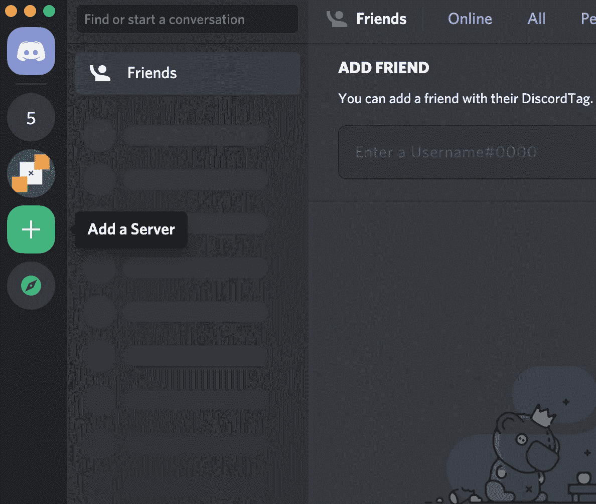

# 用人工智能的调节机器人实时阻止有害信息

> 原文：<https://medium.com/google-cloud/stop-toxic-messages-in-real-time-with-an-ai-powered-moderation-bot-for-discord-ea5c17d669c0?source=collection_archive---------0----------------------->

在这篇文章中，我将向你展示如何使用 Perspective API 为 Discord 聊天平台构建一个人工智能主持人机器人。

自从五年前我开始在在线约会网站 OkCupid 工作以来，我就一直对适度这个话题着迷，即决定谁可以在网上发布什么。那里的审核团队负责完成[几乎不可能完成的任务](https://www.thecut.com/2017/02/banned-from-okcupid-sexting-moderation.html)，在被认为有风险的调情(通常没问题)、非法挑逗(可能没问题)和性骚扰(这会让你被封禁)之间划一条线。正如 RadioLab 在他们关于这个话题的[精彩播客](https://www.wnycstudios.org/podcasts/radiolab/articles/post-no-evil)中所说，“多少屁股才算太多屁股？”诸如此类的问题已经够棘手了，如果你是 Twitter 用户，你必须决定当总统的推文违反你的服务条款时该怎么做。

这是个脏活，但总得有人去做。或者他们有吗？人工智能可以处理适度吗？

*想看这个帖子的视频版？点击这里查看:*

一些政策问题，如如何处理总统的推文或如何定义仇恨言论，没有正确的答案。但是在更多的情况下，对于更多的平台，不良内容很容易被发现。你可能无法在专业网络应用或儿童教育网站上分享任何形式的裸体、血腥或仇恨言论。此外，由于大多数应用不是像脸书或推特(我们对言论自由有强烈期望)这样的公共论坛，在过滤风险内容时过于苛刻或保守的后果会更低。对于这些应用，机器学习真的可以有所帮助。

在这篇文章中，我将向你展示如何为聊天平台 Discord 构建你自己的人工智能调节机器人。如果你以前从未做过任何机器学习，也不用担心——我们将使用谷歌的一个完全免费的工具[透视图 API](https://www.perspectiveapi.com/) 来处理复杂的部分。

但是，在我们进入技术细节之前，让我们谈谈一些高层次的节制策略。大多数公司使用三种方法中的一种:

1.  **预审核**是指一组人工审核人员在每一条内容发布之前对其进行审核。当*非常非常*重要的是没有“坏”内容从缝隙中溜走时，这是一个好方法。例如，苹果要求每一个提交到应用商店的应用在发布前都要经过员工的[审查。](https://www.cnbc.com/2019/06/21/how-apples-app-review-process-for-the-app-store-works.html)
2.  **后审核**则相反——内容被允许在被审核之前*发布。相反，标记帖子的工作通常被众包给用户，用户可以“标记”或“报告”他们认为违反网站服务条款的内容。你几乎在任何地方都能看到这种情况(YouTube、脸书、Instagram 等等)。*

通过后期审核，用户可以标记不合适的内容。

这两种方法显然都有缺点——预审核需要一个庞大的人工审核团队，并且不适用于实时应用程序(聊天或任何类型的流)。后调节的伸缩性更好，但是会迫使你的用户使用潜在的攻击性或干扰性的媒体。这让我们想到:

人工智能主持人夜以继日地工作，几乎即时做出反应，因此他们可以在一个血腥视频开始后几秒钟内发现它。通常，人工智能不会取代人工审核团队，而是与人工审核团队合作，帮助自动确定需要检查的内容的优先级。

所以，事不宜迟，让我们为聊天平台 Discord 构建一个人工智能主持人机器人。

# 为不和谐建造一个人工智能驱动的调节机器人

*想直接跳到代码？在这里 *查看* [。](https://github.com/google/making_with_ml/tree/master/discord_moderator)*

今天我将向你展示如何为不和谐建造一个人工智能驱动的调节机器人。

该机器人位于一个不和谐的频道中，分析所有用户的消息，看它们是否有毒、无意义、轻浮、侮辱性或垃圾邮件。当它检测到一条消息确实符合其中一个类别(即有毒)时，它会用表情符号(🧨).)对该消息做出“反应”稍后，您可以使用“！因果报应”热词。如果用户发送了太多有害信息，他们就会被踢出频道。

让我们看看如何建立它。

# 设置

首先让我们为我们的主持人机器人抓取代码。克隆“making _ with _ ml”[Github repo](https://github.com/google/making_with_ml)并导航到“discord_moderator”文件夹:

这里是运行 ML 版主机器人所需的所有代码。在我们运行这个机器人之前，我们需要设置一些(完全免费的)服务。首先，复制文件`.env_template`，并将其命名为`.env`。

在您最喜欢文本编辑器中打开该文件:

如您所见，我们需要几个不同的 API 和开发人员令牌来开始，一个用于透视图 API，我们将使用它来分析消息，另一个用于 Discord(稍后将详细介绍)。

什么是透视 API？Perspective API 是由 Jigsaw 开发的免费工具，Jigsaw 是谷歌的一个部门，用他们自己的话说，“预测和应对新出现的威胁，创造定义未来的研究和技术，以使我们的世界更加安全。”Perspective API 就是一个这样的工具，它可以让(数字)世界更加安全。它将文本作为输入(“你像烟头一样臭”)，并分析它的属性，如毒性、侮辱、亵渎、身份攻击、性暴露、调情、威胁等。您可以在他们的交互式网络演示中快速体验一下:

你可以在 perspectiveapi.com 上测试透视 API

今天,《纽约时报》使用透视来帮助自动调节他们的评论部分。

不幸的是，在 Javascript 中实际使用透视图 API 的文档有点少，所以我将在这里补充一些细节。

# 有利视角

首先，登录你的 Google Cloud 账户(免费使用)，创建一个新项目或者选择一个现有的项目。在您的项目中，启用[透视图注释分析器 API](https://console.cloud.google.com/apis/api/commentanalyzer.googleapis.com/overview) 。您必须填写一份简短的调查才能获得访问权限(几个小时后您会收到一封电子邮件)。

接下来，您需要生成一个 API 密钥来访问代码中的 API。在 Google Cloud 控制台左侧菜单中，单击 API & Services -> Credentials。在该屏幕上，单击“+创建凭证”->“API 密钥”。复制 API 密钥。

现在回到您之前创建的文件——`.env`——并将密钥放入`PERSPECTIVE_API_KEY`字段:

## 分析邮件

现在，您应该能够使用透视图 API 来分析代码中的文本。要查看示例，请查看文件`perspective.js`。在文件的顶部，您将看到 API 可以识别的所有可能的属性:

在下一行，您将看到我们将在 bot 中实际使用的属性:

看到每个属性旁边的数字了吗？当您让 Perspective API 分析一条评论(“你太性感了”)时，它会为每个属性返回一个“summaryScore”:

分数大致代表了机器学习模型对评论是否真的是调情或有毒或威胁等的信心。接下来的工作就是你，开发人员，选择一个“截止时间”来决定一个评论什么时候应该真正得到一个标签。这就是我在上面发布的`attributeThreshold`对象中所有那些数字的含义。如果 summaryScore 高于 0.75，我只会认为一个评论是侮辱性的、有毒的或威胁性的。

专业提示:在您自己的应用程序中，您会希望选择一个与您的人工审核团队(如果您有)已经在审核内容的方式一致的截止值。例如，在 Tinder 上，发送调情信息是完全可以的，我们可能比 LinkedIn 这样的网站有更高的过滤色情信息的门槛。

同时，看一下函数`analyzeText`，看看我们实际上是如何调用透视图 API 的:

为了实际连接 API，我们调用`const analyzer = new googleapis.commentanalyzer_v1alpha1.Commentanalyzer();`。然后，我们在第 21 行打包一个请求，指定我们的语言和我们想要分析的属性，并将其发送给 API。就是这样！在第 30 行，我们检查从透视图 API 返回的分数是否高于我们的阈值(0.75)。

恭喜你，你现在可以使用机器学习来分析文本了！现在让我们把这个有用的功能扔进一个不和谐机器人。

# 设置一个不和谐机器人

如果你从未用过 [Discord](https://discord.com/) ，这是一个深受游戏玩家欢迎的语音、视频和文本聊天平台。你可以使用这篇文章中的方法为其他消息平台构建一个机器人，比如 [Hangouts](https://discord.com/) 或 [Slack](https://slack.com/) ，但我选择了 Discord，因为它有如此令人愉快的开发者体验。

首先，下载 Discord(或者使用网页版)，然后[注册](https://discord.com/developers)一个 Discord 开发者账户。一旦你进入，点击“新应用”，并给你的新应用一个名称和描述。

创建新的 Discord 应用程序。

在左侧面板中，选择“bot”创建一个新的 Bot。选择“添加机器人”给你的新机器人一个用户名，并上传一个可爱或吓人的用户图标。

给你的机器人一个用户名和一张图片。

为了能够在代码中控制你的机器人，你需要一个 Discord 开发者令牌，你可以通过点击“复制”直接从机器人页面中获取。将该代码放到` . env '文件中:

现在你已经创建了一个不和谐的机器人，你可以立即将它添加到一个频道。在任何 Discord 应用程序中(我使用的是桌面应用程序)，登录并创建一个新服务器:

下载 Discord 应用程序后，只需点击加号按钮即可创建一个新服务器。

现在让我们把你的机器人添加到服务器。回到 Discord [开发者门户](https://discord.com/developers)，在您的应用程序中，点击左侧面板上的 OAuth

Discord 有一个非常好的处理 bot 权限的系统。在“范围”下，勾选“机器人”旁边的框这将在下面打开一个“机器人权限”部分。

检查你的机器人需要的权限(我们的是上面的 3 个)。

勾选“发送消息”、“添加反应”(用表情符号对消息做出反应)和“踢会员”(禁止不良会员进入频道)。

如果你向上滚动，就在 BOT 权限面板上方，你应该看到一个 url，比如:`https://discord.com/api/oauth2/authorize?client_id=YOUR_CLIENT_ID&permissions=2114&scope=bot`。将该 url 粘贴到您的浏览器中。如果一切设置正确，您应该能够将您的机器人添加到您的服务器。这就对了。你没有写一行代码就创建了你的第一个不和谐机器人。但是现在，它什么也做不了。你需要给它一个大脑。

# 建立一个不和谐的调解人

在这个项目中，我们的机器人大脑生活在文件`discord.js.`中

在文件的顶部，我们导入我前面提到的透视图文件:

`const perspective = require('./perspective.js');`

然后我们建立了一个表情地图，它告诉机器人在检测到各种属性时如何做出反应:

你可以随意把它们改成你喜欢的任何东西。

我们希望我们的机器人做的是分析通道中的每一条消息。我们通过创建一个新的 Discord 客户端并传递我们的开发人员令牌(这是文件中的最后一行)来实现这一点:

为了监听消息，我们编写了一个监听客户端`message`事件的函数:

这里发生了很多事。

*   在第 4 行，我们确保我们正在分析的消息只来自其他用户(不是机器人)
*   在 8 上，我们分配一些内存来跟踪我们的用户。这样我们就能记住我们给了他们多少表情符号，他们说了多少次有毒的话。
*   在第 14 页，我们调用了`evaluateMessage`函数，它使用透视 API 来分析用户的消息。该函数(您可以在文件中进一步研究)将文本传递给 Perspective API，如果找到属性，则用表情符号反应进行响应，并统计用户说了一些有毒的话的次数。如果它大于我们的`.env`文件中设置的值`KICK_THRESHOLD`，该函数返回 True(即，我们应该将用户从频道中踢出)。
*   在第 19 行，我们使用函数`kickBaddie`将用户踢出频道。
*   最后，在第 27 行，我们注意"！因果报应”热词。如果用户输入这个热词，我们将发送一条消息，汇总该频道用户的统计数据。

要真正详细了解这里发生了什么，您必须查看文件中的函数`evaluateMessage`和`kickBaddie`。我在队列中添加了许多文档。但简而言之，这就是全部。

这就是你要做的——你有你自己的人工智能控制的不和谐调节机器人。你怎么想呢?

*原载于 2020 年 6 月 30 日*[*【https://daleonai.com】*](https://daleonai.com/build-your-own-ai-moderator-bot-for-discord-with-the-perspective-api)*。*