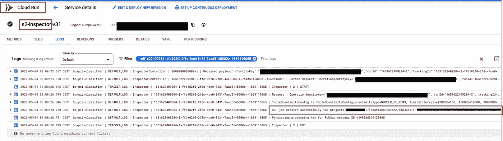

# 不要再担心 BigQuery PII:如何大规模自动化数据治理。

> 原文：<https://medium.com/google-cloud/stop-worrying-about-bigquery-pii-how-to-automate-data-governance-at-scale-81abb3e47e0c?source=collection_archive---------0----------------------->

## BigQuery 的 PII 发现、分类和访问控制

> **TL:DR** 毫无疑问，管理和保护 PII 数据是许多组织的头等大事，尤其是不遵守 PII 法案可能会给企业带来严重的物质和非物质损失。如果没有管理 PII 的自动化框架，这一敏感流程可能是手动的、不可扩展的，或者会带来更大的失败风险(例如，创建数据集的 PII 和非 PII 拷贝)
> 
> 为了解决这个问题，我们引入了一个[开源解决方案](https://github.com/GoogleCloudPlatform/bq-pii-classifier)，根据您组织的敏感级别层次结构，自动发现、分类和限制对 BigQuery 中 PII 数据字段的访问。

许多组织正在将他们的数据迁移到 BigQuery(或者已经这样做了)，并着手解决如何“处理”他们的个人身份信息的问题( **PII** )。根据组织的业务需求、法规遵从性要求或成熟度，术语“处理”可能指不同的主题，例如常见的任务可能是:

*   **发现**哪些列和表包含 PII。
*   **根据等级对** PII 类型进行分类(例如，高灵敏度、低灵敏度等)
*   **将元数据标签**添加到基于 PII 类型/类的列中，作为对数据进行编目的一种方式
*   管理**谁可以在你的项目中读取哪个 PII** 类型/类(对于用户和服务帐户)

虽然处理 PII 数据有更多的层次和方向(例如加密、匿名化、去标识化等)，但在本文中，**我们将重点关注上面列出的步骤，作为在不创建数据副本**的情况下就地管理和保护 PII 数据**的最低要求。**对于**，**我们假设您已经将数据加载到 BigQuery 中，数据为原始格式(无屏蔽)，并且可能会暴露 PII(例如着陆区)。听起来很熟悉？继续读！

在接下来的章节中，我们将介绍每一个步骤以及实现这些步骤的 GCP 产品和功能。最后，我们将讨论 [**BQ PII 分类器**](https://github.com/GoogleCloudPlatform/bq-pii-classifier) 开源解决方案来自动化整个过程。

 [## GitHub-Google cloud platform/bq-pii-分类器:

### 跨 BigQuery 表自动发现和标记 PII 数据，并基于以下内容应用列级访问控制

github.com](https://github.com/GoogleCloudPlatform/bq-pii-classifier) 

# 第一步:发现 PII

“如何发现 GCP 的 PII 数据？”的简短回答通常是[防数据丢失 API ( *DLP* )](https://cloud.google.com/dlp) 。这是原生的 GCP 产品，您可以简单地从云控制台(UI)使用它来创建一个“ [*检查作业*](https://cloud.google.com/dlp/docs/creating-job-triggers) ”，该作业基于一个*“检查模板”*(列出某些现成的或定制的 PII*[*信息类型*](https://cloud.google.com/dlp/docs/concepts-infotypes)*)扫描一个数据资源(例如 BigQuery 表)并报告*结果***

****

**样品检验模板**

****

**BigQuery 表的示例检查作业**

**对我们来说最相关的"*操作*将是 [**将调查结果保存到 BigQuery**](https://cloud.google.com/dlp/docs/querying-findings) 以导出最细粒度的工作调查结果。一个“*发现*”详述了某一行和列中的一个 PII 检测以及匹配的可能性。请注意，我们可能会在同一列中检测到多个具有不同匹配可能性的 PII 类型，例如，以“215 Nelson Mandela Street”作为 customer_address 列的数据行可能会生成两个结果；{ *InfoType: STREET_ADDRESS，likelity:VERY _ LIKELY }*和 *{InfoType: PERSON_NAME，likelity:LIKELY }*。然而，如果需要的话，我们可以通过“[规则集](https://cloud.google.com/dlp/docs/creating-custom-infotypes-rules)”来控制这样的行为**

**我们如何使用这个特性来实现自动检测 BigQuery 表中的 PII 的目标呢？**

*   **定义和定制我们要搜索的 PII 信息类型，并将其列在*检验模板*中**
*   **拥有一个应用层，它通过 [DLP 客户端库和 API](https://cloud.google.com/dlp/docs/apis) 中的一个以编程方式为每个表创建一个*检查作业*(我们将在本文的后面讨论一个本机特性 Auto DLP，以及如何使用它来实现我们的目标)**
*   **配置*检查作业*将结果存储在 BigQuery 表中，以便在后续步骤中进一步处理**

# **步骤 2:定义 PII 分类层次结构**

**PII 分类层级的一个简单而常见的例子可以是敏感度等级(例如高、中、低)，其中每个 PII 类型(即 DLP *信息类型*)属于一个分类。对 PII 类型进行分类的原因可能各不相同，但通常是为了数据治理向用户/组授予一定级别的安全许可。**

**GCP 通过 [***数据目录和策略标签分类法***](https://cloud.google.com/bigquery/docs/best-practices-policy-tags) ***完全涵盖了这个用例。***“*策略标签分类法”*是一种资源，用户在数据目录中将其定义为对业务有意义的任意用户定义的节点层次结构。该层次结构中的每个父节点或叶节点可以用作“*策略标记”*，该标记可以链接到 BigQuery 列(即，用策略标记来标记列)。策略标记有两个主要用途:**

*   **1)充当可在数据目录中[发现的](https://cloud.google.com/data-catalog/docs/how-to/search-reference#qualified_predicates)元数据字段(例如，搜索所有列标有“高敏感度”策略标签的表)**
*   **2)在 BigQuery 中启用[列级访问控制。这样，我们定义了一次访问控制(在策略标记上)，并通过标记将其应用于 BigQuery 中的多个列。](https://cloud.google.com/bigquery/docs/column-level-security-intro)**

**总之，为了定义 PII 分类层次结构，我们只需在数据目录中创建一个*策略标签分类*，其中包括我们已经在 DLP 检查模板中定义的所有 PII *信息类型*的节点**

****

**PII 的策略标签分类示例**

# **步骤 3:标记 BigQuery PII 列**

**手动列标记是从云控制台(UI)直接进行的。我们需要编辑表的模式，选择列，并从分类法中选择策略标记。**

****

**BigQuery 列标记(控制台)**

**但是，我们希望多次重复这个过程，以覆盖所有表中的所有 PII 列。更不用说，做标记的人可能不知道一个列是否包含 PII。**

**还记得 DLP *检验岗位*吗？我们将它配置为将详细的结果保存到 BigQuery？现在我们需要根据这些发现采取行动。**

**对于我们想要标记其列的每个表，我们可以执行以下操作:**

*   **从详细的结果 BigQuery 表中读取 DLP 结果**
*   **对于每个表列；查找 DLP 检测到的信息类型。如果 DLP 为该列找到多种信息类型，我们会提升其中一种(考虑到发现的数量和可能性，或者通过报告特殊占位符“混合”)**
*   **在数据目录分类法中查找该信息类型，并返回对应于该信息类型策略标记 ID**
*   **将策略标记 ID 应用于 BigQuery 列**

# **步骤 4:管理对 PII 的访问控制**

**现在，我们结束了一个设置，其中 BigQuery 中的某些列由数据目录中的层次结构/分类中定义的策略标记来标记。我们需要做的就是转到策略标签分类法，将“ [*”细粒度读者角色*](https://cloud.google.com/iam/docs/understanding-roles#data-catalog-roles)*”*分配给用户和组。这种分配可以在层次结构的任何级别上。例如，在“Email”标记(叶节点)上分配 *user1@* 的细粒度读者角色意味着 *user1* 将有权访问用这个精确的策略标记标记的列。或者，在“中等敏感度”标记(父节点)上为他们分配相同的角色，这意味着他们可以访问标记有该父节点下任何叶节点的列(即电子邮件和电话号码)。**

**为了遵循 IAM 最佳实践，我们建议使用组而不是用户来执行此步骤。例如，有 3 个组来管理对 PII 的访问[*pii-高敏感度读者@* 、*pii-中等敏感度读者@* 、*pii-低敏感度读者@* ]，每个组都被授予相应分类级别的细粒度读者角色。在这种情况下，当我们想要将新用户或服务帐户添加到任何级别时，只需将他们添加到所需的组中即可。**

****

**授予对标记 PII 字段的访问权限**

**让我们以一个假设的表“*订单*为例。此表包含我们应用策略标签的 PII 列[客户电子邮件、客户地址]和其他非 PII 列[项目、订单日期、价格等]。用户访问该表需要两层 IAM:**

*   **表、数据集或项目级别的标准 *BigQuery 数据查看器*角色。这将授予对表的访问权，以读取不受策略标记限制的所有列。**
*   **额外的*数据目录* *细粒度读者角色*授予对带标签的 PII 列的访问权限。**

**这里值得一提的是一个方便的特性，它是一个对给定分类的“ [*强制访问控制*](https://cloud.google.com/bigquery/docs/column-level-security)*的开关。当此开关关闭时，我们可以试验列标记，而不会影响用户对标记列的访问。***

***不言而喻，本节中解释的 IAM 绑定也可以通过编程来完成，我们将在下一节中看到，我们试图将所有这些步骤一起自动化***

# ***全部自动化***

***现在，我们已经理解了在 BigQuery 上实现管理 PII 的目标的每一步背后的 GCP 概念(即 PII 发现、分类、标记和访问控制)，是时候将所有东西*【glue】*在一起，将其应用到 N 个大规模的表中了。为此，我们开发了 [**BQ PII 分类器**](https://github.com/GoogleCloudPlatform/bq-pii-classifier) 开源解决方案。***

****

**BQ PII 分类器解决方案步骤**

****架构概述****

****

**BQ PII 分类器解决方案架构(标准模式)**

***检查调度服务*
云运行服务，充当解决方案的入口点。它期望大查询扫描范围表示为项目、数据集和表的包含和排除列表。该范围可以是一个或多个表。**

**检查调度程序将调用 BigQuery API 来列出扫描范围中包含的所有表，并在 Inspector Tasks 主题中提交该表的 DLP 检查请求。**

***检查员任务主题*
该发布主题将检查调度程序与检查员分离，以处理 DLP API 的速率限制，并应用带补偿的自动重试。**

***Inspector Service*
一种云运行服务，期望请求扫描一个表。它将根据配置的检查模板和其他参数(如扫描限制、结果表、通知主题等)向 DLP 提交该表的检查作业。**

**为了控制成本，该服务将根据表格大小和用户定义的配置来限制要扫描的行数，该配置确定了限制间隔(例如，0–1000 行→样本 100、1001–10000→样本 500 等)。这个样本将从表中随机抽取。**

***标记器任务主题*
该发布订阅主题将 DLP API 通知从标记器服务中分离出来，以便处理 BigQuery 列标记操作的速率限制，并应用带回退的自动重试。**

***Tagger 服务*一个云服务，它需要一个 BigQuery 表的信息。它将根据最新的 DLP 结果确定每一列的信息类型，并应用适当的策略标记。**

***标记调度服务*
云运行服务，充当解决方案的入口点。它需要一个 BigQuery 范围，表示为项目、数据集和表的包含和排除列表。该范围可以是一个或多个表。**

**标记调度程序将列出扫描范围中包含的所有具有现有 DLP 扫描结果的表，并在标记器任务主题中提交该表的表标记请求。**

**此服务用于触发重新标记运行，而无需重新检查表。这在分类体系发生变化，但底层数据保持不变的情况下很有帮助。**

***BigQuery 配置视图*
Terraform 根据定义的映射和配置生成配置视图。这些配置视图主要由 Tagger 服务用来确定策略标记逻辑。**

***日志*除此之外，还有许多 BigQuery 视图可以帮助监控和调试调用链以及对列进行标记操作。**

****部署****

**要部署该解决方案，您必须配置以下主要部分(通过 Terraform ),这些部分对应于我们之前讨论的 GCP 概念:**

*   ****BigQuery Scope:** 要在运行中包含或排除的项目、数据集或表格的列表(即扫描和标记)。它还附带了一个 CRON 时间表来确定这种运行的频率。**

****

**BigQuery 扫描范围配置**

*   ****数据分类分类法:**标准和自定义的 JSON 列表 *"* [*信息类型*](https://cloud.google.com/dlp/docs/concepts-infotypes) *"* 定义为一个层次结构(如高、中、低)。该列表将被转换成两个 GCP 资源；1)数据目录策略标记分类 2)DLP 检查模板**

****

**分类分类法配置**

*   ****域映射:**如果您需要区分跨业务单位的 PII 数据访问(例如，营销 PII 的读者只能访问营销 PII，而不能访问财务 PII)，那么您需要在项目或数据集级别告诉解决方案哪些数据属于哪个*“域】*(即业务单位)。这将导致在数据目录中创建 N 个策略标记分类，每个域一个(所有副本)，其中每个策略标记分类用于标记属于某个域的表。**

****

**域映射配置**

*   ****IAM 映射:**IAM 用户和组的列表，这些用户和组应该能够访问特定域和保密级别组合(在前面的分类中定义)的 PII 数据**

****

**IAM 映射配置**

*   ****DLP 扫描限制:**为了控制成本，该解决方案提供了一种配置，可根据表格大小确定 DLP 检查作业随机选择的行数(或百分比)。(PS:此配置仅适用于我们将在部署部分讨论的标准模式部署)**

****

**DLP 扫描限制配置**

**虽然这些是配置的主要亮点，但是您需要遵循解决方案自述文件来了解完整的配置和部署过程。**

****运行解决方案****

**一旦解决方案部署到 GCP，人们可以通过云调度器上的入口点*检查调度器*轻松触发它:**

****

**通过云调度程序触发检查运行**

**这将触发 **Dispatcher** 服务，该服务列出所提供的 BigQuery 扫描范围内的所有表(即项目、数据集和表的包含和排除列表),并将每个表的一个请求提交给 **Inspector** 服务**

****

**Dispatcher Service 日志，显示发送给 Inspector Service 的消息**

**一旦 Inspector 服务收到给定表的检查请求，它将为该表创建并提交 DLP 检查作业，同时设置所有必需的参数(例如，检查模板、结果表等)**

****

**显示一个表检查请求的处理步骤的检查员服务日志**

****

**解决方案根据表创建的 DLP 检验作业**

**最后，一旦 DLP 作业完成，它将发送一条 PubSub 通知消息，该消息将触发 Tagger 服务来解释 DLP 结果并将相应的策略标记分配给列。**

****

**显示表字段标记操作的标记器服务日志**

****

**显示给定运行/表的标记操作的 BigQuery 视图**

****

**为访问控制分配了策略标记的 BigQuery 表**

# **标准与自动 DLP**

**随着[自动 DLP](https://cloud.google.com/blog/products/identity-security/automatic-dlp-for-bigquery) 于 2022 年 4 月正式上市， [**BQ PII 分类器**](https://github.com/GoogleCloudPlatform/bq-pii-classifier) 扩展了其功能，构建在自动 DLP 之上。为此，它有两种部署方式，“标准 DLP 模式”和“自动 DLP 模式”(标准 DLP 是我们到目前为止一直在谈论的一种模式)。**

**在“自动 DLP 模式”下，该解决方案将跳过检查员服务(即，为每个表生成 DLP 检查作业)，而是依赖于自动 DLP 外部生成的数据配置文件；其他一切都保持不变。**

****

**BQ PII 分类器解决方案架构(自动 DLP 模式)**

****建议尽可能使用“自动 DLP 模式”**以利用本地产品功能的可靠性和可扩展性。您可能倾向于“标准 DLP 模式”的唯一原因是，如果您正在寻找以下一项或多项:**

*   ****严格的 DLP 成本保证:**“标准 DLP 模式”提供了一个函数来定义 BigQuery 表的采样大小，使您能够估计解决方案产生的 DLP 成本。在撰写本文时(2022 年 4 月), Auto DLP 不提供成本估算，但它是一项正在开发的功能。**
*   ****粒度大查询范围:**“标准 DLP 模式”允许您通过包含和排除列表配置项目、数据集和表级别的扫描和标记范围，而自动 DLP 允许您配置组织、文件夹或项目级别的扫描范围(无排除列表)。**
*   ****运行频率的粒度控制:**使用**“**标准 DLP 模式”可以配置 N 个具有不同 BigQuery 范围和 CRON 运行频率的云调度器。使用 Auto DLP，您可以选择在某些触发条件下(例如模式更改和添加行)每天或每月重新扫描一次表，但是您不能显式触发运行。**

# **结论**

**在本文中，我们解释了在大规模 BigQuery 中管理 PII 数据的一些步骤。我们展示了每一步背后的主要 GCP 功能，并向 cased [展示了一个开源解决方案](https://github.com/GoogleCloudPlatform/bq-pii-classifier)，您可以部署它来实现整个端到端流程的自动化。**