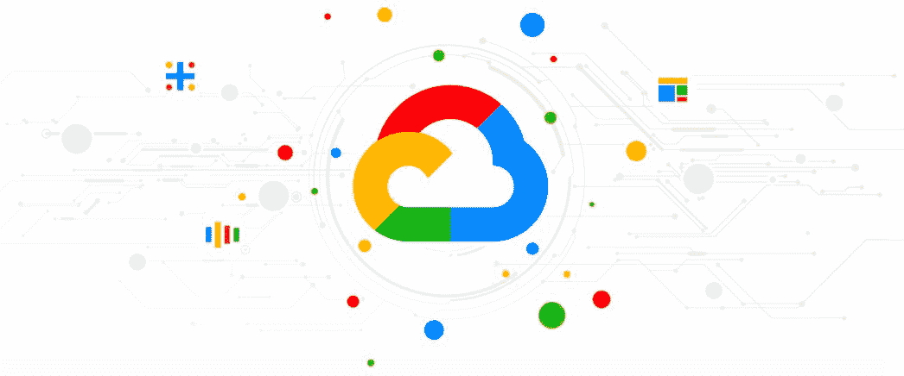
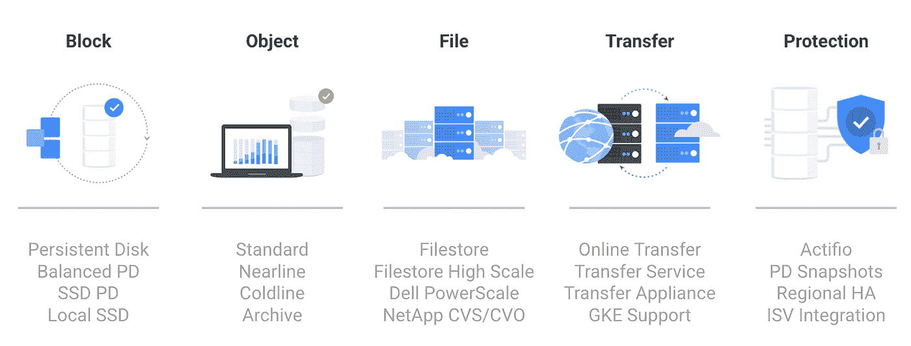
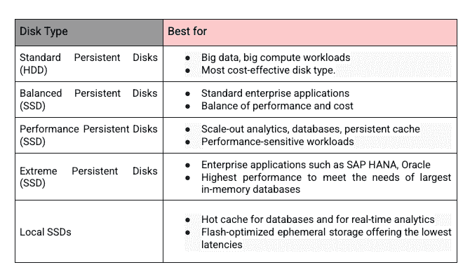
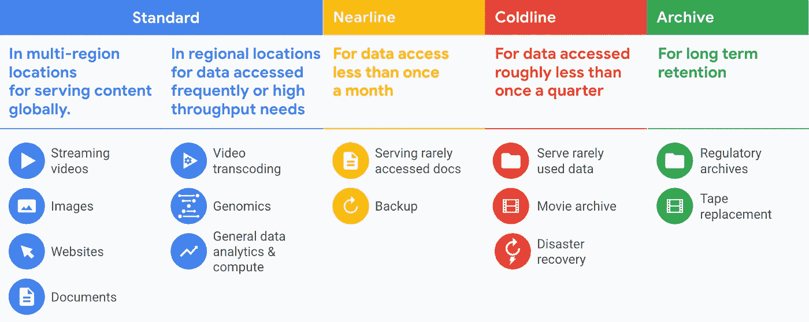
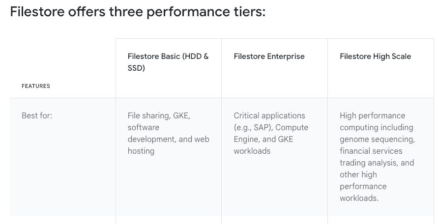
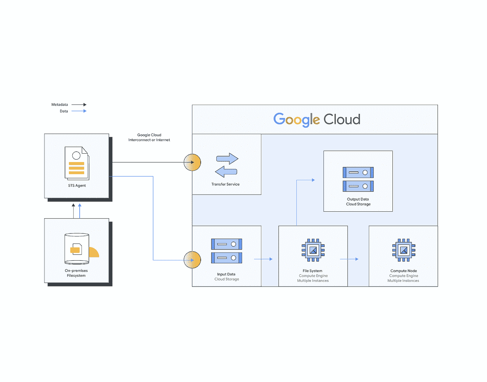
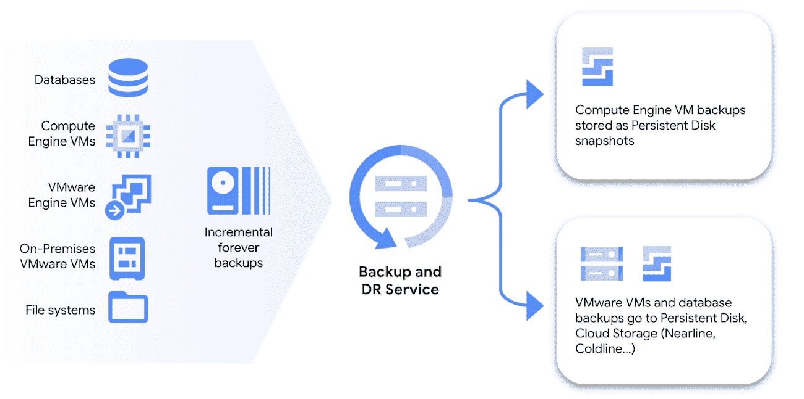
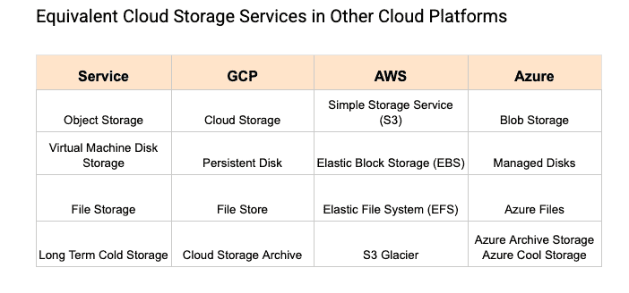

# 存储服务—GCP 选项

> 原文：<https://medium.com/google-cloud/storage-services-options-on-gcp-ba09a4e722f2?source=collection_archive---------3----------------------->

数据对于任何类型的企业都变得越来越重要。一家公司的竞争能力在很大程度上取决于它如何利用数据来获得竞争优势。每个企业都必须有一个数据存储和保护策略。

您将数据存储在哪里？您如何保护数据的安全？这个问题的答案在于谷歌云存储服务。

最常见的数据存储形式是对象存储、归档存储、文件存储和块存储，每种类型适用于不同的用途。随着时间的推移，谷歌的存储服务产品经历了显著的多样化，以满足各种应用的需求。

google cloud kitty 中的部分或全部存储产品涵盖了几乎所有用例，包括具有高性能需求、数据驻留限制、模糊或不断变化的访问模式或归档存储的用例。

# GCP 储物套件

支持谷歌云的同一存储系统也支持谷歌最受欢迎的产品，支持全球超过 10 亿用户的全球可用服务，如 YouTube、Drive、Gmail、Photos、workspace 产品套件等。

*   **持久磁盘**:灵活、耐用的块存储
*   **谷歌云存储**:可扩展、安全的对象存储桶
*   **文件存储:**简单、可预测、弹性的文件存储

除了上面提到的存储选项，GCP 还提供了各种工具，可以帮助促进不同云提供商之间的转移，并满足企业对其 HA/DR 设置的 RPO/RTO 要求。

*   **存储传输服务:**快速安全地传输数据
*   **Google 云备份和灾难恢复:**保护在 GCP 本地运行的工作负载&

GCP 存储产品

# 永久磁盘

谷歌持久盘是谷歌云平台提供的块存储服务。它允许您创建磁盘并将其连接到运行在 Google Cloud 中的虚拟机实例。这些磁盘独立于实例的生存期而持续存在，从而允许您将数据存储在磁盘上，这些数据可由多个实例随时间推移而使用。

您可以使用持久性磁盘来存储数据，如应用程序代码、日志和数据库。持久磁盘是为高性能而设计的，能够同时读写数据。它还设计了耐用性，在多个位置存储您数据的多个副本。

您可以创建各种大小和配置的永久磁盘，包括标准磁盘和 SSD 磁盘。您还可以创建具有不同性能层的磁盘，以满足您的工作负载要求。

要使用持久磁盘，您需要创建一个磁盘，然后将其附加到一个虚拟机实例。您可以使用 Google Cloud 控制台、gcloud 命令行工具或计算引擎 API 来实现这一点。一旦附加了磁盘，您就可以像在实例上使用任何其他磁盘一样使用它。您可以创建一个空白的持久性磁盘，也可以从数据源创建一个磁盘。您可以将永久磁盘用作虚拟机(VM)实例的引导磁盘，或者用作连接到 VM 的数据磁盘。

## 关键特征

*   **适用于任何工作负载的高性能数据块存储**持久磁盘性能随着磁盘的大小和虚拟机实例上 vCPUs 的数量而扩展。
*   **保持业务正常运行的耐用性和可用性**持久磁盘专为耐用性而设计。它会自动冗余存储您的数据，以确保最高级别的数据完整性。
*   **自动安全和加密**在数据从您的实例传输到永久磁盘存储之前，自动加密您的数据。每个永久磁盘都使用系统定义的密钥或客户提供的密钥进行加密。Google 将持久磁盘数据分布在多个物理磁盘上，确保了最高级别的安全性。删除磁盘时，密钥会被丢弃，导致数据不可恢复。

持久磁盘的不同选项

## 用例

*   数据库和 SAP 工作负载—作为数据块存储连接到虚拟机
*   引导映像
*   谷歌计算(GCE)和 Kubernetes 引擎(GKE)
*   高性能计算

## 定价

标准、SSD 和平衡持久磁盘按每个磁盘的调配空间量定价。对于这些磁盘类型，I/O 操作包含在调配空间的价格中。由于磁盘性能随着磁盘大小线性增长，因此在选择磁盘大小时要考虑 I/O 需求。

极度持久磁盘按每个磁盘调配的空间量和每个磁盘调配的 IOPS 数量定价。

成功删除永久磁盘后，将不再向您收取该磁盘的费用。

# 谷歌云存储

云存储是一种用于存储非结构化数据的托管服务。存储任意数量的数据，并根据需要随时进行检索。云存储通过在位于多个可用性区域的多个设备之间冗余地存储对象来提供 11 个 9 的持久性，并对动态和静态数据进行加密，以确保其安全性、完整性和隐私性。

云存储提供高可用性和高性能，同时具有很强的一致性。要使用云存储，首先要创建一个 bucket，这是一个在云存储中保存数据的基本容器。然后，您将把对象上传到这个桶中——在这里您可以下载、共享和管理对象。您可以使用云存储来托管网站，存储数据以进行分析和机器学习，或者备份数据以进行灾难恢复。

要在云存储中存储数据，您可以使用云存储 web 应用程序或云存储 API。一旦你的数据存储在云存储中，你可以从任何有互联网连接的地方访问它，并在你的应用程序或网站中使用它。您还可以对数据对象设置权限，以控制谁可以访问它。

## 关键特征

*   **自动存储类别转换**借助对象生命周期管理(OLM)和自动分类等功能，您可以轻松优化跨存储类别的对象放置成本。
*   **洲际规模和 SLA 支持的复制**行业领先的双区域存储桶支持大量区域。一个大陆规模的存储桶提供了跨三大洲的九个区域，提供了零恢复时间目标(RTO)。
*   **快速灵活的传输服务**存储传输服务提供了一种高性能的在线云存储途径，既具有简化数据传输流程所需的可扩展性和速度。
*   **默认和可配置的数据安全性**云存储提供设计安全功能来保护您的数据，并提供高级控制和功能来保护您的数据隐私和安全，防止泄漏或泄露。
*   **领先的分析和 ML/AI 工具**一旦你的数据存储在云存储中，你就可以轻松地插入谷歌云的强大工具，用 BigQuery 创建你的数据仓库，用 Dataproc 运行开源分析，或者用 Vertex AI 构建和部署机器学习(ML)模型。

## 用例

*   使用云存储进行备份、归档和恢复。
*   媒体内容存储和交付—借助云存储的地理冗余功能，将音频或视频直接传输到应用或网站。
*   数据湖和大数据分析—用于代码的协作和版本控制。
*   机器学习和人工智能——一旦你的数据存储在云存储中，就可以利用各种选项来经济高效地训练深度学习和机器学习模型。
*   主持一个网站。

## 云存储桶的存储类别

**标准**存储类提供最高级别的可用性和性能，特别适合频繁访问或短期数据。

**近线**为不经常访问的数据(包括长尾内容)提供快速、低成本和高度耐用的存储。

**Coldline** 提供近线存储的优势，同时针对灾难恢复等较冷的数据用例进行优化。

**归档存储**归档存储是成本最低、高度耐用的存储服务，用于数据归档、在线备份和灾难恢复。与其他云提供商提供的“最冷”存储服务不同，您的数据可以在几毫秒内访问，而不是几小时或几天。

云存储通过其灵活的存储类别，非常适合广泛的存储需求，从提供热分析数据到归档冷法规遵从性数据

## 定价

所有存储类别都没有最低费用，并提供按需购买的容量定价。对象生命周期管理工具允许您根据需要安排删除和将对象转移到较冷的存储类别，从而进一步降低成本。

云存储定价基于以下组件:

*   **数据存储**:存储在存储桶中的数据量。存储速率因数据的存储类别和存储桶的位置而异。
*   **数据处理**:云存储所做的处理，包括运营费用、任何适用的检索费用以及跨区域复制。
*   **网络使用量**:从存储桶中读取或在存储桶之间移动的数据量。

# 文件存储

大多数本地数据存储在文件系统中，随着应用程序迁移到云，它们对文件存储的需求不会改变，因此文件存储对于企业的提升和转移以及基础架构现代化至关重要。文件是一种有用的抽象，甚至诞生在云端的应用程序也在利用文件。

Google Filestore 是一个完全托管的文件存储服务，使您能够在 Google Cloud 上存储和访问文件数据。它专为需要快速、可扩展和低延迟访问文件数据(如共享文件系统和主目录)的使用情形而设计。

Filestore 提供三种性能等级:标准、高性能和极高性能。您选择的性能层取决于您的工作负载要求和您存储的文件数据类型。

要使用 Filestore，您需要创建一个 Filestore 实例，然后将其作为文件系统装载到计算引擎虚拟机实例或 Kubernetes 引擎集群。然后，您可以像在实例上使用任何其他文件系统一样使用 Filestore 实例。

Filestore 与其他 Google 云服务集成，如 Compute Engine、Kubernetes Engine 和云负载平衡，使您可以轻松扩展和管理您的文件存储需求。

Filestore 支持将应用程序迁移到云，无需您重写或重新设计架构，从而加速并简化您的迁移。Filestore 支持希望使用标准文件和目录的应用程序。如果您的应用程序运行在 Windows 或 Linux 上，它们很可能依赖于幕后的文件存储。

## 关键特征

**扩展以满足高性能工作负载的需求** Filestore 为应用程序提供低延迟存储操作。对于延迟敏感的工作负载，如高性能计算、数据分析或其他元数据密集型应用程序，Filestore 支持高达 100 TB 的容量和 25 GB/s 的吞吐量以及 920K IOPS。

**99.99%的区域可用性 SLA 支持企业应用程序** Filestore Enterprise 专为需要区域可用性的关键应用程序(例如 SAP)而构建，以确保应用程序在区域停机时不会被分段。

**通过备份和快照保护您的数据** Filestore 提供即时备份和快照，帮助您轻松保护数据。备份文件共享的数据和元数据，设置定期备份计划，或者在需要时随时拍摄实例的快照。

**通过 Filestore 支持 GKE 工作负载**对于在 GKE 运行的需要文件存储的应用，完全托管的 NFS 解决方案支持有状态和无状态应用。通过集成和管理的 GKE 容器存储接口(CSI)驱动程序，多个 pod 可以共享文件系统对相同数据的访问。

## 用例

*   **企业应用程序迁移(SAP)** — Filestore 专为需要区域可用性和非结构化 NFS 数据需求的关键应用程序而构建。
*   **金融服务和技术** —它专为高性能计算(HPC)应用而构建，用于在正确的时间访问、排序、处理、建模和向正确的决策者交付正确的信息。
*   **媒体渲染** —您可以在计算引擎实例上轻松安装文件存储文件共享，使视觉特效艺术家能够在同一文件共享上进行协作。
*   **数据分析** — Filestore 支持对数据的即时访问，以实现高性能、智能的分析，而无需浪费宝贵的时间将数据加载到客户端的驱动器上。
*   **基因组处理** —基因组测序需要惊人数量的原始数据，大约每人数十亿个数据点。这种类型的分析需要速度、可伸缩性和安全性。Filestore 满足了需求。
*   **Web 内容管理** — Web 开发人员和大型托管服务提供商依靠 Filestore 来管理和提供 Web 内容，包括 WordPress 托管等需求。

文件存储性能层

## 定价

文件存储定价基于以下要素:

*   **服务层**:您的实例的服务层是基本 HDD(标准)、基本 SSD(高级)、企业还是高规模 SSD。
*   实例容量:你需要为分配的存储容量付费，即使它没有被使用。
*   **Region** :您的实例被提供的位置。

# 存储转移服务

移动数据是一项挑战，它需要大量的时间和资源。

Google Storage Transfer Service 是一项完全托管的服务，使您能够将数据从外部数据源(如内部存储系统或其他云存储提供商)传输到 Google 云存储。它旨在使将大量数据移动到云变得容易，并支持调度和自动化传输、监控传输进度和处理错误。

存储传输服务可以从以下来源传输数据:

*   本地文件系统
*   亚马逊简单存储服务(S3)
*   HTTP/HTTPS 位置
*   云存储桶

您可以使用 Storage Transfer Service 一次性传输数据，或者设置定期传输，以保持云中的数据是最新的。您还可以指定过滤器，以便在传输中包括或排除某些文件或目录。

要使用存储转移服务，您需要在 Google Cloud 控制台中或使用存储转移 API 创建一个转移作业。然后，该服务将处理从源到云存储桶的数据传输。通过集中式作业管理监控传输状态，无需编写一行代码即可完成传输。

## 关键特征

**可靠而安全的数据传输**通过在线网络从内部资源或其他云迁移数 Pb 的数据—数十亿个文件和数十 Gbps 的数据。利用横向扩展性能优化您的网络带宽并加速传输。

**数据加密和验证** Storage Transfer Service 对传输中的数据进行加密，支持 VPC 服务控制，并使用校验和来执行数据完整性检查，确保您的数据完好无损地到达。

**增量传输**所有传输仅移动自上次传输以来新增、更新或删除的文件和对象，最大限度地减少需要传输的数据量。

**元数据保存** Storage Transfer Service 提供在传输过程中保存对象和文件元数据的控制。

## 用例

*   数据中心迁移
*   内容存储和交付
*   灾难恢复、备份和归档
*   分析和机器学习

## 定价

使用代理进行传输的费用为 0.0125 美元/GB，除了与网络使用、存储和服务在源和目的地代表您执行的其他操作相关的费用之外，还将向您收取此费用。

使用 STS 的示例架构

# 备份和灾难恢复服务

备份和灾难恢复是业务连续性计划的重要组成部分。云备份和灾难恢复使 GCP 客户能够通过策略集中管理大规模备份和灾难恢复，以确保安全、可靠和高效地备份在 GCP 运行的虚拟机、数据库和工作负载。保护各种工作负载，并从一个中央控制面板管理它们。服务于关键使用案例，例如从数据损坏、数据丢失、勒索软件恢复中恢复，或者用于测试/开发的数据库克隆。依靠应用程序一致的永久增量备份。该服务提供低恢复时间目标(RTO)和恢复点目标(RPO)。要使用 Google Cloud 实施灾难恢复策略，您需要定义您的恢复目标，并根据您的需求选择合适的工具和服务。

## 关键特征

**跨工作负载的集中备份管理**借助 Google 云备份和灾难恢复，管理员可以有效管理跨多个工作负载的备份。管理员可以为计算引擎、VMware 引擎或本地 VMware、数据库(如 SAP、MySQL 和 SQL Server)和文件系统上的虚拟机生成应用程序和崩溃一致性备份。

**高效利用存储，最大限度降低成本**节省空间的“永远增量”存储技术，确保您只为真正需要的东西付费。使用“永远增量”备份，在 Google 云备份和灾难恢复进行初始备份后，后续备份仅存储与相对于先前备份的更改相关的数据。

**最短的恢复时间**谷歌云备份和灾难恢复以应用程序可读的原始格式存储备份数据。因此，许多工作负载的备份数据可以直接从长期备份存储中获得。

## 用例

*   提供与您的业务相符的恢复时间
*   出于测试/开发/分析目的，将云备份作为数据库克隆重复使用
*   本机格式的应用程序一致性备份

GCP 备份和灾难恢复

## 定价

Google 云备份和灾难恢复服务根据使用情况按月计费。内置了灵活性，允许您在存储成本和数据保留时间之间取得理想的平衡。例如，当选择在 Google 云存储上存储备份时，您可以根据自己的需求选择合适的云存储类别。

# 与其他流行云平台的比较

所有三大云提供商——亚马逊网络服务(AWS)、谷歌云平台(GCP)和微软 Azure——都提供一系列存储服务，用于存储和管理云中的数据。这些服务旨在满足不同的需求和使用情形，例如为应用程序存储和访问数据，为分析存储和处理数据，或者为备份和灾难恢复存储数据。

以下是这些云提供商提供的存储服务的高级对比:

# **AWS**

*   **亚马逊 S3** :对象存储服务，可用于从任何地方存储和检索任何数量的数据。
*   **亚马逊 EBS:** 为亚马逊弹性计算云(EC2)实例提供持久存储的块存储服务。
*   **亚马逊 EFS:** 一种文件存储服务，为亚马逊 EC2 实例和本地系统提供可伸缩的文件存储。
*   **亚马逊冰川:**档案数据的低成本存储服务。

# 蔚蓝的

*   **Azure Blob Storage:** 一种对象存储服务，允许您存储和访问大量非结构化数据，如图像、视频和文档。
*   **Azure Files:** 一种文件存储服务，允许您创建可以从 Azure 虚拟机或本地系统访问的文件共享。
*   **Azure 磁盘存储:**为 Azure 虚拟机提供持久存储的块存储服务。

这些云存储服务都有其独特的功能和定价模式，因此仔细评估您的存储需求并选择最适合您的使用案例和预算的服务非常重要。

# GCP/AWS/Azure 的存储选项

前三大云提供商的存储服务

# 结论

Google cloud 提供了全面的存储选项，以满足云客户的不同业务使用情形。我希望这个博客能够为您提供决策能力，从这些不同的可用选项中进行选择，以解决您各自用例的存储需求。