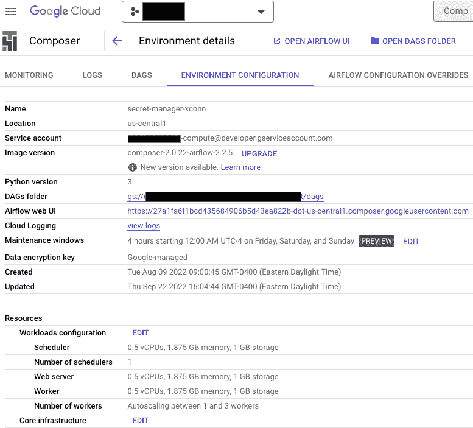
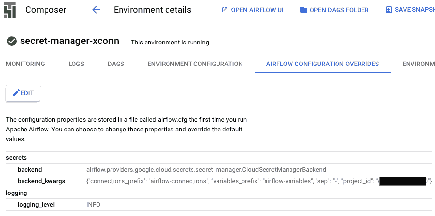
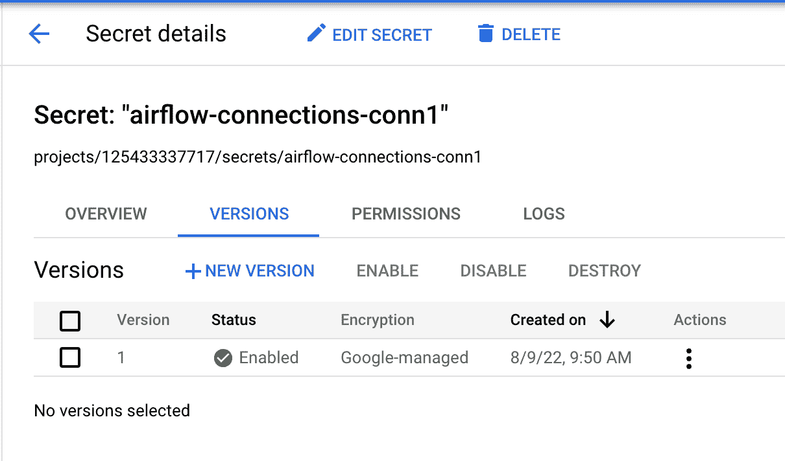
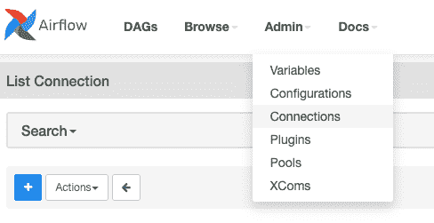
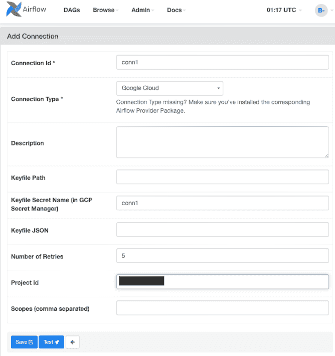

# 在 GCP 秘密管理器中存储服务帐户密钥

> 原文：<https://medium.com/google-cloud/store-service-account-keys-in-gcp-secret-manager-d74f0a1d11fc?source=collection_archive---------1----------------------->

*与* [*合写 Bipin Upadhyaya*](https://medium.com/u/b946360addad?source=post_page-----d74f0a1d11fc--------------------------------)*—2022 年 11 月 16 日*

气流 Dag 可能需要在运行时向其传递连接和变量，以执行操作符和传感器。传统上，Airflow 开发人员使用环境变量或 metastore 数据库来存储和检索这些连接以及在 Airflow worker pods 中 DAG 解析或任务执行期间使用的变量。

除了这些选项，Airflow 1.10.10 或更高版本还提供了对秘密后端的支持。在安全性方面，使用[秘密后端](https://airflow.apache.org/docs/apache-airflow/1.10.10/howto/use-alternative-secrets-backend.html)是一个很好的实践，因为它们提供了额外的安全层和秘密后端的所有功能，如自动旋转、自定义加密密钥等。也可以杠杆化。

Cloud Composer 的用户可以使用 Secret Manager(一个秘密后端)将敏感变量(如密码和服务帐户密钥)安全地存储在一个集中的位置。他们还可以分配精细的权限和经审核的访问控制，以符合其组织的安全要求。

尽管存储在 Secret Manager 中的机密可以与环境变量一起使用，但在 DAG 运行时，存储在 Secret Manager 中的详细信息优先于存储在环境变量或 metastore 数据库中的详细信息(如果值彼此不同)。

本指南介绍了配置 Cloud Composer 环境以从 Secret Manager 读取连接的步骤。

# 设置和要求

这两个步骤创建必要的环境变量，并授予 Composer 服务帐户读取机密的权限。

**步骤 1:** 该步骤显示了如何启用 Secret Manager 并授予 Composer 服务帐户对它的读取权限，假设已经创建了 Composer 环境(如果没有，请按照步骤[创建环境](https://cloud.google.com/composer/docs/composer-2/create-environments))。在“环境配置”选项卡中，从“环境详细信息”页面获取 Composer 服务帐户的详细信息。



*图 Composer 中环境详细信息页面上的环境配置选项卡*

下面的代码片段显示了如何启用 Secret Manager 并授予 composer 服务帐户权限。将<<project-id>替换为配置了 Secret Manager 的项目，将<<service-account>替换为从环境配置选项卡中复制的 Composer 服务帐户，并运行命令。</service-account></project-id>

```
gcloud services enable secretmanager.googleapis.com
gcloud projects add-iam-policy-binding <<project-id>> --member=serviceAccount:<<composer-service account>> --role=roles/secretmanager.secretAccessor
```

**步骤 2:** 使用 secrets.backend 和 secrets.backend_kwarg 的气流配置的覆盖来配置 Composer。下面的代码片段显示了如何设置气流配置的秘密。

```
secrets.backend = 
airflow.providers.google.cloud.secrets.secret_manager.CloudSecretManagerBackend
secrets.backend_kwargs = 
{"connections_prefix": "airflow-connections", "variables_prefix": "airflow-variables", "sep": "-","project_id"="<<replace-with-project-id>>"}
```

backend_kwargs 值是具有以下字段的 [backend_kwargs 对象](https://airflow.apache.org/docs/apache-airflow-providers-google/stable/secrets-backends/google-cloud-secret-manager-backend.html#backend-parameters)的 JSON 表示:

*   connections_prefix:指定要读取以获取连接的秘密名称的前缀。默认为:气流-连接。
*   variables_prefix:指定要读取以获取变量的秘密名称的前缀。默认值为:气流-变量。
*   GCP _ key _ Path:Google Cloud 凭据 JSON 文件的路径(如果没有提供，则使用默认服务帐户)。
*   GCP _ keyfile _ dict:Google Cloud Credential JSON 字典。与 gcp_key_path 互斥。
*   sep:用于连接 connections_prefix 和 conn_id 的分隔符。默认值为:-。
*   project_id:存储机密的 Google Cloud 项目 id。



*图 2:Composer*环境详细信息页面上的气流配置覆盖选项卡

# 从 Secret Manager 访问变量

**第一步:**根据你的变量名称(my_secret)，在 Secret Manager 中创建一个条目(airlfow-variables-my-secret)。添加变量前缀为“气流-变量”

```
printf "s3cr3t" | gcloud secrets create airlfow-variables-my-secret --data-file=-
```

**步骤 2:** 部署 DAG。这是一个简单的例子

```
import airflow 
from airflow import DAG 
from datetime import datetime, timedelta 
from airflow.operators.bash_operator import BashOperator 

YESTERDAY = datetime.combine( datetime.today() - timedelta(days=1), datetime.min.time())
default_args = { 
'retries': 2,
'retry_delay': timedelta(seconds=60), 
'start_date': YESTERDAY, 
}

with DAG('secrets_manager', 
default_args=default_args,
start_date=YESTERDAY, 
schedule_interval='@once') as dag: 
  t = BashOperator( task_id="get_variable_value", bash_command='echo "MY SECRET: {{ var.value.my-secret }}" ')
```

# 基于 Secret Manager 中的服务帐户密钥创建气流连接

在这个例子中，我们将使用一个 BigQuery 数据集。(按照这些[步骤](https://cloud.google.com/bigquery/docs/datasets)创建数据集)

**步骤 1:** 在 Secret Manager 中，创建将用作气流连接的密码。

1.  使用以下命令获取服务帐户 JSON

```
gcloud iam service-accounts keys create KEY_FILE \  --iam-account=SA_NAME@PROJECT_ID.iam.gserviceaccount.com
```

2.使用下面的示例程序(connection _ for _ Secret _ Manager . py)，可以得到可以直接上传到 Secret Manager 的值。

```
import sys, urllib.parse as ul
import json
import getopt

def get_content_for_secret(service_account_path, project_id):
    file=open(service_account_path)
    sa_value=file.read()
    sa_value_deser=json.dumps(sa_value)
    sa_quote_plus_value=ul.quote_plus(sa_value_deser)
    first_half_extra = ul.quote_plus('{"extra__google_cloud_platform__key_path": "", "extra__google_cloud_platform__key_secret_name": "","extra__google_cloud_platform__keyfile_dict":')
    second_half_extra=ul.quote_plus(', "extra__google_cloud_platform__num_retries": 5, "extra__google_cloud_platform__project": "{}", "extra__google_cloud_platform__scope": ""}}'.format(project_id))
    return "google-cloud-platform://?__extra__={}{}{}".format(first_half_extra,sa_quote_plus_value,second_half_extra)

def main(argv):
   service_account_file_path = ''
   project_id = ''
   try:
      opts, args = getopt.getopt(argv,"hi:p:",["saPath=","projectId="])
   except getopt.GetoptError:
      print('connection_for_secret_manager.py -i <service_account_file_path> -p <project_id>')
      sys.exit(2)
   for opt, arg in opts:
      if opt == '-h':
         print('connection_for_secret_manager.py -i <service_account_file_path> -p <project_id>')
         sys.exit()
      elif opt in ("-i", "--saPath"):
         service_account_file_path = arg
      elif opt in ("-p", "--projectId"):
         project_id = arg
   return service_account_file_path, project_id

if __name__ == "__main__":
    service_account_file_path, project_id = main(sys.argv[1:])
    print(get_content_for_secret(service_account_file_path, project_id))
```

```
python3 connection_for_secret_manager.py -i <<service_account_path>>  -p <<project_id>> > output_for_secret_manager
```

3.将输出内容上传到 Secret Manager。从气流 DAG 开始，此连接称为 conn1。在 Secret Manager 中，您需要创建带有前缀“airflow-connections”的条目

```
gcloud secrets versions add airflow-connections-conn1 --data-file=output_for_secret_manager
```



**步骤 2** :导航到管理>连接，创建 GCP 连接(连接 1)。



单击添加新记录以创建新连接。在连接 id 上，输入 conn1，连接类型 Google Cloud，airflow-connections-conn1 作为密钥文件机密名称和配置了机密管理器的项目 Id。



**步骤 3:** 部署示例 DAG(参见下面的 DAG 代码)并手动触发工作流。下载一个 BigQuery 公共数据集([示例](https://open.toronto.ca/dataset/daily-shelter-occupancy/))，以 shelter_2020.csv 的格式存储在 Google 云存储中，在下面的 Python 示例中更改 bucket 名称(< < GCS_BUCKET_NAME > >)。同样地更改 BigQuery 项目、数据集和表名(< < PROJECT_ID > >)。< <数据集> >。< <表> >)。

Python DAG 示例:

```
from airflow import DAG
from airflow.operators.dummy import DummyOperator
from datetime import datetime, timedelta
from airflow.hooks.base_hook import BaseHook
from airflow.providers.google.cloud.transfers.gcs_to_bigquery import GCSToBigQueryOperator

YESTERDAY = datetime.combine( datetime.today() - timedelta(days=1), datetime.min.time())
with DAG('example_secret_connections_conn1', start_date=YESTERDAY, schedule_interval=None) as dag:

    start = DummyOperator(
        task_id='start'
    )
    bq_load_task = GCSToBigQueryOperator(
        task_id='bqload',
        bucket='<<GCS_BUCKET_NAME>>',
        source_objects=["shelter_2020.csv"],
     destination_project_dataset_table='<<PROJECT_ID>>.<<DATASET>>.<<TABLE>>',
        skip_leading_rows=1,
        schema_fields=[
                { "name": "_id", "type": "INTEGER" },
                { "name": "OCCUPANCY_DATE", "type": "STRING" },
                { "name": "ORGANIZATION_NAME", "type": "STRING" },
                { "name": "SHELTER_NAME", "type": "STRING" },
                { "name": "SHELTER_ADDRESS", "type": "STRING" },
                { "name": "SHELTER_CITY", "type": "STRING" },
                { "name": "SHELTER_PROVINCE", "type": "STRING" },
                { "name": "SHELTER_POSTAL_CODE", "type": "STRING" },
                { "name": "FACILITY_NAME", "type": "STRING" },
                { "name": "PROGRAM_NAME", "type": "STRING" },
                { "name": "SECTOR", "type": "STRING" },
                { "name": "OCCUPANCY", "type": "INTEGER" },
                { "name": "CAPACITY", "type": "INTEGER" }
        ],
        write_disposition='WRITE_TRUNCATE',
        gcp_conn_id='conn1'
    )
    stop = DummyOperator(
        task_id='stop'
    )

    start >> bq_load_task >> stop
```

触发工作流并验证 BigQuery 表中的数据是否可用。

# 结论

使用 Secrets Manager 来存储传递到 Dag 的机密，并将其与 Composer 环境集成有很多好处。本指南中的步骤描述了如何配置 Composer 环境以从 GCP Secret Manager 读取连接，并提供了一些示例代码。

# 附加链接

[https://air flow . Apache . org/docs/Apache-air flow/1 . 10 . 10/how to/use-alternative-secrets-back end . html # GCP-secrets-manager-back end](https://airflow.apache.org/docs/apache-airflow/1.10.10/howto/use-alternative-secrets-backend.html#gcp-secrets-manager-backend)