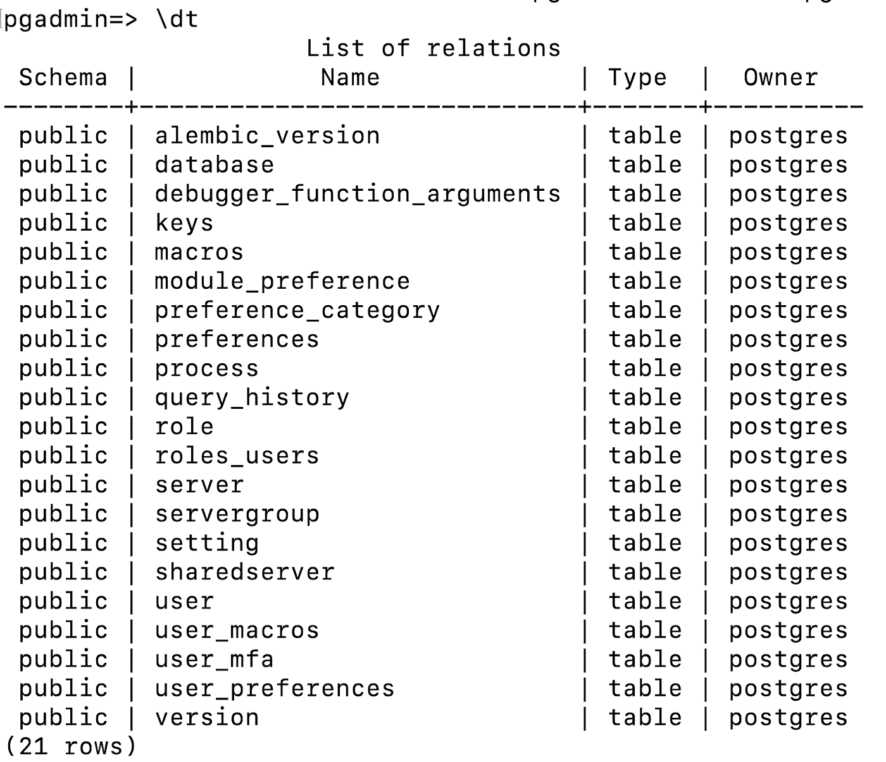

# CloudSQL 作为 pgAdmin 配置的外部数据库

> 原文：<https://medium.com/google-cloud/storing-pgadmin-configuration-on-cloudsql-as-external-database-6ac367c38f42?source=collection_archive---------5----------------------->

pgAdmin 是一个广泛使用的、用户友好的 PostgreSQL 数据库客户端控制台。pgAdmin 的最新版本 6.16 增加了对在外部数据库中存储配置的支持。

对于那些想要定制自己的 pgAdmin 设置的用户来说，这是一个很有用的特性，比如禁用仪表板或者将主题改为黑暗模式。以前，pgAdmin 配置存储在本地 SQLite 数据库中，但现在用户可以选择使用外部的 PostgreSQL 兼容数据库来存储他们的设置。

## *配置 _ 数据库 _URI 配置*

pgAdmin 版在标志 *CONFIG_DATABASE_URI* 上提供了额外的选项，可用于将默认存储从 SQLite 数据库覆盖到外部 PostgreSQL 数据库。

用于指定外部 PostgreSQL 数据库的示例格式。

> ' CONFIG _ DATABASE _ URI = ' PostgreSQL://<<username>>:<<password>> @<<host-endpoint>>:<<port>>/<<databasename>> '</databasename></port></host-endpoint></password></username>

我们可以找到包含 *CONFIG_DATABASE_URI* 选项的 pgAdmin，config.py 配置文件的路径通常如下。

> **Mac**:-/Applications/pgAdmin 4.app/Contents/Resources/web/config.py
> 
> **Windows**:-C:\ Users \<<用户名>>\ AppData \ Local \ Programs \ pg admin 4 \ V6 \ web \

## CloudSQL for PostgreSQL 作为 pgAdmin 配置的外部数据库

将 CloudSQL 配置为外部数据库很简单。为此，您只需使用 CloudSQL 数据库详细信息更新 CONFIG_DATABASE_URI。建立连接后，重新启动 pgAdmin 应用程序。

应用程序可能需要几分钟时间在新数据库中设置必要的表，并存储所有与 pgAdmin 相关的信息，包括用户首选项。

pgAdmin 外部数据库表

设置外部数据库后，我修改了仪表板和主题的首选项，如前面分享的截图所示。

接下来的步骤是在我的新机器上安装 pgAdmin，并修改 config.py 配置文件以使用相同的外部 PostgreSQL 数据库。

这将允许我从以前的设置中加载所有的 pgAdmin 配置设置，并覆盖新实例上的默认设置。

pgAdmin *配置 _ 数据库 _URI 配置*

将 pgAdmin 首选项存储在外部 PostgreSQL 数据库上真的很酷。一个为 PostgreSQL 数据库提供查询和操作接口的工具，也可以在 PostgreSQL 上存储 pgAdmin 配置。