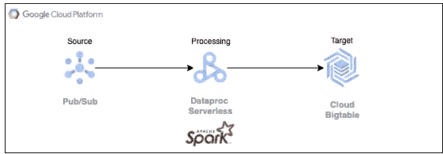

# 使用 Dataproc 无服务器将数据从发布/订阅流式传输到大表

> 原文：<https://medium.com/google-cloud/stream-data-from-pub-sub-to-bigtable-using-dataproc-serverless-3142c1bcc22a?source=collection_archive---------8----------------------->

Google Cloud Pub/Sub 用于流分析和数据集成管道，以接收和分发实时/流数据。事件驱动的使用案例数不胜数，需要将数据从发布/订阅传输到 Bigtable 等存储设备，以实现低延迟读取。

在无服务器处理时代，在专用集群上运行 Spark 作业会增加更多的处理开销，并占用开发人员宝贵的开发时间。将完全托管的随需应变服务器与 Spark jobs 结合使用，有助于开发人员专注于核心应用程序逻辑，而在框架上花费很少或没有时间。Google 的 Dataproc Serverless 就是 Google 云平台提供的一个这样的产品，使客户能够运行 Spark 工作负载，而不必创建或维护集群。一旦 Spark 工作负载参数被指定并且任务被提交给服务，Dataproc Serverless 将在后台处理所有必要的基础设施。

无需从头开始创建它们，我们可以使用 Java 和 Python 在 Dataproc 无服务器上运行典型用例——这要感谢 D **ataproc 模板**。借助这些模板，我们可以轻松定制和运行常见的 Spark 工作负载。在这篇文章中，我们将探索如何使用 Dataproc 无服务器将来自发布/订阅主题的 ***数据流传输到 BigTable***



发布/订阅到 Bigtable

**主要优势**

*   [**publisubtobigtable**](https://github.com/GoogleCloudPlatform/dataproc-templates/tree/GCS_to_bigtablejava/java/src/main/java/com/google/cloud/dataproc/templates/pubsub)模板在 **Spark-Java** 中是开源的，完全可定制，可以随时用于简单的工作。
*   您可以将数据以 **JSON** 格式从 Pub/Sub 传输到 BigTable。
*   通过简单地改变连接参数，这些模板可以相对快速地用于具有相同需求的用例。

**基本用法**

1) [Google Cloud SDK](https://cloud.google.com/sdk/docs/install) 安装并认证。你可以在谷歌云控制台中使用云外壳，通过这个[链接](https://console.cloud.google.com/cloudshell/editor)获得一个已经配置好的环境。

2)如果您要使用由 GCP 生成的“默认”VPC 网络，请确保您已经启用了带有专用 Google 访问的子网。您仍然需要启用如下的私人访问。


```
gcloud compute networks subnets update default - region=us-central1 - enable-private-ip-google-access
```

3)在预装[各种工具](https://cloud.google.com/shell/docs/how-cloud-shell-works)的云壳中克隆 git repo。或者，你可以使用任何预装了 JDK 8+，Maven 和 Git 的机器。

```
git clone https://github.com/GoogleCloudPlatform/dataproc-templates.git 
cd dataproc-templates/java
```

4)创建 GCS 存储桶和暂存文件夹。这个存储桶将用于存储运行无服务器集群所需的依赖项/ Jar 文件

5)创建一个发布/订阅主题。还要为此发布/订阅主题创建订阅。

```
gcloud pubsub topics create your-test-topic
gcloud pubsub subscriptions create --topic your-test-topic your-test-topic-sub
```

6)在集群的实例中创建一个具有所需列族的 BigTable 表。(如果实例不存在，则创建实例)

7)获取认证凭证(提交 Dataproc 作业)。

```
gcloud auth application-default login
```

8)配置 Dataproc 无服务器作业:

要执行 dataproc 作业，需要设置以下配置。

*   `GCP_PROJECT`:无服务器运行 Dataproc 的 GCP 项目。
*   `REGION`:运行 Dataproc 无服务器的区域。
*   `GCS_STAGING_LOCATION`:一个 GCS 位置，Dataproc 将在此存储登台资产。应该在之前创建的存储桶内。

```
export GCP_PROJECT=<project_id>
export REGION=<region>
export GCS_STAGING_LOCATION=<gcs-staging-bucket-folder>
```

9)对 BigTable 模板执行 Pub/Sub，为执行指定模板和以下参数值

*   `pubsub.input.project.id`:发布/订阅的项目 id
*   `pubsub.input.subscription`:发布/订阅订阅名称
*   `pubsub.bigtable.output.instance.id`:Bigtable 的实例 Id
*   `pubsub.bigtable.output.project.id`:Bigtable 的项目 Id
*   `pubsub.bigtable.output.table` : Bigtable 表名

```
bin/start.sh \
-- --template PUBSUBTOBIGTABLE \
--templateProperty pubsub.input.project.id=<pubsub project id> \
--templateProperty pubsub.input.subscription=<pubsub subscription> \
--templateProperty pubsub.bigtable.output.instance.id=<bigtable instance id> \
--templateProperty pubsub.bigtable.output.project.id=<bigtable output project id> \
--templateProperty pubsub.bigtable.output.table=<bigtable output table>

Here is an example submission:
export GCP_PROJECT=your-project-id
export REGION=your-region 
export GCS_STAGING_LOCATION=gs://your-bucket/temp 

bin/start.sh -- --template PUBSUBTOBIGTABLE --templateProperty pubsub.input.project.id=your-project-id --templateProperty pubsub.input.subscription=your-test-topic-sub --templateProperty pubsub.bigtable.output.project.id=your-project-id --templateProperty pubsub.bigtable.output.instance.id=your-bt-instance --templateProperty pubsub.bigtable.output.table=your-bt-table
```

**注意**:如果尚未启用，它会要求您启用 Dataproc Api。

**可配置参数**

以下是命令行或 [template.properties](https://github.com/GoogleCloudPlatform/dataproc-templates/blob/GCS_to_bigtablejava/java/src/main/resources/template.properties) 文件中的一些可选可配置属性

```
## Project that contains the input Pub/Sub subscription to be read
pubsub.input.project.id=<pubsub project id>
## PubSub subscription name
pubsub.input.subscription=<pubsub subscription>
## Stream timeout, for how long the subscription will be read
pubsub.timeout.ms=60000
## Streaming duration, how often wil writes to BQ be triggered
pubsub.streaming.duration.seconds=15
## Number of streams that will read from Pub/Sub subscription in parallel
pubsub.total.receivers=5
## Project that contains the output table
pubsub.bigtable.output.project.id=<bigtable output project id>
## BigTable Instance Id
pubsub.bigtable.output.instance.id=<bigtable instance id>
## BigTable output table
pubsub.bigtable.output.table=<bigtable output table>
```

下面是发布/订阅中的输入消息和 BigTable 中的输出行的示例

```
Sample Message in Pub/sub:

{
  "rowkey": "rk6",
  "columns": [
    {
      "columnfamily": "cf",
      "columnname": "field1",
      "columnvalue": "value1"
    },
    {
      "columnfamily": "cf",
      "columnname": "field2",
      "columnvalue": "value5"
    },
    {
      "columnfamily": "cf",
      "columnname": "field3",
      "columnvalue": "value3"
    }
  ]
}

Sample Row in BigTable:

rk6
  cf:field1                                @ 2022/12/20-06:17:01.318000
    "value1"
  cf:field2                                @ 2022/12/20-06:17:01.318000
    "value5"
  cf:field3                                @ 2022/12/20-06:17:01.318000
    "value3"

The below command can be used as an example to populate the message in topic T1:
gcloud pubsub topics publish T1 --message='{"rowkey":"rk6","columns":[{"columnfamily":"cf","columnname":"field1","columnvalue":"value1"},{"columnfamily":"cf","columnname":"field2","columnvalue":"value5"},{"columnfamily":"cf","columnname":"field3","columnvalue":"value3"}]}'

Instead if messages are published in other modes like a publisher, here is the example string to use:
"{ \"rowkey\":\"rk6\",\"columns\": [{\"columnfamily\":\"cf\",\"columnname\":\"field1\",\"columnvalue\":\"value1\"},{\"columnfamily\":\"cf\",\"columnname\":\"field2\",\"columnvalue\":\"value5\"},{\"columnfamily\":\"cf\",\"columnname\":\"field3\",\"columnvalue\":\"value3\"}] }"
```

确保 Pub/Sub 中必须有消息，以便读取和写入 BigTable，否则不会向 Bigtable 中写入任何内容。

10)监视火花批量作业

提交作业后，我们将能够在 [Dataproc 批处理 UI](https://console.cloud.google.com/dataproc/batches) 中看到。从那里，我们可以查看作业的指标和日志。

**参考文献**
[https://cloud.google.com/bigtable/docs/overview](https://cloud.google.com/bigtable/docs/overview)
[https://cloud.google.com/pubsub/docs/overview](https://cloud.google.com/pubsub/docs/overview)
[https://github.com/GoogleCloudPlatform/dataproc-templates](https://github.com/GoogleCloudPlatform/dataproc-templates)

如有任何疑问/建议，请联系:**data proc-templates-support-external**@ Google groups . com