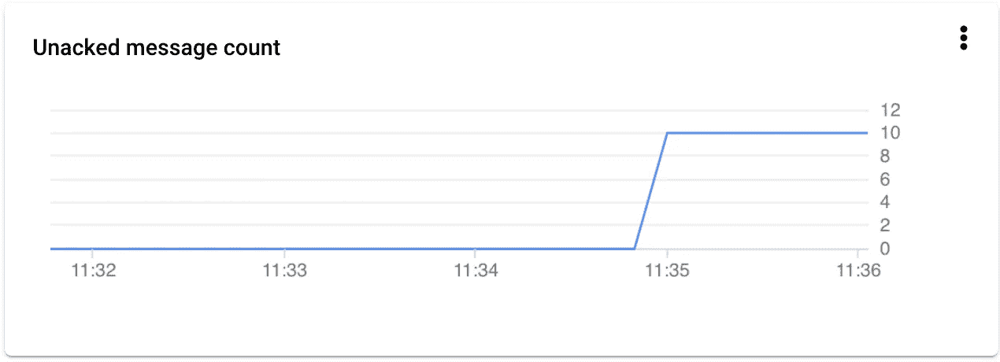

# 以一种无服务器的方式将数百万个事件从客户机流式传输到 BigQuery，第 1 部分

> 原文：<https://medium.com/google-cloud/stream-millions-of-events-from-your-client-to-bigquery-in-a-serverless-way-part-1-a38c4f9cd6e4?source=collection_archive---------2----------------------->

创业公司成功的关键之一是**数据，**收集数据从来都不是一个坏主意，即使它可能会耗费时间和资源，但它是你用来了解你的产品和将你的平台提升到新水平的财富。

我将向您展示一种以可伸缩的方式处理数百万数据事件的方法，使用 GCP 提供的无服务器服务，并且确实有一个免费层！！

本文将分为两个部分:

**第 1 部分:构建一个 API 从客户端接收原始数据并将其推送到发布/订阅**

第 2 部分:[运行 ETL 作业，将事件传输并加载到 BigQuery 中](/@abdulrahmanbabil/stream-millions-of-events-from-your-client-to-bigquery-in-a-serverless-way-part-2-d2913ecee763)

您可以在 [Github 资源库](https://github.com/omegaes/serverless-streaming)中找到 **API** 和 **gcloud** 的代码，以创建所有需要的资源，并提供更深入的细节。

# 事件流


# 生产者 API！

在大多数情况下，您有一个端点从客户端接收数据，可能客户端会向端点发送一批数据，这个端点应该是可靠的，并且始终可用，具有低延迟和高扩展能力，对于这个示例，我将选择一种简单的方法来构建这个 API，我将使用 GCP 的 CloudRun。

[**云运行**](https://cloud.google.com/run) 确实支持以无服务器方式托管您包含的应用程序，根据您的流量从 0 扩展到 N，这非常容易部署，让您专注于构建您的应用程序。

我确实在 express 中使用 node.js 编写了一个简单的端点，它可以接受 JSON 事件的 JSON 数组。

我们预计在短时间内会有数百万的事件数据，这些数据对您的应用程序来说优先级较低，因此无需将其存储在主数据库中，但您可以将其存储在仓库/数据泄漏中，在本例中，我将使用 BigQuery 作为这些数据的最终目的地。


# 堆栈驱动和发布/订阅

> 问题:我们如何将事件发送到发布/订阅？

通常，通过使用 Pub/Sub SDK，它提供了一组函数来将消息推送到 Pub/Sub 主题中，然后主题将传递给它的订阅，这种方式被认为是好的，但可能有一些缺点，例如为每个 API 调用向 Pub/Sub 服务发出 HTTP 请求的网络延迟，或者当您为每个 API 调用发送少量消息时的较高成本。

另一种方法是将 [Stackdriver](https://cloud.google.com/logging) 与[Stackdriver sink](https://cloud.google.com/logging/docs/export/configure_export_v2)**s**一起使用，默认情况下 Stackdriver 将从所有 GCP 服务收集日志，因此 stdout 中的任何日志都将由 stack driver 收集，您可以选择将这些日志作为文本文件存储在 GCP，或者将这些日志发送到 BigQuery 或 Pub/Sub。

所以首先我们必须让 API 将事件以 JSON 格式写入 stdout，对于 node.js 我会推荐你使用“Bunyan”。

```
const bunyan = require('bunyan');const logger = bunyan.createLogger({name: 'events-service',streams: [{stream: process.stdout, level: 'info'}]});app.post('/receive', (req, res) => { req.body.forEach(event => { event.receive_timestamp = Date.now() logger.info(event); }); res.status(200).send({done: true});});
```

准备好代码+ Dockerfile 后，我们需要将其部署在**云运行**上，下一步是创建一个 **Stackdriver sink** ，第一个 sink 会将所有日志定向到一个发布/订阅主题，您可以从 GCP 控制台或 gcloud CLI 创建 sink。

> 最好从 Stackdriver _default sink 中停止/排除这些日志，只是为了节省成本！

您可以使用一些事件调用您的 Producer API，稍后您可以转到云日志(Stackdriver)，使用以下过滤器搜索日志:

```
jsonPayload.name="events-service"
```


这些是当生产者 API 被调用时发送的事件，只是登录到日志中，在几秒钟内，消息将被推送到目标主题，等待消费者作业完成 ETL 工作！。



恭喜你！您的事件在 Pub/Sub 中等待，只需几行代码，无需关心客户端发送的事件数量，Pub/Sub 和 Cloud Run 会处理它，请阅读第 2 部分，这样您就可以将这些事件转换并加载到 BigQuery 中。

欢迎在下面的评论中分享你的想法，如果你有任何问题或反馈，请不要犹豫！

继续阅读第 2 部分:[运行 ETL 作业，将事件传输和加载到 BigQuery](/@abdulrahmanbabil/stream-millions-of-events-from-your-client-to-bigquery-in-a-serverless-way-part-2-d2913ecee763) 。