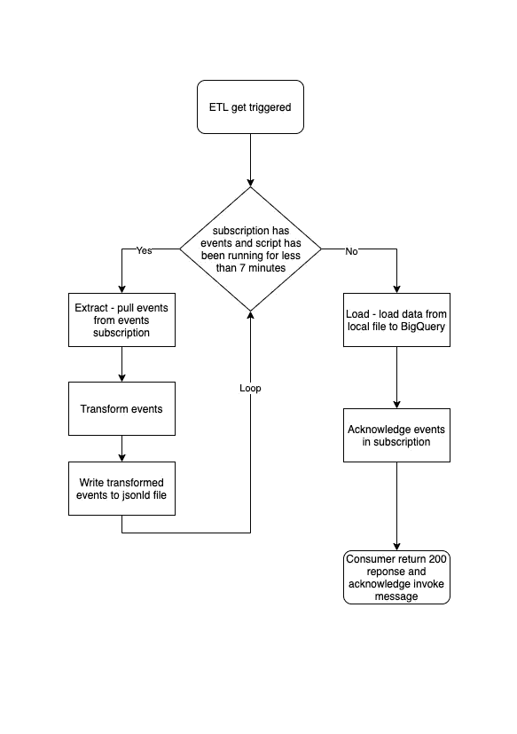
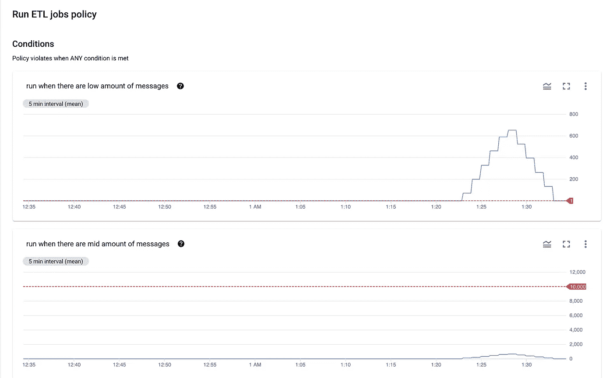
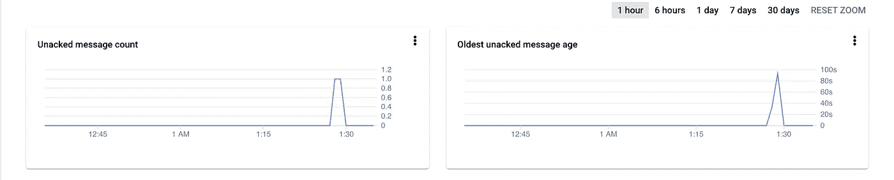
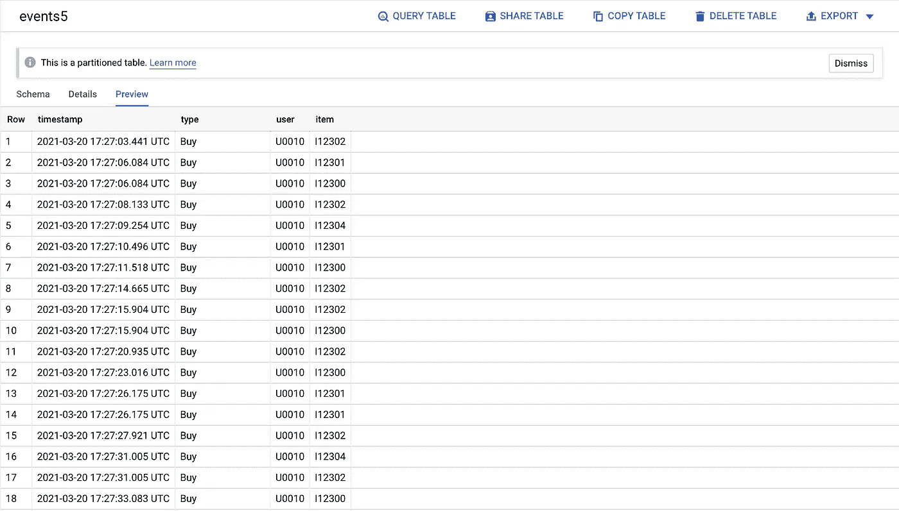

# 以一种无服务器的方式将数百万个事件从客户机流式传输到 BigQuery，第 2 部分

> 原文：<https://medium.com/google-cloud/stream-millions-of-events-from-your-client-to-bigquery-in-a-serverless-way-part-2-d2913ecee763?source=collection_archive---------3----------------------->

这篇文章是另一篇文章的完成:

第 1 部分:[构建一个 API 来接收来自客户端的原始数据，并将其推送到发布/订阅](/@abdulrahmanbabil/stream-millions-of-events-from-your-client-to-bigquery-in-a-serverless-way-part-1-a38c4f9cd6e4)

**第 2 部分:运行 ETL 作业，将事件传输和加载到 BigQuery 中**

你可以查看 [Github 库](https://github.com/omegaes/serverless-streaming)来运行/查看-编码这个例子，运行这个例子的全部细节都在那里，只是一个命令！

# ETL 作业部署

事件订阅可能有 10 条消息或 1000 万条消息，因此作业的数量将根据未完成消息的数量而变化！，在 GCP 加载后台作业的方式有很多，可以使用云函数、App engine、GKE、云构建、云数据流、计算引擎、云运行。

[Cloud Dataflow](https://cloud.google.com/dataflow) 是 ETL 的托管解决方案，但是它会限制您使用仅在少数编程语言中可用的 [Apache beam](https://beam.apache.org/) ，但是我在本文中的方法将适用于您喜欢的任何编程语言。

对于本例，我将使用**云运行，**作业将是一个 API 调用，将运行< 10 分钟，在此期间，它将尽可能多地提取消息，为每条消息进行传输(验证、映射、过滤等)，将这些传输的消息放入(CSV、JSON-LD)中，并调用 BigQuery API 将这些事件附加到一个表中。

我们创建了一个新的**作业云运行**服务，您必须确保这个服务独立于客户端 API 服务，还要确保只有经过身份验证的脚本才能调用它来执行作业，**API 调用的** **超时大约为 15 分钟**，作业必须在 10 分钟内完成其工作，因为我们将确认截止时间设置为 600 秒。 我们将持续从**事件订阅**中提取消息 7~8 分钟，然后我们将这些事件加载到 BigQuery，一旦 BigQuery 端成功，我们将确认**事件订阅**中所有已处理的消息，因此它不会再次被传递，稍后作业将返回 200 响应，以确认来自调用订阅的**的消息。**

# ETL 作业流程

提取:客户端的事件现在在事件订阅中，等待转换并加载到最终目的地，ETL 作业将在作业运行时提取一批事件，订阅有更多的事件。

转换:作业将对每个事件进行所需的转换，如映射、过滤，..等等

Load:将一大堆转换后的事件发送到 BigQuery 中

# ETL 加载到 BigQuery

> 问:如何将转换后的事件数据加载到 BigQuery 中？

BigQuery 有两种加载数据的方式，流式插入和批量加载，对于这个例子，我推荐使用批量加载，比流式插入更便宜，更具可伸缩性，你可以从[这里](https://cloud.google.com/bigquery/docs/loading-data)了解加载数据。

批量加载背后的主要思想是创建一个包含数据行的结构化文本文件，并在 BigQuery 中创建一个作业，将文件中的数据加载到 BigQuery 表中。

在批量加载中准备事件加载到 BigQuery 可能需要几秒钟，显然，这将使 API 变慢！更好的解决方案是将这些事件从 API 发送到队列服务(Pub/Sub ),然后我们运行作业来处理一大批事件并将其加载到 BigQuery 中。

# **ETL 作业触发**

> 现在，ETL 作业需要从 HTTP 请求中调用来开始处理，我们该如何做呢？？

1-使用云调度，发送发布/订阅调用消息在一个角落的方式，每 5 分钟，例如！

> 缺点:
> 
> 答:如果订阅在一个小时内没有收到消息，作业将运行多次，不会执行任何操作，因此订阅为空。
> 
> b——如果订阅了许多消息，作业实例在一次运行中的处理能力有限，这意味着消息将长时间滞留在订阅中，因为处理能力不会随着负载的增加而增加。

2-使用云监控，监控事件订阅中未交付事件的数量，并根据该数量触发 X ETL 作业。

您可以同时使用解决方案#1 和解决方案#2，#1 将每 X 分钟进行一次常规 ETL，#2 将在订阅中的事件快速增长时添加更多 ETL 作业，这将有助于同时进行并行 ETL 处理。

不幸的是，事件只能发送一条消息

事件订阅的警报策略

我们在事件订阅上添加了一个策略，该策略有很多条件用 OR 操作符来触发一个事件，事件会向 **invoke topic 发送一个 Pub/Sub 消息，invoke subscription** 会发布一个 HTTP 调用来触发 ETL 作业，并等待 ETL 作业完成处理，订阅为空时事件会继续发送 invoke 消息！

发送用于调用主题的消息数

调用 ETL 后 BigQuery 中的转换事件

# 结论

这是一种处理来自客户端的大数据的方法，这些数据在到达 BigQuery 之前会延迟几分钟，当您的应用程序收到大量事件时，您可能会面临一些挑战，但请确保总有解决方案！。

我想听听你在处理这种情况时的想法和经验，你会使用什么样的技术，构建起来有多难？